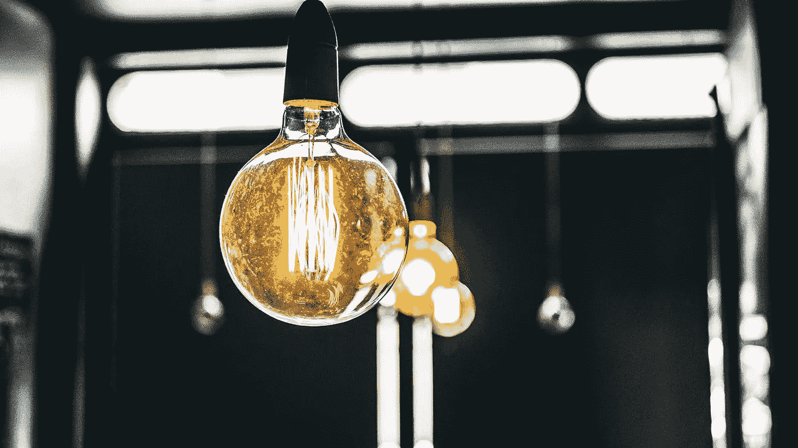
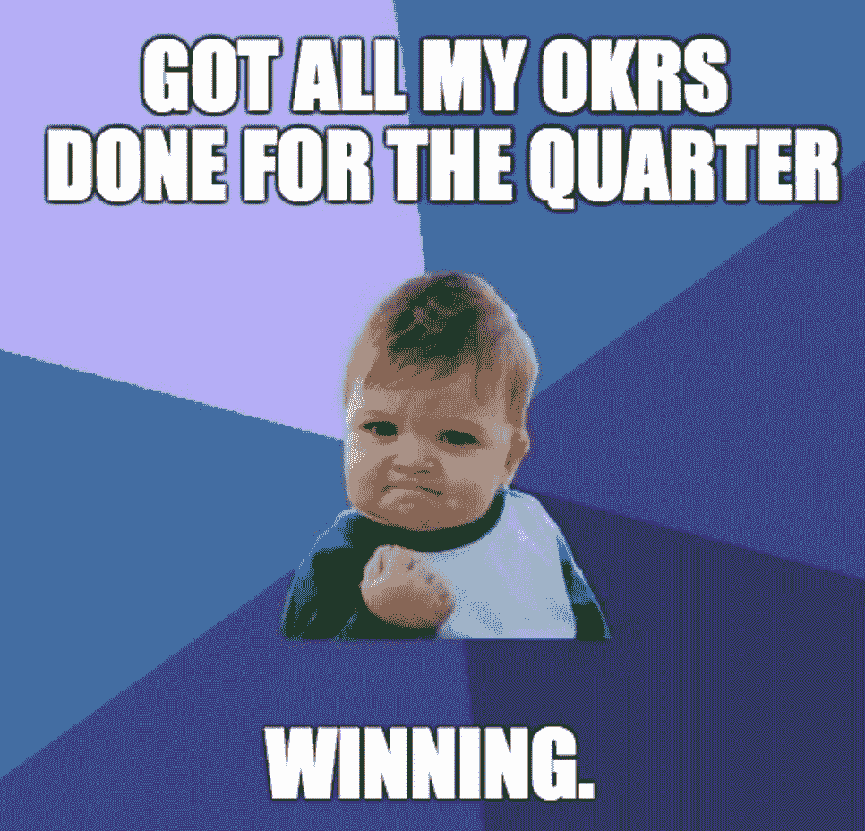
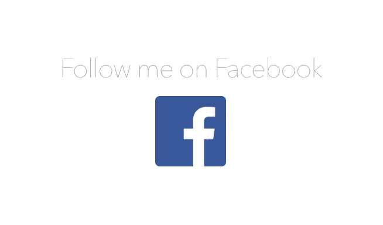
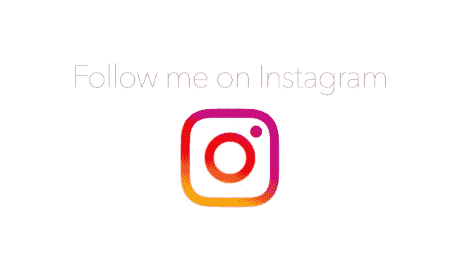
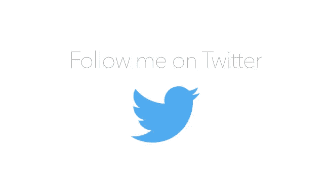

# 聚焦的艺术:为什么企业家需要“聚焦”比什么都重要

> 原文：<https://medium.com/swlh/how-to-unlock-the-true-potential-of-your-business-7129277034d>

我想说的是，当谈到实现目标时，专注是最重要的组成部分。

当史蒂夫·乔布斯在 1997 年回到苹果时，他的第一个任务是制造 iPod 还是 iPhone？不要！

**有多少人知道** [**乔布斯花了四年时间**](http://allaboutstevejobs.com/bio/timeline.php) 与蒂姆·库克、苹果公司的首席运营官*(现任 CEO)*——一起削减不成功的产品，降低成本，改善运营，在他发布 iPod 之前？

在苹果能够再次开始创新之前，他已经解决了所有其他问题。

这都是因为一个重要的原因。

# **专注的需要。**

> “迟早，你会得到你所关注的”

我自己的旅程也是如此。

我记得头三年是完全的挣扎。我们在 18、19 岁时创办了这家公司。好家伙，我们是热情的。

我们同时“关注”一百万件事情。我的联合创始人和我(不是开玩笑)一直在使用应用程序“Things ”,每个人都有超过 100 个项目。

# 你怎么能同时做 100 个不同的项目呢？

我们充满了热情——但肯定缺乏执行力。

感觉我们做了这么多，但实际上完成的很少，在构建 Appster 的大约 3 年时间里，我了解了 OKRs。

okr 是什么并不重要。有很多关于这方面的文章，如果你练习 OKRs 足够多，你会明白的。

然而，我真正想表达的是…

# 学习如何“专注”彻底改变了我们的公司。

你可能认为我在夸大其词。我希望我是。

我们从一个完全混乱的公司——在我们都在做的 530473854 个项目上几乎没有进展——到我们每个人在 90 天内处理不超过 3 个核心目标。

没有说谎——我们开始在 90 天内完成的工作比我们过去一整年完成的还要多。我不需要告诉你这有多重要。

# **我在个人生活中也使用过“专注”。**

从大约 17 岁开始，我几乎每天都写下我的目标。(注:我不是完美的蝴蝶。在我的生活中，我曾多次犯下这个习惯。有趣的是——那也是我最缺乏清晰、方向和动力的时候。

这个习惯很简单:我早上写一次，晚上写一次我的主要生活目标。

就是这样。

我可以回到我小时候写下这些目标的旧日记中，到目前为止“实现”的事情令人毛骨悚然——也许更好的说法是我——*咳咳*……“专注于”它们。

# **我也用“专注”来回顾我在人生不同时期想要完成的事情:**

我想要什么样的生活？*(评论季刊)*

今年我想要什么？*(每季度回顾一次，并召开为期 2-3 天的年度规划会议)*

这个季度我想要什么？*(也称为接下来的 90 天—每季度回顾一次，有两天的规划会议)*

这周我想要什么？*(周日晚上每周回顾)*

我今天想要什么？*(前一天晚上睡觉前复习，或者早上第一件事。仅这一条就能让你的工作效率大增！)*

# **说到“专注”，还有 9 件事要做:**

## **#1:说不**

你可以用你的时间做一百万件不同的事情。我对一些初创公司创始人的日历感到非常惊讶。

如果它与你当前 90 天内关注的事情无关，那么你为什么要参加这个会议呢！！！？

这就是为什么我经常拒绝每天收到的许多开会或其他事情的请求。

这也是我几乎不接电话的原因。*(热门提示:我的语音邮件说“嘿，你——我不听语音邮件，请给我发一封简短的 1 句话的电子邮件，附上你的请求”。这将为你每周节省数小时。)*

## **#2:不要参加随机的/无意义的/自我膨胀的会议…也就是“社交”**

不要让我开始谈论我看到的第一次创业者在做的那些毫无意义的“社交”。

我对那些自以为“把事情做完了”的人翻白眼，实际上他们只是在确保他们的竞争对手因为他们缺乏执行力和优先考虑错误的事情而彻底践踏他们。

只是不重要。

## 第三:不要承担“忙碌的工作”。

当你知道自己没有效率的时候，不要自欺欺人地说自己很有效率。如果它与你在接下来的 90 天需要达到的目标不一致，那么你就是在欺骗自己。

## 第四:把每天的待办事项整理好。

上面谈到过这个，再次提到它是因为它太强大了！

## **# 5:Pomodoro like no tomoro:-)**

你可以在其他地方读到它，但是对于那些我不能总是定时完成的任务(比如写作)，我会在我的任务清单上做“三个番茄”

通常，开始一项任务最困难的是最初的阻力。所以强迫自己在一件事情上坐 25 分钟可以打开一点“心流状态”。我发现当我这样做的时候，我会忘记休息一下，因为我不需要。

## **#6:用耳机。**

研究告诉我们，生产力的最大杀手#1:在开放的办公环境中交谈

把那东西挡在外面。我不能重申耳机对于对焦有多好。Bose QC35s 是最棒的耳机，但是如果你预算有限，任何耳机都可以。

## **#7: Brain.fm**

试试吧。它对我有效，让我兴奋不已。

## #8:歌曲主播。

如果你不喜欢 Brain.fm，试试[歌曲主持人](http://josephmosby.com/2015/02/15/the-psychology-of-a-small-playlist-on-repeat.html)……就是连续几个小时疯狂地重复听一首歌。有些人说不要用有歌词的歌曲——我发现这没什么区别。

这是我的“歌曲主播”Spotify 播放列表，你可以点击[这里](https://open.spotify.com/user/1230997179/playlist/2HHVQDtfwgUkYiEiz7KSUQ)。

## #9:锻炼

我把这个放在最后，因为我不擅长这个，而且一点都不稳定——但我确实注意到了这样做的时候——我的效率在一天的剩余时间里会更好。

# 就是这样。

现在不要读这篇文章了，因为我很确定读这篇文章与你在接下来的 90 天内需要做的事情无关，是吗？

开始吧。:-)

> 最初发表于[http://www.appsterhq.com/](http://www.appsterhq.com/?utm_source=CP&utm_medium=Medium)

