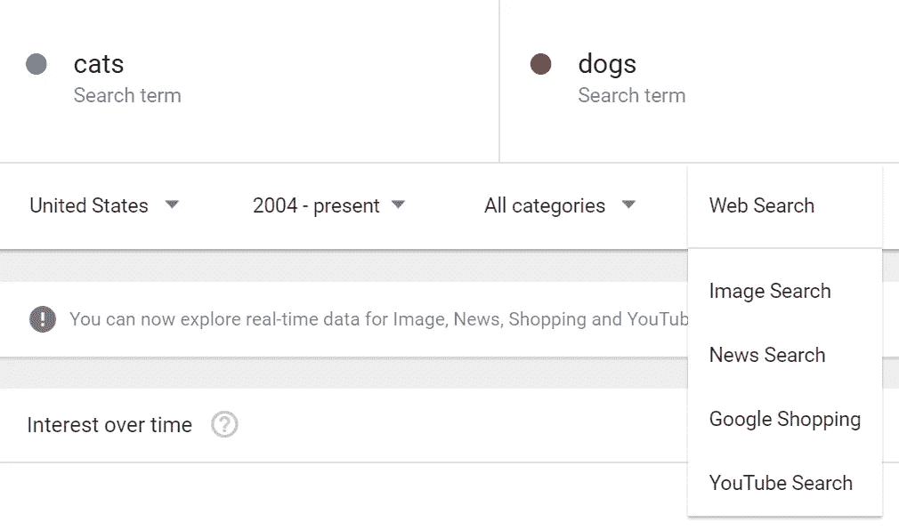
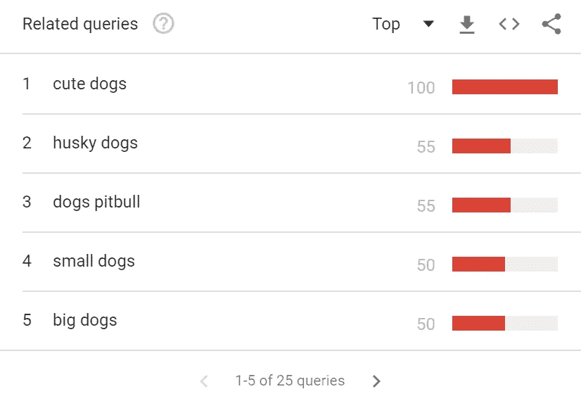
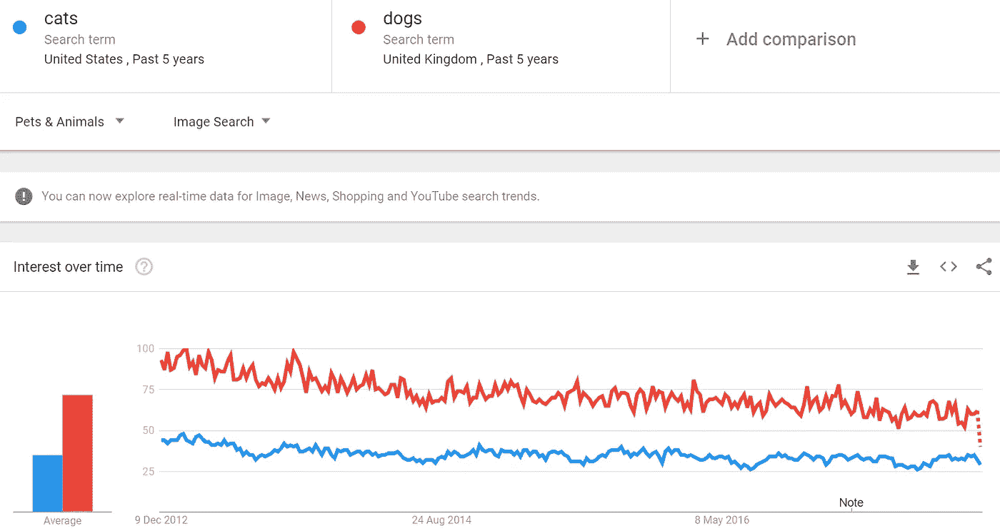
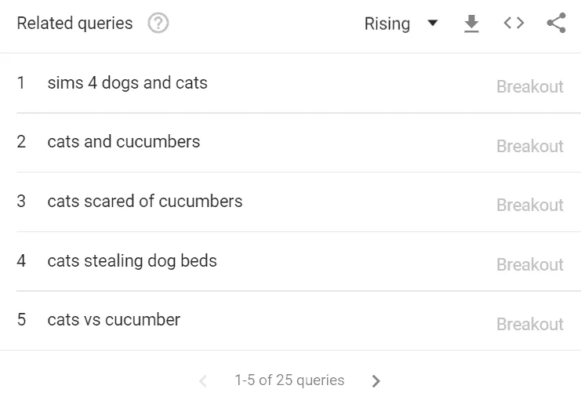
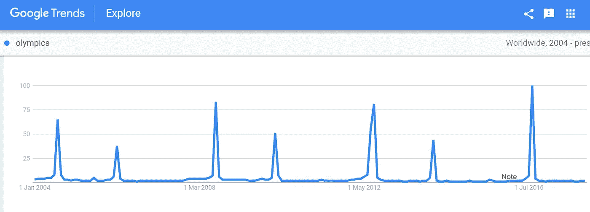
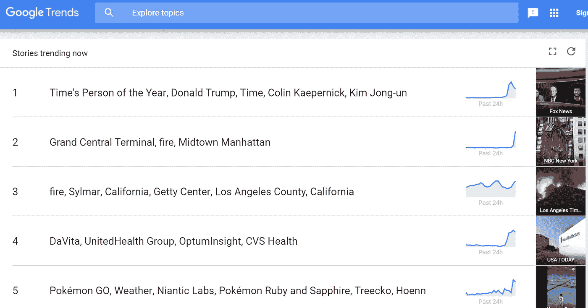
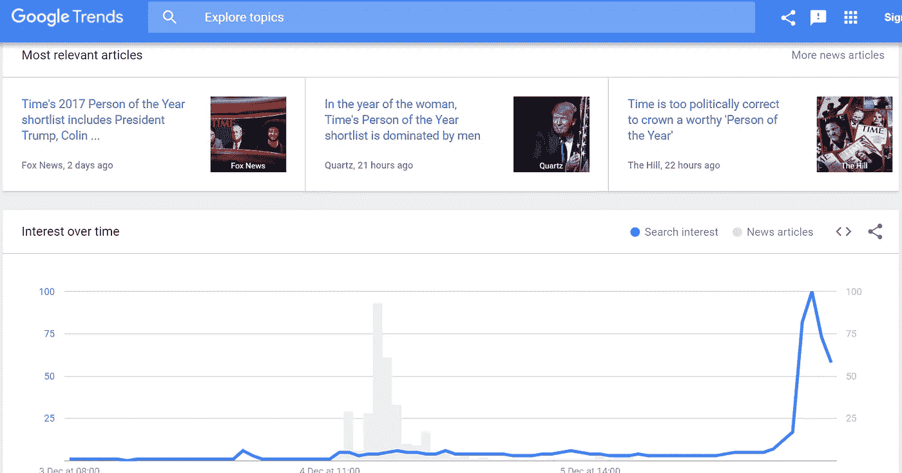
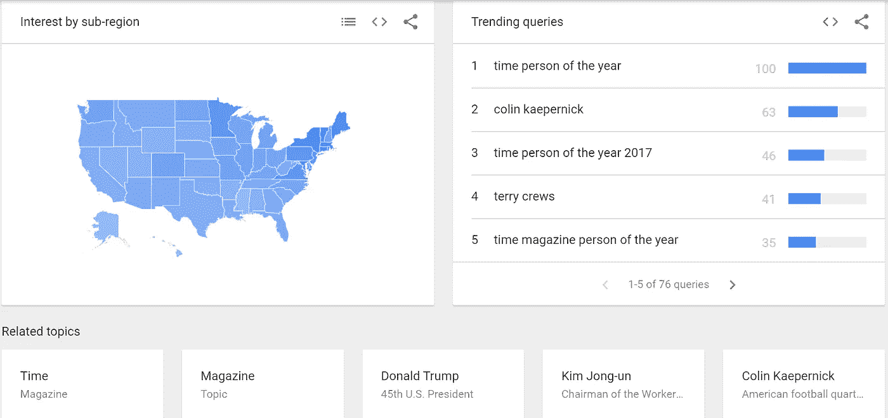

# 如何使用谷歌搜索引擎优化趋势

> 原文：<https://medium.com/swlh/how-to-use-google-trends-for-seo-3af55117eb0b>

于 2006 年首次推出的谷歌趋势为营销人员提供了关于人们如何在世界上最受欢迎的搜索引擎上搜索的宝贵见解。

在它早期的伪装下，趋势(或以前称为搜索的洞察力)是一种相当静态的资源，只在不频繁的基础上用新数据更新。

随着时间的推移，这项服务的力量以新的和启发性的方式被挖掘出来。

例如，Seth Stephens-Davidowitz 使用趋势数据进行的一项研究发现，“父母问‘我的儿子有天赋吗？’的可能性是其他人的两倍半。”该研究于 2014 年发表在《T2 时报》上。"比"我女儿有天赋吗？""

这类有新闻价值的事件向更广泛的公众揭示了 Google Trends 作为数据源的丰富性。当人们与搜索引擎交流时，他们潜在的态度、欲望和信念开始显露出来。

**在 2015 年的科幻电影 *Ex 玛奇纳* :** 中，一个虚构搜索引擎的自大狂创始人在讨论他所掌握的数据时说道

> *你看，我的竞争对手，他们专注于通过购物和社交媒体赚钱。他们认为搜索引擎是人们思维的地图。但实际上它们是人们思考的地图。*

这两个例子——一个是真实的，一个是想象的——突出了为什么 Google Trends 对搜索营销人员如此有价值。

这是我们拥有的最接近市场研究和 SEO 数据的综合。凭借其按地理位置、产品类别、内容主题和日期细分趋势的能力，它允许我们进行比传统 SEO 工具更广泛的分析。

**With Trends’**[**最近**](https://techcrunch.com/2017/11/27/google-trends-now-surfaces-data-from-news-images-youtube-and-shopping-verticals/) **扩展到新闻、购物、图片和 YouTube，这似乎是重新审视和刷新这个强大工具可以帮助您的 SEO 工作的许多方式的最佳时机。**

# 首先，做一些家务

如果你对 Google Trends 相对陌生，当你查看数据可视化时，有几件事要记住。

首先，对 Google Trends 数据进行了调整，使不同数据集之间的可视化比较对用户来说更容易。谷歌为其方法论提供了以下解释:

## “搜索结果与查询的时间和位置成比例:

*   每个数据点除以它所代表的地理和时间范围的总搜索次数，以比较相对受欢迎程度。否则，搜索量最大的地方总是排名最高。
*   然后，根据一个主题在所有主题的所有搜索中所占的比例，将结果数字在 0 到 100 的范围内进行缩放。
*   显示相同搜索次数的不同地区的总搜索量并不总是相同。"

实际上，这意味着我们最终会得到如下图表，显示从 0 到 100 范围内的趋势数据:

此外，由于谷歌在这一点上对数据收集进行了重大更新，所有追溯到 2016 年之前的图表都应用了一个注释。这可能会在 2016 年初导致一些意想不到的图表跳跃，但总体趋势仍然为某个主题的历史需求提供了很好的指导。

现在，来看看小费。

# 如何使用谷歌搜索引擎优化趋势

# 关键词研究

关键词研究似乎是最明显的基于 SEO 的趋势使用，但它往往被忽视，而有利于关键字规划和其他行业标准的工具。

事实上，它是这些平台的完美补充，揭示了它们无法揭示的模式。

趋势将建议新的关键字基于不同的标准，以那些在关键字规划中采用。例如，它突出显示了最近越来越受欢迎的相关搜索查询(再次使用“狗”的例子)，正如我们在下面的截图中看到的:

很明显，在你把它们直接添加到你的关键词列表之前，这些将需要一个感觉检查。如前所述，我们真的可以从谷歌趋势中学到一些关于人类状况的东西。

也会有一些离群值(在这种情况下，是视频游戏 Watch Dogs)，因为谷歌在主类别的庇护下分组了许多相关的子主题。

尽管如此，这些例子确实显示了这个工具可以多么频繁地提供意想不到的想法。

这也反映了如何容易获得的新趋势数据的性质可以添加至关重要的，新的元素到关键字列表。

这一点非常重要，因为我们已经超越了简单的关键字匹配，进入了语义相关的时代。建立一个包含受众对你的产品需求的关键词列表不再是一种奢侈；这是表现良好的先决条件。

此外，如果 SEO 能够在趋势查询达到峰值之前锁定它们，竞争将会减少，潜在回报将会增加。

对于那些想在平台之外检查数据的人来说，有许多 R 和 Python 包可以通过 Google Trends API 调用。

这允许用户下载查询来操作和可视化数据。R 的一个这样的包(gtrendsR)，在[这篇便利的博客文章](https://datascienceplus.com/analyzing-google-trends-data-in-r/)中有更详细的解释。

结合像 [ggplot2](http://ggplot2.org/) 这样的多功能绘图包，这种方法为搜索引擎优化研究的谷歌趋势数据开辟了一个新的功能层次。

# 比较谷歌搜索引擎的搜索趋势

Google Trends 增加了新闻、购物、图片和 YouTube 的过滤器，这为 SEO 研究提供了广泛的新机会。

这些可以从结果页面顶部的下拉菜单中访问。

图像搜索数据从 2008 年到现在都是可用的，它应该证明是 SEOs 非常有价值的灵感来源。

图像搜索不仅负责大量的查询，而且也是谷歌的重点领域，因为它旨在抵御来自脸书、亚马逊和 Pinterest 等公司的威胁。

同样，我们可以按子区域或城市对数据进行细分，也有相关图片搜索查询的建议:

由于谷歌处理和显示数据的方式，也有可能在两个不同的查询中比较这些搜索趋势。在下面的例子中，我设置了过滤器来显示美国“猫”和英国“狗”的趋势:

因此，我们可以说，相对而言，在英国对狗的图片搜索比在美国对猫的图片搜索更受欢迎，尽管绝对情况可能不是这样。

在 YouTube 上，永恒的猫与狗之战名不虚传，两个搜索主题之间的差距要小得多:

趋势查询也在这里突出显示，这应该给我们更多的理由继续访问谷歌趋势进行我们的研究:

# 评估和预测季节性高峰

也许谷歌趋势搜索引擎优化最常见的用途是分析消费者需求的高峰和低谷。

举一个简单但说明性的例子，我们可以看看搜索查询[olympics]:

每四年一次的夏季奥运会，我们都会看到世界范围内的显著高峰，而冬季奥运会每次都会在两年后吸引另一次(如果规模较小的话)增长。

在这个例子中，历史告诉我们，我们很快就会看到对(奥运会)需求的另一个高峰，但这种洞察力本身并不能转化为多少。

首先，我们不知道机会的绝对值，因为趋势只提供相对值。

然而，如果我们交叉引用我们在趋势中看到的与我们从关键字规划器中得到的数据，我们可以开始理解这个图表上的值 100 实际上意味着什么。

诚然，关键字规划数据最多是指示性的，但我们也可能有来自 AdWords 活动的数据。这至少可以引导我们预测即将到来的奥运会的搜索量。

当然，一个重大事件会导致对该事件名称的更多搜索，这似乎非常直观。尽管如此，如果我们采取同样的方法，并将其应用于不太可预测的行业，例如时尚，趋势可以帮助你在竞争对手之前识别关键词。

趋势利用实时数据来提出新的话题，这是一种补充。

# 反应性内容的趋势主题

Google Trends 最有用的方面之一是它提供了对实时搜索数据的访问。有大量的内容营销和搜索引擎优化技术，但没有一个能提供像谷歌从自己的数据库中提供的信息那样可靠的数据。

这些可以从谷歌趋势主页直接访问:

点击一个故事，就会出现精选文章，以及搜索兴趣和过去 24 小时发表文章的详细分类:

分析更进一步，按州、相关查询和相关主题显示搜索兴趣:

这应该是任何制作反应性内容的人的首选资源，无论是在他们的网站、社交媒体还是其他地方。

处理这些数据的另一种有趣方式是获取作为特色文章列出的 URL，并使用 Ahrefs 或 SearchMetrics 等 SEO 工具来获取页面排名的关键字。

这提供了对一个页面可以多快被索引和排序的洞察，以及一个页面在短时间内可以排序的语义相关查询的数量。最重要的是，这可以帮助我们理解谷歌如何处理和优先考虑新鲜内容。

*原载于* [*搜索引擎观看*](https://searchenginewatch.com/2017/12/08/how-to-use-google-trends-for-seo/) *。*

## 这篇文章发表在 [The Startup](https://medium.com/swlh) 上，这是 Medium 最大的创业刊物，拥有 274，559+读者。

## 在这里订阅接收[我们的头条新闻](http://growthsupply.com/the-startup-newsletter/)。

