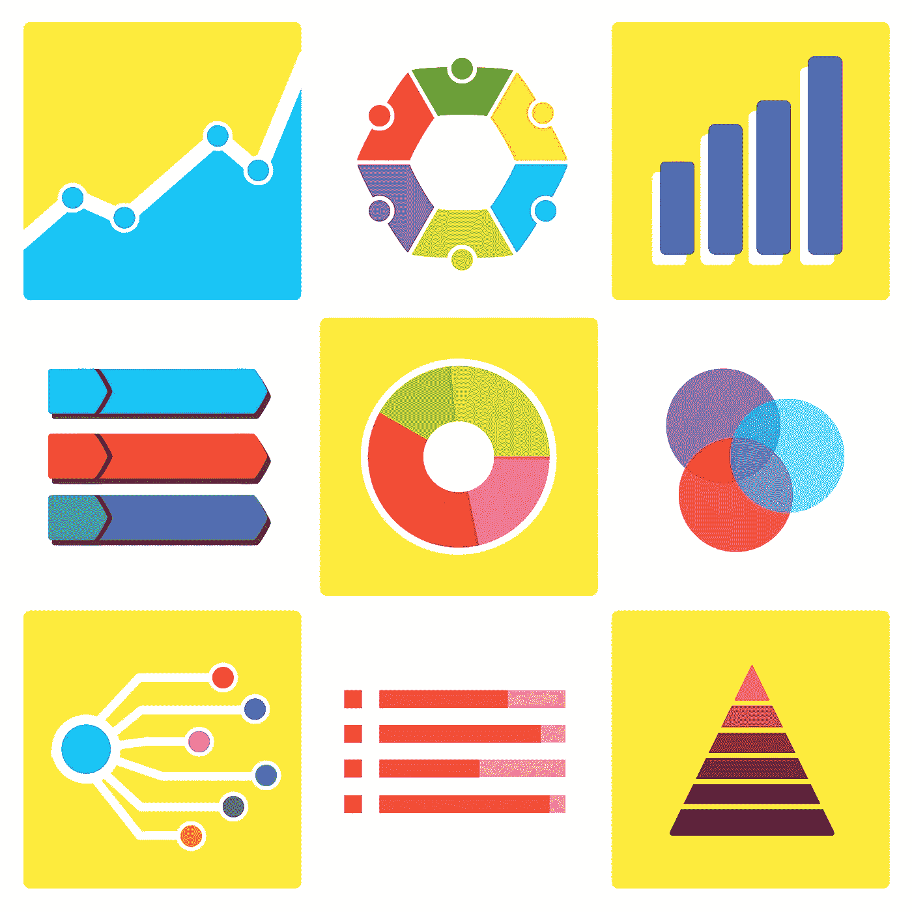

# 如何利用信息图表获得 10 倍的内容营销战略回报

> 原文：<https://medium.com/swlh/how-to-use-infographics-to-get-a-10x-return-on-your-content-marketing-strategy-aee44b3464bd>

让我们来看看为什么信息图表如此重要，以及如何成功地实施它们来吸引和留住更多的人。

Image Credit: [JuralMin](https://pixabay.com/en/users/JuralMin-2051452/)

现在，除非你的内容营销策略带来了微不足道的[回报](https://www.entrepreneur.com/encyclopedia/return-on-investment-roi)，否则期望回报有一个数量级的变化可能是不现实的。