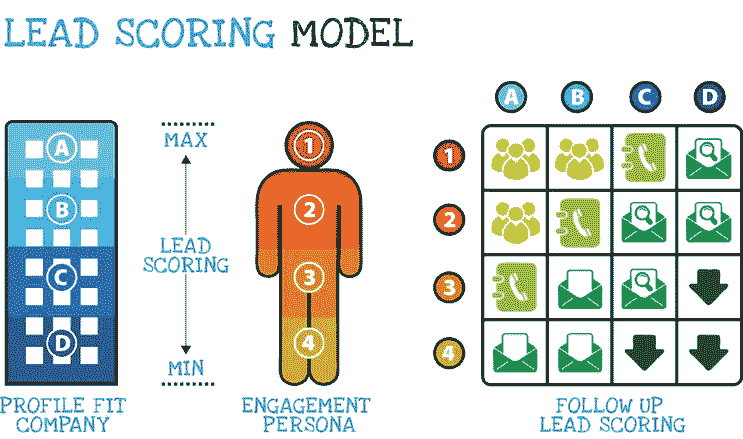

# 如何使用销售线索评分模型将销售线索转移给客户

> 原文：<https://medium.com/swlh/how-to-use-lead-scoring-model-to-transfer-leads-to-customers-171e3f5b280e>

帮助识别销售线索何时准备购买的最有效方法之一！

Photo by [QuickOrder](https://unsplash.com/@quickorder?utm_source=medium&utm_medium=referral) on [Unsplash](https://unsplash.com?utm_source=medium&utm_medium=referral)

我们都知道如何产生潜在客户，并通过适当的细分将他们放入数据库。但是在整个**顾客旅程**中，时机极其重要。了解 ***何时是销售线索准备购买的时间，何时是销售人员跟进的最佳时间*** 至关重要，有助于继续旅程。

比方说，如果你计划用一些新家具装饰我们的家，并在网上进行了一些研究，但你现在推迟购买。然后你知道会发生什么——销售人员会联系你。这在现阶段可能会受到欢迎。

如果你在购买过程中走得更远。你进行了调查，比较了不同网上商店的价格，甚至下载了销售手册，难道你不会变得更愿意与销售人员交流吗？

这里让我们介绍一个模型，帮助是它。

# 线索评分

**这是指识别潜在客户何时准备购买，并根据他们在您网站上的信息和行为为其赋值。**

## 就定义达成一致

一旦每个人都在同一页上，销售将只收到高质量的线索，营销将提供更少，但更高质量的线索。

限定词的例子可以是**决策职位**如副总裁或以上，或者**与你的业务最匹配的五大公司行业列表。**

## 收集人口统计数据

通过你的在线表格或其他伟大的来源，如 Linkedin 个人资料。

人口统计的例子可以是**年经验、在当前职位上的时间长度或他们的预算休息室。**

然后你就会知道那个人是否是决策者。

## 确定购买阶段

他们只是考虑还是准备购买？

如果他们准备购买，这里有一些例子:**填写联系表格，请求免费试用，按公司名称搜索或查看贵公司的定价页面。**

现在我们有了所有需要的信息，并为我们的评分模型做好了准备。有很多模型，我将展示一个我从 Lynda.com 学到的模型，它可以帮助我们起步。

1.  输入您的标准
2.  使用一个简单的从 1 到 10 的分数系统
3.  为所有标准分配分数
4.  电子表格将自动填充评分系统

小型企业可以手动进行销售线索评分，但由于销售线索的行为可以根据其在客户旅程中所处的阶段而改变。因此，将您的系统改进为自动化系统将有助于您管理当前的数据。

在您开发并启动销售线索评分模型后，请确保持续评估和调整。您的标准可能会随着时间的推移而演变，销售线索评分模型也会随着时间的推移而优化。

> 有效的销售线索评分模型将帮助您了解销售线索处于哪个购买阶段，了解他们何时准备购买，以及您何时应该跟进。

# 在这里找到更多我的故事！

# 顺便说一下，👏🏻*鼓掌*👏🏻如果你喜欢这篇文章，请举手(高达 50 倍)。它鼓励我坚持每天写作，并帮助其他人找到它:)

## 这个故事发表在[的创业](https://medium.com/swlh)上，这是 Medium 最大的创业刊物，有 315，028+人关注。

## 订阅接收[我们的头条新闻](http://growthsupply.com/the-startup-newsletter/)。

