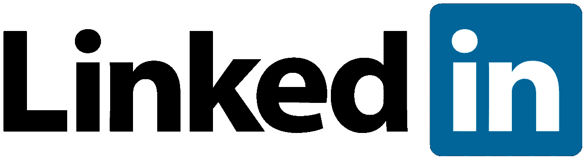

# 如何使用 LinkedIn 让你的职业生涯更上一层楼(分步指南)

> 原文：<https://medium.com/swlh/how-to-use-linkedin-to-reach-the-next-level-of-your-career-the-step-by-step-guide-ff4fd04ffb64>

Source — [Wikipedia](https://commons.wikimedia.org/wiki/File:LinkedIn_Logo.svg)

> 如果你想要一年的繁荣，种植谷物。如果你想要 10 年的繁荣，那就种树吧。如果你想要 100 年的繁荣，那就培养人。
> 
> -中国谚语

我们职业网络的质量是我们职业成功的重要决定因素，但它经常被忽视。我在这里向你提供建立和利用高质量专业网络的步骤—

# 确定目的地

Photo by [O’car Johann Campos](https://unsplash.com/photos/Pj80JY5qdsc?utm_source=unsplash&utm_medium=referral&utm_content=creditCopyText) on [Unsplash](https://unsplash.com/search/photos/destination?utm_source=unsplash&utm_medium=referral&utm_content=creditCopyText)

达到职业生涯下一个层次的第一步是知道你想去哪里。花些时间反思你在职业生涯中的定位。

> 你想成为食品行业的企业家吗？
> 
> 你想获得金融硕士学位吗？
> 
> 你想进另一家公司吗？

找出你职业生涯的下一步，并写下与之相关的关键词。(写下目标和实现目标之间有一种神奇的联系。相信我！)

比如说—

> X 食品公司首席执行官
> 
> Y(金融)学院
> 
> 职位 ABC，公司 Z

# 获得“链接”

Photo by [JJ Ying](https://unsplash.com/photos/PDxYfXVlK2M?utm_source=unsplash&utm_medium=referral&utm_content=creditCopyText) on [Unsplash](https://unsplash.com/search/photos/link?utm_source=unsplash&utm_medium=referral&utm_content=creditCopyText)

[LinkedIn](https://www.linkedin.com/in/abhishek-r-athreya-69a64688/) 让我们的社交变得如此简单！现在是我们检验它的时候了。打开你的 LinkedIn 账户，使用搜索栏搜索那些正在追求你渴望追求的目标的人。

比如你想在 PayPal 做软件工程师，搜索关键词“软件工程师 PayPal”。

你的搜索结果应该理想地引导你到一个人的名单。这不仅仅是一个人的名单，它是一张*蓝图*，告诉你为了达到你的目标，你需要成为什么样的人。

在搜索结果中打开至少 20 个人的资料，记下他们的教育背景、志愿服务经历和工作经历。

这个练习会给你一个技能、学位和经验的列表，可以帮助你向你的目标职业过渡。

如果你想获得这些技能，使用 [Coursera](https://www.coursera.org/) 或 [Udemy](https://www.udemy.com) 。

如果你想获得某个领域的学位，使用谷歌来找出提供该学位的最好的大学。

如果你想获得类似的经历，找一些你附近的组织，在那里你可以做志愿者。

# 伸出

Photo by [LinkedIn Sales Navigator](https://unsplash.com/photos/X5Z7Nhfy8Ik?utm_source=unsplash&utm_medium=referral&utm_content=creditCopyText) on [Unsplash](https://unsplash.com/search/photos/call?utm_source=unsplash&utm_medium=referral&utm_content=creditCopyText)

一旦你沉迷于你的*清单*并且尝到了达到职业生涯下一个层次*的滋味，是时候和一些真实的人谈谈了。回到 LinkedIn，搜索你之前搜索的关键词。这次你将向至少 50 个人发送简短(有意义的)信息。理想情况下，信息应该传达四件事—*

*   你是谁？
*   你目前在做什么？
*   你想去哪里(职业)？
*   你为什么和他们说话？

比如说—

> 嗨先生，
> 
> 我是 Abhishek，PayPal 的技术专家。我希望利用我在 PayPal 获得的技能，在食品行业转型成为一名企业家。我想问你几个关于你创业历程的问题。请让我知道一个对你合适的时间。
> 
> 谢谢

一旦你联系了一群人，你会开始看到源源不断的回复。根据我的经验，你联系的人中有 40%会回复你。给那些回到你身边的人—

*   在对他们合适的时间打电话。
*   准时开始通话。
*   问他们关于你在“获取”链接步骤中获得的经验的问题

这个练习有两个目的

*   你会和你想转换角色的人交谈。你会得到很多*内部*的信息。**这将帮助你了解这个角色是否真的适合你。**
*   你会给别人留下这样的印象:你是一个对这个角色充满热情的人。如果他们的公司开始招聘那个职位，他们可以马上推荐你！

# 概括起来

如果使用得当，LinkedIn 是一个强大的网络工具。以下步骤将帮助你建立正确的关系，过渡到你的梦想职业

*   **决定你职业生涯的下一步。自省反思。**
*   在 LinkedIn 上搜索你感兴趣的职位，找出这些人拥有的所有技能。致力于获得这些技能。
*   向那些在你的*梦想*角色中工作的人伸出援手。安排与他们的通话，分享您的经验，并从他们的经验中学习。在这一步结束时，你应该有一个能证明你对你的梦想角色充满热情的人际网络。

**感谢阅读！如果你喜欢这篇文章，请尽情鼓掌，关注我的******。请留下回复，告诉我如何改进。****

****联系我—****

**[Quora](https://www.quora.com/profile/Abhishek-Rathan-Athreya) | [脸书](https://www.facebook.com/abhishek.athreya) | [LinkedIn](https://www.linkedin.com/in/abhishek-r-athreya-69a64688/)**

****

## **这篇文章发表在 [The Startup](https://medium.com/swlh) 上，这是 Medium 最大的创业刊物，有 309732+人关注。**

## **在这里订阅接收[我们的头条新闻](http://growthsupply.com/the-startup-newsletter/)。**

****