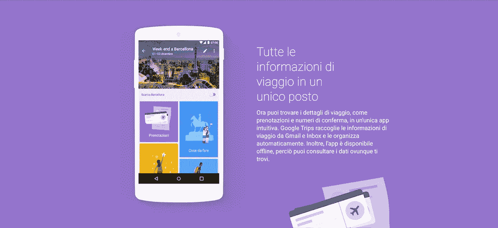

# 如何利用数字化转型创造新市场

> 原文：<https://medium.com/swlh/how-to-use-the-digital-transformation-to-create-new-markets-35ffb96fc18d>

我们能把所有包含数字技术的项目都描述为数字转型吗？如果我们不改变消费者体验、内部流程和商业模式，我们是在转型吗？

Car2Go、优步、Airbnb 不仅仅是利用技术进行渐进式改进，他们还革新了所在行业的商业模式。即使是在成熟市场运营的公司也必须努力超越他们的商业模式，因为只有**的渐进式改进并不能保证长期占据主导地位。**

让我用一个长期行业(如银行业)的创新(假设)产品的例子来解释一下。

# 在竞争异常激烈的市场中，谁敢赢

**银行害怕来自金融科技初创公司的竞争**。这是可以理解的，新玩家更敏捷，因为他们没有遗留系统，他们知道如何利用数字优势，他们的产品是根据用户需求设计的，没有义务遵循内部分层流程(如果你的公司在不同的行业，你可能会发现相似之处)。

然而，新的金融科技并不像银行一样可靠。他们从未面临过全球经济危机、战争和其他远比一般竞争更严重的威胁。**银行与其客户之间的关系有着悠久的历史**，经历了许多起起落落，但这种纽带是不可否认的。

但是要小心，**如果客户觉得这种关系是发展的障碍，这种纽带就会变弱。**

想想那些使用不同银行产品的专业或小型企业:活期账户、贷款、预借账单、信用卡。这些服务产生了大量的**数据，银行可以将这些数据增强并转化为对客户有价值的信息。**

**我和 Google** 打个比方。我们使用的各种服务产生的大多数通信都是通过 Gmail 进行的。例如，每次我们购买火车票时，谷歌都会外推数据，向我们显示最相关的信息:路线、日期、时间、车厢、座位号、预订代码。

这些数据会自动显示在谷歌日历上。谷歌旅行应用程序显示关于目的地有用信息的卡片。所有这些都不需要用户交互。

Google Trip retrieves and organizes travel data from Gmail automatically.

活期账户就像 Gmail，但银行不会利用数据为未表达或未服务的客户需求提供解决方案。

让我们回到专业和小企业。让我们假设一项研究表明，一些用户更喜欢使用电子表格而不是会计软件，因为他们认为这对他们的需求来说太复杂了。

这将是一个重新思考当前帐户并将其转变为简化小型企业财务管理的端到端解决方案的机会。

创建和发送发票，有一个仪表板来检查谁付款，谁迟到，知道客户和供应商的经济重要性。这些和其他功能可以自动化，而其他功能则需要用户干预，但每个交互都将在一个旨在简化工作日的单一环境中进行。

当前账户会与电子表格竞争。是理论上的[要做的工作](/swlh/jobs-to-be-done-theory-helps-you-to-create-better-products-a47f94a56214)。

# 方向是什么？

数字化转型开启了一个充满机遇的世界。如果没有指南针，来自假设(如市场研究)或习惯(如跟随竞争对手)的尝试就有浪费时间和资源的危险。

关于新产品发布的统计数据告诉我们一个悲伤的故事:

*   **超过 50%** 的新产品辜负了计划的期望
*   100 个新产品中只有一个包含开发成本
*   **300 个**中只有一个新产品对客户的购买行为、对其品类或对公司的成长有重大影响。
    【弗罗斯特&沙利文，2013】

这是因为创新战略主要受以下四项原则的指导:

*   **产品属性** *(比竞争对手多 25 项功能)*
*   **客户特征** *(40 岁职业、父亲、极限运动爱好者)*
*   **趋势** *(增强现实是未来)*
*   **竞技答案** *(别人这么做，我们也必须这么做)*

另一方面，如果我们观察和分析**用户的需求集**，我们可以确定哪些需求对他们来说是**必需的，但被当前的报价**所忽略，将它们与那些不相关但被不明确的竞争过度服务的**区分开来。**

## 创新有风险吗？

是的，但是放弃的风险更大。

## 我们能降低风险吗？

是的，如果用户处于所有产品生命周期的中心:

*   战略
*   实现(设计、开发、发布)
*   持续优化

如果意识到客户如何衡量服务或产品的价值，数字化转型就能实现其全部潜力。*要做的工作*、*设计思维*和*服务设计*是帮助公司引领以消费者为中心的创新过程的一些框架。

让我们利用这一点。

*Puoi leggere la*[*versione italiana di questo articlo*](/@gianflip/sfrutta-la-digital-transformation-per-creare-nuovi-mercati-caa2035c048a)*。*

## 这篇文章发表在 [The Startup](https://medium.com/swlh) 上，这是 Medium 最大的创业刊物，有+368，675 人关注。

## 在这里订阅接收[我们的头条新闻](http://growthsupply.com/the-startup-newsletter/)。

