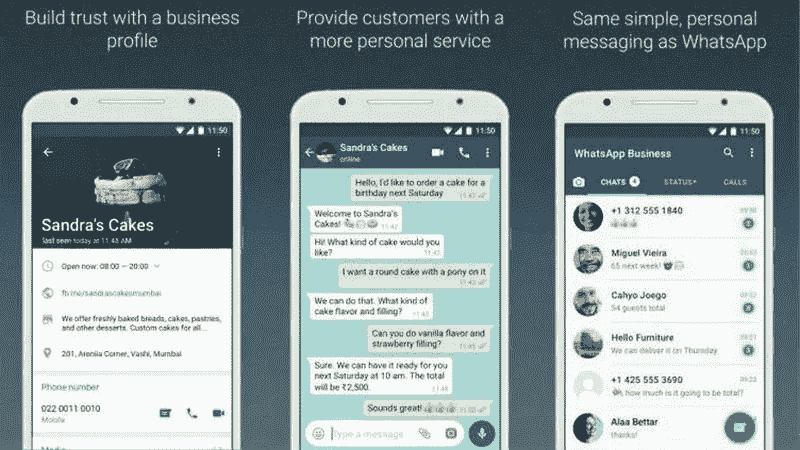
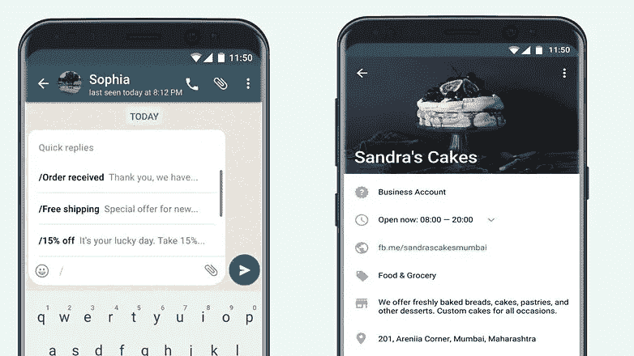
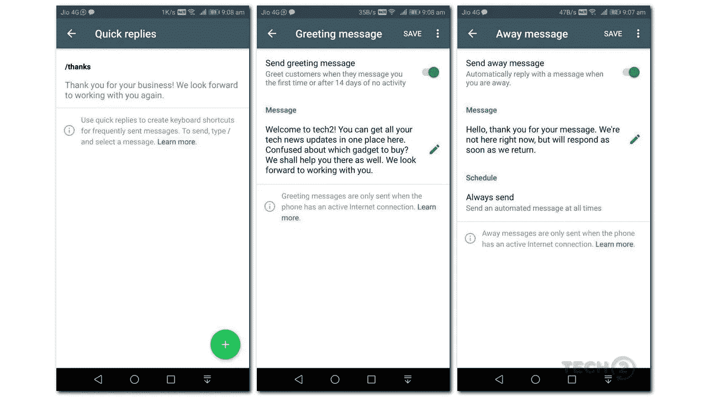
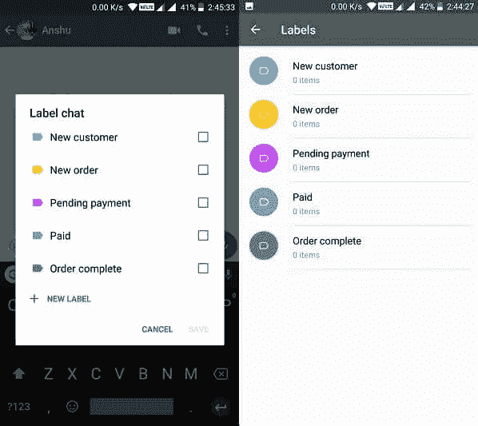

# 如何使用 Whatsapp 业务提供更好的客户服务

> 原文：<https://medium.com/swlh/how-to-use-whatsapp-for-business-for-better-customer-service-delivery-c341da8f2ddb>

Image from Gadget 360

几年前，脸书表示，它将创建一个 Whatsapp 版本，以满足业务需求，并有助于更好地与客户沟通。周三，他们像往常一样兑现了自己的承诺。我们现在有了 Whatsapp 业务，耶！！！！

但重要的问题是，这如何改变我们已经使用我们一直熟知的 Whatsapp 交流的方式？

以下是我注意到的一些方法。

Image from Android Pit

1。 **让你的生意合法化:**使用个人 whatsapp 做生意的一个主要缺陷是，除非你已经为你的公司建立了足够的信誉，否则客户可能会对与你做生意持怀疑或谨慎态度，尤其是当你发布个人状态或消息甚至广播时。有了商业简介，你可以陈述你公司的地址、网站、营业时间，并清楚地陈述你公司的业务或你的愿景。

要创建***“WhatsApp 商务档案”*** :打开 WhatsApp 商务 App >点击 App 右上角 3 个点表示的菜单按钮>设置>商务设置>档案。

2。 **最佳信息传递:**作为人，你可能需要休息，但你的公司并不需要，尤其是当客户觉得他们需要你的时候。通过设定营业时间和创建一个出色的*的“离开信息”，你可以确保你失去的客户更少，向他们展示下一步，甚至通知他们你什么时候可以回复他们。这让他们觉得他们被倾听了，你也有义务回应。您还可以使用 ***【快速回复】*** 功能，针对客户提出的一些问题或信息，设置具体的回复，帮助您建立针对这些问题的反馈机制。*

****激活或编辑离开消息:*** 进入设置>业务设置>离开消息>***激活离开消息*** ，然后，如果需要，编辑消息。*

*在 ***“离开消息设置”*** 中，您可以轻松安排希望消息出现的时间。它提供了三种不同的选项— *始终发送、定制日程安排和非工作时间。**

**

*Image from Bouncegeek*

*3。 **给你的客户贴上标签以便更好地跟踪:**根据你产生的订单量或你的业务性质，你可能不得不用奇怪的轶事来保存你客户的名字，比如 ***【迈克尔第一单】*** 等等。即使你用最简单的方式标记你的客户，他们也可能在翻译中或在所有其他客户中间迷失。但是有了这个，你就可以在你的客户在你的企业中的地位发生变化的时候有效地对他们进行分类。比如，你可以开始给客户贴上 ***“常客、挂单、促销客户”*** 等等标签。*

****将客户添加到标签:*** 点击客户聊天页面上的菜单按钮>然后选择一个标签并点击保存*

****添加新标签:C*** 点击客户端聊天页面上的菜单按钮>然后点击 ***【新标签】*** 点击保存*

*这些是我觉得有用的一些功能，但我敢肯定 Whatsapp 还没有完成，我们才刚刚开始看到这款新产品的功能。*

*我会在这里向你更新我发现的任何东西以及我是如何使用它的。它还是新的，所以有很多东西要学。*

*请告诉我您将如何使用您的产品，以及它将如何转变您的业务信息。*

*干杯！！！*

**

## *这个故事发表在 [The Startup](https://medium.com/swlh) 上，这是 Medium 最大的企业家出版物，拥有 292，582+人。*

## *在这里订阅接收[我们的头条新闻](http://growthsupply.com/the-startup-newsletter/)。*

**