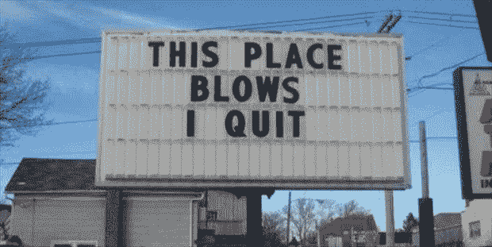

# 如何将没有前途的工作转化为你的优势

> 原文：<https://medium.com/swlh/how-to-use-working-a-dead-end-job-to-your-advantage-5899f209a7c2>

## 拥有一份你不在乎的工作也有好处

Photo Credit: www.imgur.com

我最美好的回忆来自我做过的最糟糕的工作。我花了六个月的时间在一个屋顶上安装太阳能电池板，不知何故，这个屋顶至少在一天的前半天都是被水浸湿的，我和我的两个最亲密的堂兄弟姐妹以及我们共同的一群乌合之众朋友一起。