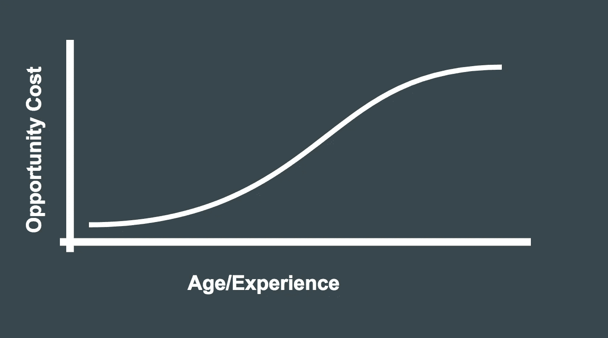
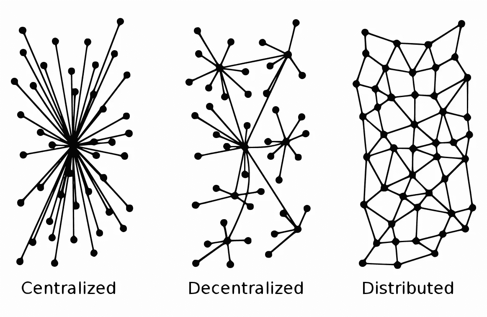
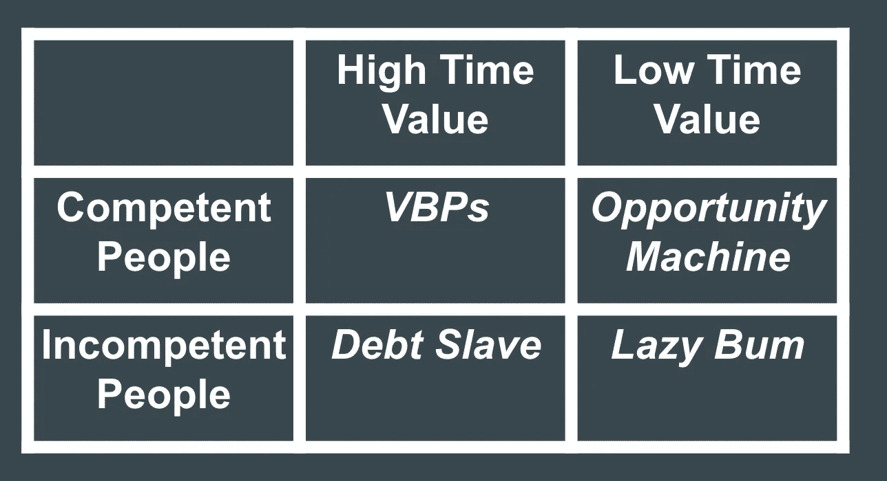

# 如何利用你无价值的时间创造机会机器

> 原文：<https://medium.com/swlh/how-to-use-your-worthless-time-to-create-an-opportunity-machine-bdd064828a0>

This is how you’ll feel. pc: unsplash.com

我羡慕那些刚刚开始职业生涯的人。

我羡慕没有技能，没有经验，什么都不能提供的人。

为什么？

因为他们比那些时间已经很宝贵而且已经用完的人有更多的学习和成长空间。

当你处于职业生涯的这个阶段时，你可以创造一台机器，为你带来机会。机器很好。机器工作。你建立他们，你维护他们，他们做他们的工作。机会机器是你职业生涯的一种系统和思维方式，如果设置和维护得当，会给你带来新的机会。你不需要手忙脚乱地寻找增长——增长自然会发生。

前几天，我有机会成为宾夕法尼亚州匹兹堡[深度峰会](http://www.goingdeepwithaaron.com/event.html)的闭幕主题演讲人。

在我的演讲中，我谈了一点我的经验，帮助年轻人开始他们的职业生涯，开始我自己的职业生涯，让学徒和学员加入，也许更重要的是，帮助[非常忙碌的人](https://zakslayback.com/2017/11/14/send-good-emails-busy-people/)放下他们的盘子，变得更有效率。

当你年轻，技能和经验都很少的时候，你的时间根本不值那么多。你能做的最有价值的事情是什么，如果没有完成会发生什么？你可以学习，你可以去你的服务工作，你可以享受闲暇时间，就是这样。如果你不明智地利用时间，就不会有什么事情发生。你可能会受到惩罚，或者为浪费时间而感到难过，但世界并没有终结。

随着年龄的增长和经验的丰富，你会承担新的责任。你的时间变得更有价值。你要么把这些作为你技能的一种功能，要么作为需要的一种功能。你可能是管理一个领导团队的最佳人选，或者是开发一种特定产品的最佳人选，或者是某一特定行业或工艺的高度熟练者。或者，你可能只是有人指望你——家人、朋友、债权人或员工。如果你不明智地利用时间，坏事就会发生。产品无法上市。会面不会发生。存货卖不出去。你的家人会挨饿。你的房子被收回了。收账员开始打电话。

As you grow more experienced, the relative value of the next-most-valuable things on your list increases.

[找到有技能的导师和顾问的价值在这里体现](https://zakslayback.com/2017/08/25/whats-difference-mentors-advisors-coaches/)。如果你属于第一类人——他们的时间并不那么重要或有价值——你面前就有一个机会。第二类人——非常忙碌的人——必须完成任务。他们知道有些任务比其他任务更有价值，需要更多的技能，所以他们专注于那些任务。这些是管理、技能和技术任务。但是他们的待办事项清单会持续好几天，而且清单上总是有需要完成的项目。

对于低时间价值的人来说，从非常忙碌的人的清单中挑选低价值的项目仍然是*一种增值。*

想象一个想成为艺术家的年轻人。他们找到一位成功养活自己并推销其艺术的艺术家。他们认为，鉴于这个人相对成功，他们的时间是宝贵的，他们可能不会每天都完成他们想完成的所有事情。

不仅仅是 ***阅读*** 关于如何成为一名成功的艺术家，他们可以给他们发电子邮件，直接向那个人学习。

# 做真正的推广

而不是发一封电子邮件说，“让我来帮你！”([这很糟糕](https://zakslayback.com/2017/11/14/send-good-emails-busy-people/)，请不要这样做)，他们可以找到那个人，说:“根据我对像你这样的成功艺术家的了解，你可以从这种形式的媒体中受益/为活动做宣传/[基于最少的互联网研究]。”我在这里**[**整理了一套十二个高性能的电子邮件脚本**。****](http://zakslayback.com)**

**即使有抱负的艺术家在他们认为成功的艺术家需要什么方面是错误的，事实上他们做了一些研究，花时间提出了一个他们能做什么的明确建议，这是有希望的。通常，他们会得到一个带有机会的回复。**

**现在，他们可以直接向已经成功的艺术家学习，而不仅仅是阅读关于成为艺术家的书籍。**

**将这种方法应用到大多数非专业(如法律、医学)职业轨道上，效果非常好。**

**为什么？职业发展需要一种增值的方法。增值方法始于谦逊，知道你没有太多可以提供的，但也要相信自己有能力发现价值。**

**就在我发表主题演讲的前几天，我在一个朋友的推荐下，读了约翰·卡尔顿的书**【企业家的生活指南】。足够偶然的是，卡尔顿正确地指出大多数不称职的人不知道他们是不称职的。当他们从朋友、同事和经理那里得到负面反馈时，他们认为自己受到了冒犯和震惊。对于没有什么技能的年轻人来说，好消息是这适用于很多人。很多人都是无能的。他们无法完成基本任务。他们无法赶上基本的最后期限。当他们错了的时候，他们不能承认，必要的时候，他们会谦卑地寻求帮助。****

****胜任并不需要技巧。这需要耐心、时间和学习的欲望。****

****有能力的人价值连城。在我自己的职业生涯中，我很快通过我面前的可能性上升，因为我有能力。一旦我发现我的时间太宝贵了，无法完成我想完成的所有事情，我就到处寻找一个超级能干的人。我找到了她，她是我推荐给任何想找人做事的人的首选。我会兑现我和其他人为她以及像她这样的超级能人开发的所有社交货币。****

# ****提升您的网络****

****我会在她身上冒这个巨大的风险，因为她已经向我证明了自己不是累赘。我知道当我把她介绍给比我更忙更重要的人时，她不会让我尴尬。****

****不是每个人都是那样的，人脉广的人都知道这一点。他们知道他们不能也不会做人们要求他们做的大多数介绍，因为那些人要么没有证明他们的能力(或者没有成为一个负担)，要么他们知道那些人是负担。****

****不过，如果你有能力，你可以通过吸收那些非常忙碌的人的联系，迅速发展出一个世界级的网络，你可以节省他们的时间，珍惜你创造的价值。****

********

****In the picture above, being on the edge of the Distributed Network is okay if you have the social currency to get the in-betweens to vouch for you.****

****随着你在为第一个你接触的非常忙碌的人工作时获得更多的技能和经验，你可以更专注于你想做的事情。也许你开始交往的第一个人不再为你提供成长的机会，所以现在你可以像上面一样，利用你从第一个人那里获得的技能和经验，找到一个新的导师或顾问。****

****借用詹姆斯·阿尔图彻的一句话，你升级了导师。如果你从不提升导师，你就不会成长。****

****总会有人在你想成长的某个领域比你更专业，或者在那个领域比你懂得更多。你总是能从他们的盘子里拿走一些东西。最好的人选是那些足够成功，拥有满满一盘子食物，但没有成功到拥有管家和私人助理大军的人。****

****这是机会机器。利用你缺乏经验和技能的机会，从那些比你更有经验、更忙碌的人那里获得学习经验。****

# ****提醒一句！****

****世界上实际上有四种类型的人，他们都是我们前面两类人的子集(时间宝贵的人和时间不宝贵的人)。****

****还记得我说过的能力和能力是很难得到的吗？无能并不难得到。时间价值低又无能的人多的是。有的是*高*时间值的人，无能的人。****

****如果你是一个时间价值低的人，而你最终和一个时间价值高但不称职的人一起工作，你就是在和一个**债奴**一起工作。债务奴隶必须完成所有事情，因为他们为了现在牺牲了未来。他们可能有实际债务，并不断击退债权人。他们可能有社会债务，生活在报复的恐惧中。他们可能有健康债务，经常生病，压力很大。****

****尽可能避免与这些人一起工作。除了拥有更少的真正给你带来增长的机会之外，他们也不是思考未来的好榜样。记住投资是为了未来而牺牲现在。你不必成为一个成功的乞丐，但不要向债务奴隶学习如何获得成功。****

********

****要找的人是非常忙碌的人(VBP)。[这个人可能很难联系到](https://zakslayback.com/2017/11/14/send-good-emails-busy-people/)，但他通常生活在一起，但仍然需要更多帮助。他们可能有债务，但他们不是债务的奴隶。债务对他们来说是一种工具。他们有技能，他们的时间很宝贵。****

****嫉妒地兜售你的能力。不要成为**懒汉**。有很多人的时间并不宝贵，也没有能力。他们所能做的最好的事情就是勉强应付，他们没能击中(或者甚至是设置！)截止日期。****

****尽量让自己保持在**机会机器**的位置上，时间越长越好。随着你的成长和成功，你会转变成你自己的 **VBP** ，但是当你渴望不断达到更大的目标时，你会发现**相对更大的 VBPs** 。在你生活的某个领域，总会有比你更大的鱼，谦卑自己，寻找机会。****

# ****去拿吧****

****停止阅读，去建立你自己的机会机器:****

****想清楚你想做什么。我这里有一些句子补全练习，如果你在这一点上卡住了，它们会帮助你。****

******找人做成功。** [找导师、顾问、教练。如果可以，和第一个合作，雇佣第三个](https://zakslayback.com/2017/08/25/whats-difference-mentors-advisors-coaches/)。****

******向他们伸出援手。写好的电子邮件可以增加你成功的可能性。我也有一些可用的测试脚本[这里](http://zakslayback.com)。******

******提出真正的解决方案。**即使他们不喜欢那些具体的解决方案，他们也会欣赏你的坚持和专一。****

******有能力。赶上截止日期。快速回复消息。当你失败时要诚实(我们最终都会这么做)。******

******重复。当你从这个人的盘子里拿走任务时，你会积累他的社会财富。你可以用这种社交货币和他们认识的人一起遵循同样的步骤。******

********

## ****这个故事发表在 [The Startup](https://medium.com/swlh) 上，这是 Medium 最大的企业家出版物，拥有 290，182+人。****

## ****在这里订阅接收[我们的头条新闻](http://growthsupply.com/the-startup-newsletter/)。****

********