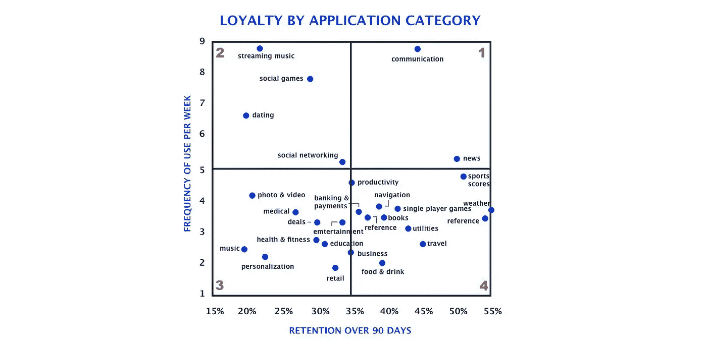
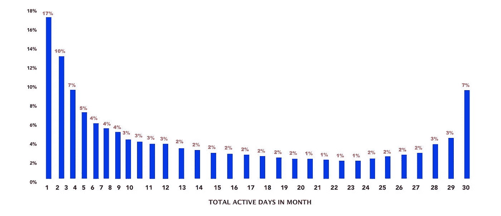
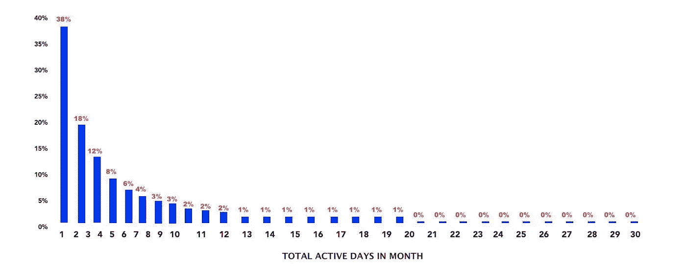
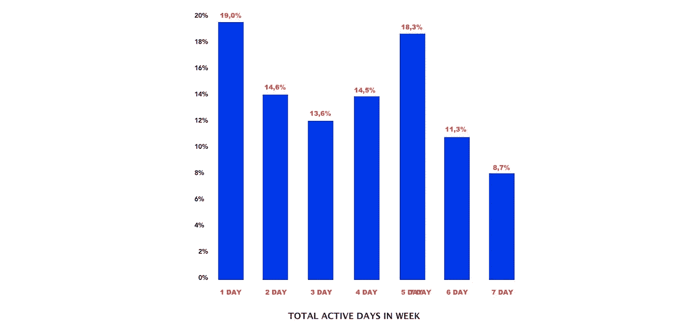
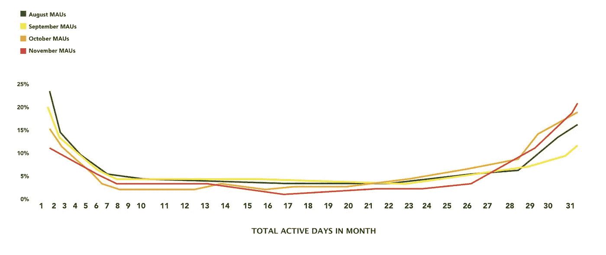

# 如何:用户参与度指标

> 原文：<https://medium.com/swlh/how-to-user-engagement-metrics-678f4fb85492>

超级用户让世界上最伟大的公司脱颖而出。他们热爱产品，以各种可能的方式参与其中，并为网络带来价值。你想让尽可能多的人参与进来。对优步来说，他们是权力驱动者，对易贝来说，他们是权力销售者，等等..那么你如何区分最活跃的用户，如何衡量他们的参与度呢？

# MAU 毛方法

最常用的方法是确定 DAU/MAU 比率(日活跃用户与月活跃用户之比)——单日与你的产品互动的月活跃用户的比例。你应该认为好的一个常见值(在应用程序世界中)是超过 20%。如果你的比率超过 50%，这意味着要么你算错了，要么你是一个真正的天才，我要脱帽致敬。开玩笑的。

看一下这张图表:

有 3 个突出的类别。分别是**社交游戏**、**天气预报、**和**通讯软件**。游戏一开始会被频繁使用，因为你会上瘾，但是很快就会变得不稳定。天气预报是一个有趣的例子，因为你只在天气可疑或你计划旅行时才查看它，所以使用频率很低，保留率很高。通信软件是一个伟大的使用频率和保留的例子。

**如果你的产品被频繁使用，并且有很高的保留率，并且通过广告货币化**，你应该参考这种方法。如果你想更深入地了解你的用户参与度，或者如果你的产品只是偶尔使用，但互动的价值很高(如 Linkedin 或 Airbnb)，考虑投入更多时间来寻找替代方法。

# 替代用户参与度测量

几年前，脸书首创了活动直方图。它按用户在一个月中的活动天数显示参与度(时长取决于一个月的持续时间)。一般来说，它反映了登录或搜索等常见活动，但可以配置为显示任何有价值的指标。

**那么，与“传统的”MAU/DAU 比率相比，使用活动直方图有什么优势呢？**

*   显示每天返回您产品的用户群。
*   显示了“普通用户”和超级用户之间的等级，与 DAU/MAU 不同
*   可以映射到群组，以显示参与度是否随着时间的推移而提高
*   可以显示比传统的“应用打开”更深层的有价值的用户动作。

# 活动直方图是如何工作的？

很简单。**当一切顺利时，一条活动线“微笑”**。微笑可以是对称的，也可以是斜向一边的，意思各不相同，所以看一个例子可能更容易。

上面的柱状图是一个新闻网站的。它显示了每天都回来的高参与度用户的清晰细分。像这样回报率高的网站非常适合通过广告赚钱。像 Instagram 这样的产品有一个向另一个方向倾斜的“微笑”(65%的回头率)。

留住和发展高级用户的能力非常重要。依赖它们的企业重视网络效应，并期望随着时间的推移，用户每天都会回来。(你可以在这里了解客户获取成本

让我们看一个不同的例子:

这条曲线完全不同。它的左边很重，完全向右边倾斜。这表明缺少超级用户，这对于某些产品类别来说是正常的。参与率低的公司应该找到一种方法，在用户参与的那一刻，从他们身上获取尽可能多的价值，比如一种财务咨询产品。没有太多的用户每天登录，然而，企业仍然从中获得可观的利润。

这些公司的高管应该考虑:

*   如何在低参与度下创造有效的收入流？
*   如何让更多用户上船？
*   客户旅程的特定部分(入职或核心体验),因为他们没有从一开始就获得价值而失去了很大一部分用户。

# 时间框架

分析时间框架的长度取决于你的产品。例如，您应该以 7 天为间隔分析 SAAS 产品。如果你的产品有一个周周期，这是一个有价值的案例。让我们以任何 B2B SaaS 生产力应用程序为例(Trello，Slack 等。)其中用户在工作日参与，在周末离开。

DAU/MAU 比率不是这类产品的合适指标，因为它不是日常使用的。顺便说一下，如果你仔细观察从第 1 天到第 5 天的曲线，你可以注意到一个微笑，这是一个很好的指标。

这些公司的高管应该考虑:

*   那些一周只参与一次，但每周都参与的用户是谁？
*   哪些部门获得了更多价值，我们如何才能改善他们的工作流程，以便以后追加销售？

覆盖不同的群组会非常有帮助。它可以显示随着时间的推移，有多少用户成为超级用户。你可以通过向高频率接触的转变来注意到这一点。

让我们看看这个例子:

该曲线显示了用户参与度正发生变化的 4 个 MAU 群组。你可以注意到，由于 11 月 19 日成功的营销努力，每天都有越来越多的用户变得活跃，并开始曲线上升。

您还可以通过查看这些曲线来衡量产品发布和新特性的成功。

# 你应该衡量什么？

您可以配置活动直方图，以显示远远超过打开率或登录率的操作。例如，它可以显示与货币化相关的核心活动，或者显示用户是否获得了价值。这是至关重要的，因为它让你努力思考什么措施是重要的。

这是一个类似于 Medium 的博客平台的例子。它显示一个月内发布的内容。你可以注意到一个类似微笑的活动，因为当临界质量的用户不时发布时，有一小部分用户每天都这样做。想想你自己，你多久发一次帖子到脸书的 Instagram 上？

如果你的平台相似，花些时间精心设计算法，这样每个人都有机会被阅读。Facebooks news feed 可以确保，尽管发布了大量内容，你还是可以看到你关心的人的每一篇帖子。同样的事情也发生在各种市场上——当你发布一个列表时，你希望确保它显示给潜在的买家。

# 结论

这种类型的分析使您能够清楚地了解用户参与度，并做出更多基于数据的决策。您应该选择最适合您的项目序列的业务模式。或者，您可以创建一些场景来点燃那些不太投入的受众，或者投资于已经带来价值的用例。

这种活动直方图的伟大之处在于，与传统的 DAU/MAU 比率不同，它反映了各种用户群的详细信息，因此您可以区分每个用户群的确切驱动因素。这就是为什么您可能想要为每个用户组创建这些直方图的单独版本的确切原因。

超级用户直方图显示你是否与狂热的用户群有联系，即使传统的 DAU/MAU 比率很低。

对于高管来说，没有衡量敬业度的灵丹妙药。唯一正确的方法是找到一系列适合您具体业务的指标。

即使你们在同一个领域比赛，也不要拿自己的标准和别人的比较。这根本说不通。

# 感谢阅读。

## 附:如果你喜欢这篇文章，请考虑分享到:

## 🔥[推特](https://twitter.com/home?status=http%3A//cudato.com/a-practical-guide-to-net-promoter-score/) |🔥[脸书](https://www.facebook.com/sharer/sharer.php?u=http%3A//cudato.com/a-practical-guide-to-net-promoter-score/) |🔥[领英](https://www.linkedin.com/shareArticle?mini=true&url=http%3A//cudato.com/a-practical-guide-to-net-promoter-score/&title=A%20Practical%20Guide%20to%20Net%20Promoter%20Score&summary=&source=)

*原载于 2018 年 12 月 19 日*[*【cudato.com】*](http://cudato.com/power-user-engagement-metrics/)*。*

## 这篇文章发表在 [The Startup](https://medium.com/swlh) 上，这是 Medium 最大的创业刊物，拥有+402，714 名读者。

## 在这里订阅接收[我们的头条新闻](http://growthsupply.com/the-startup-newsletter/)。

