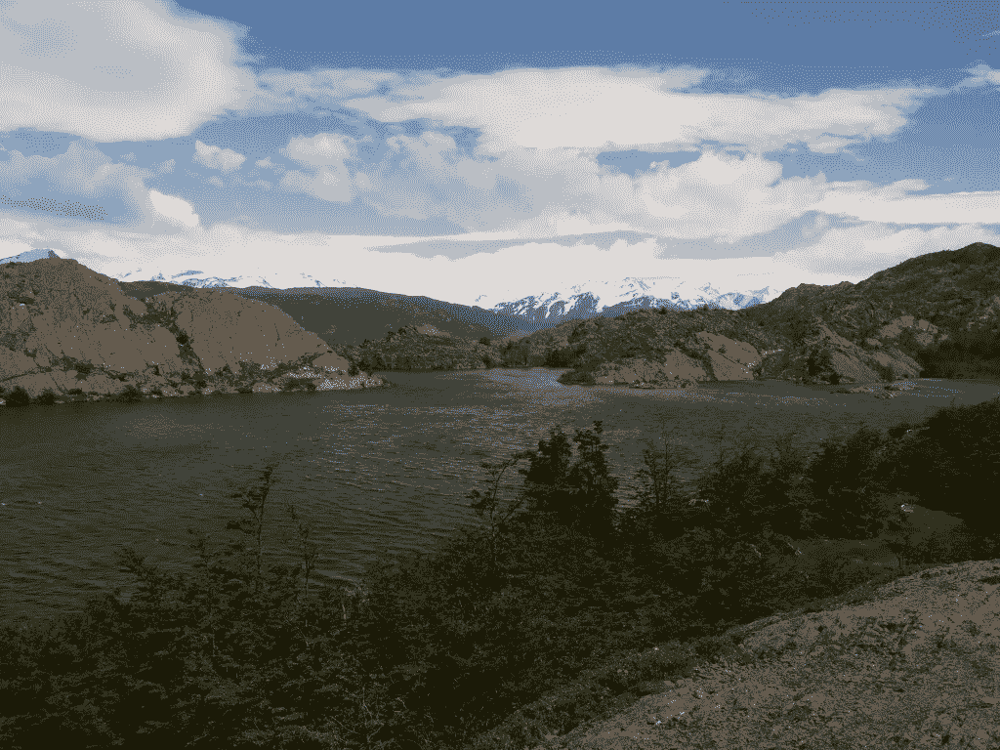
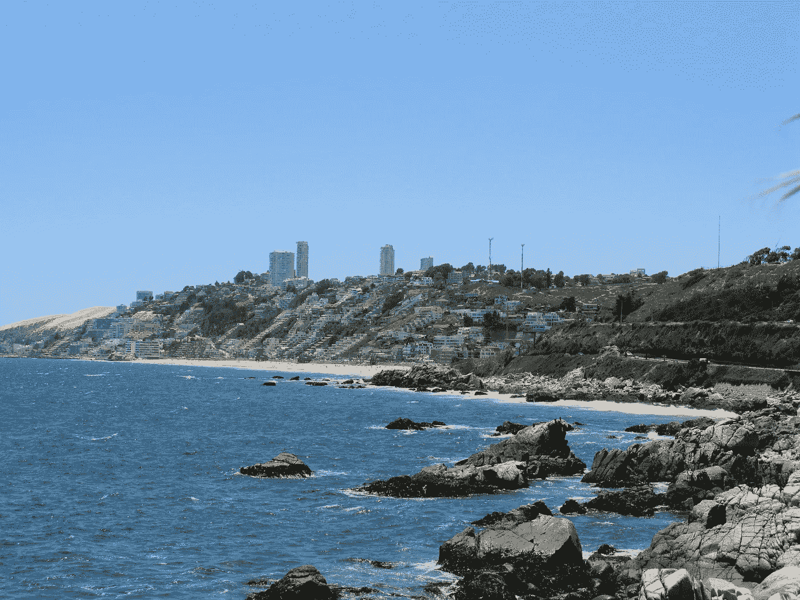

# 如何在 14 天内游览智利之最

> 原文：<https://medium.com/swlh/how-to-visit-the-best-of-chile-in-14-days-1e459a1bd120>

## 你在旅游指南中找不到的有价值的提示..

虽然它不是很出名，但它越来越成为全世界旅行者梦寐以求的地方。鉴于其独特的地理位置，该国能够为您提供各种自然美景。

另一方面，对于大多数游客来说，计划他们的旅行是一件令人头疼的事情，因为这片土地太长太分散了。

Chile is situated in southern South America, bordering the South Pacific Ocean and a small part of the South Atlantic Ocean. Chile’s territorial shape is among the world’s most unusual. From north to south, Chile extends 4,270 km (2,653 mi), and yet it only averages 177 km (110 mi) east to west.

去年 12 月(不要错过智利位于南半球的事实，仅供参考，所以你应该计划在 11 月至 3 月期间访问智利！)我的一部分家人来这里看望我。在过去的 15 个月里，我一直住在智利，我计划了一次 14 天的旅行，去参观和触摸这个国家提供的所有极限:从圣地亚哥令人震惊的混合到阿塔卡马沙漠的神秘，从瓦尔帕莱索的美好生活到巴塔哥尼亚冰川的艰苦。

因为它已经成功了，我想我会有兴趣分享它。

## **______________________**

# **圣地亚哥**

> 12 月 26 日早上抵达圣地亚哥机场。参观这座城市的一天。晚上，飞往卡拉马(该国北部)，在一家旅馆过夜。

Mercado Central de Santiago (left) and Plaza de Armas (right)

> 小贴士:不要忘记随身携带你在机场拿到的旅游签证，否则你会有麻烦离开这个国家。在圣地亚哥，去 Mercado Central(不在中心区，那是给游客的，在边上)吃午饭，晚上去 La Piojera 酒吧喝点东西。通常要去沙漠，建议你飞往安托法加斯塔。这个航班稍微便宜一点，但是你必须租一辆车，开 4 个小时到卡拉马。

# **阿塔卡马沙漠**

> **12 月 27 日**早上去圣佩德罗-德-阿塔卡马的第一班车。登记入住和旅游规划。日落时游览山谷德拉卢纳。

> **12 月 28 日**游览靠近玻利维亚和阿根廷边境的塔拉盐沼。我们看到了美洲驼、美洲驼和火烈鸟。

> **12 月 29 日**清晨 4 点醒来，前往世界第三大间歇泉地——德尔塔西奥间歇泉(4320 米)。

回来的路上，我们在马丘卡的小村庄吃了美洲驼肉(我吃过的最好吃的肉之一)。我们乘车回到卡拉马，然后飞往圣地亚哥。在圣地亚哥，我们租了一辆车，驶向太平洋，到达了瓦尔帕莱索。

> **小贴士:** *在圣佩德罗德阿塔卡马，去拉斯德利西亚斯德卡门吃。在商店里，你可以找到有助于提高海拔的古柯(圣佩德罗海拔 2500 米，大多数旅游会带你到 4000 米)。当你去间歇泉的时候，温度可能在 0 度以下，但是随着太阳的升起，温度会上升很多，所以要相应地穿衣服。*

# **瓦尔帕拉索**

> 12 月 30 日我们乘坐一辆微型汽车(当地人称之为公共汽车)来到瓦尔帕莱索，参观了市中心，然后绕着 reknown hills 走了一圈。我们在一个风景优美的艺术酒吧休息了一下。

> 下午我们驱车前往北边 1h 的小天堂扎帕拉尔。海岸驾驶值得一游。

> **12 月 31 日**我们走在维纳和雷纳卡的海滩上，直到康孔奇妙的沙丘。不管怎样，我们这一天主要集中在准备年夜饭上。瓦尔帕莱索是南美洲最著名的地方之一，沿着数公里的海岸线燃放烟花。

Valparaiso New Year’s Eve fireworks. This is the only one picture of this post that we didn’t take ourselves!

> 2007 年，瓦尔帕莱索创造了一个晚上燃放烟花数量最多的吉尼斯世界纪录:16000 个。

> **温馨提示:** *如果你在一年中的另一个时期来到瓦尔帕莱索，不用担心！请访问我们的*[*exo sphere*](http://www.exosphe.re/)*网站，您将获得比烟花更大的能量😉*

# **巴塔哥尼亚**

> 2015 年的第一天，我们开车回到圣地亚哥，然后乘飞机去了彭塔阿雷纳斯(最南端)。
> 
> 1 月 2 日早班车到纳塔莱斯港，然后乘另一班车穿过典型的巴塔哥尼亚景观，进入托雷斯·德尔·潘恩国家公园。在这里，我们乘坐双体船，到达了潘恩格兰德旅馆。

> 1 月 3 日步行 11 个小时到达 Campamiento italiano，穿过 Valle del Frances(然后返回)。

> 1 月 4 日我们沿着格雷湖走到了格雷冰川。

> 1 月 5 日，我们走了一小段路去靠近冰川，然后在返回潘恩格兰德旅馆的路上，乘坐双体船和公共汽车去了纳塔莱斯港。在这里，我们在推荐的 Picada del 卡里托斯餐厅吃了晚餐，有典型的 Asado de Cordero 和 Calafate Sour。
> 
> 1 月 6 日乘车返回蓬塔阿雷纳斯。下午，我们游览了马格达莱纳岛，这是麦哲伦海峡中部的一个小岛，夏天有 120，000 只企鹅聚集在这里繁殖后代。

> **温馨提示:** *不要相信智利地图和关于步行距离的指示。Punta Arenas 和 Puerto Natales 的大多数地方/服务不接受信用卡，而 Torres Del Paine 国家公园内的避难所接受信用卡(也接受美元/欧元，但费率不方便)。一旦进入公园，你将完全离线，没有电话网络(我们不知道，所以你可以想象我在意大利的老套母亲是如何度过那 5 天的)。*

> **1 月 7 日**航班返回圣地亚哥，旅行结束。

在 14 天内，你可以了解智利的极限:圣地亚哥的大都市、世界上最干燥的沙漠、瓦尔帕莱索五彩缤纷的山丘和巴塔哥尼亚独特的美景。是一次值得推荐的旅行！

## _______________________

# 对智利感兴趣的其他原因..

The sky in the Atacama Desert

阿塔卡马沙漠是世界上最干燥的沙漠**，因此也是许多有史以来最强大的望远镜的所在地(其中很多是**)！*)***

***智利是世界上从北到南最长的国家，全长 2647 英里(4620 公里)，横跨 38 度纬度。***

***智利有 100 多家葡萄酒厂，现在是世界第五大葡萄酒出口国。***

***智利的巴塔哥尼亚是地球上最干净的地方之一。***

******

***View of the Nevada Ojos del Salado***

***智利安第斯山脉有 2000 多座活火山。智利的最高点是内华达 Ojos del Salado，海拔 22572 英尺(6880 米)。它是世界上最高的 T21 火山。***

***苏格兰水手亚历山大·塞尔柯克被困在智利胡安费尔南德斯岛上大约四年，该岛位于瓦尔帕莱索以西 364 英里(587 公里)。获救后，他出版了自己的生存故事，据说是丹尼尔·笛福的经典小说《鲁滨逊漂流记》的灵感来源。***

***智利在 1984 年开始出口鲑鱼，现在是仅次于挪威的世界第二大鲑鱼出口国。智利也是世界上最大的鱼粉出口国。***

******

***The pool of San Alfonso del Mar Resort***

***智利的圣阿方索德尔马度假村拥有世界上最大最深的室外游泳池。***

***智利的大岛是拉丁美洲第二大岛，仅次于智利/阿根廷的火地岛。***

***智利拥有世界上最大的铜储量，约占全球供应量的四分之一，也是世界上最大的铜出口国。智利也拥有第二大锂储量。***

***智利是拉丁美洲最安全的国家。)***

******

***View of Santiago and The Gran Torre***

***作为南美洲**最发达的**国家，智利越来越成为一个 [*移民之地*](http://www.buenosairesherald.com/article/166888/chile-land-of-immigrants) 。***

***Costanera 中心的 Gran Torre Santiago 高达 300 米(980 英尺)，是拉丁美洲最高的建筑，也是南半球第二高的 T2 建筑。***

***谷歌[最近](https://www.google.com/about/datacenters/inside/locations/quilicura/)选择智利作为其在拉丁美洲的第一个数据中心**。*****

***圣地亚哥现在也是世界知名的创业中心。你可以在一天之内通过互联网创建你的公司。检查[你在一个直径](http://www.empresasenundia.cl/)的企业。***

******

***View of Reñaca, where Exosphere HQ is***

***最后，智利是 [Exosphere](http://www.exosphe.re\) 的所在地，这是一个全球性的学习和解决问题的社区，如果你是一个好奇的人，准备将你的生活引向一条有意义和独立的道路，你一定要去看看。***

***如果您在智利各地旅行，请到我们在雷纳卡的办公室来拜访我们！***

> ***还可以订阅我们的[每周策划新闻简报](http://exosphe.re/signup-form/)，我们将为您更新科学、技术、企业家精神、教育和哲学方面的有趣发展，以及关于我们不断发展的社区的所有相关新闻。***

******

****发表于* **创业、旅游癖和生活黑客*****

******************

***-***