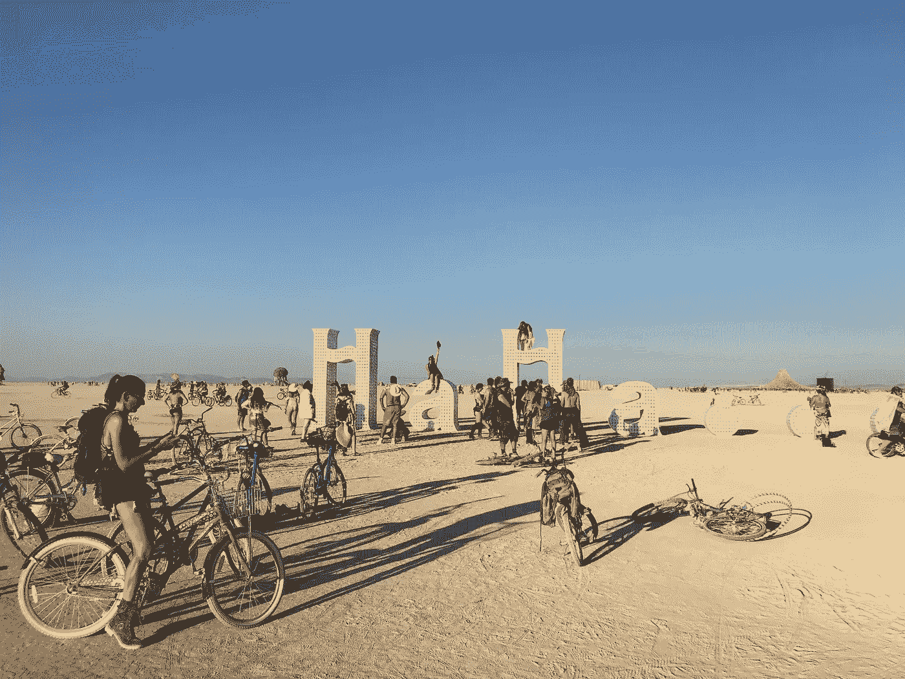

# 如何在数字世界中赢得商业和生活[播客访谈]

> 原文：<https://medium.com/swlh/how-to-win-at-business-and-life-in-a-digital-world-podcast-interview-75fa631d663a>

Burning Man 2018

## 在与最有影响力的数字营销者之一杰夫·布拉斯的对话中

> ****我每天早上五点到九点都在阅读、研究和写作。*** ***我从 2008 年到今天一直在改进那个过程****“-*[*杰夫·布拉斯*](https://medium.com/u/65e308bd88bb?source=post_page-----75fa631d663a--------------------------------) *。**

*我想与你们分享这份礼物，这是我在 2008 年进入社交媒体和数字营销领域时开始关注的第一批人之一，与 [**克里斯·布罗根**](https://isragarcia.com/chris-brogan-human-business) 一起采访杰夫·布拉斯的机会。*

# *杰夫·布拉斯:数字营销的成功之道*

*作为数字营销、社交媒体、内容营销和博客领域最杰出的人物之一，Jeff 获得了无数的认可、提及、露面和影响力。[企业家、**作家的几本书**](http://www.jeffbullas.com/blogging-the-smart-way-how-to-create-and-market-a-killer-blog-with-social-media-book/) ，其中有掌握博客艺术的八大秘诀。他的使命是帮助公司和专业人士在生活、商业和数字世界中获胜。主要通过 [**他的博客**](https://www.jeffbullas.com/) 、工作坊、咨询公司，还有他的社交网络，特别是在 [**推特**](https://twitter.com/jeffbullas) 上。你可以在这里 阅读杰夫的完整简历 [**。**](http://www.jeffbullas.com/bio/)*

# *打乱所有礼物，杰夫·布拉斯*

*这一集是一个将近一个小时的采访，我与杰夫·布拉斯深入讨论了一些在当今数字营销中脱颖而出的基本问题。除了演讲和讨论其他能让你拥有美好生活、伟大事业和伟大工作的话题。*

> *****永不满足****”—杰夫·布拉斯。***

****

**Jeff Bullas**

# **[**> > >听这里的< < <**](https://isragarcia.es/disrupt-everything/?name=2018-04-04_31_dep_-_jeff_bullas.mp3)**

****目录索引****

*   **关键里程碑。**
*   **数字景观的变化和演变。**
*   **什么公司和专业人士，都应该关注数字营销。**
*   **有效的多渠道策略。**
*   **内容营销的关键指南。**
*   **SEO 的支柱。**
*   **如何创建一个超过 8 年仍然非常受欢迎的博客？**
*   **博客的关键。**
*   **杰夫·布拉斯的一天。**
*   **最具决定性的能力。**
*   **重塑的关键过程。**
*   **最果断的习惯。**
*   **当前和未来的项目。**
*   **从哪里学习，从哪里获得灵感。**
*   **他最喜欢的播客。**
*   **最喜欢的博客。**
*   **向谁学习。**
*   **个人方面和生活方式。**

**一些资源:**

*   **[**深功**](https://www.amazon.com/Deep-Work-Focused-Success-Distracted/dp/1455586692) 。**
*   **[T5【Flipboard】T6](https://flipboard.com/)。**
*   **[**推杆**](https://pushcrew.com/) 。**
*   **[**上书**](https://www.amazon.es/Writing-Memoir-Craft-Stephen-King/dp/1439156816) 。**
*   **[**HubSpot 博客**](https://blog.hubspot.com/) 。**
*   **[**赛斯·戈丁**](http://sethgodin.typepad.com/) 。**

## **你也可以直接从 [Disrupt Everything 播客系列主页](https://isragarcia.es/disrupt-everything/)收听。**

**【本帖最早出现在[**isragarcia.com**](https://isragarcia.com/chris-brogan-human-business)】**

# **只有当你觉得值得的时候，才让这个故事震撼吧！如果你发现任何有价值的东西，请鼓掌。**

> **Isra Garcia = 55 个客户，48 家企业，400 次演讲，3.574 篇帖子，24 个项目，6 本书，380 场讲座，6 家公司，17 次冒险，26 次实验，∞失败。到目前为止…**
> 
> **[有一手](https://isragarcia.com/wp/marketer)。顾问。扬声器。作家。教育家。经理。在 [IG](http://thisisig.com) 的负责人。博主。企业家。颠覆性创新。数字化转型。高绩效者和生活方式实验者。**

# **行动号召>>订阅[此处](http://feeds.feedburner.com/isragarcia)更多类似本文的文章！**

****

## **这篇文章发表在 [The Startup](https://medium.com/swlh) 上，这是 Medium 最大的创业刊物，拥有+367，690 名读者。**

## **在这里订阅接收[我们的头条新闻](http://growthsupply.com/the-startup-newsletter/)。**

****