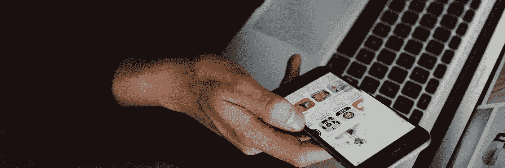
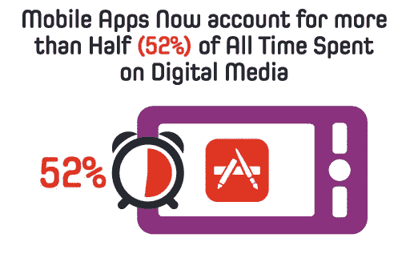
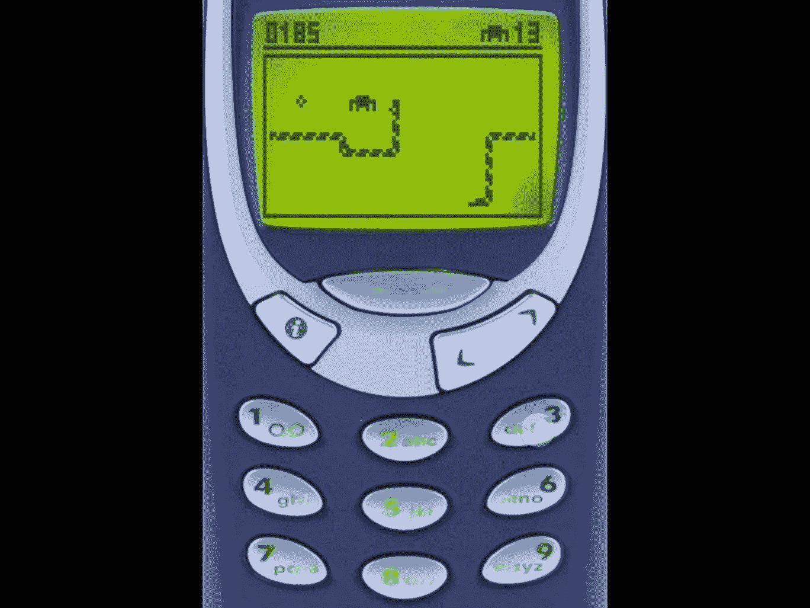
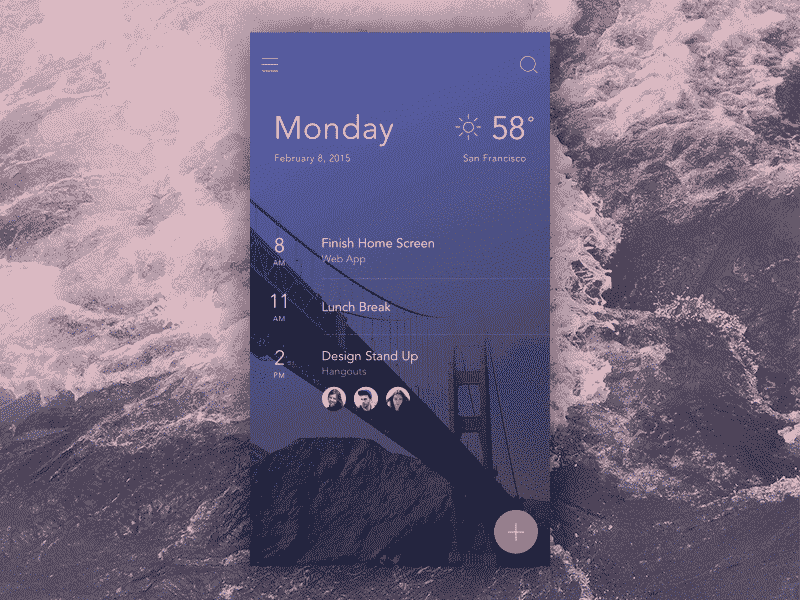
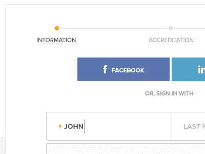
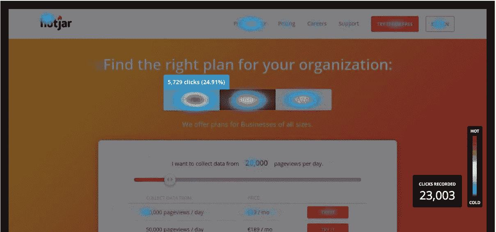

# 如何赢得 UX 用户！

> 原文：<https://medium.com/swlh/how-to-win-ux-users-81de51cd27c6>

移动应用程序设计者的当务之急是创造一个成功的策略！

Mobile App Usage by [GO-Globe](https://www.go-globe.com/blog/mobile-apps-usage/)

苹果(Apple)和谷歌(Google)等领先公司提供了超过 100 万个应用程序，而《环球时报》(GO-Globe report)的一项研究显示，用户在数字媒体上花费的时间超过一半都花在了观看移动应用程序上。用户下载应用程序的心理是为了让生活更舒适，如果这个目标没有实现，他们会很快卸载它。设计师可以研究当前的应用程序使用情况，以找出什么有效，什么无效，这对他们的用户来说是不可或缺的。

**以下是一些当前的统计数据，供您概述**

*   500 家领先商家报告称，42%的移动销售额来自应用程序
*   从 2015 年的 450 亿美元到 2016 年的 580 亿美元，移动应用的收入每年都在持续增长。
*   最常用的类别依次是游戏、社交网络应用和音乐。
*   由于手机比笔记本更方便，大约 85%的用户更喜欢手机应用程序而不是手机网站。

**紧跟潮流**

A legendary game for a legendary phone article by [Independent](http://www.independent.co.uk/life-style/gadgets-and-tech/news/nokia-3310-back-how-to-play-snake-game-mobile-phone-return-a7579901.html)

诺基亚在 1998 年实施了一项伟大的战略，当时他们在手机上推出了一款名为 Snake 的预装游戏。在那之前，用户将手机视为打电话和发短信的设备，并没有想到它也是一种娱乐设备。

这个聪明的策略改变了游戏规则。诺基亚设法挑选了一个受欢迎的东西，并将其与他们的产品相结合。然而，竞争对手很快跟进，那时诺基亚已经成为有史以来最畅销的手机。

案例研究，调查，跟随流行趋势，带着熟悉感创造出更具创新性的东西，这是设计师可以遵循的久经考验的道路。

**清新大方**

Secret Project by [Anton Aheichanka](https://dribbble.com/madebyanton)

选择一个感觉干净宽敞的用户界面(UI)。请记住，它将在不同大小的屏幕上显示，分析它如何在这些屏幕上调整大小，并选择最佳的最小化 UI 设计。

只有当你的应用比市场上类似的应用更吸引人、更有效时，用户才会保留你的应用。与其制作复杂的用户界面，不如通过使功能清晰和易于理解来吸引注意力。

使屏幕元素足够大，以便正确阅读。屏幕上太多的元素会降低可读性，让用户不知所措。记住拇指是最常用的手指，并围绕它设计功能。

用户不仅可以在稳定的位置访问移动应用，还可以在移动中访问。测试多任务处理时的易用性，如吃饭、写字、走路以及光线不足的情况。干净的功能和最少的混乱将确保用户不会意外地选择一些错误的功能。

Login Example by [Kerem Suer](https://dribbble.com/kerem)

尽可能允许用脸书或谷歌登录，以尽量减少出错的可能性和由此带来的挫败感。同样，纳入自动完成个人信息的要求。

**利用 UX 分析**

Analytics by [Hotjar](https://www.hotjar.com/tour)

与网站分析类似，你可以通过收集和分析数据来评估你的应用的弱点和优势。触摸热图可用于评估用户将屏幕向下滚动多远，以便对交互有更大的了解。同样，可以找出摩擦点，以了解用户在注册过程中停止的位置。精炼和即兴创作将随之而来。

最后一点要记住的是，成功的设计师包括 UX 战略，使他们的应用程序吸引人，这给他们的企业带来更可观的财务成功！

*您可以关注我们的***/*[*LinkedIn*](https://www.linkedin.com/company/13404751/)*/*[*Twitter*](https://twitter.com/monsoonfishy)*/*[*Dribbble*](https://dribbble.com/monsoonfish)*

**原载于 2017 年 11 月 2 日*[*monsoonfish.com*](http://monsoonfish.com/blog/how-to-win-ux-users/)*。**

**

## *这个故事发表在 [The Startup](https://medium.com/swlh) 上，这是 Medium 最大的企业家出版物，拥有 292，582+人。*

## *在这里订阅接收[我们的头条新闻](http://growthsupply.com/the-startup-newsletter/)。*

**