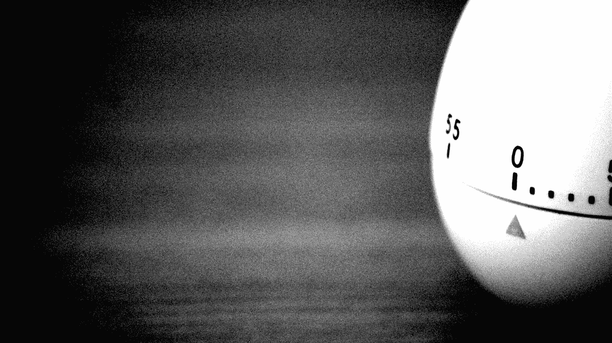
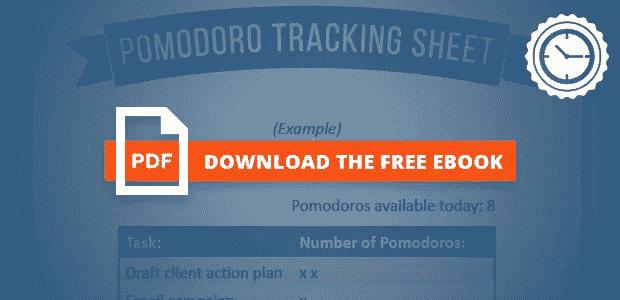

# 16.7 如何工作 40 小时

> 原文：<https://medium.com/swlh/how-to-work-40-hours-in-16-7-d9038681e652>

我曾经一周工作**——60、80 甚至 100 个小时。我让我的工作成为我定义自己的一大部分。我把那些疯狂的时间当作荣誉徽章……我喜欢告诉人们我有多“忙”……以及我有多少“必须做的事情”。**

*听起来熟悉吗？*

*回顾过去，我意识到我用我的工作来填补自己的空白。问题是这个空洞就像一个黑洞。无论我工作多少小时，似乎都无法填满。如果有什么不同的话，那就是让我感觉更糟。*

*有一天我受够了。说实话，我已经受够了。我停下来重新评估我的生活，试图找出什么对我来说是重要的，什么不是。我意识到，虽然工作很重要，因为我想感到富有成效，但它只是一件重要的事情……而且不是最重要的事情。此外，我意识到从事我并不真正喜欢的事情对我的健康有害。*

*所以我决定我必须做一个大的改变…*

# *寻找道路*

*因为我的工作对我来说很重要，我必须想出如何更聪明地工作，而不是更努力。我必须优化我的工作流程，用更少的时间做更多的事情。*

*当然，我也必须找到我喜欢的、让我充实的工作，而不是让我精疲力竭的工作。通过这样做，我有更多的时间来提高自己，与朋友和家人在一起，并真正在各个层面上保持健康——思想、身体和灵魂。*

*我喜欢阅读。我特别爱看能帮助我提升自己的东西。我着手的改变给了我一个完美的借口去疯狂阅读！我读了所有我能找到的关于更聪明地工作的书。我读了很多相同主题的博客帖子。我和人们交谈。*

*然后，我把对我来说最有意义的事情拿出来，去实施。有些是彻底的灾难。有些部分有效，但显然不适合我。*

*我注意到几个不同的解决方案各有一个难题。我把那些对我有用的部分组合成我自己的系统。缓慢但坚定地，我开发了一个公式，它将永远改变我的工作方式。*

# *进入番茄花园*

**

*多年来，我听说过一个叫做番茄工作法的时间管理系统。这似乎太简单了，但正如他们所说，最简单的事情往往效果最好。*

*我读了它的创造者 Francesco Cirilio 在 2006 年写的论文，这篇论文解释了这项技术，同样重要的是，它背后的心理学。这一革命性的时间管理系统看似简单易学，但如果应用正确，将会改变你的生活。[番茄工作法](http://pomodorotechnique.com/)可以分解为以下四个基本原理。*

***1。和时间一起工作，而不是和它作对:**我们中的许多人活得好像时间是我们的敌人。我们争分夺秒地完成任务并赶上最后期限。番茄工作法教我们与时间一起工作，而不是与时间抗争。*

***2。消除倦怠:**工作时有计划地短暂休息可以消除当你把自己逼得太紧时产生的“气喘吁吁”的感觉。坚持制度就不可能过度劳累。*

***3。管理分心的事物:**电话、电子邮件、脸书的信息，或者突然意识到你需要给你的汽车换机油——分心的事物不断地轰炸着我们。通常，这些干扰可以等待。番茄工作法可以帮助你记录分心的事情，并为以后的事情进行优先排序。*

***4。创造一个更好的工作/生活平衡:**我们大多数人都非常熟悉拖延带来的罪恶感。如果我们没有过有成效的一天，我们似乎就不能享受我们的空闲时间。作为一个番茄大师，你制定了一个有效的时间表，完成了你的高优先级任务，所以你真正享受你的休息时间。*

*”*这一切都很棒，*你可能会想，“*但是我实际上做了什么呢？**

## ***很简单:***

*1)选择一个任务；*

*2)设置定时器 25 分钟；*

*3)继续完成你的任务，直到计时器响起，然后在追踪器上打上勾号；*

*4)休息五分钟(你刚刚完成了你的第一个番茄！);然后*

*5)重复步骤 1-4 三次，然后休息 15 分钟。*

## *简单，但是…*

*现在，你可能在想"*二十五分钟的工作？那不算什么！这很简单。*“没那么快……那是 **25 分钟稳定、专注地完成一项任务**。不要一心多用。没有邮件。不打电话。没有检查脸书。**没事！不允许分心！***

*对我来说，这需要一些时间来适应，并且需要一些工具和技巧。以下是我用过的:*

*1)一个厨房定时器(或者一个 app)；*

*2)飞行模式(任何手机上最重要的功能！);*

*3)安静的工作场所和/或一副好的耳机或耳塞；*

*4)笔和纸(针对那些番茄工作证)；*

*5)每天早上五分钟计划一天的任务；和*

*6)每周末 30 分钟回顾过去的一周，计划下一周。*

# *寻找神奇的组合*

*像我生活中的大多数事情一样，我通过实验学习，经历了许多痛苦和挫折，但最终还是成长了。*

*起初，我以为我每天可以做 16 个番茄，没问题。我已经习惯了大量的工作，以至于不到七个小时的工作似乎轻而易举。第一天我完成了 12 个番茄。我做了很多，但仍然觉得自己很失败，因为我没有达到目标。我感到疲惫和痛苦。*

*在接下来的几天里，我试图削减我的目标数字。当它起作用时，我完成了一大堆事情，并且感到非常有效率。我知道我找到了好东西。其他日子里，我做得太少或太多，感觉像废物，并确信这是世界上最愚蠢的系统。*

*有一天，我完全忽略了这个系统，回到了多任务状态。我注意力不集中，没有收获，很沮丧。我咬紧牙关，继续用我的老方法做了几天。我发现我把事情做完了，但是我的工作效率根本无法和番茄大战时相比。*

*理智恢复了。我开始试验少量的番茄，从每天五个开始，逐渐增加到八个。我的目标是每个工作日吃 8 个番茄，每周总共 40 个。*

*这(在某种程度上)奏效了，但正如他们所说，生活就是这样。有些日子我有太多的会议要参加，或者我的女儿在学校有一场独奏会，我不想错过，我就是找不到合适的八个番茄。很明显，40 是我每周的神奇数字，但我需要对我的工作周不那么严格。*

*数学很简单: *40 个番茄=每周 1000 分钟的工作*(加上 350 分钟的休息时间)。这相当于 T2 每周平均工作 16.7 小时。就是这样！*

*然而，当我有太多事情要做，或者感到身体或精神不舒服时，我就吃不下八个番茄。我会落后，第二天我会试图塞进 14 个，让我筋疲力尽，对我的工作质量不太满意。*

*我意识到我必须退后一步，重新思考我的一周，关注我的情绪。重新关注[对我来说什么是正确的](http://hitenism.com/focus-on-your-own-success/)。番茄工作法很棒，但是缺少了一些东西来让它真正为我工作。*

# *动机心理学*

**

*在一个完美的世界里，我会在每个工作日开始时确定八个高价值的任务。我会优先考虑这些，从最重要的到最不重要的，一个接一个地把它们去掉。我对每一件事都同样充满热情和动力，不会被打断，并且会在不到三个小时内完成一天的工作。*

*听起来很棒，对吧？不幸的是，“我们的生活远非完美”。*

*事实是，我是一个人，生活在一个充满其他人的世界里。我有控制不了的情绪，经常会很累。有些任务我就是不想做，尽管我知道它们很重要，可能很紧急。*

*为了使这项工作长期进行，我必须面对这些事情，并学会接受它们，与它们合作，而不是反对它们。*

*我的精力水平和态度会影响我的工作和产出，所以我必须保持现在的状态，控制自己。读了一篇有用的博文，我发现像这些的[问题特别有帮助:](http://blog.bufferapp.com/the-4-elements-of-physical-energy-on-how-to-master-them)*

*   *我的体能— *我有多健康*？*
*   *我的情绪能量— *我有多快乐*？*
*   *我的精神能量——我能多好地专注于某件事？*
*   *我的精神能量——为什么我要这样做？我的目的是什么？*

*这些问题帮助我在安排任务优先级时考虑到了我的心情和精力。结果，我不再做任何事情，只是因为我觉得我必须做。*

*当我体力不支时，我会努力保持健康。当我情绪低落的时候，我会找一些让我开心的事情，比如和我的妻子和女儿在一起。*

# *一周工作七天*

*还记得我是从哪里开始这一切的吗——在疯狂的时间、晚上和周末工作？*

*当我决定改变时，我对自己发誓绝不在周末、假日、假期，甚至下午 5 点以后工作。很好，对吧？嗯，我很高兴地告诉大家，我打破了所有这些承诺，这实际上是一件好事。*

*在那些我不能在下午 5 点前吃完 8 个番茄的日子里，我会感到有压力。我会觉得自己很失败。突然我意识到我对工作周的看法太局限了。为什么我对自己做出这些承诺，限制我工作的时间？我这样做是因为我的工作生活不如意，工作时间太长，而且出于错误的原因。*

*我从单纯的*工作过渡到*…做让我满意的事情。此外，我给自己自由去做非工作的事情，比如在大多数人认为的工作时间去参加我女儿的独奏会。这让我很容易改变自己什么时候可以工作，什么时候不可以工作的心态。*

*我的难题的最后一块是从五天工作制(我必须在下午 5 点前停止工作)转变为七天工作制(我可以在适合自己的时候工作)。这让我每周有 40-45 个小时来吃 40 个番茄，变成了 168 个小时。因为我只需要 **16.7 小时净**，这意味着**我只工作 10%的时间**。差别真大！*

# *什么？！我应该在一周 16.7 小时内做所有的事情？！*

*你可能在想，“我两天工作的时间比这还多，而你想告诉我这就是我一周工作的全部吗？*

*是啊！这正是我要告诉你的。不，你可能仍然每周“工作”超过 16.7 小时。我每周“工作”35-40 个小时，但我至少花其中的 20-25 个小时打电话、开会、网上网下以及其他不太专注的任务。这些很重要，但我不算工作时间。*

*我真的每周工作 16.7 个小时，在这几个小时里我完成的工作是其他 25 个小时的五倍。*

*这是无法避免的。[生活发生](http://www.nerdfitness.com/blog/2010/03/08/how-to-deal-with-life-when-sh-happens/)。只要人类参与其中，尤其是如果你生活在一个 24/7 互联互通的现代社会，想要拥有一个完美的工作环境几乎是不可能的。然而，你可以更聪明地工作，而不必更加努力。*

*你准备好了吗？*

****行动思路:*** *从今天尝试 1 个番茄开始。在一项任务上集中工作 25 分钟。从一个开始，然后从那里开始。**

# *想更进一步？*

*准备好每周节省 23.3 小时并获得更多成就了吗？*

*你当然是…我想让你尽可能轻松。*

*[**点击下面的图片**](http://www.chriswinfield.com/save-23-hours-ebook) **获取我的免费 32 页电子书。***

*本指南详细解释了我的简单系统，包括工作表、工具和资源，您可以打印出来使用。*

****

**发表于* **创业、旅游癖和生活黑客***

******

*-*