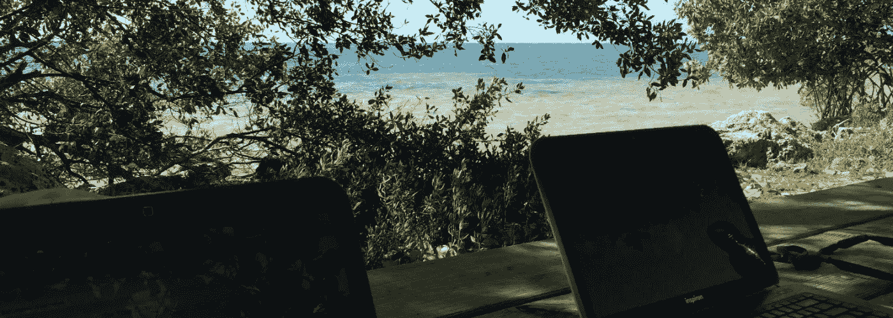
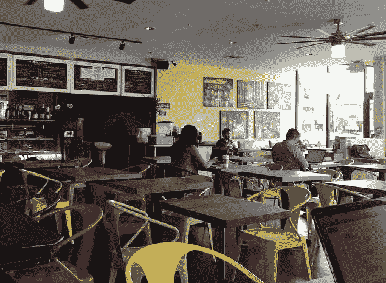
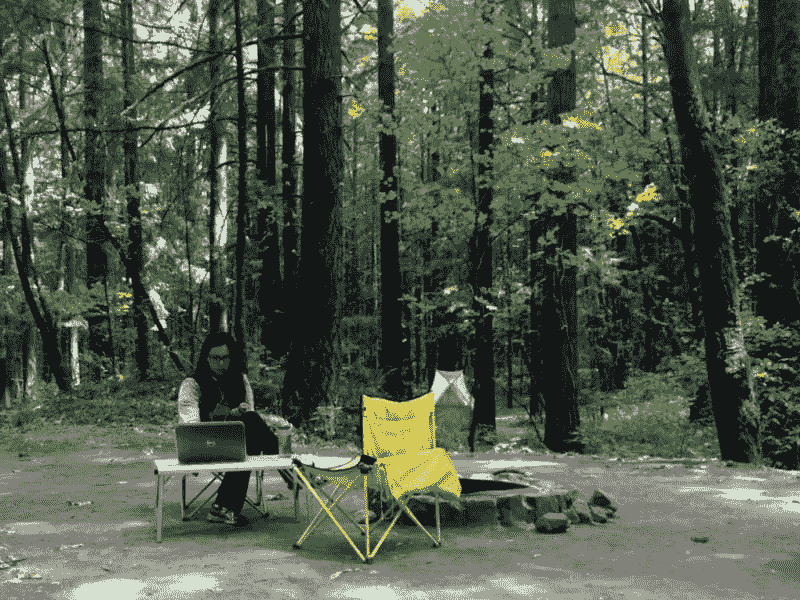

# 如何工作和旅行:来自数字游民的 6 条建议

> 原文：<https://medium.com/swlh/how-to-work-and-travel-4c64601e3161>

Working from the Florida Keys

互联网无处不在，为什么工作要局限在办公室？越来越多的专业人士正逃离他们的小隔间，成为“数字游民”——一边赚钱一边环游世界。

*   [汤姆和珍妮](http://tillthemoneyrunsout.com/)创办了一家公司，为患有自闭症的儿童开发[应用](http://touchautism.com/)，他们在从路易斯安那州的新奥尔良到越南的丰芽等地工作。
*   梅尔和阿曼多作为自由职业者，乘坐一辆名为“莫克”的威斯特法伦面包车环游欧洲。
*   我丈夫和我去年开始在美洲做自由职业者，在哥斯达黎加的丛林中通过 Skype 进行电话会议。

# 也想实现梦想吗？

做一名数字流浪者很有趣，但可能比你目前的生活方式更难。在我们的文化中，上班族的日常工作是本能的:通勤、小隔间、电话会议、喝咖啡、休息时间。要打破这种模式，成为一名数字流浪者，你必须有创造力、灵活性和毅力。

如果你想迈出这一步，以下是当前赚取收入的环球旅行者对实现这一目标的看法。

# 1.如果你现在的工作不是不受地点限制的，考虑一下自主创业。

大多数基于知识的工作都可以在网上进行，从平面设计和商业咨询到远程医疗和在线教育。虽然一些雇主雇佣不受地域限制的员工，但许多数字游民是个体经营者或自由职业者。灵活的日程安排有助于旅行。

> “如果我们有一个期限，我们可能会在一个美丽的地方，但我们会工作 11 个小时来交付。有时候我们就是不想工作——我们也没必要工作。”

**看你的技能** [**研究你的选项**](https://fizzle.co/sparkline/64-ways-location-independent-people-earn-a-living) **。Armando 是自由摄影师和视频编辑，Mel 是自由撰稿人和社交媒体经理。“我们的客户遍布全球，从毛里求斯到奥斯陆再到纽约，”梅尔说。当你不受地点限制时，你的客户也可以——打开更多的门。**

Coffee shops are great for concentration

# 2.练习寻找无线网络和工作空间。

旅行时你需要互联网来工作。Armando 和 Mel 乘坐面包车出行，因此他们的便携式 Wi-Fi 热点让他们在太阳能电池板为他们的设备充电时保持在线。汤姆和珍妮在 Airbnb 或[上租房子做保姆](http://www.theprofessionalhobo.com/2013/05/financial-travel-tip-81-free-accommodation-with-house-sitting/)，这样他们就有了私人工作空间。

幸运的是，有很多选择:**咖啡店、公共图书馆、网吧、智能手机、公共热点、** [**共同工作空间**](http://www.brazencareerist.com/blog/2011/11/17/what-to-look-for-in-a-co-working-space/) **、城市公园，以及你住处的客人互联网**。可靠性可能是一个问题——当 Wi-Fi 关闭时，我们都会后悔，我们已经支付了咖啡的费用——所以有一个备份是很好的，就像将你的笔记本电脑与智能手机捆绑在一起。

> 他们认为，如果你在某个地方不打卡，你一定是失业了。这取决于你来处理这些误解。

# 3.找到自己的工作-生活-旅行平衡。

平衡工作和生活具有挑战性；现在，再加上旅行。给自己时间去适应新的生活，如果一开始事情感觉有点混乱，也不要气馁。区分工作任务的优先次序，允许自己离开网格，比如说，去山里远足，这需要练习。

有些日子你要工作，有些日子你要观光，有些日子你两者兼而有之。正如 Mel 解释的那样:“如果我们有一个期限，我们可能会在一个美丽的地方，但我们会工作 11 个小时来交付。有时候我们就是不想工作——我们也没必要工作。”最终，你会找到适合你的平衡点。

Sightseeing in Valparaiso, Chile

# 4.慢慢走。

慢旅行——在更少的地方花更多的时间——极大地帮助平衡工作、生活和旅行。这也会帮你在全职旅行时省钱。珍妮说:“我们尽量在某个地方呆久一点，这样我们就可以按照自己的时间表看东西，也可以有工作日。”。“我们也更喜欢住在一个地方，感受那里的生活，而不是四处奔波观光。”

记住，你是在生活——而不是在度假，试着在一周内走尽可能多的路。给自己一个像当地人一样生活的机会，你会有更丰富的经历。

> 如果你紧张，那是正常的——不要让它阻止你。

# 5.准备好面对对你生活的误解。

“你遇到的每一个人，甚至你很熟悉的人，都以为你在永久度假，”珍妮说。许多人对工作仍有传统观念。他们认为，如果你在某个地方不打卡，你一定是失业了。如何温和而坚定地处理这些误解取决于你，尤其是来自潜在客户的误解。与朋友和家人谈论你的旅行*和*你的工作项目；如果客户担心你的可用性，准备好做出额外的回应。

另一方面，有些人可能会认为你是一个工作狂，在度假时不停地查看电子邮件。“我们住在一家小旅馆里，每次我们试图在餐厅工作时，老板都会善意地唠叨我们把电脑放好，去享受这个小镇，”珍妮回忆道。要有耐心和礼貌，记住他们只是想帮忙！

Campground conference calls

# 6.拥抱不确定的事情，记住事情总是朝着好的方向发展。

如果你正在考虑数字游牧生活方式，你可能比一般人有更高的风险容忍度。然而，做出如此巨大的生活改变可能会令人害怕。如果你紧张，那是正常的——不要让它阻止你。**“愿意冒险，”梅尔鼓励道。**“安全没意思。世界唾手可得，尤其是有了今天的技术。”

体验新的地方和冲出舒适区会让你成为一个更强大、更充实的人。记住，如果有必要，你随时可以回来找工作，但你可能会沉迷于你为自己建立的新生活。

“别想了，去做吧！”珍妮说。“相信事情会解决的。他们总是这样或那样做。”

**你对成为数字流浪者有什么疑问吗？请在评论中告诉我，我很乐意帮忙！**

[*塔玛拉·默里*](http://www.helloimtamara.com/)*(*[*@塔玛拉·默里*](http://www.twitter.com/tamaramurray) *)是一位社会变革沟通顾问、全职旅行者，著有《令人敬畏的管理技巧:给年轻的初次管理者的七堂课 *》。她和丈夫作为自由职业者，开着一辆由小型货车改装而成的露营车在北美旅行。她在博客上谈论职业中断、生活方式设计和了不起的人。**

*原发布* [*于 LinkedIn*](https://www.linkedin.com/pulse/how-work-travel-6-tips-from-digital-nomads-tamara-murray) *。*

*发表于* **创业、旅游癖、生活黑客**

-