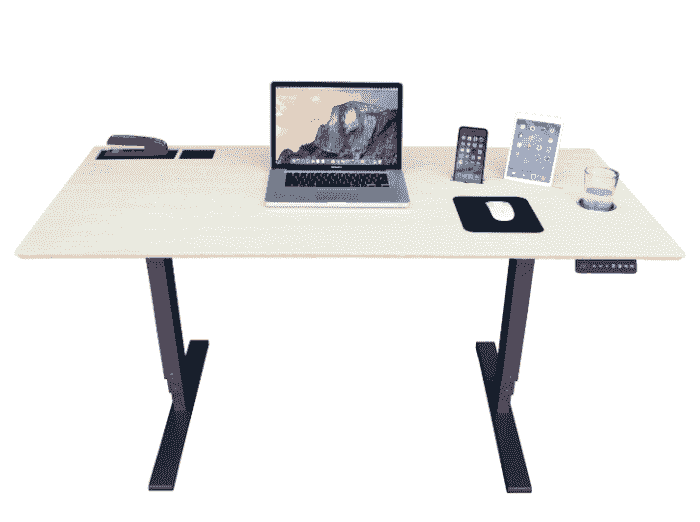
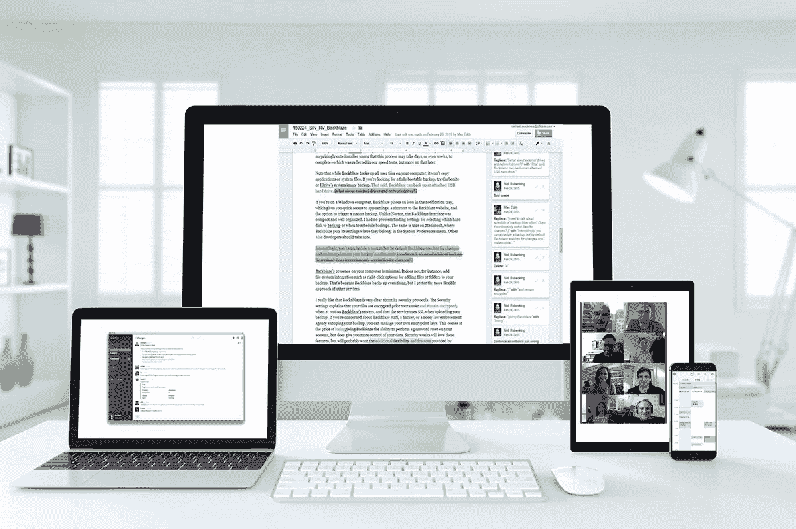

# 如何在家工作并完成任务

> 原文：<https://medium.com/swlh/how-to-work-from-home-and-get-stuff-done-3d91d1070b39>

The view from my balcony. =)

越来越多的承包商和全职员工在家工作——或者幻想在家工作。

但是不要让这种惊人的优势欺骗了你，[远程工作需要大量的工作](http://thegallupblog.gallup.com/2013/07/remote-workers-log-more-hours-and-are.html)。更不用说，这是一种截然不同的工作方式。

虽然在家工作很棒，但也给沟通、生产力和公司文化带来了挑战。

在远程工作多年后，我经历了所有这些挑战并幸存了下来。这篇文章是我在家工作的终极指南。它包含了所有的细节，从您需要开始做什么到尽可能做好远程工作的一长串提示和技巧。

# 让你的家庭办公室合法化。

我再怎么强调拥有合适的办公室布置的重要性也不为过。

决定一个人专注能力的唯一最重要的因素是他们的物理环境。事实上，一个设计良好的办公室可以让你的工作效率提高 20 %( T2)。

正确的家庭办公室设置不仅会让你更有效率，还会让你看起来更专业。

让我们深入探讨如何让你的家庭办公室合法化。

## 环境

我认为，你在哪里设立家庭办公室与你为家庭办公室购买什么一样重要，如果不是更重要的话。

**你需要一个单独的空间。**

达拉斯室内建筑和设计公司 Staffelbach 的总裁乔·海因茨(Jo Heinz)表示，为了实现最高效率，必须区分工作空间的物理边界。

在你开店之前，亨氏建议考虑以下问题。

*   **需要做什么类型的工作？如果你正在做大量深度工作，那么你需要一个安静的地方来思考。**
*   **我会参加电话会议吗？再次强调，这类工作需要安静。**
*   **我会参加视频会议吗？如果你是，你的办公室应该看起来像样。**
*   **外部客户会参观这个空间吗？**
*   **同事会因为协同工作而来访吗？**
*   我什么时候能完成大部分工作？

如果你一开始就没有那么大的工作空间，可以考虑买一个[分隔书架](https://www.buzzfeed.com/peggy/room-dividers)来增加你空间的私密性。

你需要良好的照明。

试着把你的桌子放在窗户旁边，因为这样会增加光线。更不用说，[自然光提升生产力](http://www.nrel.gov/docs/fy02osti/30769.pdf)。

[为了避免眩光](https://www.entrepreneur.com/article/202566)，不要将顶灯直接放在电脑屏幕上方，也不要将电脑屏幕直接放在光源前面，因为会造成眼睛疲劳。

**你也可以使用视图。**

根据研究人员的说法，我们日常环境的风景质量与我们的个人幸福有着直接的关系。

我相信——非常相信——我刚刚把我的公寓升级为海景公寓。我整天在家工作，我知道这会让我更开心。

如果你坚持平淡的观点，发挥创造力。你可以很容易地用很酷的艺术品和一些油漆来点缀你的办公室。如果你感兴趣的话，这里有一篇关于提高生产率的最佳颜色的文章。)

## 五金器具

**智能桌面**

在买我现在这张桌子之前，我没有花太多心思在我买的桌子上，我为一张不舒服的桌子支付了一年的费用。糟透了。

这一次，我投入了大量时间和研究，寻找最好、最具成本效益的可调立式办公桌。我最终购买了[自动智能桌面](https://www.autonomous.ai/smartdesk-sit-to-stand-height-adjustable-standing-desk)，我对它非常满意，尤其是它的价格。

只需轻触一个按钮，书桌就可以在站立和坐着之间转换。价格在 249 美元到 399 美元之间，取决于你想要的功能。

**支撑椅**

有了亚马逊，就没有必要花 900 美元买一把“符合人体工程学”的椅子。以下是你为家庭办公室购买椅子时需要记住的事项。

*   确保它有一个舒适的坐垫。显然，你想要一个舒适的座位。除了舒适的靠垫，还要寻找透气的面料。
*   寻找扶手。 [扶手](http://lifehacker.com/5755870/how-to-ergonomically-optimize-your-workspace)应该足够低，让你的肩膀保持放松，肘部弯曲大约 90 度。
*   寻找一把靠背高度可以调节的椅子。你想要一把能够上下调节椅背角度的椅子。
*   **腰部支撑很重要。**因为我们的背部[稍微向内弯曲](http://lifehacker.com/5755870/how-to-ergonomically-optimize-your-workspace)，我们的椅子不应该直接垂直。相反，它应该挺身而出，支撑我们的下背部。你可以通过亚马逊获得一个 [$8 的附加支持](https://www.amazon.com/Angel-Sales-PosturePro-Lumbar-Support/dp/B000AP0HY4/ref=sr_1_1?ie=UTF8&s=hpc&qid=1269159403&sr=1-1&tag=lifehackeramzn-20&ascsubtag=d1fb7e64c42cddb0bb9d1a99c2147cee55126146&rawdata=%5Bt%7Clink%5Bp%7C30833302%5Ba%7CB000AP0HY4%5Bau%7C5716509846451982265%5Bb%7Clifehacker)，或者在你的椅子上绑一个纸巾卷。
*   **不要忘记车轮。你想轻松地浏览你的办公室。当你去拿东西时，没有轮子的椅子很容易使你的身体疲劳。**

## 电脑配件

**笔记本电脑支架**

笔记本电脑支架可以防止你无精打采，对你的姿势和健康有好处。一个很好的经验是找一个支架，让你的眼睛在屏幕下面两到三英寸的地方。

[TechCrunch](https://techcrunch.com/2016/05/19/things-to-make-your-home-office-legit/) 声称[这款 65 美元的笔记本电脑支架](https://www.amazon.com/dp/B00LSU4QD8?tag=wctchcrsynd-20&ascsubtag=SH34885)在测试了 11 种不同型号后是最好的。

**耳机**

这里没有确定的“最佳耳机”，因为它主要取决于个人喜好和预算。在互联网上搜索耳机时，请记住以下几点。

*   确保穿着舒适。你将长时间戴着耳机，所以要确保佩戴舒适。例如，我永远也不能戴那种很酷的耳罩式耳机,因为那会让我立刻偏头痛。
*   确保它合乎逻辑。你不会想依靠电脑音频来进行电话会议，因为它可能质量不佳。所以确保你的耳机有一个合适的内置麦克风，这意味着那些很酷的无线耳机可能就不行了。
*   考虑降噪耳机。如果你工作的时候别人在家，那么投资一副[降噪耳机](http://thewirecutter.com/reviews/best-noise-cancelling-in-ear-headphones/)可能是值得的。

## 噪音过滤器

有时候一定程度的噪音有助于集中注意力。考虑购买一个小风扇或空气过滤器来消除房子周围的其他噪音。

是的，你可以听像 [RainyMood](http://rainymood.com) 这样的音乐，但是我不喜欢一直戴着耳机。

# 远程优化您的计算机。

一套可靠的软件和工具是远程工作的核心。虽然您所在的每个团队不一定拥有完全相同的工具阵容，但您可以肯定每个团队都会使用以下工具。

## 松弛的

你工作的任何远程团队都极有可能使用某种聊天应用程序——可能是 [Slack](https://slack.com/) ，因为它拥有[400 万日活跃用户(DAU)](http://expandedramblings.com/index.php/slack-statistics/) ，平均增长率在 3%到 5%之间。

当你在网上的时候，你在办公室里被认为是。这可能是你每天与团队成员交流最多的地方。这绝对是我花费大量时间的地方。

还有一些不太受欢迎的替代产品，包括 Skype 和 HipChat。

## Google Drive

我非常依赖 Google Drive 进行协作，其他远程工作者也是如此。

## 一本好日历

一个好的日历会有一个内置的时区转换器。虽然 Sunrise 彻底伤了我的心，[卖给了微软](https://techcrunch.com/2015/02/11/microsoft-confirms-sunrise-acquisition-adds-depth-to-it-mobile-productivity-offerings/)，但我听说了很多关于[fantastic](https://flexibits.com/fantastical)的好消息，它内置了时区转换器。

## 在线会议工具

当你要开会时，你可能会通过视频来进行。我要说的是，尽管 Google Hangouts 可能很不靠谱，但它是最受欢迎的视频会议工具之一。

其他受欢迎的选择包括:Zoom、Join.me、Skype、GoToMeeting 和 Slack calls。

我最喜欢的 Zoom 功能之一是它的录音功能，它允许你记录重要的会议。

# 远程工作最佳实践:让远程工作为您服务。

## 沟通至关重要。

理解良好的沟通最佳实践可能是远程工作最重要的部分。

在办公室里，当你从每个走向座位的人身边走过时，会有一些友好的玩笑。你的同事和主管知道你在工作，因为他们看到你在办公桌前工作。

有了远程工作，没有人会知道你在工作，除非你告诉(或展示)他们；因此，远程工作者需要稍微明确一些。

这里有一些我最好的远程沟通技巧。

## 让别人感觉到你的存在。

仅仅因为你不在办公室，并不意味着你不能和你的同事交朋友。你肯定可以——我认为更容易——而且应该这样做，原因有二。

第一:远程工作可能会很孤独，所以在工作中有人聊天真的很好，即使是在在线聊天频道，这可以充当虚拟的“饮水机”。

二:[讨人喜欢很重要](http://www.wsj.com/articles/SB10001424052702303725404579461351615271292)。讨人喜欢的人更容易被雇用，在工作中得到帮助，从别人那里得到有用的信息，并且错误得到原谅。

大多数远程团队都会有与工作无关的 Slack 频道，比如“random”分享搞笑的模因、有趣的文章、酷炫的图片。

在我工作过的地方，我们有一些这样的渠道。

虽然我们有传统的“随机”频道，但我们也有“WorkingLikeABoss”频道，团队成员可以在这里分享他们旅行中的美丽图片。

我们也有临时频道，如“健身”频道，用于我们社区团队组织的当前健身挑战，以及“秘密圣诞老人”频道，用于我们的秘密圣诞老人活动——是的，远程团队可以(也应该)做像秘密圣诞老人这样的酷事。

## 有求必应。不要消失。

不管你的团队是否规定了每个人都需要在线的时间，当你的上级和队友在线时，至少要在线几个小时。

当重要的截止日期临近时，在线尤其重要，以防需要对你的工作进行修改，或者如果团队成员需要你回答关于你所做的事情的问题。

如果你确实需要离线，让人们提前知道和/或点击你的“打盹”或“离开”按钮，这样人们就知道你要么在做深度工作，要么在开会，要么不在电脑旁。

## 展示你的作品。

因为人们看不到你工作，他们需要看到你的工作。

团队领导应该每周发送一封电子邮件，重点介绍当前的计划和最近的成就。

虽然一周一次对全公司范围的更新已经足够了，但我认为在你的部门或团队内部交流时还不够。

例如，我通常在我的清单上有一个待办事项清单，我知道人们会想要或需要看到它。我尽量在他们提出要求之前给他们这些东西。

这可以像一个 Google 文档或 GitHub 提交日志形式的项目计划一样简单。不管是什么，只要记得留下你最近完成的工作的数字痕迹给人们看就行了。这是展示你在工作的最好方式。

## 表情符号很有用。

检测语调几乎是不可能的，这就是为什么书面交流会导致不良情绪和无根据的争论。

表情符号是我所知道的用文字表达语气的最好方式。例如，当我对某人的工作提供反馈时，我倾向于包含一个表情符号，以确保那个人知道我是友好的，而不仅仅是一个令人讨厌的混蛋。

但是也不要把它们看得太重。例如，我是一个典型的活泼的人，但有一次，我迟到了，发了一条没有任何感叹词或表情符号的消息。我的老板认为我对他不满。我没有。我只是迟到了。

## 恶意之前先假设误传。

回到我关于沟通失误的最后一点，如果你不确定某人是否不开心或者你对某事不清楚，尽管问。这样做比无所事事、焦虑几个小时更有成效。

例如，我最近在一次远程通话中保持沉默。紧接着，有人打电话给我，问我是否一切都好。一切都很好；我只是一心多用，对关闭一堆标签感到沮丧。两秒钟后，我告诉他，一切都很好。

## 打字之前先思考一下。

正如我们从希拉里那里了解到的那样，在网络空间里，没有什么是被完全抹去的。你在懈怠时做的事情会留在懈怠中。需要时，总会有备份的备份和充满尴尬历史的档案可供挖掘。

所以请记住，如果您不想让团队中的其他人阅读您将要键入的内容，或者如果其他人阅读了您会感到尴尬，那么您可能根本就不应该发送它。如果必须的话，口头提出来。

# 结构也很关键。

远程工作的讽刺之处在于:大多数人认为他们会工作得更少，但实际上你可能会工作得更多。

正如我前面提到的，因为你不在办公室，你必须留下一些你工作过的痕迹。撇开聊天分心不谈，远程工作人员有更多的时间进行深度工作；因此，他们通常会比办公室职员有更高的产出。这正是为什么结构对于在家成功工作也是至关重要的。

这里是我多年来学到的一些技巧和诀窍。

## 保持一个适合你的一致的时间表。

这不必是一成不变的，但要尽可能保持一致，这样人们就知道他们什么时候可以联系你并得到快速回复。

在团队的大部分成员都在线的时候和你效率最高的时候制定你的时间表。

在团队重叠窗口期间，尽量在聊天中积极响应。然后把你的深度工作安排在你感觉最有效率的时候。

例如，我的团队在早上最活跃，所以我通常会在这段时间关注聊天。然后，因为我是一个夜猫子，我倾向于在晚上很晚的时候做我所有的深度工作，那时很安静，周围没有人。

## 强迫自己保持专注。

这就是应用程序非常方便的地方。我认为每个远程工作者都应该使用这些工具来获得最高效率。

**时间管理工具**

远程工作让跟踪你在哪里花了最多的时间变得非常容易，除了点击“安装”之外，几乎不需要任何努力

虽然工人们对[改期](https://www.rescuetime.com/)赞不绝口，但我个人更喜欢[为 Mac](http://timingapp.com/?lang=en) 计时。

**分心阻挡工具**

一旦你知道你在哪里浪费了太多的时间，你可以安装一个浏览器扩展来长时间阻止令人分心的网站。看看这份由扎皮尔整理的排行榜。

虽然这些工具对很多人有用，但对我没用，因为我会把它们关掉。对于像我这样的人，我建议忘记工具，去没有 wifi 的地方完成任务。只需提前下载所有你需要的在线资源。

## 像进办公室一样准备好。

根据研究人员的说法，服装会影响人们的心理过程和感知。我相信。这也是我倾向于在早上花些时间做准备的原因之一。

即使我只是穿上打底裤和白色 t 恤，我也会花 15 分钟化妆，做头发。

不管我什么时候离开家，这都让我感觉更有效率，并且我已经准备好在早上跑步了。我想这也是因为它给了我一些时间，让我在起床后上网之前醒来。

有些日子我甚至穿上更好的衣服，但并不舒服，因为它下意识地提醒我，我需要整天远离厨房。

众所周知，知识工作者往往容易发胖。虽然我还没有找到太多关于这方面的研究，但我坚信远程工作者比他们在办公室的同事更容易发胖，所以我喜欢做这样微妙的事情来保持健康。

# 其他提示和技巧

如果以上这些还不够，我还有一些锦囊妙计。他们来了。

## 热爱你的工作。

如果你想在家工作成功，这条建议至关重要。正如我已经多次提到的，远程工作往往工作量更大，所以你必须真正享受你大部分时间在做的事情。

## 保持负责，自我导向。

虽然您应该对任何工作都这样做，但远程工作人员体现这些属性尤其重要。保持条理性，为自己设定最后期限，这样人们就不会为了更新或交付而纠缠你。

## 换地点。

我倾向于在一天中改变两到三次地点，根据我正在做的项目来划分。这让我的大脑重新集中在一个新项目上，避免在长时间工作后筋疲力尽。

例如，早上往往会占用我很多精力，所以一旦下午来临——大约下午 1 点——我就会去散步，然后去星巴克做一天的下一个项目。

一旦我这样做了，我会感到神清气爽，准备好去做下一件大事。

## 不要在床上工作。

就我个人而言，我无法适应在床上工作，但令我沮丧的是，很多人都可以。除非你晚上不想睡觉，否则不要成为他们中的一员。

为什么？因为在为了某种目的反复使用某物后，我们的大脑开始将一个物体与一个目的联系起来。

所以当你在床上工作时，会发生两种消极的事情。

1.  你会在工作的时候睡着，或者至少在工作的时候犯困。
2.  你的大脑会开始将你的床与睡眠分离，让你很难真正入睡。

## 加入远程工作社区。

有一个或几个小组会有所帮助，在那里你可以向志同道合的人寻求建议或发泄，他们会理解你的工作生活方式。

加入一个[闲散社区](http://blog.standuply.com/2016/08/23/the-ultimate-list-of-300-slack-communities/)，或者和以前工作过的同事保持联系。我两样都做。

# 一旦你去了远方，你就再也回不去了。

毫无疑问，一旦你远程工作，你就再也不想在办公室工作了。反正对我来说就是这样。

不过，远程工作需要的技能和职业道德与大多数办公室工作人员习惯的不同。

希望到现在为止，你已经准备好利用这项福利，成为一名非常成功的远程员工。