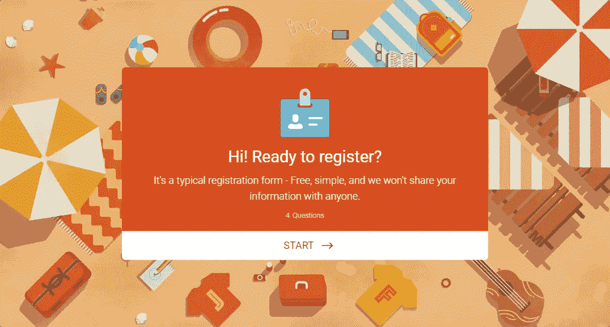
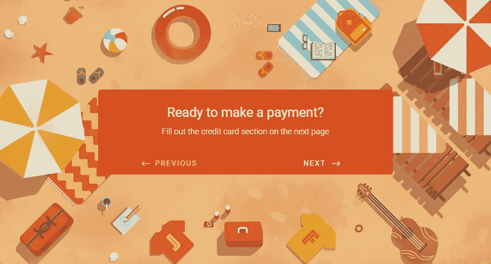
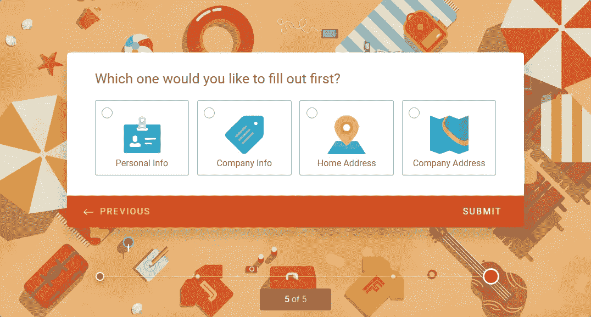
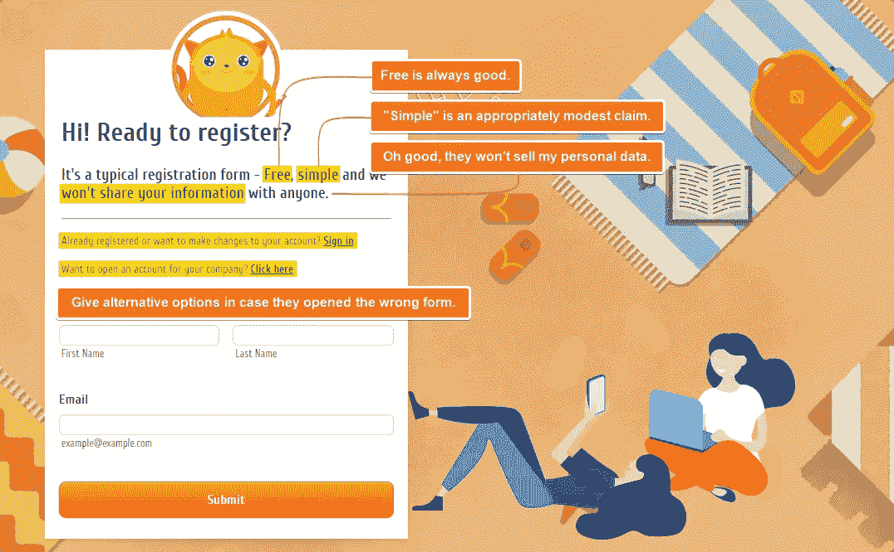
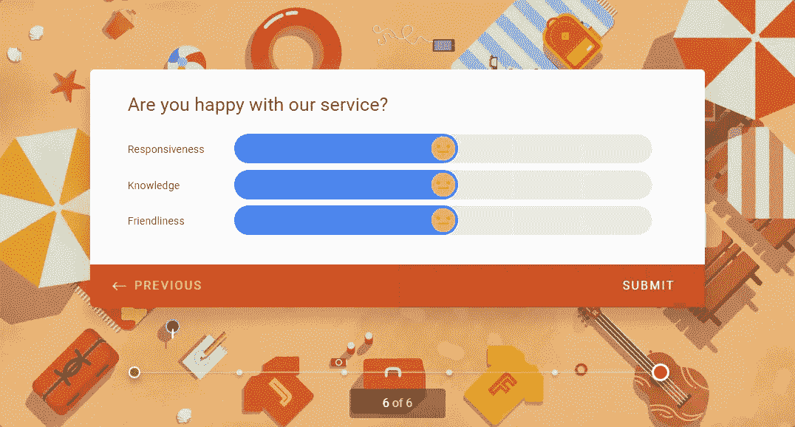

# 如何编写表格以便人们填写

> 原文：<https://medium.com/swlh/how-to-write-forms-so-people-will-fill-them-2a1e98fa9666>

Originally published on [**JOTFORM.COM**](http://jotform.com)

你工作了一整天。

又累又饿，你遇到一个老朋友，想喝一杯。接下来的几分钟可能听起来像这样:

> “过来坐下。你今天过得怎么样？”
> 
> “疯了！七次会议，每个人都压力很大。”
> 
> “为什么？”
> 
> "我们明天将推出新版本，但仍有大量工作要做。"

简短的句子。日常用语。轻松轮流。问题和答案。

人类就是这么说话的。

对话就是这样进行的。

但是当对话在网上进行时，我们看不到对方，也听不到他们的声音。《对话式设计》的作者 Erika Hall[解释了](https://www.intercom.com/blog/podcasts/erika-hall-podcast/):

> “当涉及到设计数字系统时，总是有忘记人类参与的风险，因此，使事情变得更加机器人化，而不是现实化。”

大段大段。精确的语法。没有宫缩。

而不是说:

> 请回答下面的问题。

在线表单可能以下列内容开始:

> 您必须阅读、填写并完成本页和下页表格中包含的以下部分中的问题的答案。

这种写法很矫情。它疏远了读者。另外，这是一场噩梦。

另一种选择？写下你如何说话:对话(不是独白)。

[埃尔莫·伦纳德说得好，他说:](https://www.brainpickings.org/2013/08/21/elmore-leonard-10-rules-of-writing/)

> “如果听起来像写作，我就重写。”

有趣的是，像人一样写作要比像机器人难得多——但这是*所以*值得。当谈话感觉温暖、直接和真实时，它会建立联系并产生影响。

以下是方法。

# 重要的事情先来

## 打招呼

我知道，这看起来太明显了！但是你会惊讶于有多少网上对话不是以问候开始的。

我们知道礼貌很重要:这就是为什么 [JotForm Cards](https://www.jotform.com/cards/) 内置了一个可定制的欢迎页面。

接下来，**标题**。它应该反映表单的目的，而不需要陈述显而易见的东西:也就是说，单词“form”不需要出现在那里。

如果有必要的话，在这里列出需要收集的东西:我们不希望用户在中途匆忙寻找他们的护照。

## 让它私人化

与陌生人交谈通常没有吸引力，尤其是在网上。所以，用一个(简短的)总结性陈述让你的谈话对象知道你是谁。

这种真实的双向对话的感觉可以贯穿整个表单。使用“我”、“你”和“你的”这样的代词，让它更个性化一点。

## 消除被动

当书写是主动的(*客户必须填写表格*)而不是被动的(*表格必须由客户填写*)时，书写更清晰、更有影响力。

主动动词使文章更简洁，因为它们比被动动词短。他们也使它更有活力，因为他们专注于行动，更准确，因为他们确定了所描述的行动的主题。**非英语母语者发现主动语态的句子更容易理解。**

被动写作令人困惑，因为它往往更长，更不集中。

你怎么知道一个句子是被动的？这里有两个例子:

> 做动作的主体不清楚。 *)*
> 
> 或者
> 
> ——*这个句子用了动词‘to be’*(一直，曾经…)。

主动语态非常像人类的语言。当我们说话时，我们会不假思索地使用主动语态。

还在怀疑？你可以用[微软 Word 的可读性统计](https://support.office.com/en-us/article/test-your-document-s-readability-85b4969e-e80a-4777-8dd3-f7fc3c8b3fd2)或者[普渡大学的辅助医疗方法](https://owl.purdue.edu/owl/general_writing/academic_writing/paramedic_method.html)来检查讨厌的被动语态。

## 使用标题作为焦点

> “平均来说，阅读标题的人是阅读正文的人的五倍。”——大卫·奥格威

如果人们能 100%全神贯注地阅读表格，那就太好了。

但是他们没有。

他们浏览和快速阅读与他们相关的内容，而忽略其余的内容(平均而言，80%的内容)。

我们无法阻止他们，所以我们不妨用清晰、简洁的标题来引导他们。

伟大的标题创造了一种形式:它们澄清了文本，给了它结构，并将其分解。在保持用户参与方面，他们也承担了大部分繁重的工作。

这使得它们和问题本身一样重要，如果不是比 T21 更重要的话。给他们仔细的思考。

用户应该能够浏览标题，并判断对它们的期望。测试这一点的最好方法是独立于文本的其余部分来阅读标题——它们还有意义吗？

## 不要做出虚假的承诺

你的表格很容易填写吗？让用户自己去发现。声称它有多“快速和简单”,或者给出一个时间估计，都是浪费文字。

人们写作和阅读的速度不同。不要冒险破坏任何人的能力。

但是如果你的表格保证要花几个小时呢？给人们一些警告。

# 一直亲吻

你听说过接吻原则:保持简短甜蜜(或者，不那么甜蜜:保持简单，笨蛋！)

接吻是形式中的女王。

接吻的最佳方式是通过 Cs:切割、浓缩、收缩、劈开。

> “在你的文章中寻找杂乱之处，无情地删除它。感激你能扔掉的一切。重新检查你写在纸上的每个句子。每个字都在做新的工作吗？任何思想都可以更经济地表达吗？”
> 
> ――威廉·津瑟，[写得好:写非小说的经典指南](https://www.goodreads.com/work/quotes/1139032)

## 切口

作家常常觉得用的词越多，就越能打动读者。事实正好相反。许多表格使用了过多的单词，这就产生了噪音，使得读者很难集中注意力在关键内容上。

这意味着像 T2 术语 T3 这样的东西。

**行话是专门的或时髦的术语。它隔离，它混淆；事实上，它实现了良好沟通的反面。**

但是行话的构成取决于你在和谁说话。一个人的行话可能是另一个人表达清晰的捷径。如果一个专业术语是你的读者的面包和黄油，并提供了一种表达复杂含义的简洁方式，那么使用它是有意义的——它不再是行话。

说到切割，你的指导原则是相关意义。在梳理了冗余单词之后，文本发生了变化，变得更精简、更精确。

**要拧紧，拆下以下部件:**

*   副词(*以-ly* 结尾的词)。
*   无意义限定词(*很多，大量*)。
*   空强化词(*非常，相当，相当，真的*)。
*   ‘那个’这个词。
*   不重要的信息。
*   含糊的话(*事，少，多*)。

## 凝结

在小学，我们因使用难词而受到奖励。在大学里，我们以为人们会更认真地对待源自拉丁语或法语的又长又熟悉的单词。

所以，这种句子不断出现也就不足为奇了:

> “请接受我们最诚挚的道歉。然而，我们很想知道你的意见。此外……”

听起来又闷又不自然，对吧？这种行话在学术论文中可能行得通，但在日常对话中就不合适了。这也造成了一定的距离——好像我们在俯视我们的读者。

好消息是什么？通过使用每个单词的最简单版本，我们可以让自己的生活更轻松，我们的写作更有吸引力。

“简明英语”的用词比它们更精致或更“花哨”的替代品更清晰、更准确。

所以如果你指的是‘结束’，不要说终止。用“利用”代替“使用”没有任何好处。

## 合同

不能还是不能？是吗，还是？当你想要正式的时候，你会使用完整的形式(没有撇号)，不是吗？

但是如果你想保持你的风格对话和放松，那么选择简约的版本是有意义的，不是吗？

> 你的家庭住址是什么？

容易的事。

## 劈开

冗长、密集的句子，充斥着过多的形容词；标点符号太多；而且，曲折、分裂的逻辑——它们创造了压倒性的优势，不是吗？

大块完整的文本也是如此。

就像要一口气吞下太多食物。姑且称之为阅读消化不良。你不想让你的读者生病。一口大小总是更好。

这是一把假想的斧头。拿着它，开始把一大段文字一分为二。对于大多数读者来说，每句话不超过 20 个单词是很舒服的。

每段最多三句话。不要害怕只有几个单词的句子。空白、项目符号和表格是你的朋友。

简洁是一种福气。

# 最后…

## 大声说出来

这是书中最古老的把戏，这是有原因的——它奏效了*。*

大声朗读你写的东西。经常做。大声说出来(不要小声嘀咕)。

听听你自己。这听起来像是你对一个活生生的人说的话吗？没有吗？改变它。

## 回来吧

诚然，好的写作是 30%的作文，70%的剪辑。把表格放好，过几天再来看。你会发现第一次没有发现的错误，并找到进一步澄清的方法。

> 编辑。重写。重复一遍。

## 保持轻松

回想一下想象中与朋友的对话。你为什么喜欢和他们聊天？

是一些小的习惯和玩笑让它变得很私人。

在一个充满无意义的数字互动的世界里，我们渴望感觉更人性化的联系。

当你在你创造的东西上洒一点点个性，你的用户就会了解你:就像 [JotForm Cards 表情滑块](https://www.jotform.com/blog/boring-form-filling-fun/)。

用户应该体验你的写作，就像喝咖啡时的热烈交谈。

所以做你自己。别吵了，回到基础上来。煮点喝的，给你的读者一片自制的蛋糕，聊聊天。

## 感谢阅读。如果你喜欢这篇文章，请随意点击那个按钮👏帮助其他人找到它。

*原载于*[*www.jotform.com*](https://www.jotform.com/blog/how-to-write-forms/)*。*