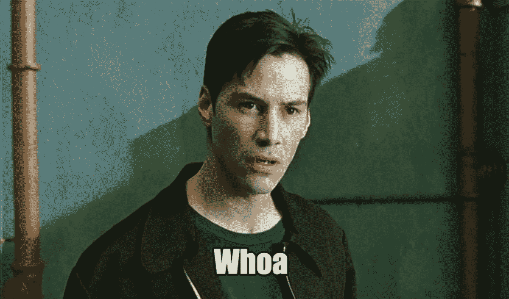
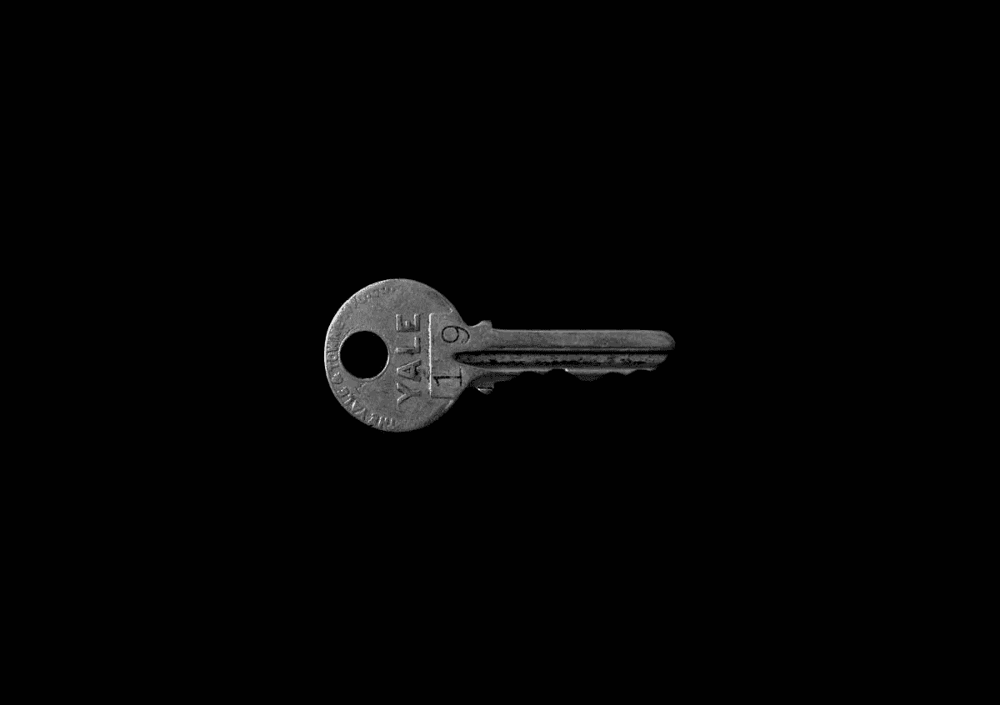

# 如何像专业人士一样写更长的内容

> 原文：<https://medium.com/swlh/how-to-write-longer-content-like-a-pro-5fef56d05e86>

## 写简短、稀疏的帖子只能让你到此为止。研究表明，写更长的文章可能是内容营销成功的关键。

John was never great at DIY.

更长的内容是前进的方向。这是本文的重点，稍后我会解释原因。

另外，如果你坚持到最后，我会和你分享我的秘密框架，我用它来为我自己和我的客户写长篇内容。

但是首先—

## 一个叫做内容营销的小东西

让我们面对现实吧。每个公司都知道内容营销。

事实上，T2 89%的 SaaS 公司都有某种形式的博客。

这是有原因的，对吧？

*因为它有效。*

来自同一个[链接](https://www.cobloom.com/blog/10-saas-content-marketing-statistics-for-2017-infographic)的更多数据:

*   SaaS 博客平均每月产生 573 次有机搜索访问。
*   表现最好的博客每月产生超过 45，000 的有机访问量。
*   最好的博客帖子有可能达到**1000 条社交分享**。

所以，是的，这个叫做内容营销的小东西是一个相当大的事情。如果您没有使用它，那么您应该使用它。如果你正在使用它，但是没有看到多少成功，那么你做得不对。

**成功的内容营销必须提供价值。**

把它写在某个地方，因为它可能是我在这篇文章中要说的最重要的事情。

你猜怎么着我再说一遍…

**成功的内容营销*有*提供价值。**

可能是你在娱乐你的观众，更常见的是你在教育他们一些事情(很像这篇文章)。希望是两者的结合。

内容营销不应该是推销。没有人会在推销中发现价值，尽管这听起来像是一张破唱片:

> ***成功的内容营销必须提供价值。***

不是最吸引人的口头禅，但也行。

你需要提供价值的原因是它能确保你的潜在客户留下来。

他们会在社交媒体上关注你(相当不错)，他们会注册你的邮件列表(甚至更好)。

说到这个…

那是一个厚脸皮的小塞子。那又怎样？告我吧。

无论如何，现在你已经(咳咳)注册了我的邮件列表，让我继续。

如果你的潜在客户认为你能解决他们的问题，猜猜他们在需要的时候会向谁求助…

没错。*你*。

随着时间的推移，他们会越来越意识到你能提供什么，而且你不只是说说而已。

一旦他们信任你，这笔交易就变得轻而易举了。

但是千万不要认为内容营销很容易。事实上—

## 内容营销很难

人们雇佣像我这样的人为他们写内容是有原因的。

是因为难。这需要时间，需要努力。这不仅仅是把文字写在纸上，而是了解你的观众，研究你的主题。

当然，这有点像把单词写在纸上。

在我看来，大多数人认为。我会写字。我小时候就学会了。所以我自己做内容。能有多难？”

我可以看到那里的逻辑，即使它是错误的。

这么说吧…

> *嗯。我能跑。我小时候就学会了。所以我要跑马拉松。能有多难？*

任何读过这篇文章并尝试过马拉松的人都知道这有多难。

要达到那种跑步能力，达到你能跑完马拉松而不瘫倒在一堆的程度，需要时间。

**这需要时间和练习。如果你投入了时间，那么你肯定会进步，最终你会成为一名内容专家。**

但是大多数 SaaS 的创始人没有多余的时间。他们忙着经营自己的生意。

这就是为什么他们试图写自己的内容，但只是半心半意。

他们不能把所有的精力都放在这上面，因为他们把它和作为创始人的职责的其他方面一起塞进去了。

而且他们制作的内容往往是欠缺的。也许，仅仅是也许，如果他们灵光一现，他们会创造出伟大的东西。

但大多数时候，它是缺乏的。

这里有一些迹象表明你的内容有所欠缺:

*   **很短**——比如说，500 字左右。这个长度还不错，但是不能让你细说。
*   **没有链接**——如果你没有链接到其他博客或研究，那么我确信你已经做了任何研究。
*   **老调重弹**——简单地重复更多知名博客的内容是行不通的。你需要自己的旋转。

如果这些警告信号中的任何一个适用于你的内容，那么我敢打赌，你正在忙着做生意，没有时间花在内容上。

这将被证明是有问题的，因为—

## 毕竟，规模确实很重要

我不敢说，但是你的文章太短了。

我知道我们被引导去相信尺寸并不重要，但最终，它确实很重要。

当你写一篇短文的时候，我想你会在脑子里为它辩护:

“嗯，人的注意力持续时间比金鱼短，一条金鱼永远不会阅读超过 2000 个单词。所以，我的观众肯定不会。”

是的，我去过那里。我以前也这么想。

但后来我开始写更长的内容，大约在 2000 字左右，我注意到一些惊人的事情。

> 这些帖子被分享的越来越多，人们注册了我的邮件列表，在社交媒体上关注我。哦，他们被更多地阅读。

这告诉了我两件事。

*一个*——我是个白痴，永远低估了金鱼。

*两个* —长篇内容是前进的方向。

但这只是传闻，对吗？你想要一些数据，你想要一些数字，一些冷酷的事实。

好吧。

集客营销之神 hubspot[对自己的内容进行了一项研究](https://blog.hubspot.com/marketing/seo-social-media-study?goal=0_9a3ff4abc7-cc2da15005-176356773)。

以下是他们发现的一些东西:

*   字数在 2500 字左右的文章**获得了最多的有机流量**。
*   字数超过 2500 字的文章**在社交媒体**上分享最多。
*   字数超过 2500 的文章**产生的反向链接最多**。

如果这还不能说服你，那恐怕没什么能了。

但是如果这让你坐起来，意识到长格式的内容是成功的关键，那就听好了。

我要给你一份大礼。我将解释我如何写更长的内容，你也可以这样做，使用—

## 我的秘密框架

[https://imgur.com/gallery/7j15tXU](https://imgur.com/gallery/7j15tXU)

你已经看到了精彩的部分。这是尼欧最终看清母体真实面目的部分。

在我们继续之前，我想请你帮个忙。我喜欢认为我为你提供了大量的价值，这个框架很棒。我真的相信。

如果这不能帮助你产生更长的内容，那么你可以给我发一封讨厌的电子邮件什么的。

但是如果你用下面的表格注册我的电子邮件列表，这将意味着很多。

没有垃圾邮件，只有我的最新文章(比如这篇)直接发送到你的收件箱。就是这样。

好吧，我们开始吧。

这个框架是一个大纲，我用它来确保我的内容不会漫无目的地围绕一个主题，并且它是我试图解释的重点。

这可以保持读者的兴趣，并为文章提供一个逻辑流程。

这就是我的大纲…

**重点:** 简要说明你要讲的内容。重点是什么？

**引领他们进入:** 大多数人都会有学科的基础知识。这是你阐明基础知识并引导他们进入主题地方。

坐直并注意:
借助统计数据或专家意见，向观众展示这个话题非常重要，他们真的真的需要注意。

**肉:** 这是文章的前提，解释你在题目上要说的话。

要带走的东西:
一旦你解释了理论，你需要给他们一些他们可以离开去工作的实际东西。

**把所有的都集中起来:** 通过总结和集中文章的要点来结束文章。

这六个部分是我用来写文章的。它工作了。

> 作为一名作家，这让你的生活变得更容易，因为你知道你必须写什么，你要写什么。

它使阅读更容易，因为它遵循了贯穿主题的逻辑路径，而不是绕过边缘。

我经常发现例子是有帮助的，所以这是应用于你现在正在阅读的这篇文章的框架…

**焦点:** 我解释说，更长的内容是前进的方向，如果你留下来，我将与你分享我的框架。

**引他们进来:** 我用更一般的术语来讲内容营销，大多数人至少知道一点点。

**坐直并注意:** 我用统计数据来说明为什么内容营销如此重要，以及暗示你做得不对的警告信号。

**肉:** 我告诉你长格式的内容更好，并提供数据来证明我的论断，也稍微解释一下为什么越长越好。

**要带走的东西:** 我分享我用来创建长篇内容的框架，然后解释几个关键原则。

**综合起来:** 我总结了我在文章中涵盖的一切，并以更长的内容提示人们采取下一步行动。

好的，这就是我在这篇文章中使用的框架。我是多么的 meta。

如果你关注了这个例子，你就会知道下一部分是关于—

## 较长内容的关键原则

这里还有一些提示和技巧，可以帮助你改进长篇内容。

**1。章节是你的朋友每个人都讨厌大段大段的文字，它们似乎涵盖了一百万种不同的东西。这很难保持跟踪，它散发着业余爱好者的气味。**

相反，把你的文章分成几个部分。每个部分应该涵盖你的主题的一个方面。当你发现自己正游离于其他事情之外的时候，是时候开始一个新的副标题了。

**2。使用图像各处的图像打破了文字的流动，使你的文章更具视觉吸引力。更重要的是，它让我们的眼睛得到休息。**

我使用 [Unsplash](https://unsplash.com) 或 [Pixabay](https://pixabay.com) 获得我的图像，这两个软件都提供了免费的优秀图像。

**3。一个好的标题** 虽然我不相信一个标题能成就或破坏你的内容，但是一个好的标题确实有帮助。

使用像 CoSchedule 的[标题分析器](https://coschedule.com/headline-analyzer)这样的工具，目标是大约 70 分或以上。

**4。了解你的受众** 这确实适用于任何内容，但是如果你很了解你的受众，你就可以说他们的语言。

这有助于吸引他们，让他们更有可能真正阅读你写的东西。

**5。重复事情** 不要害怕重复信息。如果某件事对主题很重要，那么实际上值得重复几次。

如果你正在写一篇需要 10 分钟才能读完的文章，那么提醒人们 5 分钟前他们学到了什么不会有什么坏处。

所以—

## 下一步是什么？

我不喜欢说再见，但这将我们带到了我文章的结尾。

你现在应该明白内容营销对你的业务有多重要，以及大多数人是如何做错的。

但是你现在也知道如何正确地做这件事。你知道较长的内容通常意味着更好的内容，值得花时间去创造。

我已经和你分享了我的框架和一些关键点。在编写自己的长格式内容时，您可以将它作为模板。

这篇文章花了我三个小时来写和研究。通过练习，我相信你也能做到。

> 这是你一周的三个小时来制作频繁的长篇内容。那没什么，真的没有。

所以你没有借口。

使用我的框架，记住我的原则，然后开始写作。

*如果你有任何问题或者你想与我分享你的文章，请发送给*[*joe@thismonkeytypes.com*](mailto:joe@thismonkeytypes.com)*。*

记住，现在一起:

**成功的内容营销必须提供价值。**

*传其妹。*

***PS。如果制作更长的内容似乎超出了你的能力范围，那么你应该知道我目前正在接受新的客户。如果你要我为你写内容，那就*** [***取得联系***](mailto:joe@thismonkeytypes.com) ***！***

## 这个故事发表在 [The Startup](https://medium.com/swlh) 上，266，100+人聚集在一起阅读 Medium 关于创业的主要故事。

## 在这里订阅接收[我们的头条新闻](http://growthsupply.com/the-startup-newsletter/)。

