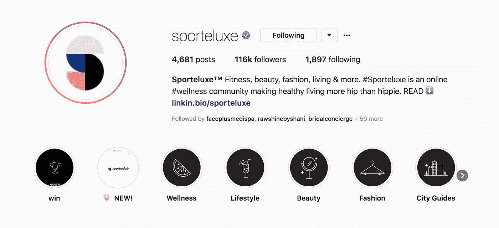
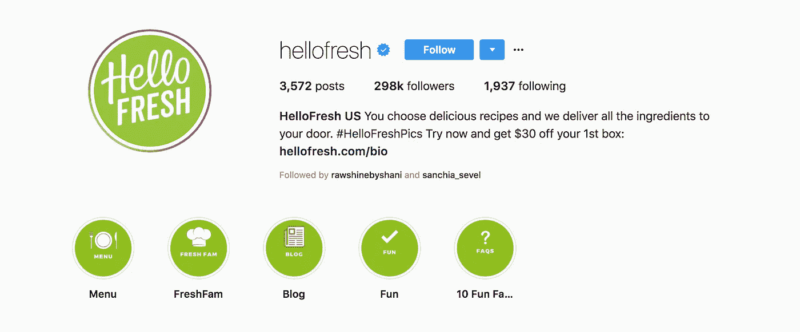
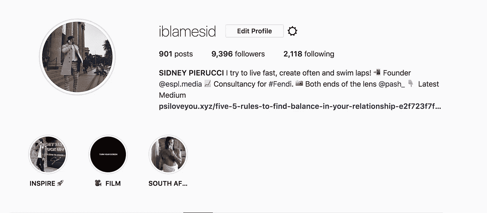
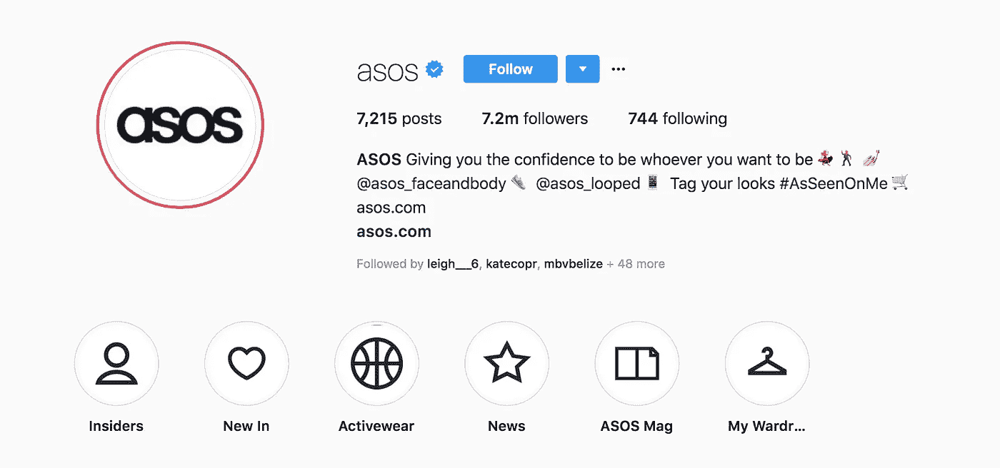

# 如何写出极致的 Instagram 简历

> 原文：<https://medium.com/swlh/how-to-write-the-ultimate-instagram-bio-5aa067e74957>

## Instagram 无疑是在视觉层面上与你的观众建立关系的最伟大的社交媒体平台——参与就是这个词！

A h，对。没有什么比在社交媒体上为自己或自己的企业制作一份简历更让人伤脑筋的了。

写一篇 Instagram 简介并不像看起来那么简单，而是很难！！

毕竟，你必须传达你的信息、兴趣、个性(在商业简介中是你的语气)和价值观，以这样一种方式让人们感兴趣并吸引追随者。而且……你必须用 150 个或更少的字符来概括所有这些。

此外，您还可以在个人资料中获得一个链接，您可以使用该链接将人们引导到您想要的任何网页。但问题是，这是他们给你的整个账户唯一可点击的链接…你应该链接你的网站吗？你的博客？您的销售线索捕获登录页面？你如何充分利用它？

下面我们将探讨世界级 Instagram 简历的四(4)个关键要素！

# 一(1)建立清晰的价值主张

首先，你的 Instagram 简历需要告诉人们你到底是谁。

对你的公司和你提供的产品或服务做一个清晰简洁的描述是很重要的。

**#Wellness 在线社区 Sporteluxe 在个人资料方面做得很好。**

[sport luxe](https://sporteluxe.com/)利用他们的履历让观众确切地知道他们能提供什么样的价值。他们会主动回答潜在追随者对他们社区的疑问，这也是你应该做的。所以现在检查你的 Instagram 简历，确保你回答了这些问题:

*   你或你的公司是做什么的？Sporteluxe 提供在线#wellness 论坛，围绕健康生活主题吸引社区参与。
*   我必须对你品牌的所有东西都感兴趣吗？不，你将从 Sportluxe 的一系列不同主题的内容中获得价值，从健身和生活方式到时尚和健康饮食。内容的覆盖面构建为无缝工作，可以通过特定的选项卡在他们的网站上使用。
*   我如何才能更好地接触*您的品牌*？点击 Instagram 简历中的链接，您将被引导至他们的主页，了解 Sportluxe 的更多信息及其有用的内容报道。

# 两(2)创建一个强有力的行动号召

你可以用你的简历来帮助潜在客户点击链接，解释他们这样做会得到什么。

**这个例子取自**[**hello fresh**](https://www.instagram.com/hellofresh/?hl=en)**。**

HelloFresh 准确地告诉他们的观众他们提供什么样的服务，并包括一个自定义的追随者图片标签。他们还让潜在客户知道，通过这个链接，他们可以从 HelloFresh 的首次交付中获得 30 美元。

这种优惠券是吸引顾客回到你网站的好方法。它为任何点击链接回到你的网站的人提供了一个激励。

HelloFresh 在他们专用的 Instagram 登录页面上继续这一对话，该页面只面向那些点击过该链接并对 30 美元的折扣优惠感兴趣的人。

# 三(3)个表情符号展示个性

通过在你的 Instagram 简历中添加表情符号，你可以给原本是一堆纯文本的东西添加一个视觉元素。你可以用表情符号来强调你的描述，展示你(或你的品牌)的个性。

一个合适的表情符号也可以帮助强化你试图向观众展示的特定信息，但重要的是要知道，这可能并不适用于每个人或每个品牌。确保你考虑到了你的观众和公司品牌，如果表情符号不能给你的简历增加价值，就不要使用。

我使用一些恰当的表情符号来加强我的 Instagram 简历中对工作和生活方式的情感。

我的主要受众是千禧一代和创意人士，我是@espl.media 的创始人，我经常写作，为全球家喻户晓的#FENDI 提供咨询，并为我的女朋友@pash_ 创作内容。我的追随者正在选择接触我的社会和商业角色的不同方面，并阅读“最新媒体”行动号召下的每周内容。

这个 Instagram bio 中的每个表情符号都代表了我的品牌价值观和理想的一个不同的核心方面:连接、成长、摄影和写作。

# 四(4)纳入正确的标签和利基帐户

使用标签和标记额外的帐户可以建立社区和利用用户生成的内容。UGC 帮助你的品牌与你的受众建立联系，并让他们有机会参与你正在进行的对话(有时远离你的“母平台”)。这也是跟踪帖子参与度的好方法。

在你的简历中喊出这些自定义标签，让关注者知道他们如何出现在你的订阅源中。

Asos 在将其追随者重定向到利基账户方面做得很好，并使用不同的规范来做到这一点。

ASOS 有各种各样的 Instagram 账户，用于其各种产品和活动。传记的第一行是两个社交媒体简介:@ASOS_Looped(运动鞋)，@ASOS_FaceandBody(美容和身体护理产品)，吸引追随者进入利基市场，展示品牌的多功能性。遵循其用户生成的活动——# AsSeenOnMe——是激励客户发布在线内容并获得品牌特色的一个很好的方式。

每当有人点击他们的自定义链接，他们就可以查看任何被标记的帖子。asos 使用#AsSeenOnMe 标签在 Instagram 上收集了超过 130 万条帖子。

ASOS 的每一个帖子都为他们的公司做了额外的营销，并建立了他们的观众的忠诚度，社会证明和兴奋度！

您可以通过以下方式在 Instagram 简历中宣传您的重定向:

*   让你的关注者知道他们如何使用自定义标签来显示你的订阅源。
*   把人们带到一个特定的账户(或登陆页面)，在那里他们可以根据这些图片查看要购买的商品，或者成为利基社区的一部分。

最终，你的 Instagram 简历需要用仅仅 150 个字符做几件非常重要的事情。您需要:

*   告诉你的读者关注你的个人资料会有什么收获。
*   在真正有意义的层面上与人交流。
*   让追随者点击回到你的网站。

一个伟大的 Instagram 生物做所有这些事情，帮助推动交通回到你需要它的地方。

对你来说，最终简历可能很有趣，也可能很严肃，包括社交表情符号，或者有助于建立社区。看看你的观众想要什么，给他们，找出最适合你的品牌。

# 我想做的是…

***……就是写值得你花时间，能给你带来价值的东西。如果你喜欢阅读，请点击💚这样其他人也会看到它(你最多可以点击 50 次)！！***

还有，如果你伸出手说‘嘿！’,那绝对会让我开心一天 via DM on[***insta gram***](https://www.instagram.com/iblamesid)***。真的很期待连接！*** 😊

## 西德尼

## 这篇文章发表在 [The Startup](https://medium.com/swlh) 上，这是 Medium 最大的创业刊物，拥有 336，210 多名读者。

## 在这里订阅接收[我们的头条新闻](http://growthsupply.com/the-startup-newsletter/)。

