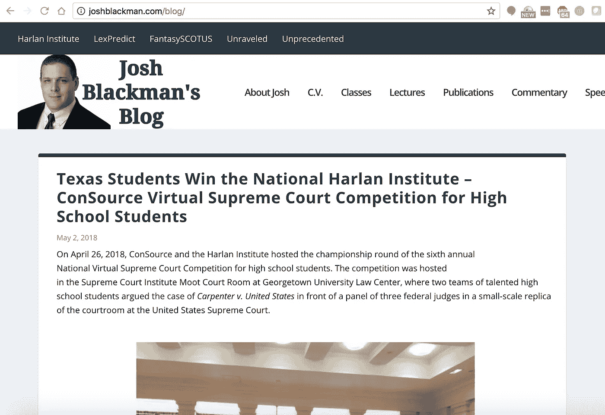
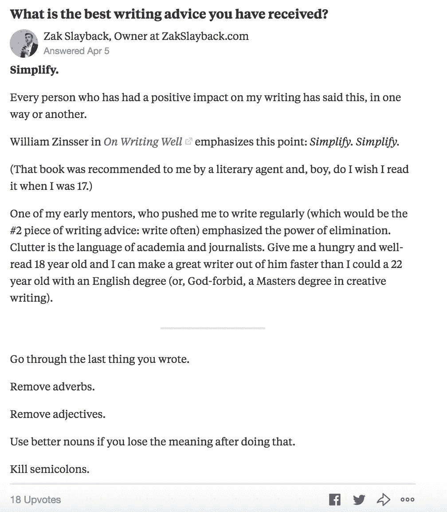

# 当你只为学校写作时，如何为现实世界写好文章

> 原文：<https://medium.com/swlh/how-to-write-well-for-the-real-world-when-youve-only-ever-written-for-school-4d9622ea0fd5>

unsplash.com

[***这最初是作为《ZakSlayback.com***](https://zakslayback.com/write-well-real-world/)刚入门时如何写好》发表的

一位读者写道:

> *我今天被你的作品* [*“如何在一无所有的情况下出人头地”*](https://fee.org/articles/how-to-get-ahead-when-you-have-nothing-to-offer/) *挑战了，印象深刻。在这本书里，你写道，你认为你在学生时代可以写得很好，但是在现实世界里写作是在一个不同的层面上。更具体地说，你这么说是什么意思？在大学课程之外，你有什么资源和工具可以让你成为一名更有效率的作家？*

我喜欢这个问题。

写作是为数不多的高杠杆技能之一。一旦你学会了做好它，你就可以在市场营销、销售、软件开发、筹资、产品开发、教育或经营自己的企业中应用它。它在行业和工作之间的转移令人惊讶地好。懂得如何做好营销的营销人员是有价值的——能以书面形式很好地沟通的营销人员更有价值。一个知道如何写出漂亮代码的软件开发人员是有价值的——一个能够交流他在写什么和为什么写的软件开发人员更有价值。

我以前写过关于[如何成为一个更好的作家](/marketing-and-entrepreneurship/the-easiest-way-to-become-a-better-writer-3ee4bc1c4b9e)和[如何利用你已经在消耗的东西来提高你的写作和创造能力](/@zslayback/dont-worry-about-being-original-everything-s-a-remix-6fbb06ab1683)。当我写得越多，读得越多，我的写作就会非线性地提高。我的写作风格是我阅读的我最喜欢的作家和我以前写作的重复的混合物。

学校很少鼓励这种写作，尽管。大多数大学里的写作研讨会都是可笑的尝试，试图让那些在那之前只受过 s at 或 act 或他们的英语老师写作训练的人成为公式化和二年级的作家。优秀的学生知道他们的老师和学校想要读什么样的风格和内容。随着时间的推移，这意味着优秀的学生发展了为学校写作的强大能力，而没有发展为现实世界写作的独立能力。在学术界之外，唯一喜欢学术写作的人是那些本该去读研(或者去了也去不了)的知识分子，他们现在周六早上在家和《纽约客》坐在一起。

这不是大多数受过教育的读者所寻求的。

那么，你如何在校外培养这种写作能力呢？你如何看待一个喜欢写作，但从入学开始就没有机会享受写作的人？更难的是，你如何让那些只把写作视为一系列作业的人培养这种享受感。

我这样做是为了保留我对写作的热爱，并从我上大学时就开始影响写作的学术风格中重新找回它。

# 如何开始

为普通读者写好文章是一个不断推销和吸引的过程。不像你的高中英语老师或大学助教，普通读者不会因为阅读和评论你的文章而赚钱。他们可以选择关闭标签，合上书，或者随时扔掉这封信。每一句都建立在前一句的基础上，给他们继续阅读的理由。

人们来找你告诉他们一些事情。如果你写小说，他们会找你讲故事来娱乐他们。如果你写非小说(像我一样)，他们会来找你通知他们。

问题是，新写作者要么陷入寻找写作公式的困境——类似于你在高中英语课堂上为 SAT 学习的段落风格——要么陷入对信息的完美主义，以至于他们从一开始就没有开始。如果你没有论文要写，这两个都不重要。就像销售和诱惑一样，克服这种对开始的恐惧的最好方法是从小做起。当我与以前从未做过推广或销售的一对一客户一起工作时，我鼓励他们从尽可能多的小案例开始。

这并不是因为我相信“喷雾祈祷”——我不相信，发送 10 封高质量的邮件比发送 100 封垃圾邮件更好——而是因为你知道开始总是最难的部分，尽管它本不应该如此。游戏和约会教练鼓励他们的客户接近街上有魅力的人，并试图得到他们的号码。不是因为你会在街上找到你未来的女朋友或妻子——你可能不会——而是因为克服开始时的恐惧比完善推销更重要。

所以，在提高你的写作和为真实的人写作的过程中，关注先写作的机会，开始写作的机会，以及随着时间的推移提高技能的机会。

阻止作者开始写作的借口数不胜数。我经常听到这些:

*不知道从哪里写起。*

*我不知道该写些什么。*

*没人有兴趣听我说。*

我该怎么写？

写作会给我带来什么回报？

我如何知道我的写作是否好？

这是我建议你做的:

1.  **开博客**
2.  **开始课外阅读。**
3.  开始写你感兴趣的主题。
4.  开始为同龄人以外的受众写作。
5.  **更新出版物**
6.  让严肃的编辑看看你的作品。

让我们逐一分析。

# 1.开始写博客

我收到的最好的专业建议之一来自乔希·布莱克曼:开一个博客。我上高中时，他给了我这个建议，我创建的博客在过去十年里演变成了今天的 ZakSlayback.com。

开博客是建立你的思维和写作作品集的最简单的方法，让你在你想去的地方得到合适的人的注意，给你一个在校外写主题的借口。

*Josh Blackman used his blog as a way to become a leading voice on issues of constitutional law.*

去 Namecheap.com 买一个域名(它值 10 美元)。如果你能买到你的 firstnamelastname.com，那就买吧。如果没有，。co 看起来不像十年前那么便宜了。

然后在像 [Tap](http://thisistap.com/) 这样的服务上建立一个 Wordpress 网站。

你的网站不需要很花哨。多年来，我的网站是一个简单的主题，有一些小的调整。直到 2017 年，我才认真考虑将新组件整合到我的网站上。

这个网站不会让你写作，但它为你消除了“我不知道该往哪里写”的借口。它也兼作你的专业主页。

如果你绝对不想创建一个 Wordpress 网站， [Medium](/) 让你现在就开始写*很容易。它是为写作而精心设计的，并且已经有了固定的读者群。*

# *2.课外阅读*

*如果你还没有阅读课外作业，开始吧。你想读什么并不重要——20 世纪 60 年代的日本水下电影、棒球、19 世纪的经济理论、术士的神秘故事——**只要开始多读点**。*

*你喜欢读什么决定了你写作的两个重要因素:你的风格和你的主题。没有人生来就有独特的写作风格。你的写作风格是你喜欢阅读的所有作者和他们喜欢阅读的人以及他们喜欢阅读的人的混合体。不要强调没有风格。你的风格会随着时间而演变。我在 2018 年的今天写的东西比 2015 年、2013 年或 2011 年要清晰得多。*

*开始吧。*

*你读的内容也决定了你要写的素材。我的散文集 [*学期末*](https://www.amazon.com/End-School-Reclaiming-Education-Classroom-ebook/dp/B01CYM2D1K/ref=sr_1_2?ie=UTF8&qid=1515709048&sr=8-2&keywords=the+end+of+school) ，出自一种想多了解教育和学校教育的愿望。我一头扎进了我能找到的关于这个主题的最好的书里，最后写下了我在学校的经历。*

*如果你绝对不能在校外读更多的东西，那就写下你在学校里读的东西。如果你回到 2013 年左右浏览这个网站，你会看到关于哲学、生物伦理和政治经济学的博客文章和文章。那是我当时在看的。*

# *3.写一些你感兴趣的主题*

*你对什么科目感兴趣？*

*你目前花时间阅读什么？*

*你看小说吗？你读关于生产力的书吗？职业？经济学？艺术？马？学历？*

*你的朋友会问你特定的话题吗？健身房？编码？慢跑？艺术？*

*开始写这些话题。你的帖子不必很长——我在写马拉松的时候受艾萨克·莫尔豪斯的启发写过俳句——它们必须很长。*

*以下是一些关于早期博客的博文想法:*

*   *书评/读书笔记*
*   *例如[纳特·埃利亚松的笔记](https://www.nateliason.com/lessons/)*
*   *在一个主题上比较和对比两个作者*
*   *你如何应用你追随的博客作者或作者的概念*
*   *你目前在读什么，为什么*
*   *如[我在读什么 2017 年 9 月](/the-mission/what-im-reading-september-2017-39402ca1aa99)*
*   *朋友经常问你的问题的答案*
*   *是什么让你对你喜欢的科目感兴趣*
*   *流行的建议是错误的*
*   *例如，[我的网站](http://zakslayback.com)上与大学和高等教育相关的任何内容*

*制定一个时间表，设定一天中你有时间坐下来真正写作的时间。如果你养成了写作的习惯，而不是等待灵感来临时，你更有可能从事写作。当我开始认真写作时，我每天都写作，坚持了 30 天。大多数时候，我在早上 7:30-9:00 左右写作。有些日子我在晚上很晚的时候写作。你不必每天都写作来开始，但是你确实想尽可能地培养这个习惯。就像去健身房一样，一旦你养成了习惯，事情就变得简单多了。*

**

*An answer of mine on Quora.*

*开始写作的一个*奇妙的*资源是 [Quora](http://quora.com/) 。Quora 是一个问答网站，任何人都可以回答其他用户提出的问题。它会根据你已经知道的东西给你提示。这就克服了“我怎么知道该写些什么？”异议，并帮助您在想要写作但无法开始时启动齿轮。当我想写一些与我保存在 Evernote 中的主题清单无关的东西时，我仍然会使用 Quora。*

# *4.为你的同龄人之外的观众写作*

*你的同龄人是写作灵感的巨大来源。问问他们会如何描述你。想想他们问你什么问题。对他们来说你是某方面的权威。*

*然而，他们并不是写作的最佳评判者。*

*如果你想要对你的写作有高质量的反馈，那就把它放在真实的人面前，这些人没有理由去读它，除了它让他们感兴趣之外。你的朋友有动力告诉你，你的文章写得很好或者正在进步，因为他们是你的朋友，他们不想冒犯你。你的写作研习班导师是有报酬的，他们会根据大学写作课程的要求，以特定的方式来评论你的写作。*

*在你自己的博客上写作不会让你在已经关注你的人之外获得观众。为其他博客投稿。媒体出版物是一个很好的起点。找到你喜欢关注的博主，看看他们是否愿意将你的帖子[作为客座博文](https://zakslayback.com/learning-social-skills-not-stem-will-improve-career/)。即使他们说不，你也可以得到关于你写作风格的反馈，克服许多人在开始时的恐惧。*

# *5.购买新的出版物*

*当你在新的网站上发表文章，并从编辑、网站所有者和读者那里获得反馈时，你可以升级到新的更大的出版物。*

*这样做的好处是让你的作品出现在更多没有理由阅读它的人面前。你想知道什么能坚持，什么不能。有时你的写作会触动你的神经，让你在几个月或几年内坚持不懈地追求那个主题。以我自己的经验来看，写关于教育和学校教育的文章，以及最近写的关于沟通技巧的文章来改善你的职业生涯，都是购买新的出版物并观察哪些内容最受欢迎的结果。*

*大多数出版物都有编辑电子邮件地址或投稿页面。如果你必须发送一封电子邮件，像这样的快速推销很有效:*

> **嗨【编辑的名字】，**
> 
> **我的名字是【姓名】，从【时间】开始我就一直在阅读【出版物】。我喜欢你[出于真诚的原因]发布的内容。**
> 
> **我是一名年轻的作家，希望扩大自己的作品，根据我在[出版物]上读到的内容以及我对你的读者的了解，我想向你推荐一些帖子的想法。**
> 
> *[推介想法 1]*
> 
> *[推介想法 2]*
> 
> *[推介想法 3]*
> 
> **我已经在[较小的，其他出版物]上发表了文章。基于那里对我文章的接受，我认为给你发这些广告是有意义的。**
> 
> *你对这些感兴趣吗？如果是这样的话，我可以写一篇文章寄给你。*

*我这里还有一些电子邮件脚本，你可以使用。*

*这让你在写之前就知道你需要写什么。如果网站确实转载了其他地方的作品，你可以把你在个人网站上写的文章或帖子发给他们，看看他们是否愿意转载。你*不想做的*是在某个出版物的编辑对你的想法表示出兴趣之前，为该出版物写一篇长文。*

# *6.让严肃的编辑看看你的作品*

*如果你想在跑步方面做得更好，除了常规训练之外，你还应该聘请一名跑步教练。如果你想提高艺术水平，除了常规练习外，你还需要请一名艺术指导。如果你想在烹饪方面做得更好，除了常规的练习之外，你还应该请一位烹饪教练。*

*为什么写作会有什么不同？*

*“等等，我记得你说过你想为那些没有报酬来评论你作品的人写作？”*

*是的，这些是你为之写作的人，但这并不意味着你不能受益于*高质量*和*有经验的*编辑。*

*著名作家喜欢奚落编辑。HL 门肯写道，他完全相信一个编辑从来没有帮助作家。纳西姆·尼古拉斯·塔勒布把大多数文字编辑和 DC 官僚归为一类。*

*但你不是纳西姆·塔勒布或赫尔·门肯——还不是。一个高质量的编辑器帮助你理解你的结构，在文体怪癖变得普遍之前消除它们，并且让你的盲点变得清晰。*

*你不必定期雇佣严肃的编辑，尤其是如果你只是想提高你的写作水平。你应该接近你认识的那些在现实世界中是优秀作家的人，请他们对你的作品动笔。他们会删除影响你在校写作的学术术语，清理你在学术界可以接受的冗长句子。*

*让一个有严肃眼光的人来看我的作品是我写作经历中最痛苦也是最有帮助的事情。一年多前，我开始写一本自己出版的新书的手稿。对我来说很有意义，读起来也不错。这份手稿成了我新书的样本章节，*如何在一无所有的情况下获得成功*。当我把它发给我的文学代理人时，我期待着一些小的改动和反馈。*

*她取出了内脏。*

*我完全重写了手稿的大部分和几个章节。这个过程是痛苦的，也是对我自尊心的打击。*

*最终的提案是我创作过的最干净、最简洁的作品。*

*找人看看你写的东西。*

*[***这里是我推荐每个有抱负的作家挑选的 3 本书。***](https://zakslayback.com/write-well-real-world/)*

**

## *这篇文章发表在 [The Startup](https://medium.com/swlh) 上，这是 Medium 最大的创业刊物，有 324，834+人关注。*

## *在此订阅接收[我们的头条新闻](http://growthsupply.com/the-startup-newsletter/)。*

**