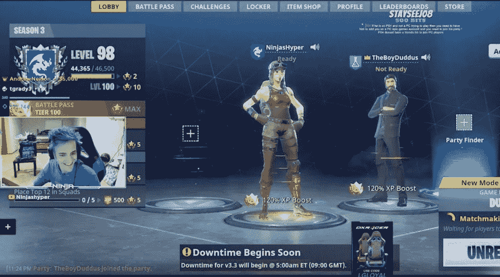
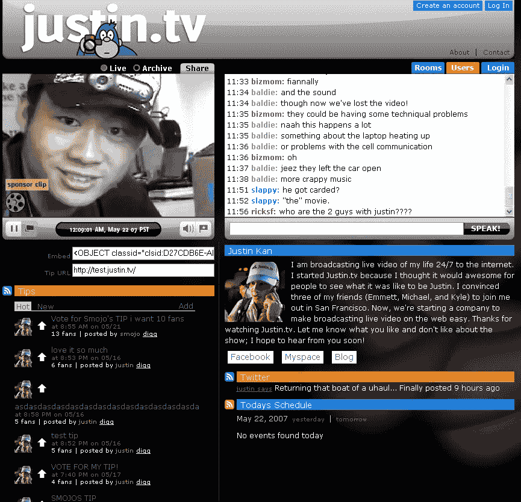
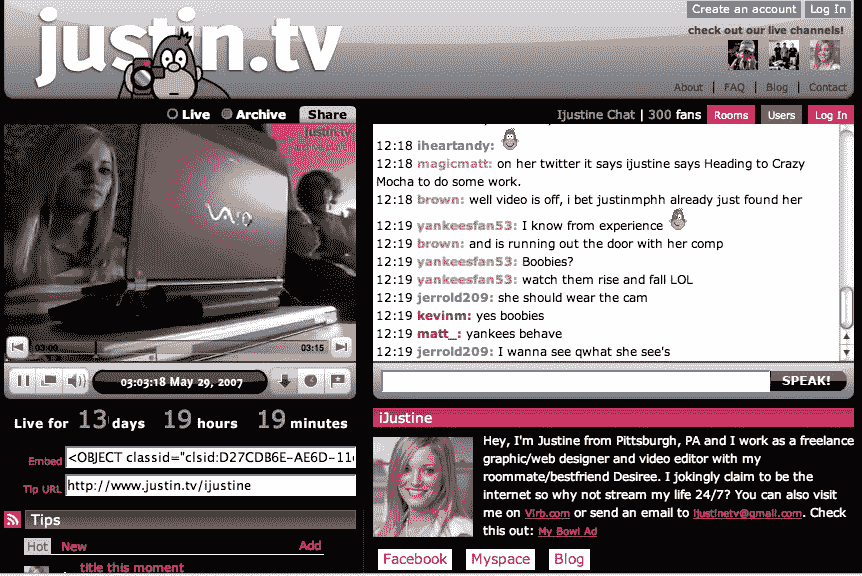
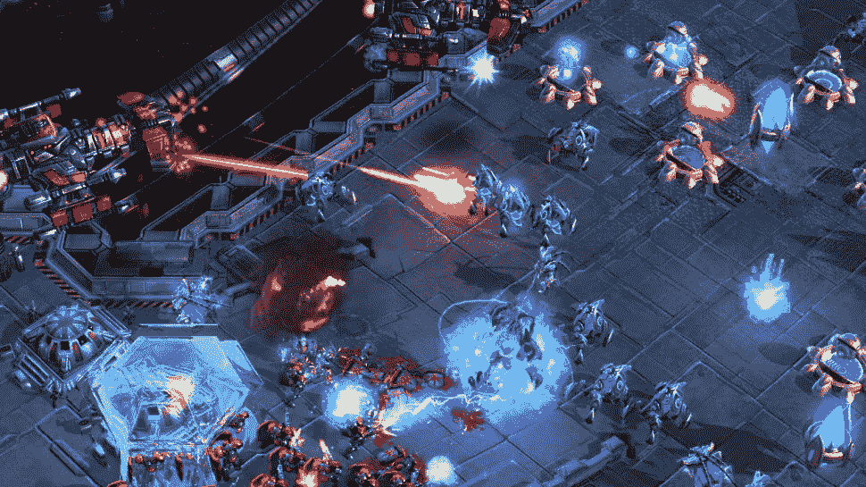

# Twitch 是如何开始的，这导致了名人游戏时代的到来

> 原文：<https://medium.com/swlh/how-twitch-got-its-start-which-led-to-the-age-of-the-celebrity-gamer-55204c8adbd>

这将是一个漫长的阅读过程，但请相信我们，每一分钟都是值得的！

毫无疑问，你听说过忍者获得说唱歌手德雷克发挥堡垒之夜与他在流。有趣的事实:忍者每个月从展示他令人敬畏的堡垒之夜技巧和娱乐中获得 50 万美元。如果你问我们这在 15 年前是否可行，我们会告诉你这是一个疯狂的想法。然而我们在这里；这种干扰确实很强。

事情怎么会变成这样？它是如何发展到利基游戏粉丝群体开始做这些事情的？

这一切都始于 Justin.tv 和一个试图成为真人秀明星的家伙。

# 贾斯汀.电视日

回到 2007 年的美好时光，当时 YouTube 仍在与 Vimeo 和其他类似的竞争对手进行斗争，耶鲁大学的两名学生创建了网站 Justin.tv: Emmet Shearer 和 Justin Kan。标题上的“贾斯汀”是有原因的:该网站描绘了贾斯汀·坎的生活，从起床和放松到游戏的平凡活动。这和电视真人秀没什么不同，只不过它是用最小的预算和他们的直播后台完成的，而且基本上是每天的流媒体。

在当年，这是闻所未闻的。Justin.tv 得到加速器和种子资本公司 YCombinator 的支持也有所帮助。Justin.tv 二人组获得了 5 万美元，让他们当众出丑。由于真人秀式的节目形式，该网站吸引了成千上万的观众。一个大问题在最初的喧嚣过后浮出了水面:它并不完全有趣。

流媒体技术已经存在，并正在慢慢建立和完善，但贾斯汀的直播时间需要减少，成为可管理的大部分。虽然很有趣，但人们很容易对贾斯汀做的普通活动感到厌倦。他确实用约会改变了他的日常生活，学习了新的生活技能，比如弹吉他，并且对他的日常生活很自然。

# 但是后来，人们想要更多

还是那句话，人性使然，人总是对内容贪婪。所以人们开始自己解决问题。自从 Justin.tv 允许其他人发布自己的内容以来，早期的直播流媒体如 IJustine 开始制作恶搞和喜剧内容。它成功了，因为大约在 2007 年，Justin.tv 成为了世界上最大的网络直播中心。

然而，尽管从最初的商业模式发展而来，Justin.tv 还是面临着财务危机。他们目前的赞助计划不足以抵消使他们的流媒体技术发展和业务规模不断上升的成本，尽管如此，他们的努力工作结出了果实；他们使用的软件将直播的成本降低到每小时半便士。

这给 Justin.tv 带来了采用广告收入系统来保持资金流入的大好机会。因此，在 2008 年至 2009 年间，该网站的流量激增至每月 2100 万用户和 30000 个流媒体/频道。然而，在 2010 年左右，由于涉及有线电视体育赛事的版权问题，该网站的增长陷入停滞。

> 事实上，一个 19 岁的孩子在网站上广播了他的自杀，这对事情没有帮助；Justin.tv 不得不取缔和限制其内容。因此，用户基数稳步下降。

2011 年伊始，Justin.tv 的团队仍然坚持不懈地让网站和服务保持相关性。然后，联合创始人埃米特突然想到:如果他们专注于当时的利基游戏市场会怎么样？如果我们增加网站的游戏部分会怎么样？

# 新的游戏革命

虽然乍一看，这只是一家大公司实现了一个利基目标，并从中获得了更多的损失，但实际上，利基市场最终变得越来越大的情况很少见。事实上，电子竞技和电子竞技观众人数需要像这样的流媒体服务，这意味着除了向上走，别无选择。

事实是，人们希望观看其他更好的玩家玩游戏，同时也与他们互动。小众且极度忠诚的粉丝群极度渴望像 Justin.tv 这样的平台。除此之外，甚至没有任何限制，也很少或没有侵犯版权；在这个生态系统中，玩家、游戏玩家、粉丝、评论员和游戏联盟都受益匪浅，并且保持同步。

埃米特是一个与社区产生共鸣的游戏玩家，这也很有帮助。他和他的团队有一种真正的动力将这款游戏提供给游戏玩家，尤其是在星际争霸 2 作为当年最受欢迎的竞技游戏越来越受欢迎的时候。

当该部门在 2011 年快速增长时，它最终成为了自己的专用中心。它被称为 Twitch.tv。其余的，正如他们所说，是历史。人们使用 Twitch 来传输他们的游戏，娱乐，在拍照时开玩笑，甚至与他们的粉丝互动。最终，像忍者这样的人以此为生，他们在展示游戏的同时变得更好，同时也更有趣。

# 兜了一圈

由于其迎合和对小众观众的超高水平支持，Twitch.tv 的浏览量飙升，超过了 Ustream、Azubu、Own3DTV 等其他平台，甚至是其兄弟 Justin.tv。他们的独立月用户从 2011 年的 350 万增加到 2012 年的 2000 万。从现在开始这些数字会越来越多。

这就是试图进入电子竞技的公司失败的地方，因为他们不认同社区。他们首先看到的是金钱和感觉，然后才明白这是一场持久战。你需要正确的心态和真正的爱好之心来尝试这种不朽的东西。

在 Bountie，我们现在可能还很小，但是我们有动力和激情去实现我们的“游戏赚钱”的想法。但是没有你我们做不到。如果 [**你需要知道我们在谈论什么，请访问我们的主网站。**](https://bountie.io/tokensale/)

*原载于 2018 年 4 月 5 日*[*bountie . io*](https://bountie.io/blog/twitch-got-start-led-age-celebrity-gamer/)*。*

## 这个故事发表在 [The Startup](https://medium.com/swlh) 上，这是 Medium 最大的创业刊物，拥有 315，028+人关注。

## 在这里订阅接收[我们的头条新闻](http://growthsupply.com/the-startup-newsletter/)。

