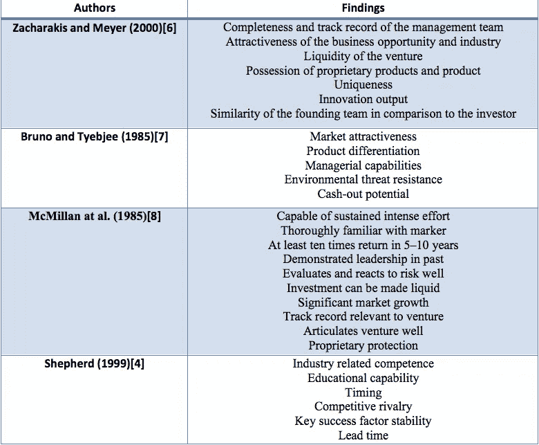

# 风险投资如何评估创业公司和企业家

> 原文：<https://medium.com/swlh/how-vcs-evaluate-startups-and-entrepreneurs-1202bbc7e6ca>

## 向风投要钱之前应该注意的。

这篇文章提供了一个关于风险投资的学术研究的分类，更具体地说是关于投资决策的。我们遵循卡尼曼[1]和他的名著《思考，快与慢》中的双系统理论，将投资决策分为两个阶段。最初，在早期筛选阶段，我们看到快速驳回或推进(“系统 1”)，在交易评估阶段，我们展示缓慢且合乎逻辑的(“系统 2”)投资决策。

**早期过滤—交易筛选**

在这个阶段，风险投资家的重点是筛选出大量的公司和想法(更多内容参见“[风险投资漏斗](/@kobu/the-venture-capital-funnel-ca717af03be8)”)。在学术研究中看到两个要点；第一，直觉、投资者偏好和经验[2][3]，第二，快速事实和估计，如行业、阶段、地点和所需资本[4]。为了应对巨大的工作量，节省时间、精力和资源，风险投资者使用许多启发式方法或“经验法则”，但更常见的是他们使用“满足[5]”启发式方法[6]，这意味着他们希望迅速放弃一个想法，转向下一个。有经验的投资者会将经验和直觉与快速的事实和估计结合起来。一旦“推介”符合这些标准，就进入下一阶段进行进一步评估。

有抱负的企业家应该利用“系统 1 ”,它更快、更感性、更刻板。一些例子是看风险投资者最近投资了什么，他的兴趣和背景是什么，也许还有他可能经常做的其他事情。例如，如果有人想解决健身类的问题，他的机会会更好地给一个经常锻炼的风投留下印象。此外，快速陈述事实也应该加入到营销中。例如，健身行业涵盖了将健身作为一种生活方式的人群，但一个健身者可能会遇到与每天在公园跑步的人不同的问题。球场应该有关于“X 市有多少健美运动员？”，“他们训练多少次？”，“他们在 X 上花了多少钱？”，“他们觉得做 X 难吗？”。准确地提出问题是很重要的，但是进行初步的细分和分配估计以及关于成本和利润的快速事实应该在推介材料中强调。

**尽职调查——交易评估**

在这个舞台上，赌注更高，评价标准更严格、更细致。这个决定是缓慢的、费力的和合乎逻辑的，它涉及研究和进一步的尽职调查。下表总结了四项关于早期创业评估标准的研究结果。

启动评估标准这些报告有三个主要的相似之处。投资者希望得到关于谁(“团队”)、哪里(“市场”)和什么(“产品”)的明确答案。首先，我们看到管理团队的能力。换句话说，风投想知道公司是否能管理好，是否有业绩记录。第二，吸引力、竞争、交付周期、稳定性或熟悉度等市场因素回答了公司在哪里竞争以及在这个市场中的优势是什么的问题。第三，我们看到产品的独特性、差异化和保护等考虑因素提出了需要解决的问题。

在这个阶段，有抱负的企业家必须很好地了解这三个关键点。他们必须知道:

*a)他们的想法(“产品”)是什么，为什么建造它很重要，*

*b)他们的行业(“市场”)是什么，以及他们如何以优势竞争，最后，*

*c)他们如何组建和管理一个伟大的团队。*

这些问题必须由企业家来回答，答案越好，就越表明这是一项好的投资。如果创业者还没有合适的经验，这没什么，但他们应该寻找合适的人，并将其加入他们的团队。谷歌创始人拉里·佩奇和谢尔盖·布林就是一个很好的例子，他们聘请埃里克·施密特担任他们公司的首席执行官。

**结论**

企业家应该知道投资者的决策过程和他们在寻找什么，以准备他们的“推销”。做一些早期尽职调查，并相应地回答关于团队和管理、市场和行业以及产品和解决方案的问题，对于投资决策的成功至关重要。此外，向合适的投资者展示并通过筛选过程应该被视为他们创业的第一次营销测试。获得以“寻找新想法”为生的人的注意似乎比真正的顾客更容易。

**注**:本文最早发表于[www.whydotheyfail.com](http://www.whydotheyfail.com/)，基于对名为“*风险投资失败”的项目和论文的研究。为什么风投支持的初创企业会失败，我们如何才能提高失败率*”该论文由 Kostakis Bouzoukas 于 2018 年 3 月 5 日提交给华威商学院。

[1]卡尼曼博士，2011 年。思考，忽快忽慢。麦克米伦。

[2] Hisrich 博士和 Jankowicz 博士，1990 年。风险投资决策中的直觉:使用新技术的探索性研究。商业风险杂志，5(1)，第 49-62 页。

[3] Tyebjee、Tyzoon T 和 Albert V. Bruno。1984."风险资本家投资活动的模型."管理科学 30(9):1051–1066。doi:10.1287/mnsc

[4]谢泼德，地方检察官，1999 年。风险资本家对新企业生存的评估。管理科学，第 45 卷第 5 期，第 621-632 页。

[5][https://www.investopedia.com/terms/s/satisficing.asp](https://www.investopedia.com/terms/s/satisficing.asp)

[6]扎卡拉基斯和迈耶，2000 年。精算决策模型的潜力:它们能改善风险资本投资决策吗？。商业风险期刊，15 卷 4 期，第 323-346 页。

[7]布鲁诺和泰比耶，1985 年。企业家对资本的寻求。商业风险杂志，1(1)，第 61-74 页。

[8]麦克米伦、伊恩·c、罗宾·西格尔和 P.N .苏巴·纳拉辛哈。1985."风险资本家用来评估新风险项目的标准."商业风险期刊 1(1):119–128。doi:10.1016/0883–9026(85)90011–4

*原载于 2018 年 3 月 14 日*[*【www.whydotheyfail.com*](https://www.whydotheyfail.com/single-post/2018/03/14/The-VC-Evaluation-criteria-a-systems-approach)*。*

## 这篇文章发表在 [The Startup](https://medium.com/swlh) 上，这是 Medium 最大的创业刊物，有 315，028 人关注。

## 在此订阅接收[我们的头条新闻](http://growthsupply.com/the-startup-newsletter/)。

