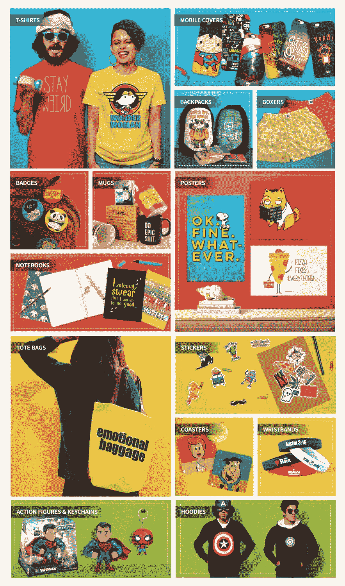
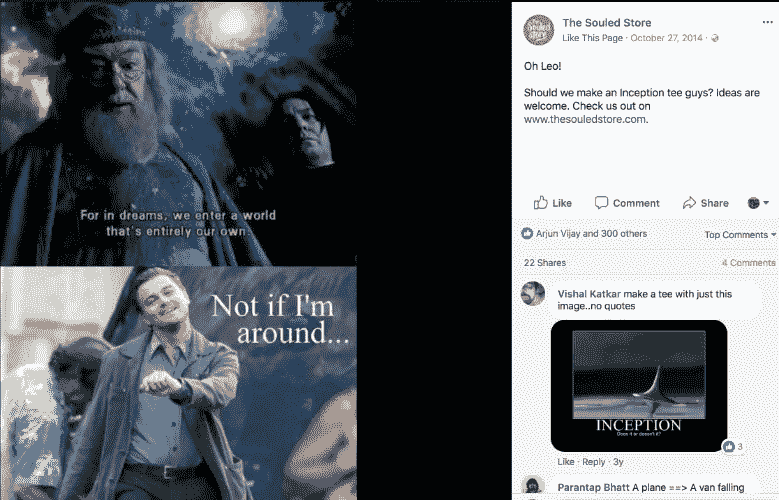
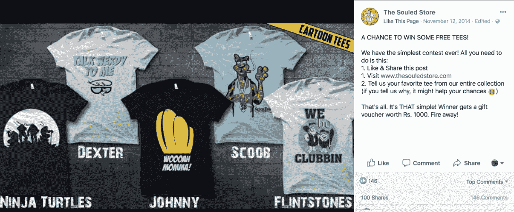
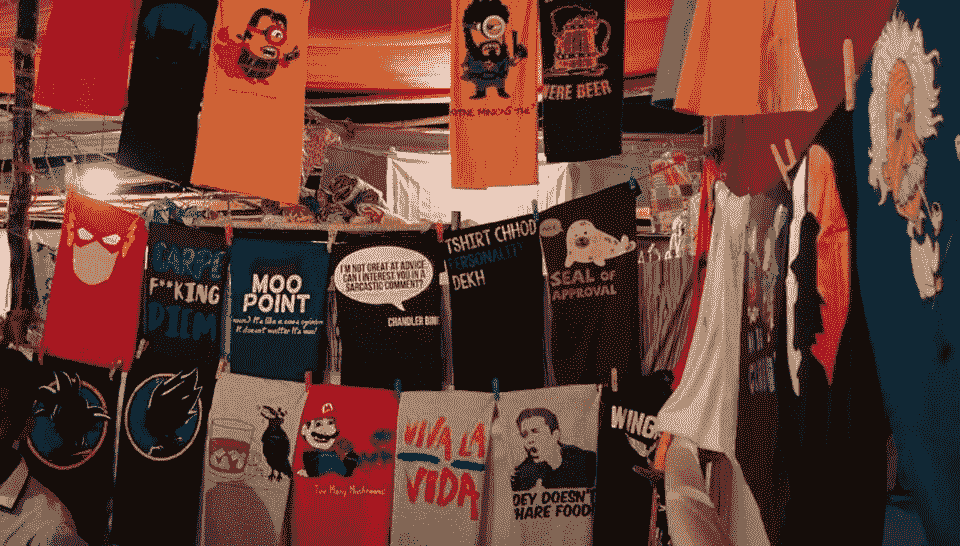
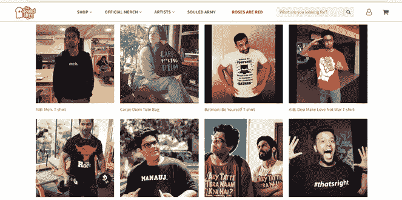

# Vedang 和他的团队如何建立 Souled Store——一个每月创收 45 万美元的在线商店

> 原文：<https://medium.com/swlh/how-vedang-and-team-built-the-souled-store-an-online-store-generating-450k-per-month-staying-75d54ae91c3a>

## [推送面试](https://www.facebook.com/groups/Pushstarter) 11:

## [Vedang](https://www.linkedin.com/in/vedang-patel-40aba34b/) 和团队如何建立[Souled Store](https://www.thesouledstore.com/)的旅程——一个每月产生 45 万美元以上收入的在线商店。

到 2020 年，印度的在线时尚市场预计将增长四倍，达到 300 亿美元。

每天都有数以吨计的公司诞生，以满足这种不断增长的需求。你还可以看到品牌建立自己的电子商务商店，并使用像[**Flipkart**](https://www.flipkart.com/)**或[**亚马逊**](https://www.amazon.in/) 这样的市场进行在线展示。**

> **在这个拥挤的市场中，任何创业公司都有可能保持自举并脱颖而出吗？如果是，如何实现？**
> 
> **通读这篇采访就知道答案了。**

**这是“[**push interview**](https://www.facebook.com/groups/Pushstarter/)**:帮你的访谈**[**push start**](https://www.facebook.com/groups/Pushstarter/)**”**系列的第十一期访谈由 [**Pushstart**](https://www.facebook.com/groups/Pushstarter/) 提供动力。**

**如果你碰巧错过了我们之前在**[**上的采访，看看我是如何建立印度最活跃的创业社区之一的。**](https://hackernoon.com/how-i-built-the-most-active-startup-community-of-india-dfd83e8fe687)****

**** [## 我如何建立印度最活跃的创业社区之一

### 我从零到一建立创业社区的旅程

hackernoon.com](https://hackernoon.com/how-i-built-the-most-active-startup-community-of-india-dfd83e8fe687)**** 

# ****🕴你是谁？****

****嘿 [**Pushstarters！**](https://www.facebook.com/groups/Pushstarter/) 我是 [**维当·帕特尔**](https://www.linkedin.com/in/vedang-patel-40aba34b/)[**The Souled Store**](https://www.thesouledstore.com/)的联合创始人兼执行董事。****

********

******Hi! That’s me sporting our funky products!******

****我毕业于萨达尔帕特尔工程学院的机械工程专业。作为一名汽车爱好者，我参加了许多围绕制造汽车的国家级比赛。****

****毕业后，我做了两年的金融分析师，就在那时我认识了另两位联合创始人 [**The Souled Store。**](https://www.thesouledstore.com/)****

> ****我通过了 CAT 检查，接到了三个 iim 的录取电话。****

****只是在入学后，我意识到生活变得越来越单调，我不再享受整个金融世界。这就是我创业之旅开始的时候。****

# ****🤔灵魂商店是怎么回事？****

> ****Souled Store 是一个电子商务网站，出售最疯狂的商品，主题包括流行文化、电视节目、超级英雄、音乐、体育等。****

****我们创造和策划令人惊叹的设计，并将它们印在各种同样令人惊叹的产品上——从 t 恤到手机套，从背包到平角裤到真正的长平角裤等等！****

********

****[**The Souled Store**](https://www.thesouledstore.com/)****

****我们的产品是专为传播快乐而设计的，直达你的“灵魂”深处。****

> ****灵魂商店诞生于热爱你所做的事情的理念——“跟随你的灵魂”****

****您可以访问该网站，发现根据您喜欢的主题、艺术家和流派分类的各种产品。****

********

******Our Products!******

> ****t 恤是我们的核心产品，几乎占我们销售额的一半。****

# ****💯是什么促使你开办实体店，你是如何验证你的想法的？****

****当我追求金融时，我意识到我并不真正喜欢我的工作。****

> ****我不喜欢去办公室，我讨厌星期一。我很快意识到，生活中有太多的星期一让我无法继续憎恨。****

****我渴望做一些我会在接下来的 30-40 年里继续热爱的事情。****

****总的来说，我喜欢《星球大战》和流行文化，并且总是寻找他们的官方粉丝商品。但是，回到 2014 年，这些物品要么价格高昂，要么是赝品。****

> ****一件简单的 t 恤衫大约要 30 卢比。1800.****
> 
> ****这些物品价格昂贵，因为它们被运到国外进行所需的印刷和水印，然后再运回印度。****

****因此，我和我的联合创始人想到了解决这种效率低下的问题，并想出了在印度以比现有价格低得多的价格销售特许商品的主意。****

****这个想法的验证花了一些时间，或者更准确地说；花了几个月。****

****我们凑钱花了 100 卢比。25k 让一个服务公司做网站。这是一个基本的电子商务网站，一旦上线，我们在第一周内就卖出了大约 100 件 t 恤。****

> ****第一批 100 名客户的评论和反应帮助我们验证了这个想法。****

# ****🛠:构建最初的产品都花了些什么？****

> ****当我们决定开办 Souled 商店时，我们三个人共同出资 100 卢比。公司每人 17.5 万，日常开销每人 2.5 万卢比。****

****这是我们在金融分析师工作期间攒下的所有钱。我们从一个朋友办公室的小木屋开始。我们只有一个房间和一个橱柜，用来堆放我们的第一批 t 恤。****

> ****最初，我们没有设计或编码的线索。我们只是有想法的年轻人。****

****我们花了卢比。25k 让一家服务公司完成我们的基本电子商务网站，我在一天内学会了平面设计。从设计 t 恤到接听客户电话，我们做了所有的工作。****

****我们外包了制造部分，因为这是一项资本密集型工作，我们在最初阶段负担不起。****

> ****t 恤是通过我们网站销售的第一批产品。****

# ****🤝你是如何获得最初的买家的？****

****在推出网站的第一周，我们向朋友和家人出售了大约 100 件 t 恤。但之后的增长相当缓慢。****

> ****我记得，第二周我们只剩下 5 件 t 恤，第二周只剩下 10 件。****

****那时我们开始在 **FB、Instagram** 和 **Google** 上做广告，并改进了我们网站的 **SEO** 以获得知名度。****

> ****我们还坚持在我们的社交媒体手柄上发布内容，围绕我们的观众可能感兴趣的热门话题。****

********

******Meme we used for selling inception tees******

> ****由于我们的产品总是符合潮流，我们通过内容营销获得了良好的转化。****

****我们还在 Instagram 和 FB 上举办了许多吸引人的比赛和竞赛来增加我们的粉丝。****

## ****我们举办的众多比赛之一:****

********

******Contest we ran in 2014******

> ****我们也在一些线下活动中宣传我们的品牌，如[Lil Flea](https://www.facebook.com/thelilflea/)。****

********

******This was our stall at** [**The Lil Flea**](https://www.facebook.com/thelilflea/) **in 2015!******

> ****除此之外，我们还为学生开设了在线实习项目，以渗透到大学内部的实体店。****

****这些项目不仅仅是为了雇佣实习生，而是为了帮助我们接触那些喜欢我们产品的学生。****

****当我们与著名艺术家合作并为他们制作官方商品时，我们迎来了重大突破。我们曾与****[**肯尼·塞巴斯蒂安**](https://www.knowkenny.com/)**[**卡南·吉尔**](https://en.wikipedia.org/wiki/Kanan_Gill) 等许多人合作至今。**********

********

> ****影响者营销是一个强大的工具。正确使用它，你可以像任何东西一样成长。****

# ****💰你的商业模式是什么？你是如何增加收入的？****

> ****我们的基本商业模式就是要与市场上的其他类似产品不同。****

## ****一些帮助我们增加收入的策略:****

*   ****我们必须获得销售某些商品的许可证。我们保证让商品更吸引人，更耐磨，从而以低廉的价格获得许可。****
*   ****我们围绕流行主题进行设计。每一个 logo、每一句引言、每一个角色都充满了激情。****

> ****我们涵盖了几乎所有的流行趋势。****

*   ****我们监控网站和广告的转化率，以检查特定设计的表现。因此，我们优化我们的设计，给人们他们想要的。****
*   ****我们努力使**实体店**成为获取所有粉丝商品的一站式解决方案，这帮助我们增加了收入。****
*   ****我们的另一个策略是，专注于印度内容。这在我们最近与 AIB、肯尼·塞巴斯蒂安和加尔各答骑士队的合作中显而易见。人们喜欢穿他们追随的名人的商品。****

> ****宝莱坞商品也大受欢迎，我们正与他们一起成长。****

****这家实体店是盈利的，每月有 3000 万的经常性收入。****

# ****🏁你未来的目标是什么，你打算如何实现它们？****

****我们的目标是让**灵魂商店**成为所有古怪、时尚和与流行文化相关的东西的一站式目的地。我们也期待着转向更多的印度内容，如印度节目、音乐家和艺术家。****

> ****我们的最后一步是下线，在印度的各个城市开设店铺！****

****到目前为止，我们还没有任何特定的战略，但我们在不断扩大产品范围、合作和增加我们设计的主题领域方面取得了进展。****

****这些将带领我们前进，并帮助我们实现我们的目标。****

# ****🌋到目前为止，你面临的最大挑战是什么？你是如何应对的？****

****获得许可证是一个巨大的挑战，因为我们需要以合适的价格购买它们，并确保它们不是假的。****

****仍然会发生这样的情况，我们给几个月的时间来获得一个特定的许可证，有时，它就是不能通过。这对我们来说总是一个很大的打击，但是我们一直在努力，从不放弃。****

****此外，让任何一家公司出售官方商品都需要时间。****

> ****我们花了一年的不懈努力才登上****。********

******还有一个持续的挑战是跟上所有最新的趋势。******

******除此之外，由于涉及腐败(贿赂),获得网上做生意的政府许可并不容易。所有会计流程，如提交所得税申报表、商品及服务税管理和合规性，都是一项难以管理的任务，它们每次都对我们构成挑战。******

# ******🗒，你对起跑有什么建议？******

*   ******选择合适的合作伙伴至关重要。你的伴侣可能和你有不同的思考过程，但他必须质疑你所做的所有决定，这样才能有更好的结果。******

> ******你需要有各种不同的观点。******

*   ******你需要有决心和动力。请记住，你会面临失败，但你需要继续努力，直到你实现你想要的。******

# ******✉️:我们怎样才能和你联系上？******

******可以联系我 [**LinkedIn**](https://www.linkedin.com/in/vedang-patel-40aba34b/) **和** [**脸书**](https://www.facebook.com/vedang.patel.3) **！********

## ******非常感谢你的阅读！如果你喜欢，请鼓掌支持👏🏻还有分享帖子。请随意发表评论💬下面。******

## ******想成为印度最活跃的创业社区的一员吗？******

*******在* [***上发送请求 Pushstart***](https://www.pushstart.in/join-network-community) *成为我们不断壮大的大家庭的一部分。*******

*******嘿！Neeraj 这里，* [***的创始人，Pushstart***](http://pushstart.in/feed) *，印度最活跃的企业家群体。我每周都会发布对成功企业家的采访。**[***脸书***](https://www.facebook.com/jneeraj0807)***|***[***Linkedin***](https://www.linkedin.com/in/jneeraj0807)***| neeraj . Joshi @ pushstart . in |***[***Twitter***](https://twitter.com/jneeraj0807)【*******

**************

## *******这篇文章发表在 [The Startup](https://medium.com/swlh) 上，这是 Medium 最大的创业刊物，有 313，216+人关注。*******

## *******在这里订阅接收[我们的头条新闻](http://growthsupply.com/the-startup-newsletter/)。*******

**************