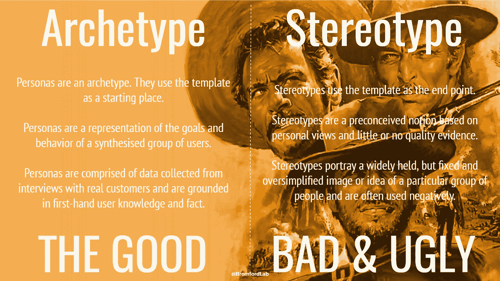
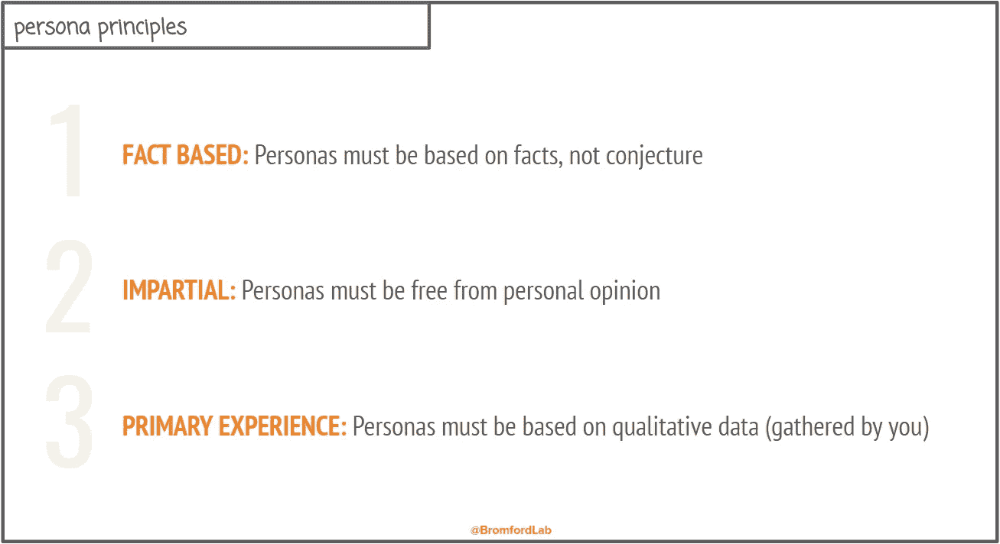
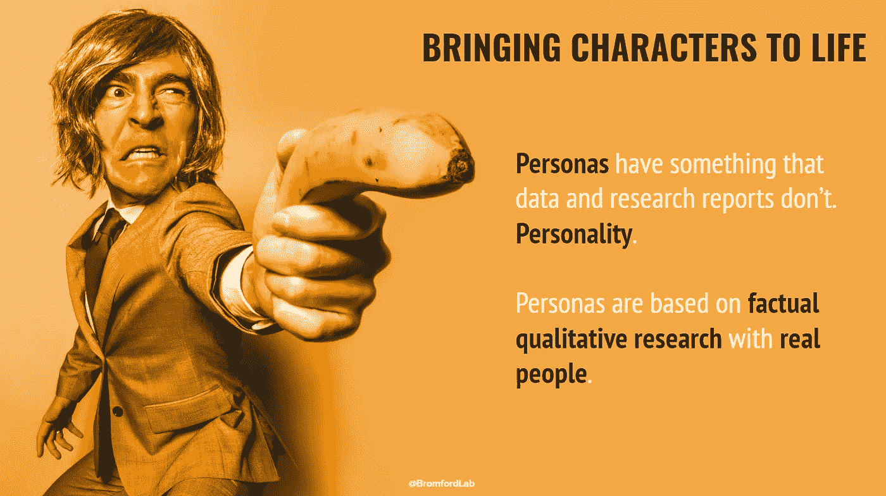
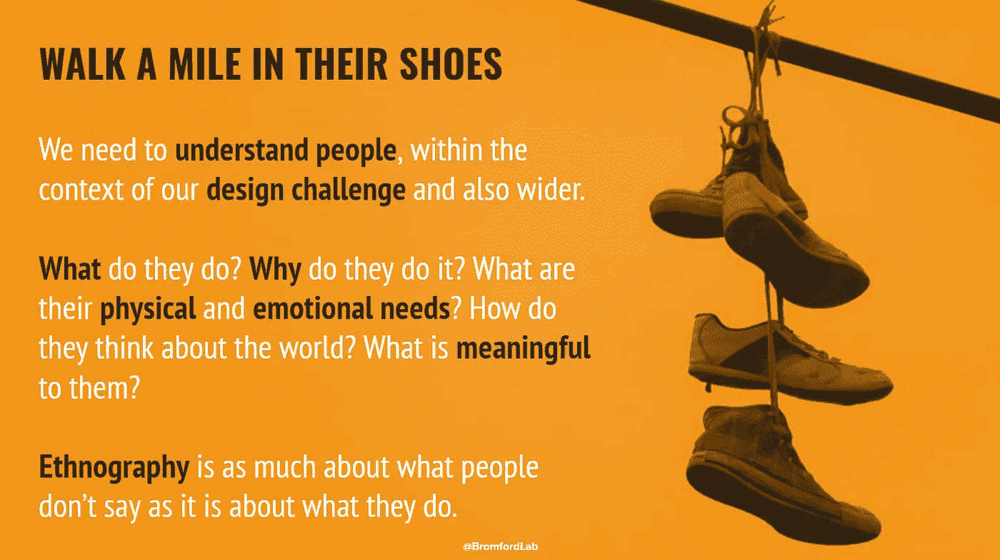
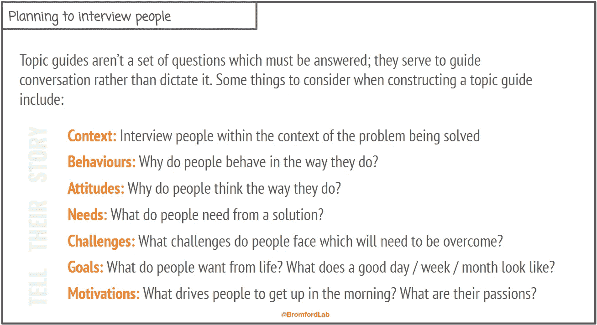

# 我们如何使用人物角色

> 原文：<https://medium.com/swlh/how-we-are-using-personas-a78a141080e1>

人物角色有时会受到一些负面报道。如果做得好，它们可以成为无价的设计辅助工具，但是如果做得不好，它们只能是丑陋的刻板印象。我们希望让人物角色成为我们设计服务的核心部分，所以我们一直在思考如何确保避免糟糕的人物角色陷阱。

当我们谈论人物角色时，我们谈论的是原型而不是定型。这很重要，因为这两者之间有一些重要的区别。

就像一种气味或味道可以引发我们童年的记忆一样，人物角色应该让我们想起我们见过的**真人**。好的人物角色培养同理心，将研究带入生活，并允许我们在设计过程的每个阶段与客户互动，不管他们是否在房间里。

有很多证据支持在设计和创新中使用高质量的人物角色。像[知名故事集团](http://www.welltoldstory.com/)这样的组织正在有效利用原型来改善非洲的社会成果，并为我们在布罗姆福德重振人物角色的使用提供了部分灵感。

为了确保我们的人物角色是**好的原型**，我们制定了一套总体原则来指导我们:

通过围绕我们的指导原则集中我们的工作，我们能够创建人物角色来讲述一个故事，并将我们的研究带入生活。

我们使用人物角色作为交流定性研究的一种方式，这些研究是关于我们以某种方式跟踪、采访或观察过的人的。人物角色帮助我们在更广阔的背景下理解人们，而不仅仅是我们的服务。一张图胜过千言万语，因此我们正努力更好地使用人和他们的事物的照片，以补充我们的研究，并为我们正在策划的故事提供信息。

为了对我们见过的人做一个统一的总结，我们把人物角色描述为一个独立的人。然而，事实上人物角色并不是单个个体的代表，而是代表许多真实人物的综合观察集。人物角色帮助我们比数据本身更深入地了解人们，帮助我们理解人们为什么以特定的方式行为，帮助我们发现他们的目标、动机和关注点。

我们真的很保护我们的人物角色原则，尤其是# 3*——人物角色必须基于定性数据(由我们收集)。刻板印象和原型的区别在于研究。当专业人员在他们舒适的办公室里创建人物角色时，很少或没有证据支持他们，人物角色是不好的。*

> 人物角色只是我们把自己从思考的位置带到了解的位置的一种方式。

在没有证据支持的情况下认为某件事是真的会导致糟糕的人物角色，而糟糕的人物角色会导致糟糕的设计决策，所以基于事实和证据来构建人物角色是很重要的。我记得看到了一条来自 [Carrie Bishop](https://twitter.com/carriebish) 的推文，它总结了这一点并启发了这张图片。

好的人物角色是建立在**丰富的洞察力上，而不是臆测**。我们认为好的人物角色有几个关键特征:

*   好的人物角色反映了研究中观察到的模式
*   好的人物角色关注当前正在发生的事情
*   好的人物角色是现实的，而不是理想化的，具有几个真实人物的属性

好的人物角色有助于我们理解:

*   语境
*   行为
*   态度
*   需要
*   挑战
*   目标
*   动机

好的人物角色以多种方式提供价值:

*   好的人物角色可以帮助验证或否定一个设计决策
*   好的人物角色可以帮助我们决定前进的方向
*   好的人物角色提供敏捷的学习，而不是统计上的生存能力
*   好的人物角色在想法产生的过程中提供灵感
*   好的人物角色能表达最终用户的心声，并培养共鸣

为了收集基于事实的证据，我们需要设计一组人物角色，我们使用基于主题指南的观察和对话，而不是一组僵硬的问题，如问卷。通常，最有见地的对话发生在问题被回答之后，我们的对话更多的是关于没有说的内容，而不是已经说了的内容。

我们目前正在寻求创建一组新的人物角色来支持我们的[良好开端](http://www.bromfordlab.com/search?q=starting%20well)工作，随着工作的进行，我将在博客上记录我们的进展。

[@西蒙 _ 佩妮](https://twitter.com/simon_penny)

*原载于*[*www.bromfordlab.com*](http://www.bromfordlab.com/labblogcontent/2017/8/3/how-we-are-using-personas)*。*

## 这个故事发表在 [The Startup](https://medium.com/swlh) 上，这是 Medium 最大的创业刊物，拥有 289，682+人关注。

## 在这里订阅接收[我们的头条新闻](http://growthsupply.com/the-startup-newsletter/)。

