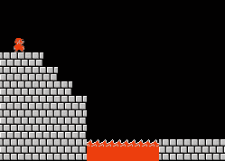
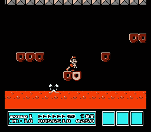
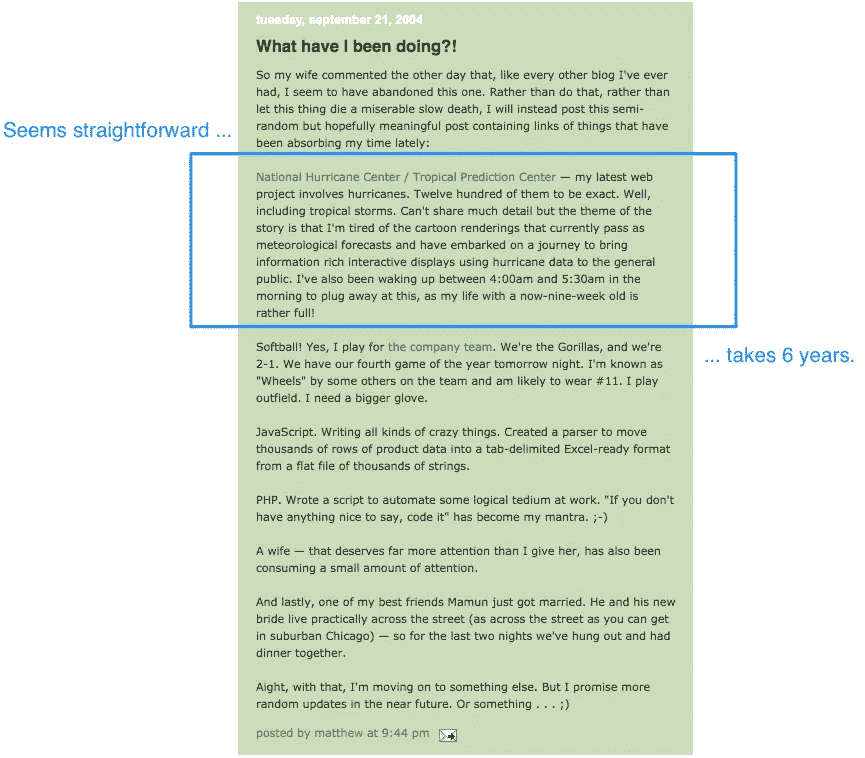

# 我们如何启动一个气象初创公司

> 原文：<https://medium.com/swlh/how-we-bootstrapped-a-weather-startup-b3f0463839d4>

下面是我在 2010 年发表的黑客月刊文章“Bootstrapping Stormpulse”的转载，这篇文章在 2013 年从互联网上消失了。随着最近几个月围绕[*bootstrapping vs . VC*](/swlh/the-new-bootstrappers-how-alternative-funding-models-are-embracing-founder-lifestyles-bd66a6656120)*的讨论愈演愈烈，Stormpulse 是两者的故事，我认为这值得重新讨论。这个故事的第二部分可用* [*此处*](/@mattwensing/bootstrapping-stormpulse-part-ii-5eb491b82474) *。*

你想创业吗？太好了。自举吧？甚至更好！你在这里:

不幸的是，不像我们的英雄从左往右走，没有公式告诉你如何找到公主。顾名思义，自举是一种你想尽一切办法让它发生的冒险。感觉是这样的:

你下面的平台要让位了！你会及时跳下去吗？你会降落在那个小平台上吗？你会滑倒吗？不幸的是，你真的没有时间计算所有这些。你现在必须跳。你成功了吗？

我要补充一点:我不会总是想“哦，天哪，我早餐吃的是风险！我天生就是干这个的！”我可能生来就有这样的齿轮，当我看到大多数人会避开的东西时，我会跳进去，但当我飞到半空中时，我仍然不知道东西会如何着陆。在这一切之下，我不得不说，如果我不能满怀信心地做这件事，相信这一切都是为了我生命中、我的性格中、我的家庭中、我的灵魂中的一个更高的目标，那么我根本不会做这件事。

> 我想这只需要几周，也许一两个月，然后就结束了，就像我涉足的所有其他小项目一样。

# 2200 多天前…

*   2004 年 7 月我的第一个孩子，一个女儿，出生了。
*   2004 年 9 月 21 日。 **Stormpulse 作为一个** [**有机的启动想法在我的大脑中萌发**](http://www.paulgraham.com/organic.html) **:**

Blogspot Entry, Sept. 2004

*   我对 2004 年飓风季节的破坏感到沮丧，并渴望为一个网络项目找到一个想法，我写道:“我厌倦了目前作为气象预报的卡通渲染，并开始了一段旅程，利用飓风数据向公众提供信息丰富的互动显示。”我想这只需要几周，也许一两个月，然后就结束了，就像我涉足的所有其他小项目一样。

# 2004 年总计:约 300 小时，投资 0.00 美元->，收入 0.00 美元

*   2005.我仍然着迷于我已经开始的这个网络项目，我听着[汤姆·科茨在伦敦网络应用的未来上的“数据的网络”演讲](https://web.archive.org/web/20101015191554/http://www.archive.org/details/NativeToAWebOfData)，它作为**的催化剂，促使我思考什么将成为 Stormpulse 存在的理由和它的设计哲学。**我带着 iPod 上下班时会听很多遍。它沉得很深。*许多突触围绕着天气数据运转。*
*   2005 年夏天。有史以来最活跃的飓风季节。卡特里娜给飓风国家的当地人留下了不可磨灭的印象。

# 2005 年总计:大约 600 个额外小时，投资 0.00 美元-> . 00 美元收入

*   2006 年 8 月。我辞去了在麦克马斯特-卡尔公司的软件开发工作，搬到了佛罗里达州。Stormpulse，一个用于抓取数据的 PHP 脚本目录，是我唯一拥有的东西。此时，我正在将一堆 PHP 代码转换成 Python(当时是 [TurboGears](https://web.archive.org/web/20101015191554/http://turbogears.org/) )。还没有 Flash 组件(地图)。Brad(我在 McMaster 的经理)决定成为种子投资者和我的联合创始人，同时暂时留在 McMaster。他的种子投资将用于支付我家下一年的生活费用，并且仍然是我们迄今为止最大的单笔现金注入(总共 7.5 万美元中大约有 5 万美元)。

# 2006 年总计:约 1000 小时的额外工作时间，5 万美元的投资-> $0.00 美元的收入

*   2007 年 2 月。布拉德辞去了他在麦克马斯特-卡尔的工作，全职致力于 Stormpulse。
*   2007 年 3 月 24 日。**我和布拉德去西部** [**创业学校**](http://startupschool.org/)**[**2007**](http://www.google.com/search?aq=f&sourceid=chrome&ie=UTF-8&q=startup+school+2007)**！**清晰的记忆:遇见 Jessica Livingston(前一天我刚到 YC 的时候，她问我“哦，不。你是不是想问你能不能整天呆在这里？!"(这很有趣，无意冒犯)，德鲁·休斯顿，贾斯汀·坎，凯尔·沃格特，萨姆·奥迪奥，特雷弗·布莱克威尔，巴里·赫斯([谁？！](https://web.archive.org/web/20101015191554/http://bjhess.com/blog/2007/3/29/startup_school_2007/))。整个经历的启发。保罗·布切特的演讲非常棒。我得告诉他我不喜欢 Gmail(讽刺的是我现在有 6 个 Gmail 账户)。**
*   **2007 年 4 月 25 日。我们的第一批 42 位访客。完成了交互式地图的第一部分(从零开始，没有第三方 API)和主页面设计，我们开始给我们的第一批人口统计数据发电子邮件——飓风跟踪和研究的前沿——美国国家航空航天局、美国国家海洋和大气管理局等。当几十个人试图同时访问网站时**网站崩溃**。我明白了关闭数据库连接意味着什么，并高兴地将 CTO 的权力交给了 Brad。**
*   **二零零七年五月十六日。我们参加了福特州长的飓风会议。佛罗里达州劳德代尔。在预算有限的情况下，我们带了一台 30 英寸的液晶显示器、一台笔记本电脑、一些传单和**画一些** [**微薄的关注**](http://stormpulse.wordpress.com/2007/05/25/on-the-air/)**[**给我们自己**](http://stormpulse.wordpress.com/2007/05/30/weathertalk/) **在气象行业**。花大量时间阅读保罗·格拉厄姆的所有著作。****
*   **2007 年 6 月 25 日。我们在新闻上发布了 Stormpulse 的链接。YC 并得到关于我们需要**为普通人简化演示**以及**使网站全年有用**的可靠、有用的批评。我们将在接下来的三年里这样做。**
*   **2007 年春天。被[y 组合](http://ycombinator.com/)拒绝 07 夏。**我意识到住在南佛罗里达州是一个资金问题，但我决心不搬迁**。**
*   **2007 年 6 月。初始资金耗尽，是时候**重新找一份工作了**。我开始在《棕榈滩邮报》工作，这很讽刺，因为他们是 Stormpulse 的竞争对手(事实上，Stormpulse 在 99.99999%的市场中完全不为人知，这还不算是一个竞争)。我在里面能学到什么？与此同时，我开始学习并喜欢上了姜戈。我给 Adrian Holovaty 发了一封电子邮件，告诉他关于 Stormpulse 的事情，如果让我重来一次，我会用 Django。*回想起来，真的很庆幸我们没有。***
*   **2007 年夏天。为了增加收入，布拉德和我为《邮报》准备了一份提案，要求独家授权我们将追踪地图嵌入他们的网站。这将是每月 2000-3000 美元的交易。总比关门好，对吧？由于编辑没有表现出兴趣(大概是因为价格)，交易失败了。**
*   **2007 年冬天。流量依然持平(<100 visits per day on average), I’m pretty **接近认为 Stormpulse 已死**)。当我离开 Stormpulse，在 Post 学习 Django 和地理空间数据库时，Brad 开始涉足其他项目…**

# **2007 年总计:3000 多小时-> 37640 次访问，18233 个独立访问者，0.00 美元收入。**

*   **2008 年 2 月。我的第二个孩子，一个儿子，出生了。**
*   **2008 年春天。我们继续对网站进行[小改动，让它变得越来越不令人生畏/困惑(远离天气呆子市场，更多地关注主流类型的用户)。开始认真运用](http://web.archive.org/web/*/http://www.stormpulse.com) [**的口头禅吸引专家**](https://web.archive.org/web/20101015191554/http://www.google.com/corporate/ux.html#engaging) **。**”**
*   **2008 年 7 月**找到了！如果我们提供 Stormpulse 作为一个可自由嵌入的小部件会怎么样？我把这个免费的想法推销给我的总编辑。他说“是的！”(也许 2007 年在创业学校听到克里斯·安德森的演讲对我们产生了某种持久的影响？).****
*   **2008 年 7 月 19 日。帖子[嵌入了我们的地图](https://web.archive.org/web/20101015191554/http://www.storm2010.com/)，这意味着成千上万人的即时品牌曝光。我们认为*这可能会很大。***
*   **2008 年 8 月。数十家主要报纸和广播电台嵌入了我们的飓风跟踪小工具，这符合[“比现有解决方案好十倍”的要求](http://www.businessinsider.com/marc-andreessens-3-criteria-for-startup-success-2010-5)。而且是 ***免费！作为交换，我们所要求的只是链接回 Stormpulse 作为“飓风跟踪”网站。搜索引擎优化大幅提升随之而来。*****
*   **2008 年 8 月 15 日—9 月 15 日。大西洋飓风季节着火了，我们的网站被 330 万人访问了 1120 万次(没有崩溃——感谢亚马逊网络服务！).这个流量的 58%是直接的，来自谷歌的前两个搜索是“stormpulse”和“storm pulse”。为了赚钱，我们添加了一个 Tipjoy 小工具，后来又添加了一个 PayPal 的“捐赠”按钮。Tipjoy widget [得到一些压力](http://geeklad.com/stormpulse-earning-thousands-on-tips-alone)。贝宝打电话来问我们在做什么(显然在某个地方触发了一些危险信号)。**
*   **美国东部时间 2008 年 9 月 2 日下午 1 点 48 分。我收到了 CNN 气象节目制作人的电子邮件，正好可以从我的房间里站起来，走到一台平板电视前，在那里我可以看到 CNN 气象学家在直播电视上使用 Stormpulse。真的，就像它变得超现实一样。**
*   **2008 年 9 月 5 日。我在邮报的同事告诉我, [Stormpulse 在 TechCrunch](http://techcrunch.com/2008/09/05/track-hurricanes-on-stormpulse/) 上。在这一点上，TC 推荐对我们的流量几乎没有影响。**
*   **2008 年 9 月 18 日。在纽约的 Web2.0 博览会上，Tim O'Reilly 在舞台上展示 Stormpulse，作为“Web 3.0 可能是什么”的一个例子。这越来越奇怪了。**
*   **2008 年十月。前电信公司创始人，现棕榈滩亿万富翁，在飓风艾克引起他对 Stormpulse 网站的注意后，向该网站献殷勤。当我们得知他想要公司 51%的股份来换取他目前金融项目的工作时，战略投资和合作的想法就破灭了。很有教育意义，但是不用了，谢谢。**

# **2008 年总计:2500 多小时-> 1360 万次访问，400 万独立访客，125.00 美元的 AdSense 收入，约 2000 万美元的 PayPal 捐款。**

*   **2009 年 1 月。我观看了有 400 万人参加的巴拉克·奥巴马的就职典礼。我突然意识到，我在 CNN 上看到的人群和今年使用 Stormpulse 的人数是一样的。神魂颠倒！**
*   **2009 年 2 月 24 日。**一家气象行业的战略投资者提出一项协议，他们将拥有 storm pulse**51%的股份。我们考虑了这个想法，但[对公司的估价比潜在投资者](http://paulgraham.com/googles.html)高得多，因此这笔交易被抢先否决了。*我们了解到，在游戏的早期阶段，51%在“战略”投资者中是一个受欢迎的股权比例。***
*   **2009 年 5 月**我** [**辞去了我白天的工作**](http://paulgraham.com/boss.html) **全职从事 storm pulse**的工作，我提前两周通知了这个职位。在我离开之前，**我讨论了 COX Enterprises 投资 Stormpulse** 的可能性，但是没有达成协议。**
*   **2009 年 6 月在狂热地为即将推出的高级账户功能工作的同时，我学会了在 Stormpulse 上按 CPM 或 CPC 出售、出售、出售……[广告，这让我们得以生存。所有的线索都是在没有任何提示的情况下进入我们的收件箱的，这……很好。](https://web.archive.org/web/20101015191554/http://www.stormpulse.com/advertise)**
*   **2009 年 7 月 11 日。通过[推出我们的专业账户](http://stormpulse.wordpress.com/2009/07/11/stormpulse-advanced-the-better-way-to-track-tropical-weather/)，我们成为合法的免费增值，最初的名字是“风暴脉冲高级”(现在简称为风暴脉冲专业)。第一天我们就卖出了几打，这让我们很兴奋。原价是每月 3.95 美元，飓风季节是 19.95 美元。大多数销售是后者。我们有现金流！**
*   **2009 年 9 月我们将 Stormpulse 推介给一家芝加哥风投公司。我们的转化率对他的口味来说太低了。**
*   **2009 年十月。我向纽约一家大型媒体企业的投资部门推销 Stormpulse，发现我们对他们来说为时过早。我早该知道要进去，但这很有教育意义。投资者说，如果我能以每月 10 万美元的价格回来，可能会很有意思。我告诉他我们已经有了，但这并没有延长谈话。**
*   **2009 年 12 月 1 日。2009 年飓风季节正式结束，成为 12 年来最平静的风暴季节(有趣的时机)。**
*   **2009 年末。在寻找资金的过程中，**我们发现，我们原本希望能够成功的几个天使投资人……并没有去**。风暴脉冲机会对他们来说没有意义。*为什么不呢？！对我们有意义！哦好吧……***

# **2009 年总计:4000 多个小时-> 670 万次访问，180 万独立访问者，25%的方式实现全年收支平衡。**

# **换句话说…**

*   **2010 年 1 月。我试水，**开始寻找合同工作**。理想的合同演出(固定的时薪，远程 OK，天气相关的[？！—是的，说真的])打开了大门，然后在经过三轮热情洋溢的代言面试后……失败了。然后，这一循环又发生了两个合同机会。我只剩下暴风脉冲了。又来了。许多存在主义问题浮出水面:我认为我在做什么，我是谁？！**
*   **2010 年 2 月。我们被介绍给一个非常著名的早期风险投资公司。你愿望清单上的前三名。太神奇了。在几个电话和一次面对面的会议之后，我们通过电子邮件被告知**我们将在本周收到种子阶段的条款清单(是的！！！！).**然后变成下一周的**。然后是**后面的**。然后，在另一个视频会议之后，它变成了“*对不起，但是没关系”(不！)*。主要问题:我们完全不同的地理位置(亲爱的读者，我是不是忘了说，我们已经建立了 Stormpulse，布拉德住在芝加哥，我住在南佛罗里达？).最难的[让](http://paulgraham.com/fundraising.html)失望了。我真的以为这能支付我/我们的账单。****
*   **2010 年 2 月。我们争先恐后地寻找一些家庭成员，他们愿意投资的钱只够再维持几个星期。布拉德下注最后一次*(至少我们相信自己！)*。我发现我的第三个孩子将会是双胞胎。**
*   **2010 年 2 月 2 日。用完了我们的资金，我们扩展了网站，把全年天气都包括进去了。有些人可能会称之为枢轴。**
*   **2010 年 4 月 2 日。没有收入，没有保险，有三个需要抚养的人，还有一对即将出生的双胞胎，我祈求上帝给我一些主意，让我做些什么。我听到的回答是“*别再要钱了，你去要吧。*“这正是我想听到的。我把踏板放在金属上，在灵感的洪流中，我彻夜未眠，设法设计并制作了一个高分辨率的动画雷达功能(当时的第一要求)，并将其添加到我们的专业帐户中。我给 3980 个注册用户发邮件，然后睡觉。**
*   **2010 年 4 月 3 日。我算了算**我们平均每天需要卖出至少 4 个 Pro 账户来支付账单**。令人难以置信的是，超级雷达功能开始以这种速度或更快的速度推动订阅。我们又活过来了！**
*   **2010 年 4 月。因为双胞胎的出生，我们家暂时搬到了佐治亚州的亚特兰大。在周三上午参加几个 Bootstrapper Circle 会议时，我潜入亚特兰大技术社区，会见了保罗·弗里特、本·希尔和佐治亚理工学院/ATDC 大学的了不起的研究员。在适当的时候与其他企业家会面是一种新鲜空气。**
*   **2010 年 4 月。在一次[自举圈子](https://web.archive.org/web/20101015191554/http://atdc.org/services/startup-circles/bootstrapping-circle)中，我提到了我们的生意以及天气频道就在[附近](http://maps.google.com/maps?q=the+weather+channel+marietta+ga&um=1&ie=UTF-8&sa=N&hl=en&tab=wl)的事实(我暗暗希望能有一次会面)。碰巧天气频道的创始人之一就在街对面的 B & N at GaTech 。我们被介绍了，我有 90 秒的时间来推销风暴脉冲。几天后，我得知他对气象部门不再感兴趣了。**
*   **2010 年 5 月。我们将 Stormpulse 推介给纽约一家非常著名的早期风险投资常驻企业家。现阶段无跟进/兴趣。**
*   **2010 年 6 月。我们**完全** [**重新设计我们的产品页面**](https://web.archive.org/web/20101015191554/http://www.stormpulse.com/products)**[**推出 B2B 级计划**](https://web.archive.org/web/20101015191554/http://www.stormpulse.com/products/emergency-operations) 。在向公众推出这些计划之前，我们出售每一个包中的一个(试图验证兴趣和定价)。****
*   ****2010 年 6 月至 2010 年 8 月。自助 B2B 帐户获得了应急管理人员、政府机构和财富 500 强公司的青睐。在网站上运行一个单一的图形广告，偶尔溢价直接销售。****
*   ****2010 年 8 月。将申请发送到 [AngelList](https://web.archive.org/web/20101015191554/http://venturehacks.com/articles/angellist) 。不准咬人。我很确定我们几乎空无一物的“社会证明”表单域没有帮助。****
*   ****2010 年 8 月。一位北卡罗来纳州的百万富翁商人联系我们，向我们介绍他的企业客户。作为以企业价值的价格出售我们服务的交换，他希望将业务一分为二，并拥有企业公司 51%的股份。*这些人和 51%有什么关系？*我们认为我们已经走得太远，现在不能停下来。没有交易。****

# ****2010 年年初至今总计:3000 多个小时-> 1300 万次访问，400 万独立访问者，收入比 2009 年增长 3 倍。****

****那现在怎么办？****

****我们后退一步，根据过去 3 年的经验，认真评估我们的价值主张。****

****我们正在仔细考虑我们的定价，这样我们就能继续抓住这只老虎的尾巴。****

****几周前，另一位刚听说我们故事的创始人告诉我，他对我们做事的倒退感到震惊。我立刻把它当成了一种恭维(这也是他的本意)。我猜规范是:团队(往往意味着资金)第一，产品第二。****

****但我喜欢我们的方式。不要等着。现在，用一个简单的产品解决一个实际问题。然后和其他有同样问题的人谈谈(这些人是存在的，对吗？)这样你才能正确估计机会。我认为有一种高估现有解决方案(竞争)从而低估机会的趋势。我从来没有想到第一个愚蠢的 PHP 页面可以成为一个真正的业务。****

****我唯一遗憾的是，我们花了这么长时间来理解和建立定价。最后，我想建议:****

****如果您要引导:****

******产品第一，** [**基于价值定价**](https://sixteenventures.com/pricing-value-metrics) **第二。******

****我真的认为接下来会发生的。****

****[*原创评论*](https://news.ycombinator.com/item?id=1743533) *关于黑客新闻。*****

****如果你喜欢这个，你也会喜欢阅读第二部分。****

********

## ****这篇文章发表在 [The Startup](https://medium.com/swlh) 上，这是 Medium 最大的创业刊物，拥有+392，714 名读者。****

## ****在这里订阅接收[我们的头条新闻](http://growthsupply.com/the-startup-newsletter/)。****

********