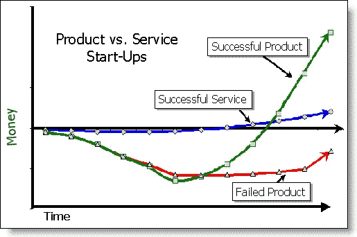
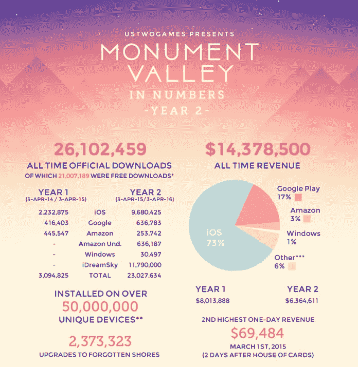

# 我们如何为自己和他人制造产品

> 原文：<https://medium.com/swlh/how-we-build-products-for-ourselves-and-others-f722cddd56f1>

## ***管理产品和服务的秘诀***

我的朋友[罗布](https://twitter.com/rkenedi)喜欢说，“每个服务公司都想成为产品公司。”他是对的。产品公司是诱人的，它们经常被描述为每个企业家、投资者和顾问都喜欢听到的词——可扩展。

服务公司通常以计费时间或基于价值的价格运营，但产品公司并不直接依赖人力报酬。产品公司获得了数亿美元的资金，并得到了媒体和投资者的认可。在更大的范围内，它们被认为更令人兴奋，更有影响力。

总之，罗柏是对的。但我对他的回答是，“你为什么不能两者兼得？”

不容易，但是可以做到。

显然，一些产品公司承担服务工作是因为他们必须这样做。他们最初打算生产产品，但产品收入不足以让他们生存下去，因此他们被迫扩展到服务领域，以维持业务。这通常是一个警告信号，充其量是一个绷带解决方案。这很难持续，但可行。

在其他情况下，服务公司选择承担服务和咨询工作，因为这项工作可以教育他们的团队，并为他们的产品提供信息。他们从服务工作中获得更多的洞察力，服务工作使他们能够进一步试验更多样化和更深入的产品工作。

考虑一下那些创造真正伟大产品的创业工作室，比如 Betaworks 和 Expa。他们有很多现金。虽然我们想在这些层面上开发大量产品，但我们的银行里没有数亿美元。所以在我的工作室[小心脏](http://www.tinyhearts.com)，我们决定建立自己的现金流，使用[数字产品工作室模型](http://blog.marvelapp.com/state-of-the-digital-nation-2016/)。

数字产品工作室建立在三个支柱上:构建内部产品、咨询(即服务工作)和风险投资。咨询公司的稳定性有助于维持另外两家公司，并提供了保持稳定的多元化。*想想在三轮车上而不是自行车上保持平衡。或者三脚架有多稳。*

ustwo 是数码产品工作室最好的一个例子。Monument Valley 创造了大量的收入，他们为此开发了一个产品组，但这也巩固了他们的声誉，并带来了客户机会。单靠它自己，纪念碑谷不会维持他们雄心勃勃的增长目标，所以他们的服务很好地补充了他们的产品工作。

与此同时，随着 ustwo 建立自己的产品和服务，开发自己的剧本，它还投资其他企业，如漫威。

Ustwo 正在开发他们的产品、企业和服务之间的共生关系，这将在学习和资金方面获得回报。万物相互依存。

数字产品工作室不建立微型网站或宣传材料。他们被咨询来解决棘手的问题，最终他们真的拥有了这些问题并为它们建立了解决方案。

如果你正在寻找一个数码产品工作室，或者一个设计或开发公司来合作，你应该和那些真正制造过产品的人合作。这并不意味着他们为了乐趣而构建的副业项目，而是他们的团队实际上花费了他们的全职时间工作并倾注了他们的灵魂的产品。他们会比那些只为客户服务的公司更了解你的产品和你的问题，那些公司从来没有建立任何东西来解决他们自己的问题。

这听起来是一个很小的区别，但实际上构建自己产品的数字产品工作室带来了更全面的视角，这使他们成为更好的合作伙伴。

我们已经有客户接近我们，而不是开发店，因为他们[看到了我们的产品](http://tinyhearts.com/work/)，想了解更多关于我们的过程。我们不需要向他们推销，因为我们的工作，他们知道我们是移动领域的专家，他们知道我们直接面对他们正在经历的问题。

建立一家服务或产品公司变得异常复杂。两样都做要复杂两倍。以下是一些管理它的方法:

## ***90%*/10%**

我们团队中的每个人都被分配了 90%的产品和 10%的服务，或者相反。例如，我们的一个开发人员可能 90%专注于内部键盘产品，10%专注于客户合作项目。这让每个人都有机会从事其他项目，但保持他们的重点和优先次序非常清楚。

## *100%*

*较大的数字产品工作室有专门的团队成员来构建产品或专注于服务。如果他们成功了，他们最终会形成产品组、部门或完全独立的企业。考虑调用媒体生产 Hootsuite(它已经被极大地夸大了)。Invoke 仍然在做服务工作，但是如果没有最初构建它的 Invoke 团队，Hootsuite 就不会存在。*

****双年冲刺****

*我们鼓励我们的团队成员每年转换一次工作重点。例如，如果在上半年，他们正在开发一个内部产品，那么在下半年，他们将为合作伙伴开发服务。这有助于我在本文前面谈到的更“整体”的理解。*

****数码产品工作室是未来****

**

*The future is now!*

*我们相信，作为一个数字产品工作室和建筑企业，产品和服务工作通知我们，并完善我们的观点。为了管理我们的团队并保持专注，我使用[我们称之为 99–50–1 的方法](/life-learning/how-to-scale-yourself-the-99-50-1-framework-7798518f36e1#.lx0784eg7)在这些相对更混乱的环境中管理产品开发。*

*我们从每一项活动中获得的见解会相互影响，因此我们可以超越标准的最佳实践，比同行更快地超越和创新。最终，所有基于服务的公司将看起来更像三管齐下的数字产品工作室，而不是标准的代理或设计/开发商店。*

**

# *如果你喜欢这篇文章，你可能也会喜欢:*

* [## 这是官方消息:我们开始营业了

### 是的，我们做客户工作

medium.com](/p/5db9bffdfa88)  [## 用手思考

### 框架设计初学者指南

medium.com](/swlh/think-with-your-hands-36d703f60164) 

## Robleh Jama 是获奖产品工作室 [Tiny Hearts](http://www.tinyhearts.com/) 的创始人。他们生产自己的产品，如 [Next Keyboard](http://www.nextkeyboard.co) 、 [Wake Alarm](http://www.tinyhearts.com/wake) 和[Quick Fit](http://www.tinyhearts.com/quickfit)——以及为 Wealthsimple 和飞利浦等客户生产的产品。

## [查看我们的博客](http://blog.tinyhearts.com)和[加入我们的时事通讯](http://bit.ly/1kp6lTN)，了解诸如“如何在 App Store 上被发现”和“如何制造人们喜爱的产品”之类的事情。

**如果你喜欢这篇文章，请推荐，帮助别人找到！**

*