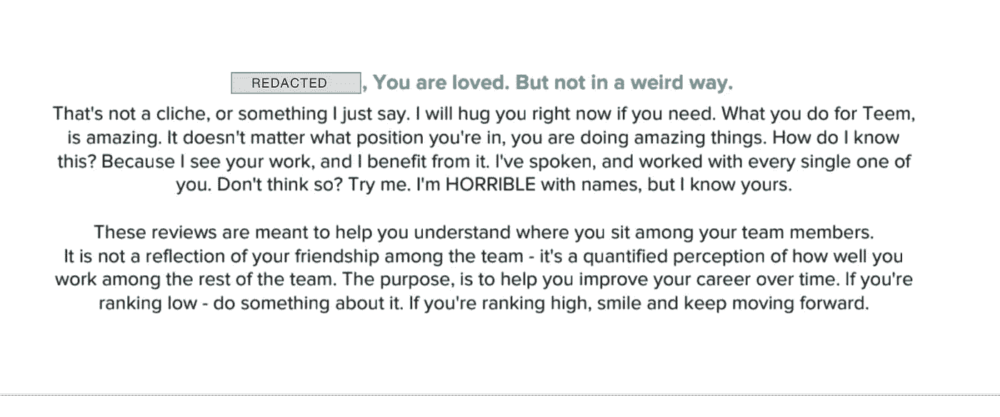
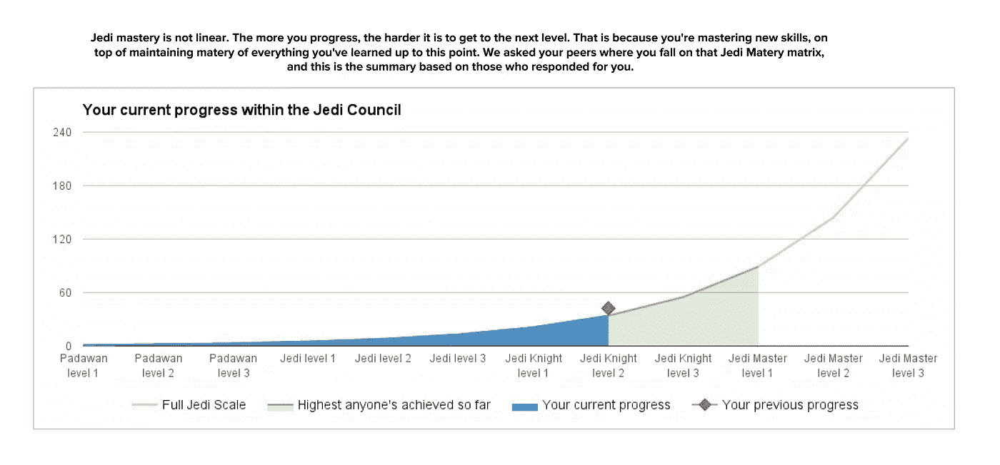
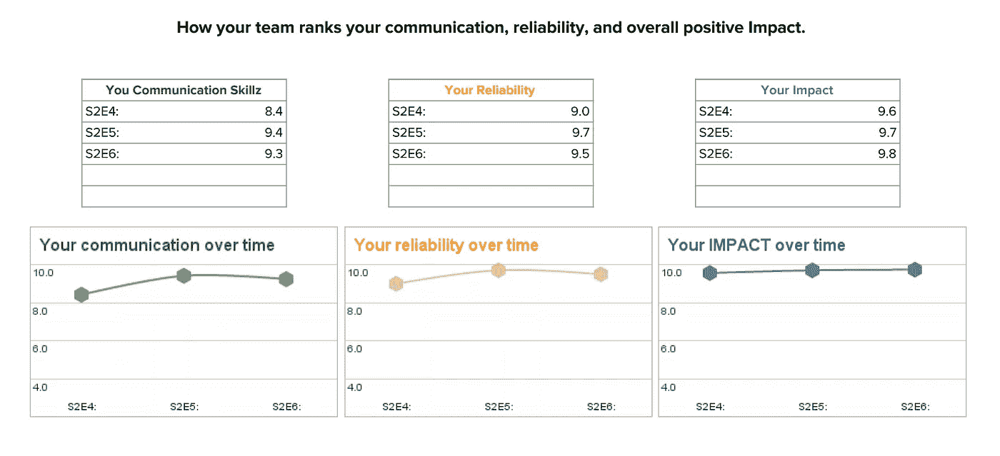
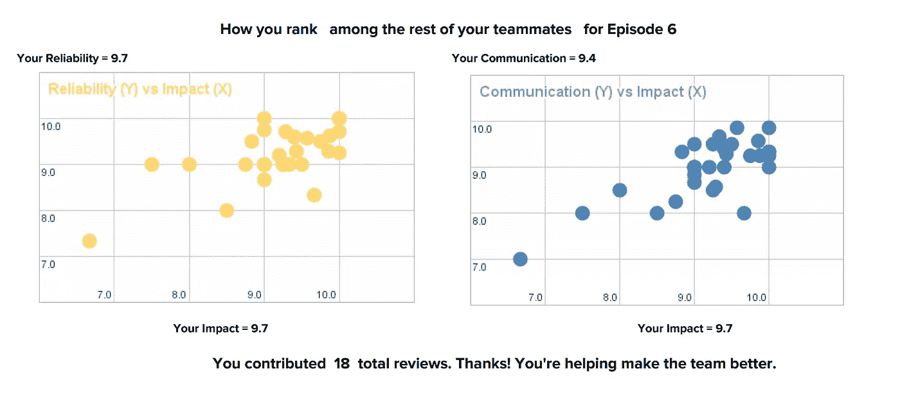
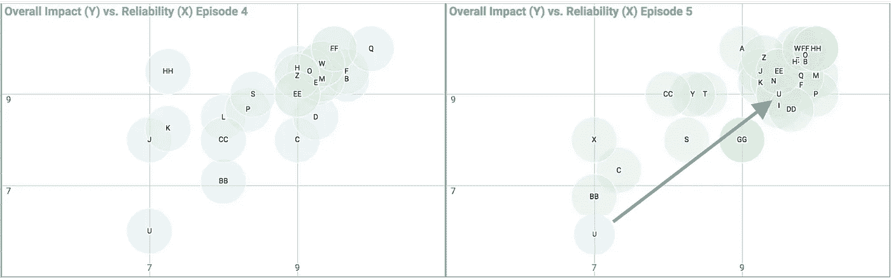

# 我们建立了一个职业发展框架

> 原文：<https://medium.com/swlh/how-we-crafted-a-career-development-framework-f4e4ceefd904>

## 对于创业领导者:我们建立了一个职业发展系统来留住顶尖人才并壮大我们的团队。以下是方法。

# 问题是

早些时候，扎克·霍姆奎斯特和我意识到我们在天河城工作的难得机会。这是一个小的创业公司，通过定义一个行业产生了巨大的影响。我们希望 Teem 成为团队中每个人职业发展的跳板。问题是我们是一个“扁平”的组织，没有职称晋升(jr、mid、senior 等。).这导致了一个问题:我们的工程师无法在简历中展示职业发展。将 Teem 作为职业发展的跳板是一个很好的想法——但我们限制了这一点，因为我们的团队无法在他们的职业生涯中表现出上升趋势。这也让我们很难明确每个人应该把重点放在哪里，以提高他们的影响力，增加他们的经验，并发展他们的职业生涯。

# 期望成果

目标:创建一个系统来帮助我们:

1.  明确地向个人展示他们需要在哪些方面努力来改善自己的职业生涯
2.  帮助每个人阐明并展示职业发展
3.  允许领导跟踪个人的长期进步(从年度评估中消除近期偏见)
4.  将个人与集体进行比较，以确定指导机会并减少团队流失

我以前说过，现在再说一遍。不是每个人都能承受创业公司带给你的快速失败和重生。这个项目很紧张——它是在我们的日常职责之外完成的，因为我们没有足够的人手，但我们知道团队需要它。

> *这个框架旨在帮助我们的队友加快他们的个人职业发展。*

# 从团队价值观开始

我们通过创造我们希望我们的团队体现的价值观来开始这个项目。我们写了一份文件，解释了它们是什么，它们意味着什么，以及我们期望彼此如何将它们付诸实践。我们希望这些价值观能够塑造我们的文化。

1.  最大化积极影响
2.  过度沟通
3.  做一个好朋友

这是我们强制阅读的文件:

> [https://docs . Google . com/document/d/1 bbapq 5g 6 kevkkpij 90 IC 8 jzhsw _ nabtztjt 0 ioo 5 iiq/edit？usp =分享](https://docs.google.com/document/d/1BbApQ5G6kEvKkPij90IC8JZhsw_NABtZTJT0IoO5IIQ/edit?usp=sharing)

# 职业发展框架

职业发展框架是一个工具，你可以用它来衡量你的工作表现，以及你需要改进的地方。理想情况下，它概述了公司和你的团队对你的期望，然后根据这些期望来衡量你，这样你就有了明确的行动。为了创建它，我们从其他公司借鉴了大量的知识，并将其塑造成我们认为适合我们独特团队的东西。这需要大量的研究、思考和重写。

对于完整的 20 页框架文档:

> [https://docs.google.com/document/d/1-jqtmbskrirsqtbx 8 kysdmwpqdj-WAFlbSaUtjBFQU/edit？usp =共享](https://docs.google.com/document/d/1--jQTMBSkrIRSqTBX8KYsDmWpQdJ-WAFlbSaUtjBFQU/edit?usp=sharing)

# 框架的主要组成部分

## 职业发展不是被动的

与大公司的员工相比，初创公司在给定的时间范围内将为员工提供 3 到 5 倍的体验。例如，8 个月前，我们聘请[系列职位效应](https://medium.com/u/e5c8912fa949#Recency_effect)的影响。频繁的反馈有助于你持续改进，而不是每年的课程修正。

在写出框架后，我们通过同行评审和向每位员工发送详细报告来将其付诸实践。

# 个人报告

每隔 6 周，我们收集同行评论，并向个人提供个性化报告。这很耗时，但这是我们为工程团队做的最有价值的事情之一。

## 我们首先让他们知道我们关心他们

我们以真诚、个性化的信息开始了这篇报道。嗯……这是我写的一条个人信息，然后自动填入每个人的名字——所以从技术上讲，他们都收到了相同的信息。但我是真诚的，我们需要从信任和关心的地方开始每次评估，以减轻情绪并帮助我们的团队客观地评估他们的表现。成功了。

## 技能进步

在回顾中，我们将一个数值与每一个连续的步骤联系在一起(参见上面的进展)。当你评价某人的技能进步时，你会看到一个数字，然后是该步骤的期望值。这些值与斐波那契数列相关联，以证明难度随着你的进步而非线性增加。

## 沟通、可靠性和总体影响

接下来，这些评论让人们就他们的沟通、可靠性和总体积极影响进行相互评价。我们花了大量的研究和迭代来理解这三个度量对我们的团队来说是最重要的。随着时间的推移，我们发现我们可以将大部分性能指标整合到这三个指标中。

## 匿名比较

下一部分帮助每个人了解他们与部门其他人相比的情况。这很重要，因为人们倾向于让自己的思想走向极端。他们要么认为自己比别人好，要么认为自己比别人差得多。这有助于在不侵犯隐私的情况下纠正错误。

## 评论

同行评审也有分数的评论/理由。我们提供这些评论，未经过滤，但匿名的个人，所以他们可以了解情绪和审查具体的改进意见。评论也不是自我引导的，我们要求评论者回答关于员工的具体问题，以最大化评论的价值。

# 比较队友

我坚信领导力是为你所领导的人服务的。因此，我们使用这些数据来识别团队中需要我们关注和帮助的人。

如果你注意到，人物`U`在第 4 集(如下)中收到了最低的同行评论。我们确保他们知道他们可以做些什么来改进，在接下来的 6 周周期结束时，他们已经加入了团队的其他成员，并被他们的同事视为增加了团队的价值。对我们来说，这是一个巨大的胜利。

# 结论

人很重要。这需要付出很多努力，但提高了整个团队的士气，保持团队的积极性，并帮助我们公开讨论个人贡献。

> -达尔
> 
> 我们在 2015 年第四季度就这样做了

**感谢阅读！如果你觉得我的漫谈很有帮助，那就继续说吧👏这样别人就能找到了。**

## 这篇文章发表在 [The Startup](https://medium.com/swlh) 上，这是 Medium 最大的创业刊物，拥有+388，456 人关注。

## 在此订阅接收[我们的头条新闻](http://growthsupply.com/the-startup-newsletter/)。

