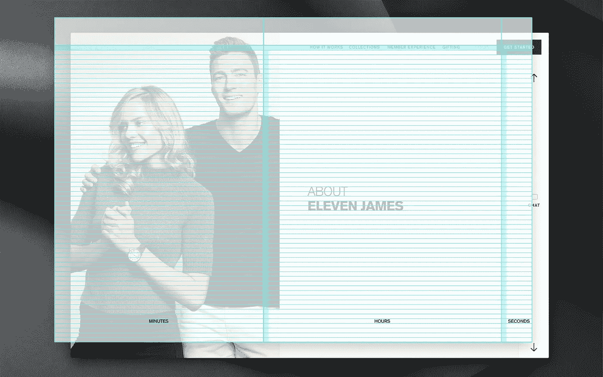
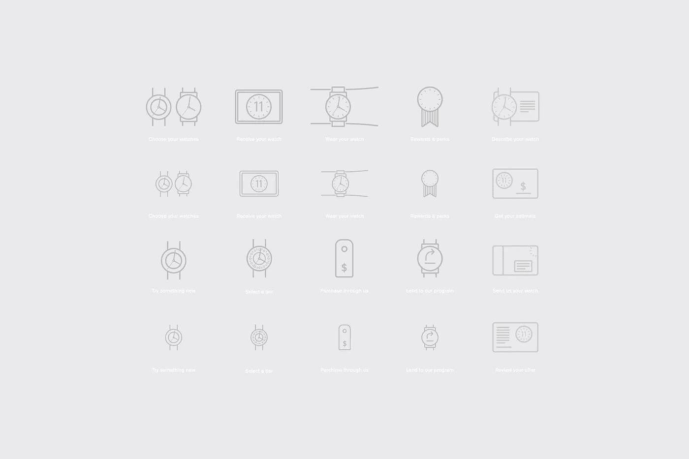

# 我们如何为 Eleven James 设计共享经济和奢侈钟表的交集

> 原文：<https://medium.com/swlh/how-we-designed-the-intersection-of-the-sharing-economy-and-luxury-timepieces-for-eleven-james-5d89e1d40a9b>

Eleven James 通过创建订阅服务，为会员提供一系列顶级手表品牌，重新定义了奢侈计时手表的世界。

## 可及的奢侈品

Eleven James 将奢侈品与共享经济结合起来，为其成员提供以较低的月费获得大量高端钟表的机会。

他们不必花上几千或几万美元反复佩戴劳力士或宇舶表。取而代之的是，只需花费一小部分费用，每三个月就会有一款新手表出现在邮件中，创造了一种符合季节和最新流行趋势的动态风格。

## 简介:以热情的态度提供优质服务

11 名詹姆斯接触降雨，以刷新他们的在线体验，为他们的年轻专业观众创造更大的吸引力。我们与他们的团队密切合作，开发了一种大胆而熟悉的视觉语言，打破了其他奢侈品牌通常的冷漠态度。

一前一后，一种创新的互动模式像秒针的滴答声一样对信息进行排序，推动了 Eleven James 的品牌故事向前发展，并使会员转化和产品选择变得轻而易举。

## 一种友好、熟悉的基调，带有现代、时尚的美感

11 詹姆斯是关于可及的奢侈品，所以我们从采访潜在顾客开始，询问是什么驱使他们去或离开特定的奢侈品牌。

我们发现，创造理想的虚构世界的传统方法会引起翻白眼和茫然的凝视。相反，观众想要的信息是包容的、实事求是的，他们认为，无论是哪种类型的钟表，都应该佩戴在身上，适合他们的监护人的日常生活。

这些对话提供了清晰的行进路线:我们抛弃了阴郁的黑色背景，转而使用更干净、更受欢迎的白色调色板，用蓝色作为强调，并选择不使用较大的字体。

## 钟表有足够的装饰，我们觉得字体不应该。

通过植根于国际风格的结构，设计参考了瑞士钟表工艺的传统。

我们选择使用各种权重的 Univers 和 Akzidenz-Grotesque 来增强可读性，并使用干净的数学网格来构建各个布局，通过统一的结构客观地简化了页面内容的呈现。

## 与时间流逝有关的网格系统

正如时间被划分，我们为 11 个詹姆斯使用的网格系统也被划分。单列是宽度的最小单位，被称为“秒”，它们可以组合起来创建一个更大的块，我们称之为“分钟”剩下的页面宽度，甚至更大，是一个“小时”这种灵活的布局系统保持了每个页面的一致性，同时允许在呈现信息时有所变化。

## 自定义图标传递信息一目了然

正如时间被划分，我们为 11 个詹姆斯使用的网格系统也被划分。单列是宽度的最小单位，被称为“秒”，它们可以组合起来创建一个更大的块，我们称之为“分钟”剩下的页面宽度，甚至更大，是一个“小时”这种灵活的布局系统保持了每个页面的一致性，同时允许在呈现信息时有所变化。

## 与时间流逝有关的网格系统

作为 Eleven James 更加现代的美学和简单有效地传达概念的愿望的一部分，创造了一系列图标来解释手表设计的变化，以及更大的概念，包括钟表选择、保养和运输。

## 一个有个性的、信息丰富的用户体验

租赁手表的想法似乎很简单，但在采访潜在客户后，我们发现只有那些对奢侈手表品牌相当了解的人才能轻松选择手表。

对于那些初来乍到的人来说，寻找合适的手表包括两个决定:他们每月花多少钱比较舒服，以及他们是喜欢现代、经典还是奢华的款式。

另一个挑战是需要就成员的分层方法进行沟通。钟表根据其价值被分为多个等级。每层包括三个选项，每个选项都有独特的月价格。

我们的解决方案是展示每一层的代表性时计，以及相关的最低月价格。

更详细的定价解释留给了那些选择探索可用时间段及其每月费用的访问者。

## 从 Eleven James 的系列中寻找合适的款式

对于我们焦点小组中的许多人来说，以每月低廉的价格购买奢侈手表感觉太好了，简直不像是真的。

我们的回应是通过传达 Eleven James 对收藏和护理独特时计的热情来建立消费者的信任。然后，我们解释了 Eleven James 如何通过将个人与他们从未想过会佩戴的手表配对来分享这种激情。

为了在体验中证明这一点，随着用户的互动，大量手表的选择范围缩小了，隐喻性地对每个游客的选择过程进行了个性化。

## 手表从选择到到达的旅程

Eleven James 会员体验的一部分是礼宾服务，一部分是高级物流，在将钟表送到会员的前门之前，会对其进行检查、清洗，并根据会员的手腕尺寸进行调整。对于仍然怀疑该公司使命的访问者来说，这个页面通过大胆的视觉效果和清晰简洁的动作设计解释了这个过程的每一步。

## 会员等级

虽然会员等级听起来很复杂，但我们努力通过使浏览过程简单明了来传达不同的等级作为丰富的选择。

访问者可以通过简单的滚动浏览每一层，或者使用选项卡式浏览方式快速导航到特定层。

## 热烈的欢迎和友好的问候

主页需要将 Eleven James 的语调设定为一个容易接近的奢侈手表供应商，同时也要清楚地解释他们的计划。

一个浅黑色的字幕缓解了从传统奢华到现代感性的心理过渡，因为它过渡到稀疏而结构化的白色页面上呈现的进一步信息。

## 赠送会员资格

Eleven James 会员的礼物不仅仅是每季度一只新鲜的奢华腕表。会员资格是获得庞大时计资料库和独家活动的礼物。

大号字体传达了最重要的信息，而美丽的图像提供了诱惑和教育。

## 把你的手表借给生态系统

会员的另一个选择是向 Eleven James collection 出借个人腕表。

这使得其他人可以体验高质量的钟表，否则这些钟表可能会被搁置在货架上，同时为原所有者每月创造收入。

## 便携式收藏

新注册的一个关键工具是口口相传，所以我们让会员在社交时向朋友炫耀变得很容易。

整个 Eleven James 体验都是响应式的，这意味着无论何时何地，浏览系列、注册和挑选腕表都很容易。

## 体现品牌价值并简化参与的网站。

this 与 Eleven James 的合作让这个项目得以继续。持续的设计评审和快速的反馈循环确保了稳定的进度，并允许快速部署进行测试。

迭代设计策略帮助我们从真实客户那里学习，创造一种吸引新客户并保持现有客户参与的体验。

# Eleven James 的网站简洁朴素，旨在向他们收藏的钟表设计致敬。

## 创造性影响

这种倾向于发现独特钟表而不是美化网站本身的方式自然会留住客户，并鼓励访问者注册。

在[Rainfall.co](https://work.rainfall.co/eleven-james-website)查看完整的 Eleven James 案例研究

马克创立了[降雨](https://rainfall.co/)，这是一个位于西雅图和纽约的品牌体验设计工作室，专门从事图形、应用程序和网站设计。我们总是渴望新客户。你也可以[在 Instagram](https://www.instagram.com/rainfalldotco/) 上关注 can 的作品。或者[直接伸手](https://twitter.com/marcbanderson)讨论产品设计和品牌。

## 这篇文章发表在 [The Startup](https://medium.com/swlh) 上，这是 Medium 最大的创业刊物，有+383，719 人关注。

## 在这里订阅接收[我们的头条新闻](http://growthsupply.com/the-startup-newsletter/)。

