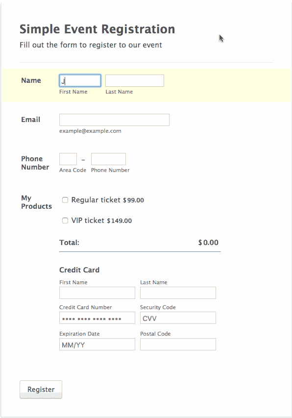

# 我们如何通过新设计将支付形式的转换率提高一倍

> 原文：<https://medium.com/swlh/how-we-doubled-payment-form-conversion-rates-with-our-new-design-cfb5a9f4ff5e>

Originally published on [**JOTFORM.COM**](http://jotform.com)

你认识喜欢填写在线表格的人吗？

我想是的。我也没有。

你还记得有一次填表让你觉得想踢东西吗？一次你变得如此愤怒以至于放弃了？

我也是。

让我们面对现实吧:即使在最好的情况下，填写在线表格也会有点枯燥。在最坏的情况下，这可能是复杂、耗时和令人困惑的。

我们需要在线表格，所以答案不是取消它们。但是我们能改变填写它们的体验吗？在 [JotForm](https://www.jotform.com/) 这里，我们认为是的。

事实上，我们的任务是创建尽可能无缝、无压力的用户体验。

我想分享一下我们是如何通过新的设计将支付形式的转化率提高一倍的。

# 付款表格

JotForm 上最流行的表单之一是支付处理，原因很明显。在我们表格的帮助下，用户仅在 2017 年就通过 PayPal、Square、Stripe、Authorize.net 和许多其他[支付网关](https://stories.jotform.com/r/?url=https%3A%2F%2Fapps.jotform.com%2Fcategory%2Fpayment_processing)收款超过 3 亿美元。

JotForm supports over 25 payment methods.

为了成功处理付款，用户需要能够无障碍地浏览表单。

分心、错误或任何激怒用户的事情都可能导致表单被放弃，从而失去销售。

棘手的是，表单可以长得非常快。我们知道，当面对长表格时，许多人干脆放弃。

这就是为什么我们决定通过创建 [JotForm 卡](https://www.jotform.com/cards/)来重新发明表单填写:简单、友好、直观。

当我们测量 JotForm 卡用户填写表单所需的时间时，我们发现与传统表单相比，时间大大减少了。

快捷简单的形式带来更高的转化率。

## 方法如下:

# 1.每页一个问题的布局

我们的经典表单——尽管仍然有用——在一页上显示所有的问题，加上付款部分。这很快会让用户不知所措。

JotForm classic with all questions on a single screen.

因此，我们决定将这个复杂的过程分成多个小部分。卡片表单的布局是每页一个问题。

除了问题，页面上没有显示任何内容(除了下一个和上一个命令)。这就是用户需要关注的全部。

填写完表单后，焦点会平稳地转移到付款表单上。不要瞎忙。

# 2.更少的错误

挡在用户面前的每一个障碍都会降低他们完成表单的可能性。这包括由打字错误或意外行为引起的挫折。

所以我们已经把减少这些作为首要任务。

正如你在下面的动画中看到的，卡片表格可以识别用户的错误。

它会自动恢复输入错误域名的用户的电子邮件地址，例如**john@gnail.com**应该是**john@gmail.com**。

此外，当出现错误时，该设计还会用一个震动的微型动画来警告用户。不再拖延。

# 3.所需信息更少

必需的信息是必需的。

但是，在仔细研究了我们的旧表格后，我们意识到它们使被调查者很难填写表格，更不用说成功付款了。

Our old forms with too many details.

他们只是要求太多的细节。

我们考虑过了。

JotForm Cards 只要求最少的信息，所有内容都以易于理解的块显示。

JotForm Cards only asks for what is required.

通过消除不必要的干扰，我们允许用户完全专注于手头的任务。

# 轮到你了

我们制作卡片是为了让填写表格变得更加有趣、快捷和简单。这增加了成功提交的可能性，从而带来更多的收入——以及更多快乐的用户。

每个人都赢了。就像我们喜欢的那样。

但是不要相信我的话。[证据在布丁里](https://www.jotform.com/cards/)。

*原载于*[*www.jotform.com*](https://www.jotform.com/blog/381-How-we-doubled-payment-form-conversion-rates-with-our-new-design)*。*

感谢阅读。

> 如果你喜欢这篇文章，请随意点击那个按钮👏帮助其他人找到它。

.