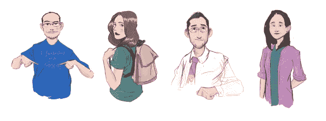
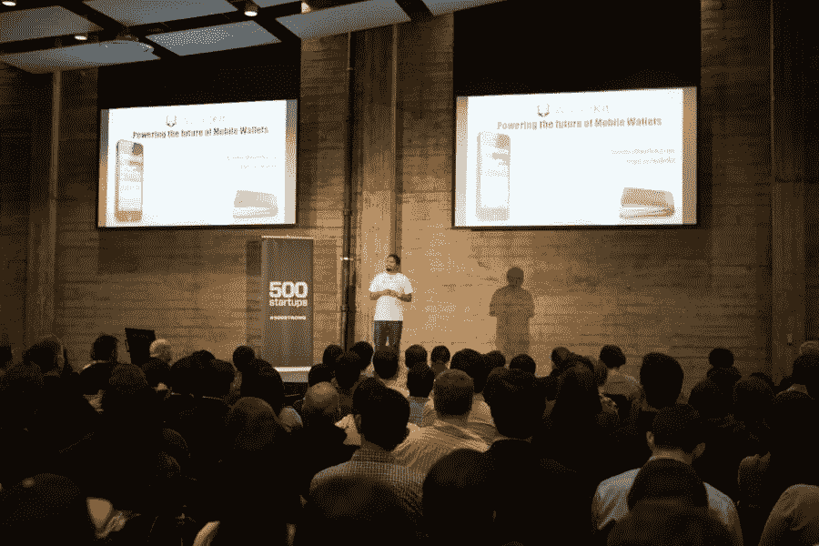

# 我们是如何得到 500 家创业公司的资助的。

> 原文：<https://medium.com/swlh/how-we-got-funded-by-500-startups-de2c86d2fce1>

在 500 家初创公司有申请流程之前，要让它们注意到自己是比较困难的。在没有申请程序的 2012 年，你需要得到 500 人网络内的人(公司创始人或导师)的推荐。他们现在有一个[申请流程](https://angel.co/500startups)。我的联合创始人[拉玛康特·糟糕小叮当](https://medium.com/u/9ec4c2fad411?source=post_page-----de2c86d2fce1--------------------------------)和我都是来自印度的 23 岁大学毕业生，他们创办了 [Walletkit](http://www.walletkit.com) 并且不认识任何来自 500 网络的人。但我们就是这样挤进去的。

2012 年 8 月 24 日，我在孟买机场看到[保罗·辛格](https://twitter.com/paulsingh)发的一条推文。他随后的推文透露，他将在几个印度城市会见企业家，会见他需要推荐。我给他发了封冰冷的电子邮件，而不是寻找一个关于我们团队和产品的介绍，并问我们是否可以在离我们的城市钦奈更近的班加罗尔见面。给收到很多邮件的人发邮件的时候我用了一个小技巧。我几乎在他们发微博或分享的同时检查他们的 facebook 和 twitter 个人资料的更新和邮件(使用 Tweetdeck 通知更新)。他回答说询问我们的产品，但随后就没声音了。在接下来的几天里，我通过电子邮件进行了跟进，但没有任何回应。后来，他的推文透露，他在孟买和德里会见了许多企业家。

他的推文透露，他于 8 月 28 日晚抵达班加罗尔。8 月 29 日早上 7 点 50 分左右，保罗在推特上发布了一张来自高层建筑的照片。我想在一天的这个时候应该是一家酒店。我们缩小了推文的位置，发现附近只有几家不错的酒店。我们最后猜测它必须是皇家兰花酒店。

我们必须做一些令人印象深刻的事情，当他在我们的地盘时，我们不能放弃和他见面的机会！。我们决定为 500 家创业公司的每一位合伙人定制印刷小册子，其中包含我们的宣传资料。我浏览了所有 500 名合伙人的脸书和推特资料，尽我所能解读他们最喜欢的照片姿势、颜色、服装风格等。然后，我们把这些合伙人的信息告诉了安德鲁，他是一个画漫画的朋友。这些成为了这本书的封面，我们还得到了由我们的设计师艾萨克设计的宣传手册，并得到了每幅漫画的海报。

我们在晚上完成了所有这些书和海报。我们从他的推特上注意到，保罗在每个城市最多呆 48 小时，所以我们必须抓紧时间。去班加罗尔最快最便宜的方法是坐公共汽车。所以我们在去班加罗尔的巴士上睡了 8 个小时。那天晚上，我注意到印度微软加速器首席执行官[穆昆德·莫汉](https://twitter.com/mukund)发布的一张 [Instagram 照片](http://instagram.com/p/O6eVN9GiyK/)，照片上的人是保罗。幸运的是，第二天我们和 Mukund 见了面。当我们和他见面时，他确认了保罗住的酒店确实是皇家兰花酒店，但是保罗很快就要离开这个城市了。所以我们跳上一辆出租车去了酒店，在路上发推特给保罗说我们在酒店附近，很想见见他。(还是没有回应)

我们满怀期待地在上午 11 点到达酒店大堂。我们决定给保罗的电话打个电话(我从他的电子邮件签名和 Mukund 那里得到了他的号码)。没有回答。所以我们留了语音邮件，说我们在酒店大厅等着，很想见见他。又一个小时过去了。我走到接待处询问保罗是否已经退房。我还没来得及问，你瞧——保罗·辛格从电梯里出来了。我在附近徘徊，等着他退房。然后我立刻打断了他的话，并做了自我介绍。见到他我太激动了！我没有伸出手和他握手，而是立即把我们的宣传手册塞到他手里。起初，这似乎是一个可怕的想法。保罗看了一眼第一本书，看到上面有他自己的漫画，立刻吓坏了，问道:“你们他妈的是谁，想干什么？？?"我以为我搞砸了。但我让谈话继续下去，解释我们如何找到他，并开始在大厅里推销他。不幸的是，谈话被打断了，因为他得赶去开会。保罗问我们是否可以等到下午 2 点，并说他很乐意在去机场之前和我们谈谈。我们答应了，因为我们大老远来就是为了见他。

我们一直等到下午 3 点，保罗给我们发了一条推特，因为他遇到了交通堵塞，回到酒店后可能不得不赶往机场。从他的推文以及他独自退房离开酒店时，我们非常确定保罗是独自旅行。所以我们决定问保罗，我们是否可以把他放在驾驶室里，因为那里应该有我们两个人的空间，并在我的笔记本电脑上准备好了一切。最终，保罗回来了，为迟到道歉，并保证他一回到美国就会给我们打电话。我说"保罗，如果我们没有再吓到你，我们能和你一起坐出租车去机场吗？"他说“是”。我们上了出租车，在去机场的路上把他甩了。听完我们的介绍后，Paul 开始向我们推荐 500 家初创公司，以及他们如何帮助我们！我们告别了，三周后，我们收到了 Paul 的电子邮件，邀请我们加入 2012 年秋季加速器计划！

我们有机会成为 Batch 5 500startups Accelerator 计划的一部分，与来自世界各地的一些最优秀的企业家和导师一起工作。

Pitching during Demo Day at Twitter San Francisco Office

我们挤进 500 强的最大收获是什么？如果你坚持不懈，你总会找到得到你想要的东西的方法——只要你永不放弃。我们很高兴我们没有。使劲挤！

> ***有时候你必须不择手段去赢得胜利，去得到你想要的，去得到别人的注意，去得到你真正应得的！***

吉米·罗恩说得好，“当你知道你想要什么，并且非常想要的时候，你会找到得到它的方法”。

> 如果你真的想做一件事，你会找到办法的；如果你没有，你会找到一个借口。