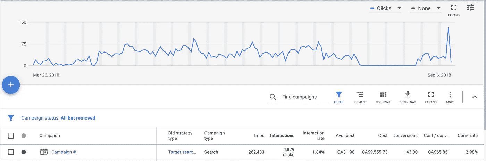
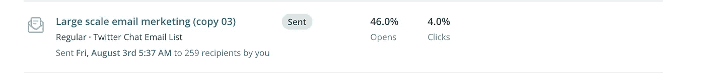
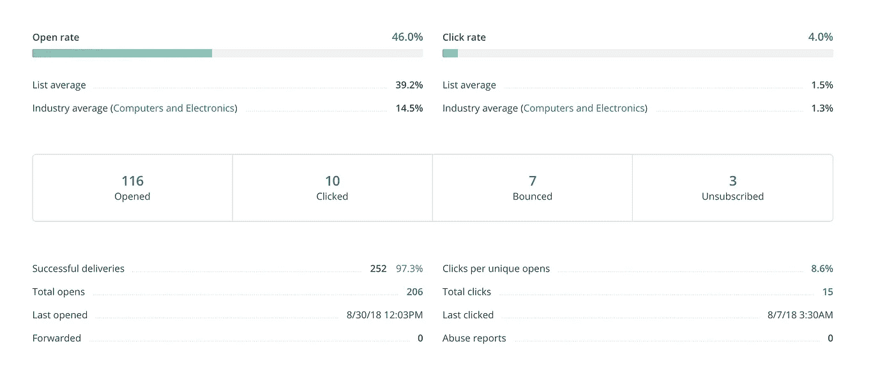
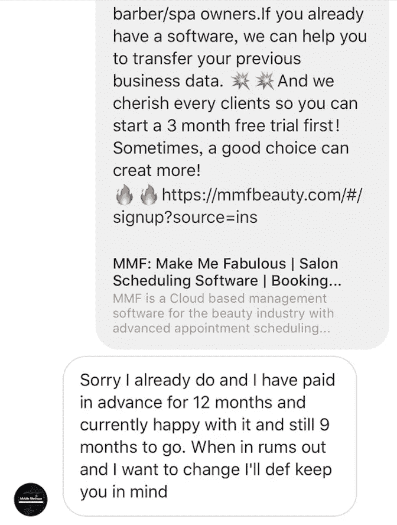
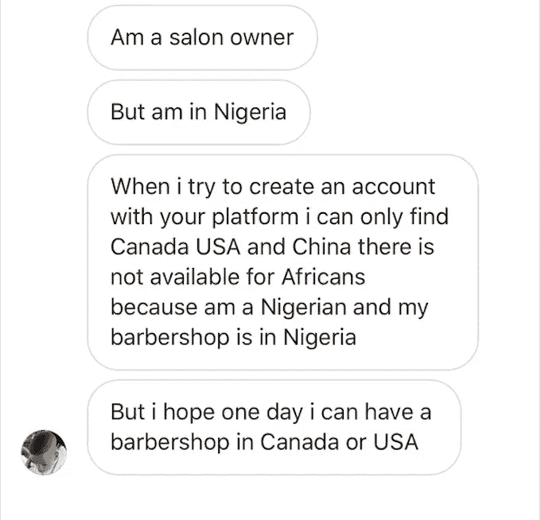

# 我们如何为我们的 Saas 软件获得第一批 300 个客户

> 原文：<https://medium.com/swlh/how-we-got-the-first-300-clients-for-our-saas-software-8c78cb5a620c>

我们的 [MMF](https://mmfbeauty.com/#/?source=blogging) 约会软件在 5 个月前推出，我们不知道如何开始营销和品牌意识的工作，因为我们不太了解北美的 Saas 软件市场，所以我们尝试了不同的渠道来推广该软件:Reddit、脸书集团、Pinterest、Twitter、冷邮件、Instagram、Google ads，其中一些有效，一些无效。我将在下面分别讨论它们，希望能给你们提供一些关于如何更好地做好 Saas 营销的见解。

# **在 MMF 工作**

在过去的四个月里，我们修改了代码，重建了整个系统。MMF 是一个基于云的预约软件，使小型企业，如沙龙，按摩水疗中心，更有效地安排服务预约。当市场已经被几家大公司占领时，开始推广软件是一项挑战，更具挑战性的是，我们不是市场上的本地公司，我们来自另一个国家，需要与本地公司竞争。一开始，我们有一些预热策略，如内容营销、付费广告、电子邮件营销。由于时间和资金有限，我们从每周 2 个商业博客、每周 80 美元的 Google AdWords 预算和每周两次的电子邮件营销开始了我们的旅程，总共向我们的潜在客户发送了 300 封商业电子邮件。在这段时间里，我们感到筋疲力尽，因为我们已经做了近 2 个月的营销，创建了许多不活跃的帐户，网站上没有很多点击。然后我们把我们的任务分成两类。

1.  维护现有客户端(非活动帐户)的任务
2.  吸引新客户/潜在客户的任务

当我们每次只专注于一种任务时，事情会变得更好，我们在几个软件评论网站上发布我们的软件:Capterra，Financesonline，SoftwareAdvice。一些社交媒体账户主要是 Instagram、Twitter 和 Pinterest 也是我们创建的，以便与市场上更多的潜在客户取得联系。

# **当前数字**

目前，我们每天有 5-10 人注册，大多数点击来自付费广告、电子邮件营销和 Instagram。尽管我们也在做内容营销，但大多数情况下，我们只是按照 Quora 的回答做，并转发给我们在 Twitter 上的粉丝，所以我们没有内容营销流量的准确数字，我们所能确定的是，这是我们的长期战略，并且正在发挥作用。我们希望在下面与您分享一些数据参数。

# **谷歌广告**

我们一直认为 Saas 软件很难推广，因为营销规模和目标客户规模都很小，所以我们从推出软件的那天就开始使用谷歌广告。显然，它在我们的谷歌广告分析方面有更好的表现。通常我们将每日预算设置为 80 美元，并获得 2%-8%的点击率，这是可以接受的。由于 4 个月的总花费为 8300 美元，我们得到了 3%的转化率，这意味着 100 人中有 3 人点击了广告。我们在不同的目标受众群体上尝试了多种关键词，结果显示只有与我们的软件直接相关的关键词才具有最好的表现。锁定合适的人群，可以让我们花更少的钱去追求更高的转化率，即使很多情况下它的人口规模更小。在使用 Google AdWords 几个月之后，我们实现了第一个 100 个客户的目标，并且我们还在继续前进。

# **电子邮件营销**

软件发布后，我们就开始了电子邮件营销，我们从沙龙和水疗网站上获得了大量的电子邮件地址。为了获得更多的点击率，我们测试了 HTML 和纯文本版本的电子邮件，HTML 的正文中有一张图片会增加我们网站的点击率。邮件的主题行也有一个小技巧，可以将我们的打开率提高到 50%以上，例如，我们多次使用主题行“来自 MMF 的邀请”,它永远不会过时。这里的秘密是利用客户的好奇心，尽量让邮件更私人化。我们发出的电子邮件通常有 4%-6%的点击率，并为我们带来一些新的软件注册，这是非常好的和意想不到的，因为我们的目标是与我们的潜在客户保持良好的关系，并提高品牌知名度，所以下次如果他们想转移到另一个软件，我们会记住。

# **Instagram 和内容营销**

Instagram 是一个很好的营销渠道，我们用它来接触新的沙龙和它们的主人，征求反馈，以及他们是否愿意加入我们。最后，事实证明我们在 Instagram 上注册的人不多，但我们确实收到了许多有用的反馈，这些反馈指出了一个重要的问题，我们的大多数潜在客户已经提前一年订阅了一个预约软件，所以很难要求他们改变。但令人惊讶的是，我们网站的 SEO 变得更好了，因为我们一直在 Instagram 上做内容营销和社交媒体，我们终于在谷歌搜索结果的第一页列出了我们的网站和一些关键词。每次我们花几分钟时间在 Buzzfeed、Flipboard、Medium 和 Pinterest 等平台上发布博客，以增加我们网站的反向链接，他们总是在创造更多流量和线索方面做得很好。我们不指望从博客和社交媒体上获得很多客户，因为我们有非常特殊的目标客户，即沙龙和按摩水疗馆。我们这样做主要是因为我们希望更多地暴露我们的软件，并提高我们的搜索引擎优化结果。

感谢你阅读这篇文章，希望你能从这篇文章中发现更多的价值，如果你喜欢它，请不要犹豫给我们一些掌声。

## 这篇文章发表在 [The Startup](https://medium.com/swlh) 上，这是 Medium 最大的创业刊物，有+366，567 人关注。

## 订阅接收[我们的头条](http://growthsupply.com/the-startup-newsletter/)。

