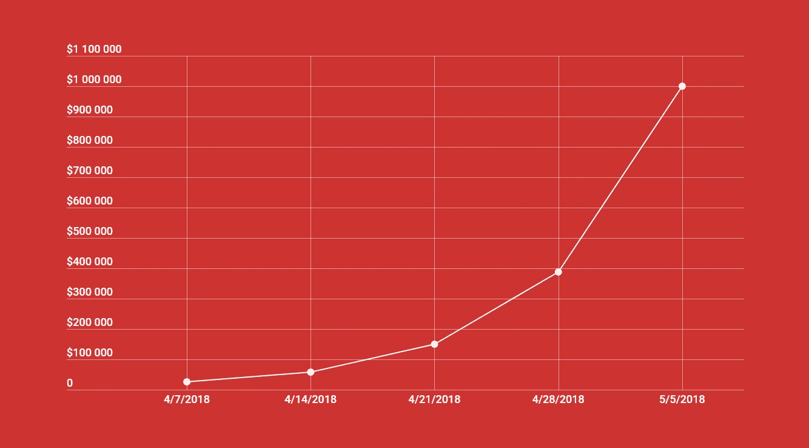

# 我们的加密应用如何在一个月内从管理 0 美元增长到 100 万美元

> 原文：<https://medium.com/swlh/how-we-grew-our-crypto-fund-to-1-000-000-in-1-month-flat-b6317cabf6bf>

一个月前，当我们发布 Shrimpy 时，我们没有想到这一时刻会来得这么快。我们实际上根本不知道它是否会来。我们只是希望有人能尝试一下这个应用程序。我们的团队不是一群拥有无限资源的摩根士丹利财富管理高管。我们是工程师，只是喜欢建造令人敬畏的东西。

> 谢谢你支持我们。Shrimpy 的每个人都很欣赏你！

当 Shrimpy 跨过 100 万美元时，是这个安静的星期六早晨 5 点。我知道这些不是因为我醒来时检查了我们的服务器日志。我还醒着。要做的事情太多了，睡不着。创业公司就像大学。你通宵熬夜完成工作。除了之后没有休息，只有更多的工作。

看着股票涨到 100 万美元对我来说很有趣。我发现它很有趣，因为它从来不像电影里演的那样。没有背景音乐来制造悬念。没有气球。我们的办公室上方没有升起带纸屑和呜呜祖拉的横幅。没有流浪乐队跳着华尔兹进门。甚至没有一句康加舞。只是默默沉思。

有些人会称这部分为幸福。然而，我不这么认为。这更像是开始。Shrimpy 才刚刚开始。我们想发布一个帖子，内容是很快达到 1000 万美元，然后再达到 1 亿美元。

> 现在不是结巴的时候。是时候前进了。

> 但是只有一百万美元。

不，这是第一个一百万。因为每一段旅程都始于足下。这是我们的步骤。一步可能看起来不多，两步也不多。然而，采取足够的步骤，你会发现自己在一个新的地方。

# 经验教训

虾肉不是我们的第一个想法。我们的第一个应用程序实际上是一个叫做 Crabby 的交易机器人。这是一个免费的应用程序，你可以通过链接不同的技术指标来构建策略。这很有趣，但把我们限制在一个小市场。

> 做出很多人想要的东西。即使他们不知道他们想要它。

这是我们的第一课。有些人想要一个先进的交易机器人。*有的*。不是很多，但也不一定有一点。只是不足以让风投们发出“哇”的一声。我们想要那个哇。

所以，我们迅速转向。从 Crabby 那里获得尽可能多的代码，我们在一个月内推出了 Shrimpy 的 MVP。

> 赶紧弄个 MVP 出来。

切到第二课。我们知道用户想要比复杂的交易机器人简单得多的东西，但我们不知道具体是什么。在这一点上，我们需要迅速做出决定，并采取有根据的猜测。这是我们赌上再平衡的时候。它离 HODL 很近，我们认为用户会觉得他们很开心，但他们有可能获得巨大的收益。

这就是我们支持[山姆·奥特曼](https://medium.com/u/22acd7905c72?source=post_page-----b6317cabf6bf--------------------------------)的地方。MVP 应该很快发布。事实上如此之快以至于你会怀疑。事情会出错，但你还是按了按钮。

> 不要胆怯。

最有价值球员出来了，开始上第三课。MVP 可能会发布，但没人会去看。人们不会只是偶然发现你的产品。

> **坦白地说，没人关心你的产品。你需要通过无情的营销让人们关心你。**

告诉大家产品的情况。这只有在你点击发送时才会发生。素材不需要完美，出货，迭代。

> 仔细听着。

一旦人们开始使用该产品，问题就不会消失。现在你需要倾听用户。我们有非常棒的用户，所以他们会告诉我们他们的想法。这使得我们能够以一种能够满足用户需求的方式来构建我们的路线图，并且将产品导向我们的最终愿景。我们不可能做到用户要求的所有事情，但是我们愿意考虑每一个建议。

# 下一步是什么？

实际上，有几件事。我们正在开发许多功能，几个更新和许多改进。这些变化将在未来几周内推出。与此同时，我们也将发展我们的愿景。

> Shrimpy 作为主要的加密投资平台。

一个既能吸引普通人，又能取悦超级用户的投资平台。这不是一项简单的任务。事实上，这是不可能的。不管机会有多大，我们有一支准备好的队伍。不管挑战有多大。

> 是时候拨款了。

Shrimpy 从一开始就被束缚住了。由来自脸书、亚马逊、NASA、三星和其他大公司的各类工程师组成的团队。办公室只是我们房子里的一间卧室，被重新用于工作。我想说的是我们白手起家。

> 你可以花很多钱来得到你想要的，也可以花很多时间。选择时间需要一丝不苟地掌握你的手艺和你所有的时间。

上个月，我花了很多时间来说服用户，让他们相信他们可以把钱交给我们。是时候让投资者相信我们可以把别人的钱托付给我们了。

# 你可以帮忙

即使你没有给我们开一张大额支票，我们仍然需要你的帮助。虾肉还没吃完。您可以通过与我们分享您迄今为止的想法来帮助定义加密货币投资的未来。

> 告诉我们 Shrimpy 可以做些什么来改善。

有很多人还没有发现 Shrimpy 应用程序。许多这些无望的 saps 仍在手工分配和平衡他们的投资组合。

> 让人们了解 Shrimpy 能提供什么。

也许你是天使投资人，或者认识有兴趣和我们合作的人。在这种情况下，不要犹豫[伸出](https://www.facebook.com/messages/t/ShrimpyApp)。有很多内容需要讨论。我们身边的人才越多，我们成功的机会就越大。

> 加入虾米革命。

最重要的是，记得享受使用 Shrimpy。我们不能忘记我们开始这样做的原因。我们*真的*喜欢建造令人敬畏的东西。

> 想和 Shrimpy 团队合作吗？我们实际上是在寻找愿意帮助我们建设加密投资未来的人！请发送电子邮件至 support (at) shrimpy.io。我们希望收到您的来信。

*虾队*

别忘了查看一下 [Shrimpy 网站](https://www.shrimpy.io/)，在 [Twitter](https://twitter.com/ShrimpyApp) 和[脸书](https://www.facebook.com/ShrimpyApp)上关注我们的更新，并在[Telegram](https://t.me/ShrimpyGroup)&[Discord](https://discord.gg/gXyy95y)上向我们令人惊叹的活跃社区提问。

留下你的评论，让我们知道你的平衡经验！

## 这个故事发表在 [The Startup](https://medium.com/swlh) 上，这是 Medium 最大的企业家出版物，拥有 322，555+人。

## 在这里订阅接收[我们的头条新闻](http://growthsupply.com/the-startup-newsletter/)。

