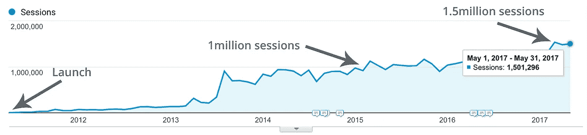
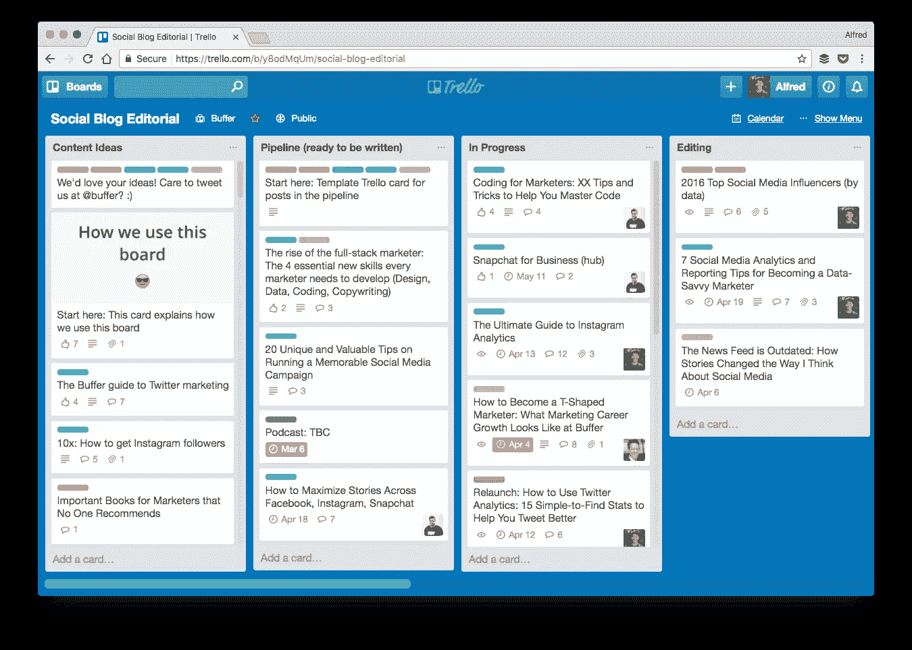
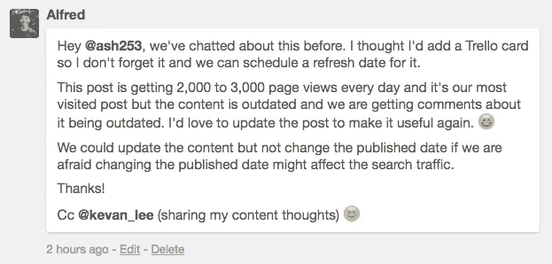
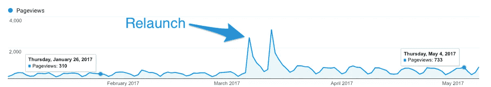

# 我们如何使我们的博客每月访问量超过 150 万次

> 原文：<https://medium.com/swlh/how-we-grow-our-blog-to-over-1-5-million-visits-per-month-8d0074d556a8>

六年来，我们发表了一千多篇博文，我们很荣幸每个月能收到超过 150 万的访问量。

在我们从零到每月超过 150 万次访问的旅程中，我们学到了很多，也喜欢我们博客增长背后的三步系统。

*(这是原博文的较短版本。如果你想阅读完整的博文，你可以在这里找到***。)**

**

# *1.观众*

## *了解我们的观众渴望什么内容*

*我们希望我们的内容能够反映客户的需求，以及组成 Buffer 营销团队的作家、编辑和战略家的观点和看法。*

*反过来，我们希望一些读者最终会成为缓冲客户。*

*在考虑写博客之前，了解你的读者想从你这里得到什么是有帮助的。否则，你就是在瞎猜，希望一切顺利。*

*在[我们的内容](https://blog.bufferapp.com/pivot)经过几次反复之后，并且通过[研究我们的博客文章数据](https://blog.bufferapp.com/content-audit)，我们发现我们的读者喜欢我们的长篇教育博客文章。*

*知道这一点有助于我们决定写什么类型的博客文章。**无论我们创建什么类型的帖子，我们的目标都是帮助营销人员和小企业在社交媒体上更加成功**。*

## *提出博客帖子的想法*

*每周持续创作高质量、有价值的内容是一项挑战。*

*以下是我们想出博文创意的各种方式:*

*   *关键词研究*
*   *业内流行的相关讨论*
*   *社交媒体新闻*
*   *过去的经验*
*   *直觉*

*通常，我们的内容想法来自于上述方法的结合。*

**

# *2.节奏*

## *找到合适的节奏来实现我们的目标*

*多年来，我们已经意识到编辑节奏的重要性，进入 2017 年，我们决定这是我们想要重点关注的事情。*

*经过一些试验后，我们意识到我们需要做以下事情:*

*   ***坚持发布:**我们曾尝试每周发布四到五次，但发现我们的标准在下降。我们发现每周两个新的博客帖子加上我们的播客节目笔记感觉是完美的内容量。*
*   ***提前计划:**通过在发布前四到六周计划我们的内容，我们有足够的时间研究和计划如何推广每一个新的内容。*

**

*提前计划并给我们自己更多的时间来编辑我们的内容，使我们能够对每一篇帖子采取最大的关注，以确保当我们点击“发布”时，质量符合我们的要求。*

*我建议根据你的内容目标和你所拥有的时间，尝试并找到一个合适的编辑节奏。没有一种正确的编辑节奏。HubSpot 一天发表几篇文章，而 [Backlinko](http://backlinko.com/blog) 一个月不到一次。*

## *简化我们的编辑沟通*

***1。将所有东西放在一个地方***

*交流有时会让人不知所措。为了应对这一点，我们在各自的博客帖子 Trello cards 中列出了所有关键的讨论。*

*这有两个目的:*

1.  ***单一参考点:**我们知道，我们可以在 Trello 卡上找到一个想法的所有关键信息，而不必查看 Slack 或试图记住我们五天前在视频电话中讨论的内容。*
2.  ***信息透明:**通过了解 Trello 的信息，我们可以让相关团队成员随时了解情况，即使他们错过了 Slack 或 Zoom 对话。*

**

***2。腾出时间面对面聊天***

*我们的博客编辑 Ashley Read 和我每周二开一次周会，在会上我们讨论所有与我们的博客相关的事情。*

*以下是我和 Ash 目前在内容同步时通常会做的事情:*

*   *查看最近的博客帖子表现*
*   *讨论现在正在研究的或未来几周计划的博客帖子想法*
*   *讨论有趣的社交媒体或营销新闻*
*   *分享我们最近读到的写得很好的博客帖子*
*   *集体讨论新的博客文章想法*

*这些定期召开的会议鼓励我们反思我们最近的工作，并思考如何改进。*

**

# *3.促进*

## *专注于内容推广，而不仅仅是创作*

*[社交触发](https://medium.com/u/8949b44941b2?source=post_page-----8d0074d556a8--------------------------------)[的德里克·哈尔彭](https://socialtriggers.com/80-20-blog-building/)喜欢花 80%的时间推广他的内容:*

> *更聪明的做法是再找一万个人来消费你已经创造的东西，而不是创造更多。*
> 
> **或者换句话说，20%的时间在创造内容。其余 80%的时间用来宣传你创造的东西。**

*我们远没有花费 80%的时间来推广我们的博客文章，但是这里有三种方法可以让我们与更多的人分享我们的内容。*

## *推广我们的内容*

***1。将博客文章重新用于社交媒体***

*我们将我们的博客文章转化为适合每个社交媒体平台的内容。例如，我们做了一些事情:*

*   *[我们的数字营销策略师 Brian G. Peters](https://medium.com/u/82aabc6b322f?source=post_page-----8d0074d556a8--------------------------------) 根据博客文章的要点创建 Instagram 故事，并邀请我们的关注者查看我们博客上的完整文章。*
*   *他还利用博客文章中的内容制作短视频，在推特和脸书上分享。*
*   *我在这里重新发布我们的博客文章，通常会有不同的标题和更短的内容。*

*我们发现[为每个平台](https://blog.bufferapp.com/how-to-craft-the-perfect-post-on-facebook-twitter-and-instagram)定制帖子，比如为脸书添加[视频，而不是简单地分享每个社交媒体平台](https://blog.bufferapp.com/facebook-video)的链接，这已经让我们的粉丝产生了更多的参与。*

*虽然这样做不一定会增加我们博客的流量，但我相信这有助于我们的追随者获得对我们创建的内容的信任。下一次，当他们在社交媒体营销上寻求帮助时，也许他们会首先想到缓冲博客。*

***2。关注长期流量(SEO)***

*我们通常的目标是为我们发布的每一个帖子产生长期的搜索流量。*

*我们在 [Instagram 算法](https://blog.bufferapp.com/instagram-algorithm)上的博文就是一个很好的例子。我们知道这是社交媒体营销人员的一个热门话题，人们正在谷歌上搜索“instagram 算法”(每月约 4000 次搜索)。*

*通过理解人们在谷歌上搜索这个主题的术语，并撰写一篇经过充分研究的高质量文章，这篇博客文章能够在谷歌的第一页上排名，并且自从我们发表以来，每天都有 600 到 800 次浏览。*

***3。重新发布旧帖子以增加流量***

*我们使用称为[内容重新发布](http://backlinko.com/content-relaunch)的过程来更新关于常青树主题的现有博客帖子，这些帖子已经过时。*

*这使我们的博客文章对我们的读者保持相关性和有用性，并通过搜索带来更多的流量。*

*例如，当我们在 2017 年 3 月更新[我们的社交媒体分析工具帖子](https://blog.bufferapp.com/social-media-analytics-tools)时，每日流量增加了一倍多，从大约 300 增加到 700 *:**

**

**The two spikes of traffic came from our RSS feed and email digest.**

**

# *想想虚荣指标和 150 万个谢谢*

*每月超过 150 万的访问量是很棒的，但你也可以说这是一个[的虚荣指标](https://techcrunch.com/2011/07/30/vanity-metrics/)。你可能是对的。*

*作为 Buffer 的内容制作者，我们从事销售软件的业务。我们对此不采取直接、强硬的方式，但我们的内容本质上是为了增加我们的影响力，建立我们的品牌，并反过来推动 Buffer 的注册和收入数字朝着正确的方向发展。*

*除了流量，我们还密切关注博客推荐的缓冲客户数量，以及这些客户每月产生的经常性收入数字。这些指标让我们从数量上更好地了解博客如何提供商业价值。*

*总的来说，我们对博客的进展很满意，我们希望这篇博文对你有用。如果您对我们的编辑流程有任何疑问，请随时提问。*

*最后，非常感谢您成为我们的读者之一。我们真的很感激🎉*

**本帖完整版由*[*Alfred Lua*](https://medium.com/u/bea1aee004a7?source=post_page-----8d0074d556a8--------------------------------)*撰写，于 2017 年 7 月 27 日首次发表在* [*Buffer 社交博客*](https://blog.bufferapp.com/buffer-blog-one-million) *上。**

*如果你喜欢这篇文章，你可能也会喜欢我们社交博客上关于社交媒体营销的文章:*

* [## 缓冲博客——社交媒体营销

### Buffer 的社交媒体营销博客涵盖了 Twitter 的最新社交媒体工具、分析和策略…

blog.bufferapp.com](https://blog.bufferapp.com/?utm_source=medium&utm_medium=posts)*