# 我们如何在应用商店推出排名第二的应用

> 原文：<https://medium.com/swlh/how-we-launched-the-2-app-on-the-app-store-53d06536b3f3>

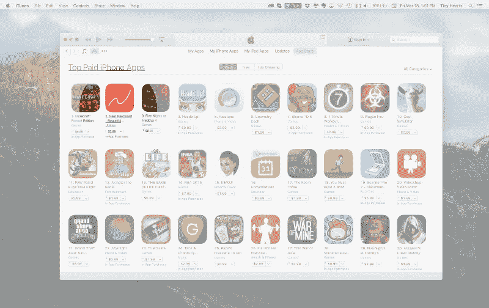

Next Keyboard reaches the #2 on the App Store

我们的应用 [Next Keyboard](http://nextkeyboard.co/) 在 App Store 付费应用排行榜上排名第二。

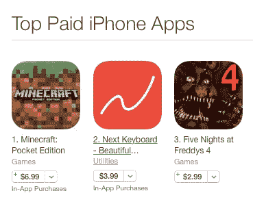

在发布之前，我们已经成为 Kickstarter 上[资金最多的应用，所以我们知道这个应用有很大的潜力，但即使这样也让我们大吃一惊。在推出的时候，我们是一个 10 人的小团队，我们击败了愤怒的小鸟、DropBox 和 Twitter 等应用。](/swlh/how-next-keyboard-became-the-most-funded-app-on-kickstarter-part-2-7c639a254752)

在我们深入研究这些策略之前，这里有一个总体公式:

*   创造一个吸引大众的伟大产品
*   在发布日进行一级发布报道
*   苹果发布日的特色
*   周四发布(这是苹果新功能发布的时间——这是[改变了](http://9to5mac.com/2016/03/03/app-store-refresh-schiller/)
*   与您现有的应用交叉推广(如果您有其他应用)

此外，您可以用以下两种促销策略来支持上述每一点:

*   做付费广告获取更多用户(脸书 app 安装)
*   联系有影响力的人分享你的应用

# 压

确保 Next Keyboard 的媒体报道是我们战略的关键部分。没有好的媒体，很难有大的发布。印刷机起着放大器的作用。下面是我们使用的电子邮件推介。我们的[宣传视频](https://www.youtube.com/watch?v=K4Bo6mbmngc&nohtml5=False)和[媒体新闻](/swlh/the-medium-com-hosted-press-kit-how-to-make-a-blogger-s-life-easier-10962dc3f04e)套件有助于保持电子邮件的简短。我们的目标始终是让 blogger 的生活更轻松——通过为他们做大量繁重的工作。

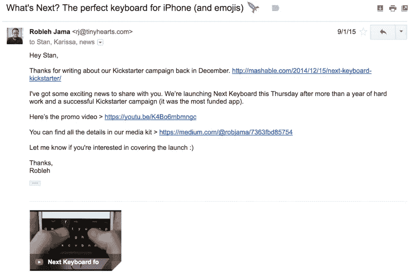

Pitch to Mashable that led to a post

Next Keyboard 在 [Techcrunch](http://techcrunch.com/2015/09/03/nexts-clever-new-ios-keyboard-has-almost-everything-you-want/) 、 [The Verge](http://www.theverge.com/2015/9/3/9252423/next-keyboard-app-iphone-ios8) 、 [Buzzfeed](http://www.buzzfeed.com/nicolenguyen/youre-just-my-type) 和 [Mashable](http://mashable.com/2015/09/05/5-cant-miss-app-simply-piano/#9iBqZDHP3iqV) 上获得了报道。

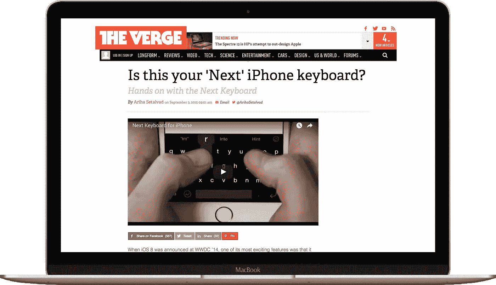

# App Store 功能

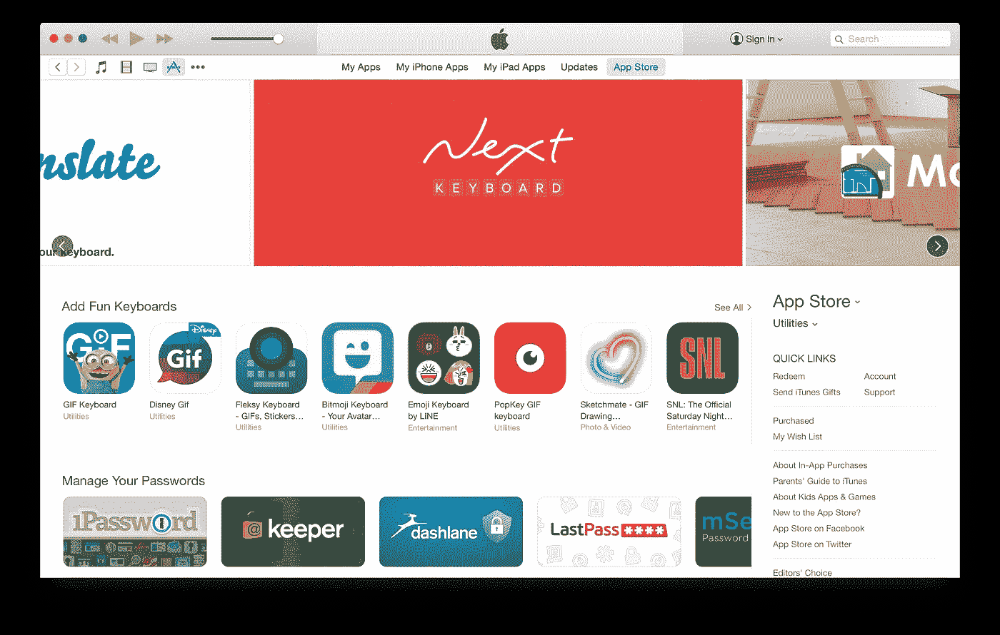

最有效的安装来源之一是苹果公司的特色。(据估计,[价值在 10 万美元到 30 万美元之间。)](https://stratechery.com/2013/promotion-app-store/)

根据我的经验，在 App Store 上获得特色有三个步骤:

1.  做出伟大的产品(咄)
2.  获得应用商店经理或编辑的关注
3.  让苹果内部的人注意到你的伟大产品，并与他们谈论你的发布

只需一款应用就能引起他们的注意。对我们来说，苹果拿起电话打给我们时，他们遇到了[威克](http://www.tinyhearts.com/wake/)。随后，苹果继续对我们下一步的产品保持好奇。我们的工作是让我们在苹果的联系人了解我们在做什么，他们偶尔会给我们联系机会。例如，我们的健身应用程序 [Quick Fit](http://www.tinyhearts.com/quickfit-7-minute-workout/) 出现在一个[苹果广告](https://www.fastcompany.com/3043401/how-my-app-ended-up-in-an-apple-ad-and-what-happened-next)中。Wake Alarm 被评为本周[应用。](http://blog.tinyhearts.com/th-blog/2015/10/23/wake-free-app-of-the-week)

Quick Fit featured in an Apple commercial

然而，重要的是要记住，与苹果的关系不是一个银弹。即使你和苹果公司有联系，你也可以保证从苹果公司得到一个外观，但这并不能保证一个功能——最近我们的另一个应用程序就发生了这种情况。

然而，Next Keyboard 很早就引起了苹果的兴趣，因为他们看到了 Mashable 对 Next 和 Kickstarter 活动的早期报道。我们告诉他们我们计划何时提交应用程序，并分享我们的产品路线图。

## *如何引起应用商店经理的注意*

显而易见的一步是通过苹果的包罗万象来接触应用商店经理。他们说你可以在这里给他们发电子邮件。但是，你可以想象，收件箱里有很多噪音。

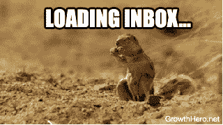

因此，联系应用商店经理需要更多的思考和同情，然后发送一封快速友好的电子邮件介绍你自己和你的应用。

如果你是一个应用商店经理，你可能会有相当多的资源来寻找有潜在功能价值的应用。你也可能被推销了很多。你也可以偶尔问问你的朋友和同事，看看他们喜欢哪些新应用。

因此，作为一名应用程序创建者，你需要确定正确的来源，并消除应用程序商店经理受到的所有干扰。

以下是一些消除噪音的方法:

1.  获得高质量的新闻报道([让博客生活更轻松](/swlh/the-medium-com-hosted-press-kit-how-to-make-a-blogger-s-life-easier-10962dc3f04e#.bgbpupvsu)
2.  了解您当地的应用社区，利用您的网络。找出谁可能在苹果公司有联系人。例如，如果他们在 App Store 上有多个应用程序，他们就有可能在苹果公司有联系人。

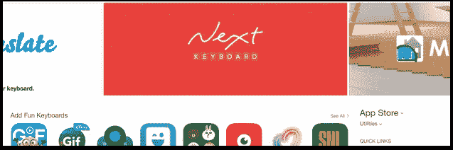

Next Keyboard featured on the front page of the App Store

# 交叉促销

应用程序世界中交叉推广的概念非常简单:从已经存在并拥有受众的应用程序链接到你的新应用程序。理想情况下，你可以在你的应用程序中完成这项工作。毕竟用你 app 的人已经信任你，喜欢你现有的 app 了。他们获得你的新应用的机会非常高。

我们测试了这种策略，用我们的两个付费应用程序来推广 Next 的推出，这两个应用程序是[快速健身](http://www.tinyhearts.com/quickfit-7-minute-workout/)和[唤醒](http://www.tinyhearts.com/wake/)。我们决定在有限的时间内免费提供这些付费应用程序，以增加我们的下载量，并向用户交叉推广 Next Keyboard。

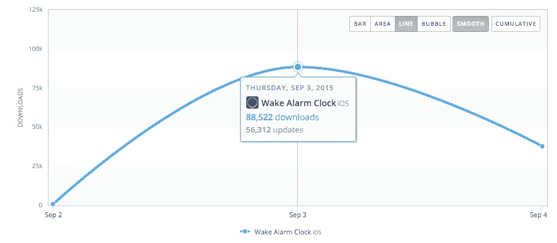

Wake Alarm free promo recieves 88k+ downloads in a single day

当我们过去免费提供这些应用程序时，我们看到了在第一天获得近 10 万次下载的能力。我们决定让快速适应和清醒几个星期。这些应用都已经有了几百万的下载量。任何已经使用 Quick Fit 或 Wake 的用户也会收到 Next Keyboard 的交叉推广广告。

促销信息本身非常简单明了。我们创建了一个覆盖鼓励用户下载下一个键盘。我们通过 MixPanel 的应用内通知工具集成并分发了覆盖图。(后来我们结束了自己的构建——对于我们有限的用例来说，MixPanel 太贵了。)

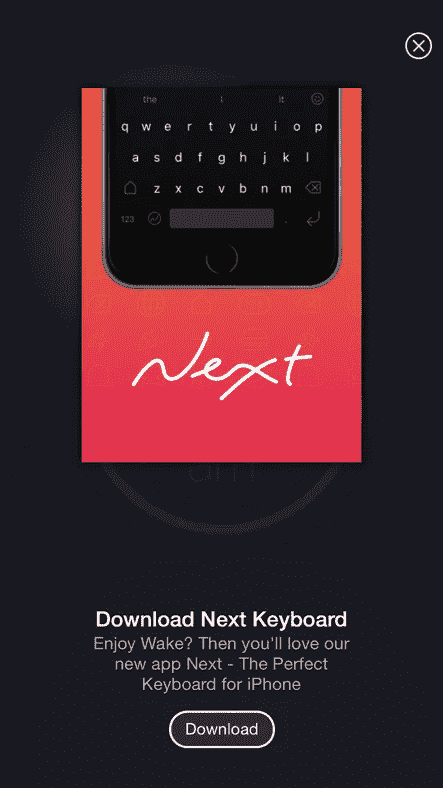

Next Keyboard cross promo in Wake Alarm

我们使用苹果的代销商工具来追踪这些转化。这个[附属工具](http://www.apple.com/ca/itunes/affiliates/)有一个不错的小好处——它实际上付给你一定比例的收入。本质上，你可以通过交叉推广获得报酬。如果你没有使用它，你应该使用它。

## *交叉推广最佳实践*

如果你还没有现有的免费或付费应用程序用于新的发布，你可以让*成为免费应用程序(如果有意义的话)。这个免费应用只有一个目的:交叉推广你的另一个应用。*

*显然，开发一个应用程序需要大量的工作。如果你是一个单独开发应用程序的人，你可以做一个稍微不同的版本免费发布。它将拥有一些与你即将推出的应用相同的功能，但功能更有限，约束更多。*

*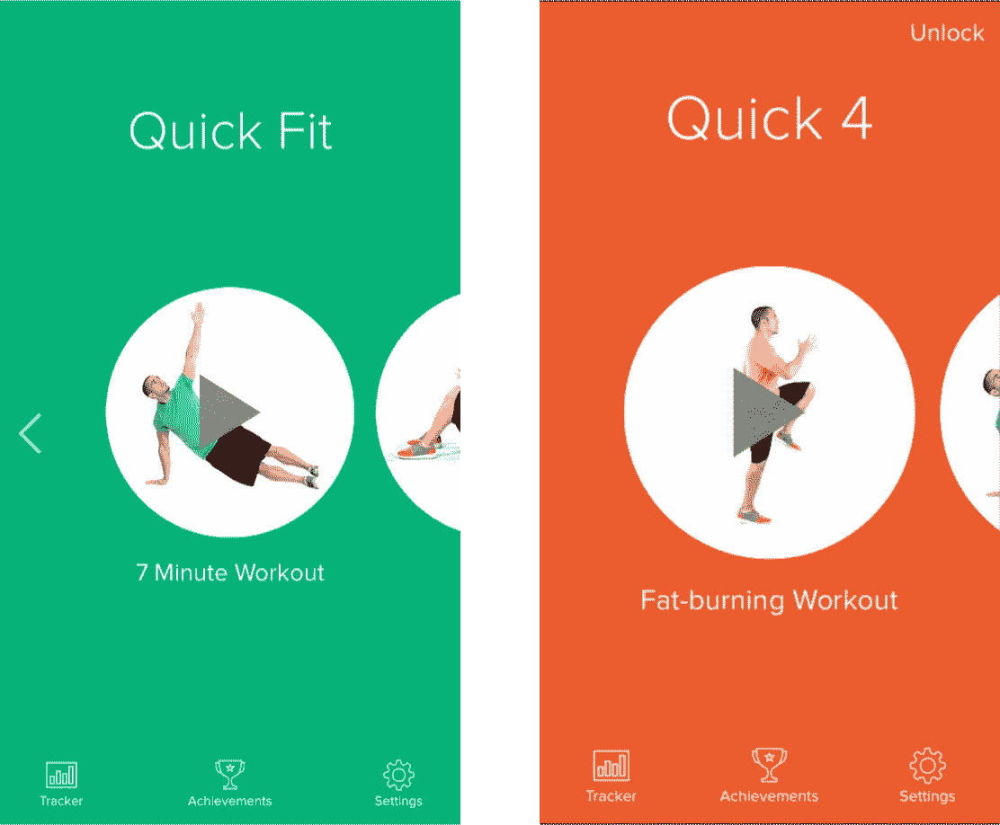*

*Quick 7 and its free companion Quick 4*

*我们的应用程序之一 Quick Fit 是一款鼓励用户在一天中进行 7 分钟锻炼的应用程序。为了推广它，我们制作了 [4 分钟塔巴塔锻炼](https://itunes.apple.com/us/app/quick-4-minute-workout-tabata/id803491681?mt=8)(life hacker 上的[)。我们的一些同行，如西米西米和托卡博卡，免费提供他们的一个付费应用程序，以推广他们的新产品。](http://lifehacker.com/quick-four-minute-workout-for-iphone-gets-you-active-an-1547603554)*

*从本质上来说，免费应用程序应该作为你即将推出的应用程序的试用版，或者给你更多的受众来推广你的新应用程序。如果你是一家大公司的产品经理或开发人员，做一些对你的观众有用的东西。(你甚至可能想雇佣一个小团队来支持你制作一个免费的应用，而你的核心团队则专注于核心应用)。创建这个免费的应用程序将有助于你保持相关性和图表。*

# *宣传材料:网站、消息、视频、应用图标*

*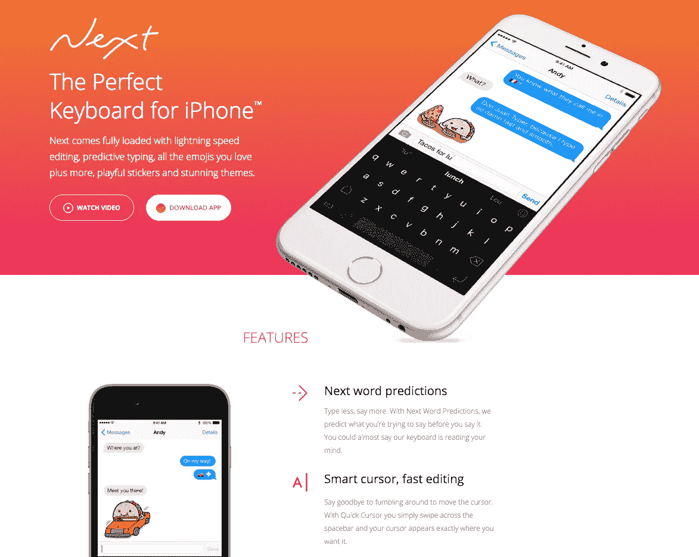*

*Next Keyboard website*

*为了获得人们的关注，你需要有一个伟大的名字，应用程序图标，截图，网站和宣传片视频。这将是很多人发现你并分享你的应用程序的方式。*

*当潜在用户浏览应用商店时，他们首先注意到的是你的应用图标。你的应用图标就像你的麦片盒子。一个图标需要既有描述性又能吸引注意力。*

*我们原本计划在 Next Keyboard 的初始迭代中推出滑动输入(这仍在我们的产品路线图中)。Next Keyboard 的图标是一个 swoopy N，它很好地传达了滑动动作。我们的图标是一个充满活力的橙色渐变。颜色和对比度帮助我们在 App Store 中脱颖而出，也将帮助你。*

*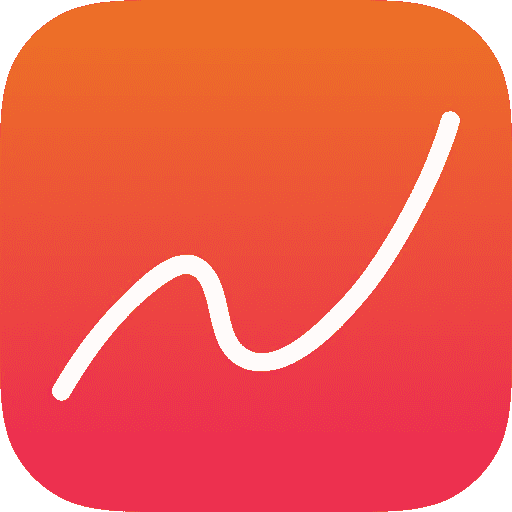*

*应用程序图标几乎就像他们自己的语言。如果你想给人留下深刻的第一印象，请专门研究应用程序图标的人。*

*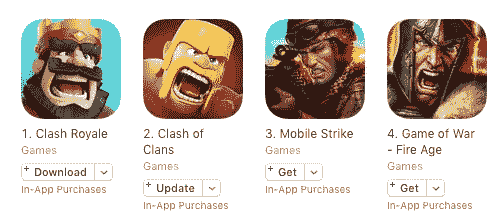*

*有些人建议你的图标上不要有文字，但这真的要视具体情况而定。查看你所在类别中的应用程序，看看它们在做什么，以及什么可能有助于你脱颖而出。例如，您可能会注意到，在游戏类别中，每个图标都有一个看起来像要跳出去的角色。相比之下，在生活方式类别中，时尚应用只需要字母和可能的标志。*

*最重要的是，获得反馈。对于 Next Keyboard，我们做了大量的调查，以获得最佳效果的反馈。*

*如果你对应用图标有兴趣， [Anas KA 在这里写了一篇有趣的文章](/mobile-growth/designing-a-unique-app-icon-3839e93add20) + Michael Flarup 也写了很多关于[设计更好的应用图标的主题。](/@flarup/designing-better-app-icons-bac276f89ead#.wajcv5vxe)*

*一旦你确定用户被你的应用程序名称和图标吸引住了，就该准备真正有吸引力的宣传材料了。你可以通过网站、应用截图、应用描述 30 秒预览视频和关键词等渠道传达应用信息。*

> *换句话说，你的应用程序名称和图标会产生认知度。你的截图和信息把一个好奇的路人变成了顾客。而且 app 描述大概只有 1%的人看。*

*当你创建你的信息时，问问自己是什么让你与众不同。说出你的价值主张。确定三个核心特性，并将其提炼为一个简短的应用程序描述(越短越好)。你的信息应该令人兴奋，激起读者的好奇心，所以你也不想透露太多信息*

*Next promo video*

*你的应用程序的网站的基础将是你的宣传视频(不同于应用程序商店上的 30 秒预览视频)。好的宣传片有娱乐性和信息性。他们很投入。他们很有趣。他们是人类。*

*雇佣一个好的导演，他能创造出一个坚实的创造性的处理方法，和故事板，能很好的在视频中传达你的信息。*

*我们为[快速合体](https://vimeo.com/85126039)、[守灵](https://vimeo.com/81344902)、[表情党](https://www.youtube.com/watch?v=yi7q1vFJD6Q)和[下键盘](https://www.youtube.com/watch?v=K4Bo6mbmngc)做了宣传片。快速适应是一个低预算视频的好例子。相比之下,《下一个键盘》更贵，而且聚焦于一个关于通信未来的故事。这也是最有趣的制作。Wake 也有一个故事，讲述了它如何帮助那些难以入睡的人醒来。*

*把你的宣传视频想象成一个电视广告。视频里一定有什么能让你看完的东西。问问你自己:*

*   *我想炫耀什么？*
*   *我的产品有什么令人兴奋的地方？*
*   *我如何用有趣的方式展示这个？*

*苹果的广告就是很好的例子。讲故事的艺术和广告的艺术。*

# *不要孤注一掷*

*正如你所注意到的，有许多因素促成了我们在 App Store 上的大规模发布。显然，苹果的特色帮了大忙——但是我们的公关、交叉促销和促销内容火上浇油。所有这些其他策略都需要在发布日执行之前预先进行规划和基础工作。祝你下次发布好运，玩得开心！*

*哦，《我的世界》是一个值得尊敬的对手。我们下次会抓到你的。-)*

***P.S.** 登上 App Store 的巅峰很难，保持巅峰更难。正如[凯西·牛顿](https://medium.com/u/b6e05447f2cf?source=post_page-----53d06536b3f3--------------------------------)在他的深度文章[App Store](http://www.theverge.com/2016/3/2/11140928/app-store-economy-apple-android-pixite-bankruptcy)中指出的那样，在 2016 年，在 App Store 上建立可持续发展的业务越来越难。幸运的是，我们的产品只是我们业务的一部分。我们还提供客户服务，处于一个幸运的位置，我们可以为自己和选定的合作伙伴制造产品。*

**

# *如果你喜欢这篇文章，你可能也会喜欢:*

* [## 这是官方消息:我们开始营业了

### 是的，我们做客户工作

medium.com](/p/5db9bffdfa88)  [## Medium.com 主办的新闻资料袋:如何使博客的生活更容易

### 过去，新闻资料袋是存放在 Dropbox 中或附加的概况介绍、文本文件、图像或 pdf 的文件夹…

medium.com](/p/10962dc3f04e) 

## Robleh Jama 是获奖产品工作室 [Tiny Hearts](http://www.tinyhearts.com/) 的创始人。他们制造自己的产品，如 [Next Keyboard](http://www.nextkeyboard.co) 、 [Wake Alarm](http://www.tinyhearts.com/wake) 和[Quick Fit](http://www.tinyhearts.com/quickfit)——也为 Plantronics 和 Philips 等客户制造产品。

## [查看我们的博客](http://blog.tinyhearts.com)和[加入我们的时事通讯](http://bit.ly/1kp6lTN)，了解诸如“如何在 App Store 上被发现”和“如何制造人们喜爱的产品”之类的事情。

**如果你喜欢这篇文章，请推荐，帮助别人找到！**

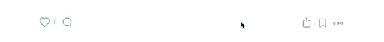*