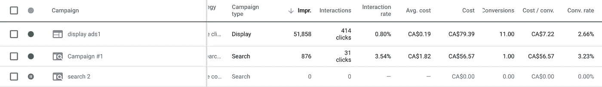
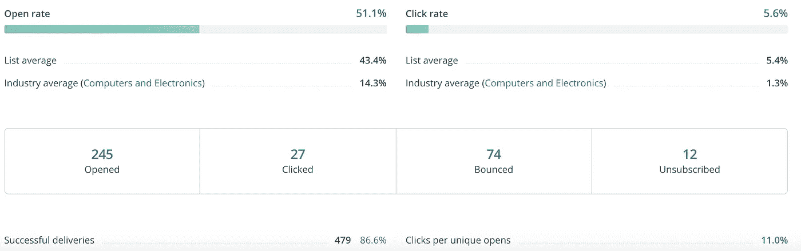
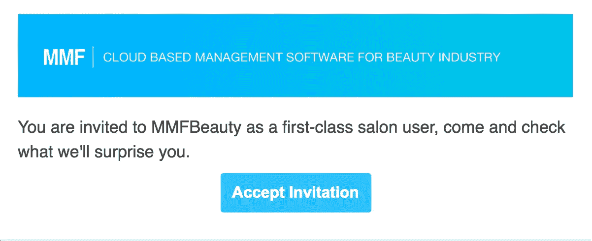

# 我们如何在中国运营我们的美国软件业务

> 原文：<https://medium.com/swlh/how-we-operate-our-american-software-business-in-china-aebae70b638b>

作为一家中国软件初创公司，我们在美国开展 MMF 业务已经一年了。简而言之，MMF 是一个基于云的预约软件，使小型企业，如沙龙，按摩水疗中心，更有效地安排服务预约。感谢互联网，现在每个人都可以将他们的业务扩展到世界上的任何一个角落，只要他们有东西要卖，而不必像传统那样亲自去那里，注册一个新公司，开设一个当地办事处。我并不是说跨国公司不再需要开设本地公司，本地化是任何成功和成长中的公司的必备条件，如亚马逊、易贝和麦当劳。但是对于像我们这样没有数百万美元来维持生存的新生企业来说，这代价太大了，在开设当地办事处/公司之前，先从外部开始业务是一个好策略，这就是为什么我们在中国开始我们的美国软件业务。我们现在每天约有 10 人注册我们的预约软件，我将分别与大家分享我们如何在不同的因素下做到这一点。

# **招聘和工作与硅谷一样，但在中国**

我们上周搬进了一个新的更大的办公室，以适应我们在中国不断增长的技术团队，我们还在招聘更多的人。目前，我们共有 19 名同事，包括 3 名设计师、10 名前端和后端开发人员、2 名测试工程师、2 名产品经理和 2 名营销人员。与美国和欧洲等其他国家相比，在中国雇佣工程师有一个很大的优势，那就是类似的技能组合，程序员的生产率，而薪水更低。毫无疑问，中国在不同领域拥有许多最好的程序员，拥有 7 年以上经验的顶级专家的平均工资约为每月 5800 美元，用这笔钱你只能聘请一名在硅谷有 1-2 年经验的初级工程师，因此我们可以在中国用有限的预算聘请更好的工程师。与硅谷的许多科技公司类似，我们每天上午 10 点开始工作，下午 6-7 点下班，其中包括中午 2 小时的休息时间。像许多其他 IT 公司一样，我们也加班到午夜，当像修复 bug，新功能的最后期限到来这样的事情发生时。等等。

# **我们营销的事实**

我们必须承认，互联网使全球营销比以往任何时候都更容易，我们能够在中国开展美国软件业务的唯一原因是，我们可以通过社交媒体、谷歌/脸书付费广告、电子邮件和在线出版物，轻松地向美国的潜在客户推广我们的软件。我们通过 Instagram、我们的脸书页面、Google Adwords 和冰冷的电子邮件联系我们的客户。数据显示，我们平均每天从谷歌 Adwords 获得 10 个注册，每次转换约 10 美元，我们有一个 15 美元/月的基本软件计划，这意味着我们每个客户每月至少有 5 美元的潜在利润，这是一个好迹象。我更想说的是，根据我们无数次的测试，谷歌展示活动似乎比谷歌搜索活动有更好的表现，每次转化成本更低，每日点击和转化更高。另一方面，我们通过邮件向潜在客户发送软件邀请，我们不难获得 50%+的打开率和 5%-9%的点击率。

这里提高电子邮件点击率的策略是尝试让它更个性化和更神秘，就像我们之前做的“发送邀请”，让电子邮件内容简短、个性化，并与目标受众玩一个好奇的游戏，当一切都准备好了，不要忘记在电子邮件底部添加一个漂亮而清晰的行动号召按钮。

# **客服先发邮件**

作为一家拥有小规模营销团队的中国初创公司，我们目前只能通过电子邮件与美国客户取得联系，并为他们提供任何支持。我们在我们的网站上有帮助中心，提供我们的全部联系信息，任何客户的电子邮件都将在 24 小时内得到回复，我们还每月两次发送电子邮件收集反馈和问题，在许多情况下，我们必须通过电子邮件处理客户对软件的投诉，每次当我们帮助他们在电子邮件中一步一步地解决问题时，效果都很好，有时还有图像。这可能不如打电话有效率，但它是有用的，我们可以在发送之前仔细编辑和审查我们的电子邮件内容，以便我们可以充分表达我们对客户的尊重，同时回答他们的问题，并为他们提供各种最好的支持。我们有足够的时间来思考我们应该在电子邮件中写些什么，我们不能在打电话时也这样做，话从我们的嘴里直接出来，如果我们没有得到良好的训练和准备，这将是一场灾难。

我们在目前阶段做得很好，我们的软件注册数量正在稳步增长，我们在中国的技术团队正在努力工作，以确保所有的功能，API，迷你程序都在良好的状态下运行。但正如我上面提到的，本地化仍然是试图更快发展的外国公司的必备策略，我们离那个阶段还太远了。我们将继续我们当前的运营战略，直到我们达到这次的目标，即每月收入 100，000 美元，然后我们将进入下一章。这篇文章的目的是希望为你们提供一些一般性的见解，当我们试图加入一个不同的市场，而不是实际到达那里，并开始一个全新的业务时，事情是如何一起工作的。如果你喜欢它，请不要犹豫给我们鼓掌。

## 这篇文章发表在 [The Startup](https://medium.com/swlh) 上，这是 Medium 最大的创业刊物，拥有+369，518 名读者。

## 订阅接收[我们的头条](http://growthsupply.com/the-startup-newsletter/)。

