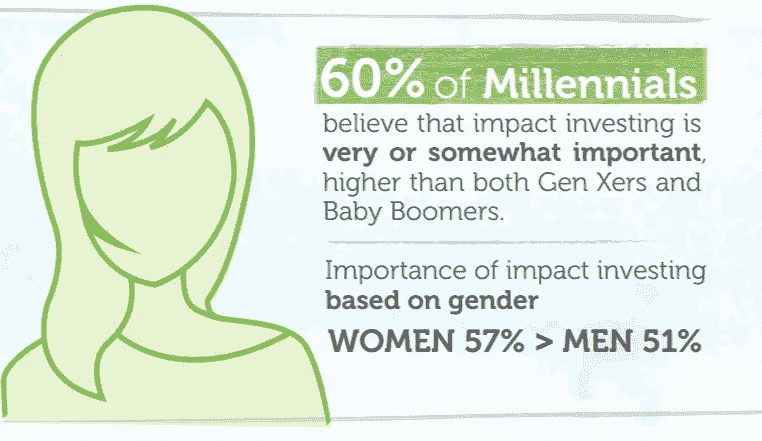

# 女性如何领导影响力投资

> 原文：<https://medium.com/swlh/how-women-will-lead-impact-investing-ab5d750a0cd0>

Photo by [Quentin Lagache](https://unsplash.com/photos/vB6mPiQId88?utm_source=unsplash&utm_medium=referral&utm_content=creditCopyText) on [Unsplash](https://unsplash.com/search/photos/eyes?utm_source=unsplash&utm_medium=referral&utm_content=creditCopyText)

投资环境正在发生变化，而且变化很快。随着婴儿潮一代开始计划退休，这为新一代年轻投资者进入市场敞开了大门。

在过去的十年中，影响或社会责任投资被导向重要的社会和环境事业，同时获得长期回报。在千禧一代的引领下，这种相对较新的投资方式正在发展壮大，这不仅是因为一代人的转变，还因为性别态度。

Source: American Century Investments

根据美国世纪投资公司 2018 年 8 月的一份报告，60%的千禧一代认为影响力投资有点或非常重要，这一比例高于 t 2 的 X 世代和婴儿潮一代。

千禧一代对更多社会责任和影响力的渴望在过去几年中被大量掩盖。《美国世纪报告》虽然有了一个重要发现:

*   57%的女性更有可能认为对社会的影响是一个重要的决策因素，而男性的这一比例为 51%。

出于几个原因，这一点值得注意。

# 成为投资者

各种年龄和背景的女性都在为挣钱、接受教育、照顾家庭和退休计划的压力中挣扎。身兼多职、实现财务独立以及在超过 40%的 T4 家庭中扮演主要养家糊口者的角色增加了理解投资的紧迫性。

正是因为这个原因，金融教育和赋权在许多面向女性的教育机构中越来越多。

尽管形势紧迫，但女性发现自己在进入投资领域时犹豫不决。几十年来，听起来复杂的金融术语与头条新闻交织在一起，这些因素造成了神话和恐吓。

这是一个很好的机会来开始弥合与女性之间的鸿沟。

# 可持续投资的真正机会

《美国世纪投资报告》强调了女性对影响力投资的重要性有了更深刻的理解，另一方面，该报告进一步指出，女性对这种投资方式的熟悉程度要低得多。

众所周知，女性会为她们相信的事业做志愿者，她们希望有更多的机会像富有的慈善家那样创造更大的影响。尤其是千禧一代的女性更有可能接触那些重视社会责任的品牌。

这是可持续投资与妇女联系并打开弥合投资鸿沟之门的一个巨大机会。消除恐惧，提高熟悉度都是从教育开始的。

[Newday Impact Investing](https://newdayimpact.com/how-to-invest/) 致力于确保投资者受到教育并获得授权，同时提供一个透明的平台，使这一努力变得非常方便和实惠。

该平台维持六个可持续组合，以解决社会和环境问题，包括:

*   [性别平等](https://newdayimpact.com/gender-equality-investment-portfolio/)
*   [动物福利](https://newdayimpact.com/animal-welfare-investment-portfolio/)
*   [气候行动](https://newdayimpact.com/climate-action-investment-portfolio/)

# 未来增长

女性和年轻投资者将成为未来十年影响力投资增长的驱动力。

卡尔弗特投资公司对富裕女性的一项研究发现，95%的人认为“帮助他人”很重要，90%的人认为“环境责任”很重要。

女性寻找对她们来说重要的产品和公司。他们更有可能与优先考虑社会责任和环境问题的品牌合作。

全球影响力投资网络预测，到 2020 年，该市场将增长至 5000 亿美元。

*原载于*[*www.newdayimpact.com*](https://newdayimpact.com/learn/how-women-will-lead-impact-investing/)*。*

## 这篇文章发表在 [The Startup](https://medium.com/swlh) 上，这是 Medium 最大的创业刊物，拥有+397，714 名读者。

## 在这里订阅接收[我们的头条新闻](http://growthsupply.com/the-startup-newsletter/)。

