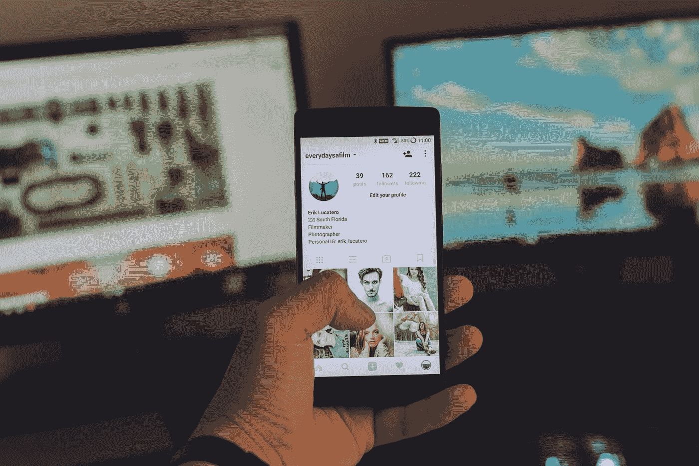
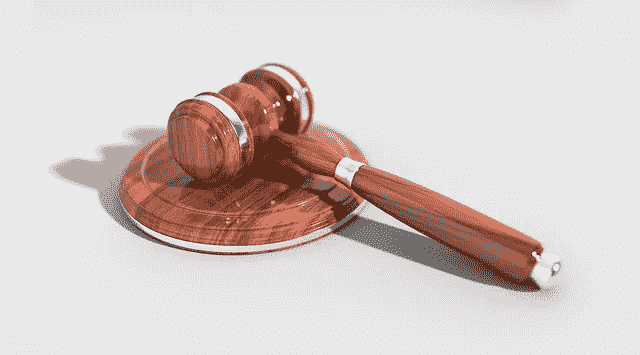
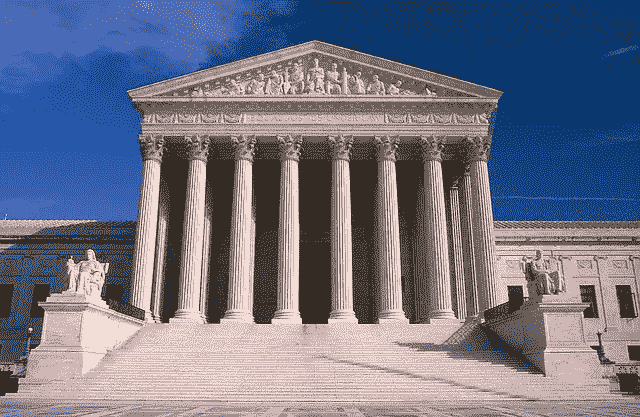
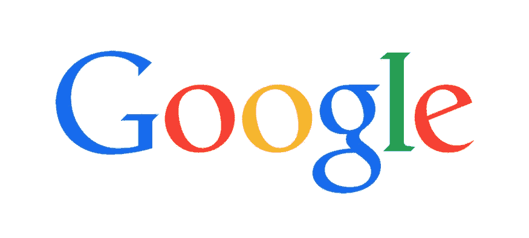
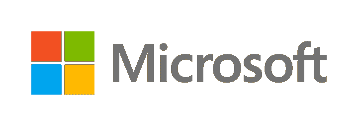
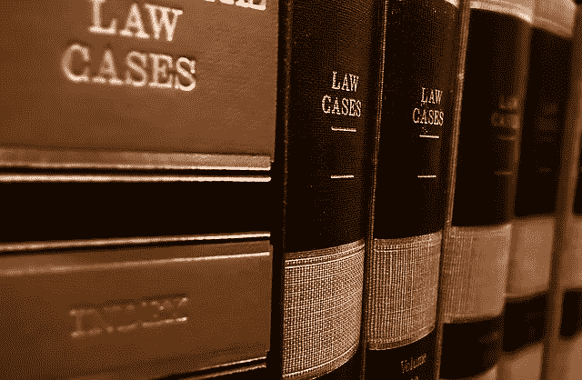
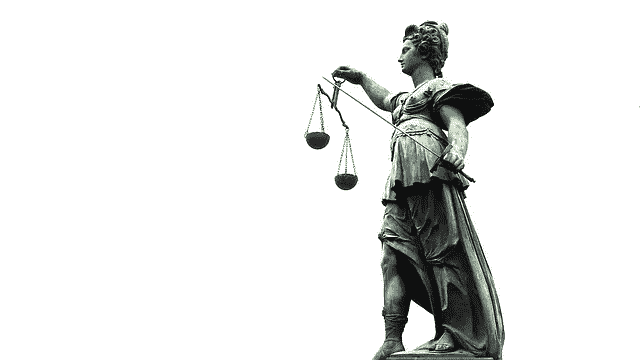
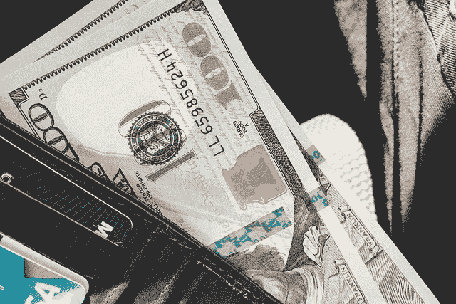

# 你如何能(但不应该)为一个应用程序创意申请专利

> 原文：<https://medium.com/swlh/how-you-can-but-shouldnt-patent-an-app-idea-9520b68eecaa>

Originally published at [http://www.appsterhq.com](http://www.appsterhq.com/?utm_source=CP&utm_medium=Medium)

在许多情况下，试图为一个移动应用申请专利是[不明智的](http://www.appsterhq.com/blog/reasons-why-startups-dont-need-patents):作为一个昂贵、漫长和困难的过程，它会耗尽宝贵的资源，同时分散创始人执行他们的商业想法和建立[高增长创业公司的注意力](http://www.appsterhq.com/blog/3-crucial-features-high-growth-startups)。

然而，与此同时，成功申请应用程序专利不仅是可能的，而且是世界上最大的科技初创公司所追求的，而且还能在移动领域提供最强大的知识产权保护。

在这篇文章中，我将详细概述在 2017 年成功申请移动应用专利的基本步骤。

# 初步的警告

重要的是要指出，我们在 Appster 的[认为，对于新的早期创业公司来说，尝试为他们的移动应用申请专利通常是**不明智和不必要的**。](http://www.appsterhq.com/?utm_source=CP&utm_medium=Medium)

事实上，我已经写了一整篇关于为什么你的创业不需要专利的文章。

在那篇文章中，我认为初创企业的创始人通常应该把他们的时间、金钱和精力放在建立真正的企业上:

*   定义和调查您的[可货币化的客户难题](http://www.appsterhq.com/blog/early-stage-entrepreneurs-launch-profitable-startup)，
*   确定[你的利基市场的规模和独特需求](http://www.appsterhq.com/blog/build-successful-mobile-app-startup)，
*   [验证你的产品创意](http://www.appsterhq.com/blog/test-product-idea-real-world-feedback)，
*   构建一个[最小可行产品](http://www.appsterhq.com/blog/mvp-app)等。—而不是担心申请专利的复杂过程。

在其他因素中，我认为以下是避免专利的重要原因:

*   获得专利非常昂贵，许多早期创业公司没有完成全部申请所需的可支配资本；
*   整个申请、审查和批准过程需要几年时间才能完成；
*   因为创业公司经常改变方向，所以当专利最终被授予时，它们可能会部分或完全不适用(也就是说，过时了);和
*   大约只有 [56%](http://digitalcommons.law.yale.edu/cgi/viewcontent.cgi?article=1113&context=yjolt) 的专利申请最终成功。

尽管如此，我承认许多创始人仍然对移动应用公司为什么以及如何申请专利非常感兴趣。

如果你对获得专利的目的、功能和流程有了充分的理解，那么就完全有可能清楚地了解是否、何时以及如何为你的手机应用申请专利。

在这种背景下，如果你应该尝试为你的应用申请专利，这可能不是一个关于 T4 的问题，而是一个关于什么时候申请专利合适的问题。

专利确实被授予了移动应用程序公司——Dropbox、脸书和谷歌(以及许多其他公司)多年来都成功地获得了他们(一些)产品和服务的专利([来源](http://blog.ipfolio.com/10-patents-that-launched-billion-dollar-empires))——但成功的专利申请实际上从来不会授予那些尚未建立其产品和商业模式基础的创始人。

此外，就移动创业世界似乎正在见证从使用版权到使用专利的转变而言，今天的创始人为不久的将来的知识产权世界做好准备是很重要的。

因此，虽然处于起步阶段的初创公司应该在申请专利之前致力于打造一个坚实的产品，并实现产品与市场的契合，但我想向那些可能在创业之旅中走得更远的人详细介绍一下 2017 年获得专利的来龙去脉。

# 知识产权

对专利的明智讨论要求我们首先熟悉一些技术术语和各种定义概念。

首先，专利是知识产权的一种形式。

世界知识产权组织(WIPO)将“[知识产权](http://www.wipo.int/about-ip/en/)”(IP)定义为“智力创造，如发明；文学艺术作品；设计；以及商业中使用的符号、名称和图像”。

因此，知识产权是指“无形资产”，即“由公司拥有并受到法律保护，未经同意不得在外部使用或实施的”智力产品(“T0”来源)。

从脸书和 Instagram 到 Slack 和 Trello，移动应用程序都是创造性的发明，即精神的艺术产品，它们显然属于知识产权的范畴。

"[知识产权](https://stats.oecd.org/glossary/detail.asp?ID=3236)(IPRs)是一种特定的权利，允许其持有者在特定时期内对受这种权利保护的物品的使用实行垄断。

正如 Businessdictionary.com[解释的那样，知识产权是:](http://www.businessdictionary.com/definition/intellectual-property-rights.html)

> *“一个人或一家公司至少在一段特定的时间内，拥有使用他/她自己的计划、想法或其他无形资产而不用担心竞争的专有权。这些权利包括版权、专利、商标和商业秘密。”*

知识产权的保护最终由法院通过诉讼(例如，以起诉侵犯版权的形式)来保证，这显然是为了鼓励创新。

创造者，从在车库里工作的普通企业家到发明尖端技术的跨国公司，当他们知道他们的发明可以受到正式保护防止被他人窃取时，他们更有可能投入必要的时间和精力来构建创新产品和服务。

专利是四种知识产权之一，另外三种是版权、商标和商业秘密。

让我们先简单地定义这三个，然后再详细讨论专利。

A " [版权](https://www.copyright.gov/help/faq/faq-general.html#what)"是法律对"固定在有形表达媒介中的原创作者作品"的一种保护形式，如诗歌、小说、电影、歌曲和其他形式的文学、戏剧、音乐和艺术作品。

版权涵盖已出版和未出版的作品，但不适用于“事实、想法、系统或操作方法”本身。

“[商标](https://www.copyright.gov/help/faq/faq-general.html#what)”是一种“保护识别一方商品或服务来源的文字、短语、符号或设计，并将其与其他商品或服务区分开来”的安全。

商标可用于公司名称、产品和服务描述、标语、口号等。只要有公司使用它们。

商标的例子包括立即可识别的谷歌和微软的标志:

[商业秘密](http://www.wipo.int/sme/en/ip_business/trade_secrets/trade_secrets.htm)是指“为企业提供竞争优势的任何机密商业信息……【如】制造或工业秘密和商业秘密”。

商业秘密的常见例子包括受保护的食品配方(例如，可口可乐的饮料配方)和隐藏的商业惯例和流程(例如，金融交易算法)。

**注意**:无论你的创业公司是否参与专利申请过程，我们在 Appster 强烈鼓励我们的客户在任何适当的时候通过明智地利用版权、商标和商业秘密担保来保护他们的知识产权。

例如，我们建议对您品牌的所有关键方面进行商标注册，包括您公司的名称、徽标、图标和口号/标语。

请务必在此搜索美国专利商标局的商标数据库[，以确定您应该在品牌的哪些方面注册商标。](https://www.uspto.gov/trademarks-application-process/search-trademark-database)

我们向客户推荐的另外两项与知识产权相关的措施是:

*   与所有员工和联合创始人创建并签署全面的“[保密/不披露协议](http://www.investopedia.com/terms/c/confidentiality_agreement.asp)”——即“双方或多方之间用于表明双方之间存在保密关系的法律协议”；和
*   在可能的情况下，购买所有一级、二级和三级域名，以防止[域名抢注者](http://www.whoishostingthis.com/blog/2013/11/06/domain-squatting/)在未来某个时候卑鄙地试图以过高的价格向你出售你的首选域名。

现在让我们来看看专利本身。

# 什么是专利？

在美国，[美国专利商标局](https://www.uspto.gov/) (USPTO)正式颁发专利。

(加拿大人通过[加拿大知识产权局](https://www.canada.ca/en/intellectual-property-office.html)申请专利，澳大利亚人通过[澳大利亚知识产权局](https://www.ipaustralia.gov.au/)申请专利，英国公民利用[英国知识产权局](https://www.gov.uk/government/organisations/intellectual-property-office))。

USPTO 以以下正式和技术的方式定义了“[专利](https://www.uspto.gov/patents-getting-started/general-information-concerning-patents#heading-2):

> *“发明专利是授予发明者的财产权，由美国专利商标局颁发。一般而言，新专利的期限为自专利申请提交之日起 20 年。专利授予所赋予的权利是排除他人制造、使用、要约出售、销售或进口该发明的权利。一旦专利被授予，专利权人必须在没有 USPTO 帮助的情况下实施专利。*

作为与发明相关的“有限期限财产权”，专利授予法律保护，正式排除其他人创造、分发和/或销售该发明并从中获利([来源](https://www.uspto.gov/trademarks-getting-started/trademark-basics/trademark-patent-or-copyright))。

专利从申请之日起持续 20 年(美国最近放弃了其长期以来的先发明专利标准，于 2013 年 3 月正式接受了[先申请](https://www.uspto.gov/patent/first-inventor-file-fitf-resources)系统，从而加入了世界其他国家的行列)。

版权为作者的原创作品(如文字材料、音频作品和实体建筑)提供安全保障，商标保护识别公司、产品或服务来源的文字、短语、符号和设计(如标识和口号)，而专利保护*发明*和发现。

到底什么是“发明”？

虽然“对‘发明’没有国际[公认的]定义”是事实([来源](http://www.wipo.int/sme/en/documents/software_patents_fulltext.html))，但 [USPTO 注意到以下](https://www.uspto.gov/patents-getting-started/general-information-concerning-patents#heading-2):

> *“任何人，凡‘发明或发现任何新的和有用的工艺、机器、制造或物质组成，或其任何新的和有用的改进，均可获得专利’，但须符合法律的条件和要求。法律将“过程”一词定义为一个过程、行为或方法，主要包括工业或技术过程。上述各类主题加在一起，实际上包括了人类制造的一切东西以及制造产品的过程*

更实际的是，一项可申请专利的“发明”是对一个技术上的问题提出有效的“T2”解决方案。

对于基于软件的发现，被确定为保护的发明解决方案在本质上通常是面向过程的——例如移动应用程序允许智能手机执行独特操作的新颖和非显而易见的方式(来源: [1](https://www.legalzoom.com/articles/can-you-patent-your-mobile-app) 、 [2](http://www.ascendle.com/blog/when-should-you-patent-your-mobile-app) )。

重要的是要注意，这样的想法既不能申请专利，也不能受到任何其他形式的知识产权的保护——正如 IPWatchdog 的 Gene Quinn 所说，“如果没有[有争议的]想法的一些可识别的体现，就不可能获得知识产权保护，也不会有专有权流向你”。

因此，你要寻求知识产权保护的不是你的移动应用程序背后的*想法*，而是这种想法与一个或多个物理实体(例如，智能手机或其一个或多个内部组件)连接、体现和改进的方式([来源](http://www.grr.com/social-media-apps-and-patent-eligibility.htm))。

有了这些技术定义和描述，现在让我们来考虑成功获得移动应用专利必须满足的主要专利资格要求。

# 专利资格要求

正如海莱格·博斯特威克指出的，移动应用确实可以申请专利，因为它们从处理的角度独特地影响了智能手机的操作:

> *“手机 app 可以申请专利吗？简单的回答是“是的”,因为它是交互方法的一个组成部分；即在连接到包含数据的远程服务器的移动电话上运行的过程，该远程服务器存储数据或者处理数据以在移动电话上使用。换句话说，它让你的手机以某种方式运行。”*

那么，严格来说，移动应用程序“在专利资格和可专利性方面与其他软件没有区别”([来源](https://www.richardspatentlaw.com/faq/can-i-patent-an-iphone-app-or-other-mobile-app/))。

从技术角度来看，软件专利可以保护“你的应用程序中的系统、方法和功能，比如用户界面特征、编辑功能、编译技术或程序语言翻译方法”([来源](https://thenextweb.com/insider/2015/05/07/does-your-mobile-app-need-a-patent/#.tnw_n8Rv0XKS))。

移动应用有可能获得“实用”专利(而不是“设计”或“植物”专利——见[这里](https://www.uspto.gov/patents-getting-started/general-information-concerning-patents#heading-2))。

现在，为了成功获得移动应用程序的专利，必须满足哪些特定的资格要求？

专利资格是通过回答以下 3 个关键问题来确定的:

1.  正在申请专利的发明是一个抽象概念吗？
2.  发明**是否新颖**(即新)？和
3.  发明**是非显而易见的**？(来源: [1](https://www.richardspatentlaw.com/faq/can-i-patent-an-iphone-app-or-other-mobile-app/) 、 [2](https://www.uspto.gov/patents-getting-started/general-information-concerning-patents) 、 [3](http://www.ascendle.com/blog/when-should-you-patent-your-mobile-app) )。

第一个要求，即确定发明是否等同于一个**抽象概念**，植根于两个具体事实，即 1) [这样的概念不能被授予专利](https://www.uspto.gov/patents-getting-started/general-information-concerning-patents#heading-4)和 2)美国最高法院最近裁定，软件专利申请中必须包含不仅仅是概念的东西，否则申请将自动失败。

在 2014 年的*爱丽丝公司诉 CLS 国际银行*一案中，最高法院通过创建一个新的、由两部分组成的测试来限定抽象创意的资格要求:

1.  专利权利要求是否包含抽象概念，如计算机算法、计算方法或其他一般原理？如果**否**，则必须考虑第二和第三个可清洁性要求(将在下面讨论)。如果**是**，则:
2.  该专利是否要求在想法上增加“额外的东西”,而这种额外的东西体现了一种“发明概念”?如果**否**则申请必须被拒绝。如果**是**，那么必须评估第二和第三个合格性要求(来源: [1](https://www.richardspatentlaw.com/faq/can-i-patent-an-iphone-app-or-other-mobile-app/) 、 [2](http://www.grr.com/social-media-apps-and-patent-eligibility.htm) )。

重要的是，法院认为，一般用途计算机的普通和惯常使用不足以满足这一检验，因为“仅仅要求通用计算机的实施不能将抽象的想法转化为符合专利条件的发明”([来源](https://www.richardspatentlaw.com/faq/can-i-patent-an-iphone-app-or-other-mobile-app/))。

正如杰森·沃希特指出的，法院的裁决意味着“必须有所改进(例如，在分类、效率等方面的改进)。)到“为了让一家移动应用公司说服 USPTO 其发明有资格获得专利。

很明显，许多初创公司的专利申请因未能满足第一个主要资格要求而被拒绝。

合格的第二个条件包括确定发明是否**新颖**，即，新的。

简而言之，如果一项发明与之前的所有发明都有本质上的不同，它就可以被认为是新颖的。

安杰洛·费伦泽是这样说的:

> *“你的软件解决了一个问题，并不代表你的专利申请就有了保证。您的软件解决方案需要是新的。它需要以一种其他解决方案无法解决的方式来解决现有的问题，要么使用新的、非显而易见的技术，要么以独特的新方式改变流程本身。”*

确保你的发明真正新颖的一部分包括[搜索现有的专利](https://www.legalzoom.com/articles/can-you-patent-your-mobile-app)和专利申请，以确认类似的发明尚未获得专利或目前没有通过专利申请程序。

正如[赫尔律师事务所](http://www.heerlaw.com/patent-faq)的律师指出的那样，为了通过新颖性测试，在美国“必须没有公开披露或申请专利”。

[这个来自 USPTO 网站的链接](https://www.uspto.gov/patents-application-process/search-patents)和[这个来自 Google Patents 的链接](https://patents.google.com/)提供了大量关于搜索现有专利和申请的有用信息和在线目录。

最后，第三个合格要求需要确定发明是否**非显而易见**。

理查兹专利法的人用这些术语解释了这个不明显的规定:

> *“当一项发明比相关技术领域的技术人员在提交专利申请时显而易见的东西更具创造性时，该项发明在专利上是非显而易见的。如果专利申请是已有发明的组合或者是一项或多项已有发明的明显变化，专利审查员可以因其显而易见性而予以驳回。”*

例如，如果你的移动应用发明仅仅是结合了现有的技术，或者只是稍微修改了一些已经存在的东西，那么它将不会被授予专利。

组合(或重新安排)现有技术对于您所在行业的工作人员来说是一种显而易见的尝试方法，因此它无法满足最终的可接受性要求。

如果你确信你的手机应用程序确实 1)不仅仅是一个抽象的想法 2)新颖和 3)不明显，那么是时候开始正式的专利申请程序了。

# 截止日期；专利申请的类型

这里有一条非常重要的信息，如果你致力于为你的移动应用程序(或任何其他发明)申请专利，你必须知道。

**在美国，从你的发明被公开披露之日起，你只有一年的时间提出一项或多项专利申请**(来源: [1](http://www.grr.com/social-media-apps-and-patent-eligibility.htm) 、 [2](http://www.heerlaw.com/patent-faq) 、 [3](https://fbombmedia.com/patent-patent-mobile-apps-intellectual-property/) )。

换句话说，从投资者开始公开讨论、营销或出售他/她的发明之日起，USPTO 只提供 365 天的时间来提交专利申请:

> *“在披露、营销、尝试许可、销售、寻求资金或推出社交媒体概念和/或相关移动应用程序之前，必须考虑专利保护。在美国，如果发明在申请专利保护之前被披露，产品和/或商业方法将被排除在专利保护之外。也就是说，专利必须在产品公开披露、上市、销售或甚至与潜在客户进行讨论之前申请。”*

换句话说，你必须在公开披露你的发明的第一天起一年内提交你的申请；否则，你将自动丧失申请专利的权利。

因此，在专利申请过程中，时机至关重要。

出于讨论的目的，我们需要解决两种专利申请。

第一份被称为"**"的临时专利申请。**

**事实上，这是最常见的方法，也是移动应用公司在开始申请专利时使用的第一种方法。**

**用技术术语来说，临时申请“允许你在没有正式的专利权利要求、誓言或声明或任何信息披露(现有技术)声明的情况下提交”([来源](https://www.uspto.gov/patents-getting-started/patent-basics/types-patent-applications/provisional-application-patent))。**

**更具体地说，临时专利申请充当了一个“占位符”,它给你一整年的时间来构建和完善你的最低可行产品，通过尝试实现产品与市场的匹配来评估应用程序的需求和强度，并确定是否值得一直致力于整个专利申请流程，同时利用美国的先申请法规在专利局“保持你的位置”,也就是说:**

**“通过提交临时专利申请而获得的一年专利申请状态让应用程序开发者有时间来看看产品是否会成功。如果是，那么开发者可以继续提交一份[完整的]非临时专利申请，开始 USPTO 的审查过程。在临时申请日的一年内提交非临时专利申请确保临时专利的申请日仍然是专利申请的正式申请日”([来源](https://www.legalzoom.com/articles/can-you-patent-your-mobile-app))。**

**因此，提交临时申请非常重要，原因有二:**

1.  **它可以让你评估你的应用程序是否足够好，可以申请专利，即它是否足够好，市场需求是否足够强劲；和**
2.  **它允许您将申请日期用作非临时(即完整)申请的相同申请日期，从而确保您的竞争对手不会获得 12 个月的“自由”时间来抢在您之前完成申请。**

**为什么你要在提交正式申请之前提交一份临时申请？**

**第一，因为申请花费少得多的钱——稍后会详细介绍。**

**第二，因为与非临时申请相比，创建和提交申请不太复杂(尽管总体上要求仍然很高)。**

**第三，因为如果经过足够的关注和精心的编译，它可以作为一个有用的“启动”应用程序，用于以后必须创建的完整提交。**

**尽管临时申请并不根据其优点进行评估，即不进行评估，但最好的做法仍然是使这些申请尽可能完整和详细，例如，包括详细的文档、线框、图表、流程等。(来源: [1](https://www.uspto.gov/patents-getting-started/patent-basics/types-patent-applications/provisional-application-patent) 、 [2](http://smallbizclub.com/startup/making-your-business-official/patent-mobile-app-idea/) 、 [3](https://www.richardspatentlaw.com/faq/can-i-patent-an-iphone-app-or-other-mobile-app/) )。**

**USPTO 在发明人公开披露其发明后强加给发明人的一年时间表反映在该机构的[规则](https://www.uspto.gov/patents-getting-started/patent-basics/types-patent-applications/provisional-application-patent)中，即“临时申请在临时申请提交日期后 12 个月其未决期到期时自动放弃”。**

**因此，在首次向世界介绍他们的产品后，移动应用公司有 12 个月的时间提交临时申请，然后再有 12 个月的时间提交完整的专利申请，否则原始申请日期就会丢失。**

**注意:**

*   **没有[所谓的](http://www.ipwatchdog.com/2017/05/13/benefits-provisional-patent-application/id=83161/)“临时专利”，只有最终提交完整专利申请的临时(即第一步)；**
*   **临时申请*并未*授予提交申请的投资者任何实际的专利或权利；**
*   **然而，它确实允许发明人在临时专利申请有效的一年时间内合法使用短语“[专利未决](https://www.uspto.gov/patents-getting-started/patent-basics/types-patent-applications/provisional-application-patent)”。**

**如前所述，第二种类型的专利申请是"**"非临时专利申请。****

****如果你希望 USPTO 最终为你的移动应用发明颁发专利，这是你必须提交的“完整”申请。****

****申请[必须包括](https://www.uspto.gov/patents-getting-started/general-information-concerning-patents#heading-2):****

*   ****包含“规范”的书面文件，即具体说明和权利要求；****
*   ****图纸(如有必要)；****
*   ****誓言或宣言；和****
*   ****申请、检索和审查费用。****

****非临时申请是一个复杂、漫长且昂贵的过程，最好由有资格且经验丰富的[专利律师来处理](http://www.ipwatchdog.com/patent-bar-exam/patent-bar-qualifications/)。****

****虽然独自承担这一过程是可能的，但我们在 [Appster](http://www.appsterhq.com/) 建议创业者与专业的专利律师合作，他们可以帮助准备和提交最有可能成功的专利申请。****

# ****成本和时间表****

********

****让我们通过简要描述在美国申请专利的相关费用和时间表来结束这篇文章。****

****USPTO 提供了一份[完整的清单，列出了提交专利申请时伴随而来的许多费用](https://www.uspto.gov/learning-and-resources/fees-and-payment/uspto-fee-schedule)——一定要查阅这份清单，以获得不同费用的准确说明。****

****投资者产生的一些最常见的非法律成本(即完全来自向 USPTO 提交专利申请的成本)包括:****

*   ******基本申请费**:70-280 美元****
*   ******专利检索费**:150-600 美元****
*   ******专利审查费(即考虑你的申请)**:180-720 美元****
*   ******3.5 年“维护”费(即保持已授予专利的有效性)**:400-1600 美元****
*   ******7.5 年“维护”费**:900-3600 美元****
*   ******11.5 年“维护”费**:1850-7400 美元。****

****这些费用范围是基于 USPTO 将申请人分为大型实体、“微型实体”或“小型实体”的事实，每一组都必须分别支付较便宜的申请费(来源: [1](https://www.uspto.gov/custom-page/inventors-eye-advice) 、 [2](http://www.nolo.com/legal-encyclopedia/small-entities-micro-entities-what-s-the-difference.html) )。****

****至于通常与提交专利申请相关的法律费用， [Richards Patent Law](https://www.richardspatentlaw.com/faq/how-much-does-it-cost-to-patent-a-mobile-app/) 根据他们使用移动应用程序客户端的经验提供了以下数据:****

*   ******准备专利的临时申请**:2500-5000 美元****
*   ******非临时专利申请准备**:10，000-15，000 美元****
*   ******被拒绝后的重新申请**:2-3 年内 5000-15000 美元。****
*   ******“**总之，**在 3-5 年的时间里**，典型移动应用程序的**总专利费用**可能在**15，000 美元到 30，000 美元**之间，维护费用是接下来 12 年的额外费用”。****

****最后，这里是一些典型的统计数据，显示了完成专利申请流程的不同方面所需的时间长度:****

*   ****审查员考虑首次申请所需的时间:几个月到几年****
*   ******完成初审阶段**:1-3 年****
*   ******完成来回拒绝和重新提交**:1-3 年****
*   ******总** **获得专利授权所需时间**:4-6 年([来源](https://www.richardspatentlaw.com/faq/how-much-does-it-cost-to-patent-a-mobile-app/))。****

****寻找专利申请时间表的例子？****

****脸书的马克·扎克伯格等了 6 年，在美国专利商标局多次拒绝后，他申请的第一项专利终于在 2012 年获得批准。****

****//****

## ****感谢阅读！****

# ****如果你喜欢这篇文章，请随意点击下面的按钮👏去帮助别人找到它！****

****************

# ****对应用程序有想法吗？[我们来聊聊](http://www.appsterhq.com/?utm_source=CP&utm_medium=Medium)。****

****在过去的几年里，我们已经帮助建立了超过 12 个数百万美元的创业公司。[查看我们如何帮助您](http://www.appsterhq.com/?utm_source=CP&utm_medium=Medium)。****

********

> ****最初发表于[http://www.appsterhq.com](http://www.appsterhq.com/?utm_source=CP&utm_medium=Medium)****

********