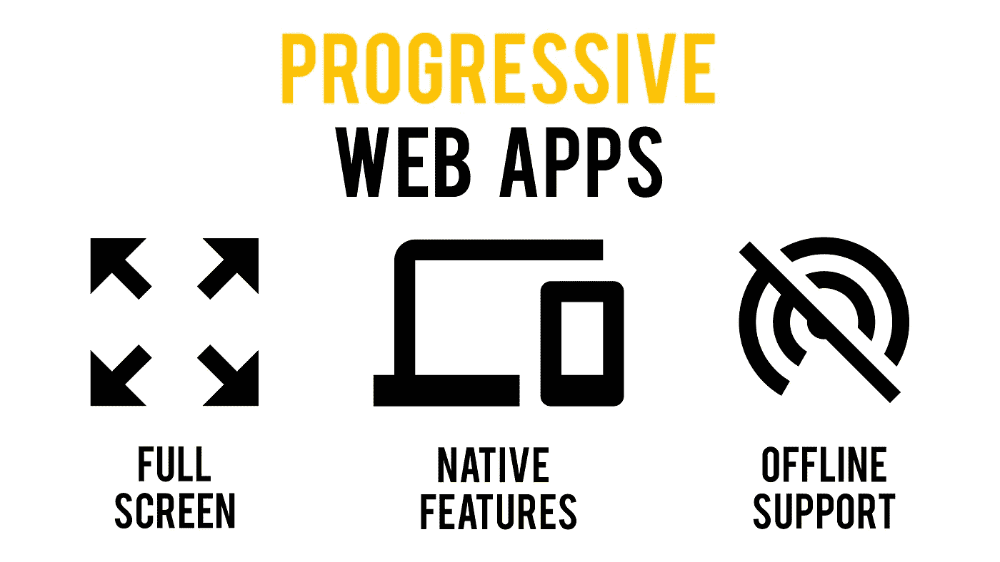
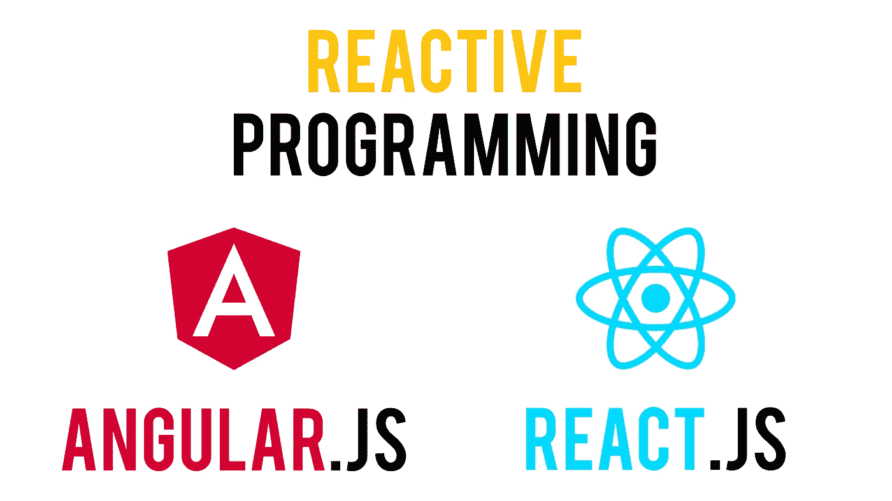
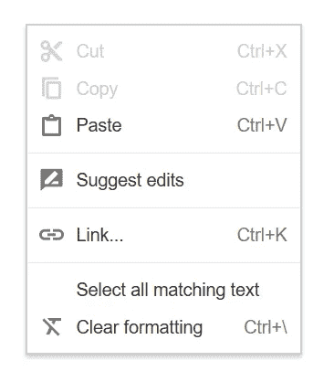

# 如何开发像本地移动应用一样的渐进式网络应用

> 原文：<https://medium.com/swlh/how-you-can-develop-progressive-web-apps-that-feel-native-5110fbbcbf4b>



我目前正在开发一个渐进式 Web 应用程序，它也将作为我下一个服务的原生应用程序。

众所周知，**pwa 是可以在浏览器或独立窗口中运行的应用，可以利用操作系统固有的特性**，例如推送通知和离线工作能力。

他们最近得到了很多媒体的报道，因为他们是那些想要到达许多不同平台的开发者的**最佳选择。试想一下，一个应用程序需要既能在移动设备上运行，又能在桌面设备上运行，并且需要原生功能。它的开发者将被迫开发四个应用程序:一个用于 Android，一个用于 iOS，一个用于 Windows，一个用于 macOS。**

现在，由于谷歌和微软(希望在不久的将来还有苹果)正在拥抱这一套新的网络技术，开发人员能够给他们的网络应用添加本地风格。这只需要很少的调整，以确保在任何系统上的最佳体验。

这种新软件模式的问题是，许多**开发者未能给他们的应用**一种本土的感觉。我说的不是缺少原生功能或者性能不好。更确切地说，我指的是缺乏润色，这是一个应用程序的某些方面需要的，以使它感觉像是本地的。

在这篇文章中，我将尝试解释什么是可以改变你的 PWA 的小感动。

请记住，本文的重点不是实现这些解决方案的实践方面(即编码)，而是理论方面。

# 禁用缩放功能

许多渐进式网络应用程序(例如 Twitter)允许用户通过捏来自由放大。这种方法的主要问题是，这样做的话，**UI 的某些部分不可避免地会脱离视图**。此外，**大多数原生应用不允许在有限区域(如图片或地图)之外进行缩放**，这使得 PWAs 相比之下看起来并不那么原生。

由于这些缺点，我建议禁用这个特性。在这一点上，您可能会说在基于文本的 web 应用程序中拥有这种能力是很方便的。但在我看来，两个增加或减小字体大小的按钮要好得多。

# 使交互式元素不可选

没有一款原生应用能让你用鼠标光标选择其界面的交互元素。与此同时，几乎所有的网络应用都是完全(或大部分)可选择的。这产生了**的效果，使网页看起来更像一个文档，而不像一个成熟的界面**。

由于一个页面可以用六行 CSS 代码(见下面的代码片段)来使其不可选择，我不明白为什么它不更常见。尽管如此，我认为每个开发人员在开发 PWA 时都应该考虑这一点。

```
div {
 -webkit-user-select: none; /* Safari 3.1+ */
 -moz-user-select: none; /* Firefox 2+ */
 -ms-user-select: none; /* IE 10+ */
 user-select: none; /* Standard syntax */
 }
```

# 反应式编程



你可能听说过 React 和 Angular。这些基于 JavaScript 的编程语言**允许页面在一些数据更新后立即刷新**。因此，不仅不需要重复刷新页面来访问最新的数据集(你可能已经注意到了，这很常见)，而且**这款应用的响应速度更快**，因为它在改变页面时不会刷新(就像在原生应用中一样)。

当然， **React 和 Angular 都适合动态内容。**因此，如果你的应用主要是静态的，请随意选择任何其他技术，你的 PWA 看起来也会一样好。

# 如果需要，覆盖右键单击菜单

如果你需要为你的用户提供一个上下文菜单，**不要回避覆盖默认的右击行为**。

对于初学者来说，让浏览器的上下文菜单在每次右键单击时都弹出来感觉不是很自然。此外，考虑到 web 应用程序的复杂性，有时很难让用户只用一个鼠标键做任何事情。



Google’s web apps (Docs in the picture) often feature a custom context menu

如果你已经编写 web 应用程序很长时间了(或者至少在渐进式 web 应用程序普及之前)，你可能会对这个标题感到不悦。几年前，这被认为是不好的做法，因为没有用户期望 web 应用程序有自定义的上下文菜单。

相反，如今这种情况更为普遍。想想 Gmail 和谷歌的其他网络应用。所以，如果需要的话，不要害怕在你的网站上添加自定义的上下文菜单。

也就是说，**当右键单击没有可预测的行为**(也就是说，它没有打开上下文菜单或类似的东西)时，我认为这是一个不好的做法，所以要小心。

# 为每个平台设置一个主屏幕图标

渐进式网络应用程序最重要的特征之一是用户将应用程序固定在主屏幕上的能力。这意味着，由于每个操作系统都有不同的界面，每个操作系统都需要自己的图标。我建议使用 [PWA Builder](https://www.pwabuilder.com/) 为每个系统下载必要的图标。

如果你愿意，我也会鼓励你**稍微改变图标，以更好地匹配每个平台的风格**，只要它不会变得无法辨认。例如，你可以在 Android 图标上添加一个斜线阴影。

并且**不要忘记为你的应用程序选择一个主题颜色**，这样支持这个特性的浏览器就可以改变它们的颜色来匹配你的应用程序的主颜色。

# 结论

正如您可能已经看到的，这些指南中的许多都是为了改变正常的浏览器行为。考虑到用户是如何习惯的，这可能很可怕。但是不要担心——随着艾滋病毒传播如此之快，我可以向你保证这些做法将很快成为新的常态。