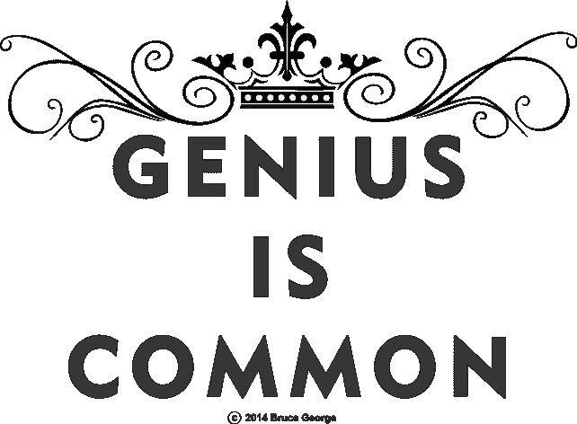
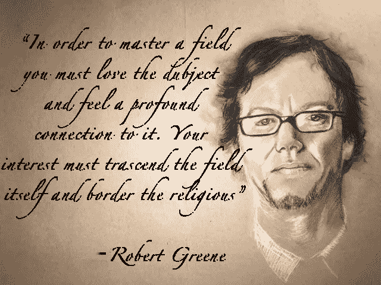

# 如何快速成为天才(以及为什么你不是)

> 原文：<https://medium.com/swlh/how-you-can-quickly-become-a-genius-and-why-most-people-arent-e01cc912abd9>

> “因为天才是意识的特征，所以天才也是普遍的。因此，从理论上讲，每个人都可以得到普遍的东西。它只等待合适的环境来表达它。”医学博士大卫·霍金斯爵士

你想知道是什么把你和那些突破的胜利者区分开来。

你想知道是什么让爱因斯坦和莫扎特与众不同，他们是如何创造出如此天才的作品的。

为什么你的同行发表了一篇新颖的文章，而你没有。

> 不同之处在于他们挖掘自己创造性肌肉的能力，当然，这是力量——他们发现自己充满勇气的创造性声音——足够经常地*然后*偶尔挖掘天才。

**发掘天才是优秀和伟大的区别**——在你的领域取得别人没有的突破的区别。

如果你想让我指导你发挥你的天赋，[点击我的日历](https://calendly.com/aramtaghavi8)参加战略会议。

但它也很微妙——无论如何都不戏剧化。它找到你，你找不到它。

天才发现了查尔斯·达尔文，因为他追随自己的深深的爱好和无尽的好奇，这创造了耐心、精神空间、活动和专注，使他的进化论从他身上出来。

他的表弟弗朗西斯被认为比他聪明得多，智商也比他高得多，但他没有——为什么呢？

为什么不是你？

也许你[不相信自己](/the-mission/this-5-minute-daily-habit-will-get-people-to-treat-you-how-you-want-to-be-treated-be5cf1a52828)，相信。

也许你不相信自己足够“聪明”，但你确实足够“聪明”。

每个人都有天赋，发掘它是他们的责任。

*天才仅仅是你创造性产出和这种产出的意识水平的结果。正是这种产出的深度，以及它的来源，让它展现出激励人们的伟大。这才是最重要的，不是吗？你的工作就是培养这种能力，让天才尽可能多地找到你。*

天才之路和最大化你的潜力是相邻的，并且经常会让你迷失很长一段路。

通常是因为错误的信仰体系和原则。

它从你开始，你如何做你所做的，你将成为谁，以及为什么。

从你晚上睡觉的方式到你早上系鞋带的方式，每件事都需要追求卓越。它总是在线上。总是比赛日。

如果你想要一位教练来帮助你实现卓越，[点击这里](https://calendly.com/aramtaghavi8)查看我的日历。

诺曼·施华蔻将军说过“擦亮的鞋子拯救生命”。

它[始于一个决定。](/the-mission/this-5-minute-daily-habit-will-get-people-to-treat-you-how-you-want-to-be-treated-be5cf1a52828)决定了解并相信你有天赋，你有责任将它发挥出来。

你越在乎什么时候不重要，就越不需要在乎什么时候重要。事实上，你想变得如此优秀，以至于比赛日只是另一个展示表演的机会。

真正的天才就是这样练习的。

世界上最好的冠军不会自我吹嘘。

他们仍然像水一样流动，准备像回声一样回应——就像李小龙(他的原话)。

当达到那种持续的能量和静止的状态时，天才就会被挖掘出来，而火热的头脑会以极快的速度产生产出。

然后在某个时候，一种力量接管了你，并从你身上带走了无法描述的特殊的东西——只是感觉到。

在这一点上，你已经达到了你的身体、思想和手艺之间的合一状态。

你变成了工艺。

你的新目标需要达到这种状态，并全身心地投入其中。

记住，[重要的不是你做什么，而是你如何去做。](/the-mission/how-to-live-a-full-life-31e23203f265)

那你是怎么做的呢？

如果你目前没有处于创造性产出的状态，并且还没有开发你的天赋，你很可能:

*   不要把时间花在个人和心理发展上。
*   花太多时间试图获得新的东西(“如果我努力存钱，3 个月后我就能拥有它，我会更开心”)。
*   不要把学习作为你生活中最重要的部分，而不仅仅是一个部分(“我有时间就看书，因为我一直在工作。”).
*   不要冥想、祈祷或锻炼。
*   不要刻意节食。

天才和你有多“聪明”或者你已经知道的东西完全没有关系。你的情商或者智商，或者你到现在为止取得的成绩。

事实是，每个人都有精神上的长处和短处，也有不同的大脑。 [**我们都独一无二**](http://med.stanford.edu/news/all-news/2010/03/what-makes-you-unique-not-genes-so-much-as-surrounding-sequences-says-stanford-study.html) **。**

所以，如果你像我一样智商很低，这仅仅意味着你不能用你的左脑处理和应用语言和符号，你可能在数学或工业时代的“教”的学习方式中没有那么强。

你可能和我一样是视觉学习者和右脑主导者。

当我潜水很深的时候，我肯定会做得更好，做很多很少，不像我左边的许多同龄人那样，他们能够做很多很好的事情。

也许你是右脑导向型的，因此能够以不同的方式掌握你所学的知识，并利用这些知识更好地将现实世界中的想法可视化。

一个并不比另一个更有价值——重要的是你如何利用你所拥有的。

有了正确的原则，有创造力的左脑思考者也许能够从青春期开始，通过学校进入哈佛商学院和企业界。他们能够挖掘自己的天赋，分析业务，运行出色的电子表格，以及你期望从哈佛 MBA 获得的所有其他技能。还有一些同样智商和技能的人没有最大限度地发挥他们的潜力，没有挖掘他们的天赋。

有了正确的原则，聪明的右脑人可以从青春期一直上学，成为专业作家、艺术家或组建非常成功的乐队。还有许多其他有同样技能和天赋的右脑思考者，他们最终没有成为专业艺术家，更没有形成成功的音乐团体。但是[‘成功’与天生的天赋](https://qz.com/707205/successful-people-dont-have-natural-talent-they-have-something-thats-much-more-important/)无关，一切都与[的成功原则](/@ARTaghavi/7-steps-to-bring-out-the-absolute-best-in-yourself-b0e14c303af4)有关，每个人都可以获得这些原则，但许多人却没有实施。

鉴于左脑技能有更多的工作机会，右脑阵营中碰巧有更多被浪费的潜力——尽管这可能不是一份理想的工作，其中那个人正在利用他们的创新精神和产出，并感觉他们正在最大限度地发挥他们的潜力。

在这篇文章中，你会发现突破到天才水平与智商或智力无关，而与你的生活方式和驱动你的动力有关。

人类最可悲的损失是当人们没有最大限度地发挥他们的潜力和挖掘他们的天赋——这是免费的，会带来满足感、幸福、创造性突破、精神能量甚至爱。

对天才的追求让生活变得有价值，唯一阻止你发掘天才的是你自己。

以下是区分天才和大众的 12 件事。

# 1.天才首先来自过程

> "影响的头号预测指标是生产率."——天才学者、加州大学洛杉矶分校心理学教授基思·西蒙顿博士

每天有意识的练习是达到天才水平的最重要的部分。

如果你每天都坚持不懈，你将会发现天才并掌握一门手艺，它最终会成为你。

发明智商的先驱心理学家开始研究是什么造就了天才，他们跟踪了 1500 名智商在 140 以上的人和另一组平均智商的人。

他发现智力并不能保证成就。这项研究中的许多高智商参与者都很努力，甚至因不及格而被大学退学，而高智商群体之外的其他人则在各自的领域中成名——包括路易斯·阿尔瓦雷斯和威廉姆·肖克利，他们获得了诺贝尔物理学奖。

# 2.天才创造空间让工作从他们身上抽离出来

> "我被一种我只能感激的力量牵引着。"—钢琴家凯斯·贾瑞特。

[Jarrett 特别记得在慕尼黑的一场音乐会，他觉得自己好像消失在了键盘的高音中。他的创造性艺术，是通过几十年的聆听、学习和练习旋律培养出来的，在他最不可控的时候显现出来。](https://www.nationalgeographic.com/magazine/2017/05/genius-genetics-intelligence-neuroscience-creativity-einstein/)

“这是一个广阔的空间，我相信这里会有音乐”，他说。

我现在每天都要写作。

幸运的是，写作只需要一台笔记本电脑，所以我可以在任何地方写作。

天才来自于[深流](https://en.wikipedia.org/wiki/Flow_(psychology))的状态。你的工作是创造那种状态和环境，让它发生在你身上。

举个例子，Jarrett 不仅是他领域的大师，他还在人群面前表演，这使得他的表演更加引人入胜。

成为很多人的焦点本身就有能力激发你的天赋所以[尽可能多的让自己处于你需要的最佳状态。](/the-mission/6-behaviors-to-become-the-person-you-need-to-become-to-achieve-every-goal-56dbadf2b53b)

# 3.天才是指突破性的想法和看到别人看不到的东西

> "每一项伟大的事业都是建立在一个对外隐藏的秘密之上的."彼得·泰尔

当你不断想出好主意，并且能够熟练地将这些想法应用到你的工艺中时，你就处于天才状态。

创意是开始，创作出精湛的作品才是天才。

在天才的状态下，你会想出如此多的好主意，以至于你不得不努力工作，优先考虑哪些主意要做，为什么要做。这可以是律师、艺术家、开发商、设计师、中层经理、初创企业创始人或自由职业者。所有的工作都有好有坏，只有实践天才原则的人才是最好的，不管他们做什么。

“医学院里有一些不是好医生的坏学生”——蒂姆·费里斯

当你在阅读一本书，并因为新的见解或表达任何想法的新方式而受到启发写博客时，你的创造力正在给全新的作品带来生命。

如果你发现自己有了一个突破性的联系，别人从来没有过，并且在经过长时间的努力思考后，你会一跃而起，这是一个天才的时刻。

如果它在领域里站得住脚，那就是天才的突破。天才不需要被大众歌颂。

大多数天才都不为人知。

当我以一种我知道没有人写过的方式写一篇关于某个主题的文章时，我发掘了我的天才。

例如，我记得[写了这篇关于文化、人才的文章](/the-mission/the-culture-of-a-high-performing-organization-and-how-to-hire-for-it-8062dc6ede59)，并将你的员工的[‘为什么一定是奇迹’](/the-mission/the-culture-of-a-high-performing-organization-and-how-to-hire-for-it-8062dc6ede59)与高绩效的企业文化联系起来。我记得在思考了很久之后，我把这些点连接起来。

当我看着作品中的“文化地图”,看到最高阶段是“天真的惊叹”——这让我大吃一惊！

[对于一个高绩效的组织来说，你的员工一定会感到奇怪](/the-mission/the-culture-of-a-high-performing-organization-and-how-to-hire-for-it-8062dc6ede59)嘣，那是一个创造性的突破，也是我那天的天才时刻。

我们可能会争论我正在解决的问题有多难，或者将[“为什么”和“想知道”与高绩效工作文化联系起来是否是](/the-mission/the-culture-of-a-high-performing-organization-and-how-to-hire-for-it-8062dc6ede59)天才之举，但事实是，我以这种方式联系了以前没有人联系过的两件事，并且我给这个领域添加了一些新的东西，这对我们的意图和目的来说，是一个天才时刻。

会持久吗？我不知道。但我知道我会继续走下去。

从小处着手，在第 100 次尝试后，你会想出一些能激发你的天赋并让世界震惊的东西。

# 4.天才出于习惯而练习

> 所有学科都有主题上的相互联系，如果我们善于感知和利用这些联系，学习过程会变得非常令人兴奋。关键的第一步是与你的直觉建立工作关系，这样你的学习过程就会被你独特的细微的创造性飞跃所引导。我们的思想都是不同的，我相信培养敏锐的内省敏感性对于发现我们的潜力是绝对必要的。—乔希·怀茨金

乔希·怀茨金是天才的定义，他是国际象棋神童和世界武术冠军。*。停下来想一想。他会下象棋和武术，并在这两项比赛中都获得了全球冠军！*

乔希为自己过着“深度而非广度”的简单宁静的生活而自豪。他生活在冥想中。做呼吸练习，锻炼和管理他的输入和输出，就好像他的生命依赖于此。

他早上直到绝对时间才会查看邮件。他以一个创造性的日志爆发开始他的一天，这是他前一天晚上启动潜意识的结果。

他现在训练对冲基金经理在高风险的情况下，用数十亿美元来挖掘他们的天赋。

你要么让自己活在天才的状态中，要么就不要。天才的状态始于你的正念、意识、深度和注意力..

如果你不在一个能直觉到你的大脑和身体的高度状态，你怎么能挖掘你的天才呢？

正如 Waitzkin 所说，最深刻的思考者培养他们的生理内省敏感性。他们斋戒，激发他们的潜意识，让洞察力发生，最后，给天才创造空间。

当你不“兴奋”或“状态”时，你在休息，并发酵你的想法。这是你的过程中最重要的部分——让想法慢慢酝酿并找到对方。

一切都是主动的，你的每一秒钟都岌岌可危。

你的时间有多慢[？](/experiential/the-best-time-spent-is-time-spent-slowly-how-to-use-time-slowly-every-day-bcd2dde8fc62)

在场必须像呼吸一样直观，每一秒钟都应该被认为是处于危险之中——积极主动。

每天是快节奏还是慢节奏？

你想为那些让你的一天变得深刻而缓慢的最重要的事情创建一个必要的例行程序。

# 5.创建一个早晨惯例，确保你每天都在最高状态下挖掘你的创造力

> 我已经越来越多地通过忘却的镜头来看待学习的过程。我正努力在成长过程中变得越来越自由，这往往是一个从复杂到简单的运动。— [乔希·怀茨金](https://www.sonshi.com/josh-waitzkin-interview.html)

你希望早上的例行公事能优化你一整天的生活，还包括一次创造性爆发，无论是写日记还是列出想法——任何能发挥你创造力的事情。

或者可能是你每天早上的手艺本身——甚至是阅读。我喜欢阅读，因为它让我进入深度状态。

做一些让你进入心流的事情。

每个人早上都是精力最充沛的时候，这也是发掘你天赋的最佳时机。

做所有你能做的事情来优化你的早晨，这样你就能处于一种深度的最佳状态，去有意识地学习，安静地创造，深入地思考。

专注于尽可能多地移除以创造空间——这是我们这个时代的挑战。

以下是其他一些基本习惯，如果在早上做，会让你一整天都有更好的状态

*   晨间冥想
*   剧烈运动
*   音乐和舞蹈

# 6.让你的潜意识为洞察力和突破做好准备——相信你自己！

> “一个人应该学会发现和观察来自内心的光芒，而不是吟游诗人和圣贤的苍穹的光芒，然而他却不加注意地抛弃他的思想，因为那是他的。在每一件天才的作品中，我们都认识到自己被拒绝的想法，它们带着某种疏离的威严回到我们身边。”——拉尔夫·瓦尔多·爱默生

你最大的突破发生在没有尝试的情况下，然而你的工作是启动你的潜意识，给自己空间去接受洞察力。

如果你想解决一个问题，简单地在前一天晚上想象一下。或许读一些关于这个话题的主要材料，让它成为你睡觉前想的最后一件事。

但是等一下，这很重要。别指望了。给它进来的空间。这可能需要几天或几个月，但要耐心等待。

这是乔希·威茨金(Josh Waitzkin)的惯例，也是他向高风险对冲基金客户推荐的内容。深入，给自己空间，让它来找你。

最重要的是，相信自己！你有天赋，相信你的直觉是你的工作。

# 7.在你早上例行公事之后或期间，立即练习你的手艺

[本杰明比任何人都做得更好，并且最擅长去除其他不重要的东西。他所有的努力都是为了优化他的状态，这产生了超深思熟虑的学习，这产生了他精湛的写作。就这么简单。](https://medium.com/u/5153880ce2ee#1 作家而出名，他接受过采访，采访内容是关于他做了什么，他是如何写出这么多伟大的材料的，事实上很简单。

 [截止日期让我们感觉我们真的在路上，我们会很快实现目标！”—约翰·帕特里克·希基](https://medium.com/u/5153880ce2ee#1 作家而出名，他接受过采访，采访内容是关于他做了什么，他是如何写出这么多伟大的材料的，事实上很简单。

 “每个人都可以表演魔术，每个人都可以达到他的目标，如果
> 他能够思考，如果他能够等待，如果他能够斋戒。”—赫尔曼·黑塞

这也许是你所能拥有的最大优势，人们并不谈论它。我已经间歇性禁食仅 8 周，并发现自己处于神奇的轻松状态，让我的思想轻松流动。每次你吃东西，你的身体都会消耗大量的能量来消化。你的大脑可以用于脑力的能量。这就是为什么我们的大脑在发现火时变得如此之大的部分原因——我们可以更容易地消化食物，所以更多的能量流向大脑，而不是身体的其他部位。

现在已经证明，从食物中获得的能量比食物本身更好。无论是你自己的脂肪，如果你处于[生酮状态](https://www.webmd.com/diabetes/type-1-diabetes-guide/what-is-ketosis)，还是[酮，当你有一段时间不吃东西，没有碳水化合物和蛋白质可以燃烧时，你就会开始产生天然的火箭燃料。](https://www.webmd.com/diabetes/type-1-diabetes-guide/what-is-ketosis)

自从我开始间歇性禁食，我只想吃得少一些，并且确信一日三餐对我们不好。我们已经狩猎采集了几百万年，我们不能仅仅通过几百年甚至几千年更频繁的进食来扭转这种局面。当我们吃得更少时，我们的身体会工作得更好，这种 T2 运动正成为常态。

# 12.做一项你一直被吸引的活动

> “天才的秘密是把孩子的精神带到老年，这意味着永远不要失去热情。”—阿尔多斯·赫胥黎

热情源于:“被上帝占有”。这就是为什么热情让人感觉很好，对你有好处

你一直有一种强烈的倾向，总能激发你的热情。也许是钢琴、艺术或写作。随着我的不断进步，这无疑是为我而写的。如果我根本不用赚钱，我会写作。这是一个信号，表明写作是我的使命，我现在正尽我最大的努力追随这一使命。

一、你痴迷于什么？

二。是什么让你夜不能寐？

三。你会为了什么而挨饿，却不记得挨饿的时候在做什么？

四。如果你能解决的话，你会为什么事业献出生命？这是一种活动，它带来了激发灵感的工作状态。

Art by Juan Jiminez

# 结论

天才是关于你的。

你的心态，你的生活方式，你的工作方式。

你想挖掘自己的潜能，让它发生在你身上吗？

挖掘你的[无尽的惊奇，拥抱冥想的生活](http://www.creativitypost.com/create/how_geniuses_think)。

将你对技艺的掌握与缓慢、深度的状态融合在一起。

当你一次又一次地把你的创造性的声音展现在这个世界上时，你的创造性的声音就会出现，总有一天你会达到一种你从未想到过的天才状态。

## [点击接收我承诺的一篇改变游戏规则的文章，这是你在互联网上任何其他地方都找不到的——永远没有垃圾邮件。你还会收到我的指导，告诉你如何在你所做的事情上成为世界上最好的。我保证你不会后悔的。](https://betreatedhowyouwanttobetreated.com/optin-main)

## 这篇文章发表在 [The Startup](https://medium.com/swlh) 上，这是 Medium 最大的创业刊物，拥有 281，454+人关注。

## 在此订阅接收[我们的头条新闻](http://growthsupply.com/the-startup-newsletter/)。

