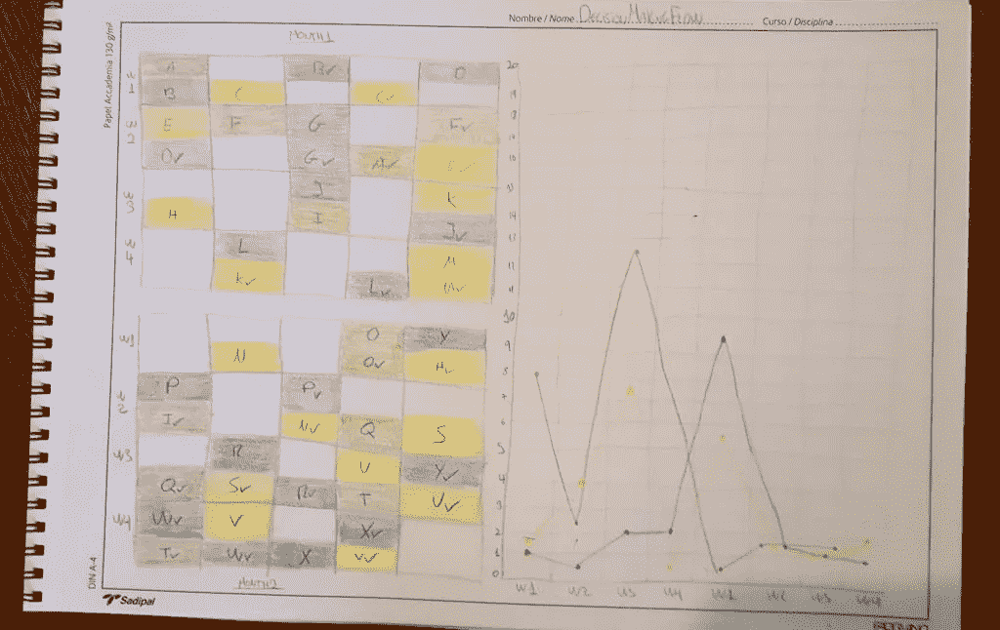

# 你如何可视化你的决策流程

> 原文：<https://medium.com/swlh/how-you-could-visualize-your-decision-making-flow-df5b594173c8>

受 Marius de Beer[敏捷决策的影响](https://youtu.be/T-43L1l9YBQ)

我想出了这个#决策可视化的模拟，基本上，我试图看到并更透明地了解如何影响团队的决策方式。每天我们都要向前迈进，对吗？我们工作的团队可能无法做出某些决定或执行某些操作，例如:如果我需要访问服务器，我很可能必须请求基础架构团队中的某个人为我提供访问权限，这并不意味着不好，这只是意味着我们必须等待某人向前推进。

你可以看到 3 种颜色，绿色意味着团队本身拥有解决方案，他们不需要任何人或任何东西来实现他们的需求。黄色意味着不属于我们团队的人必须为我们做一些事情。红色表示 mngmt 中需要有人来做。
字母表中的每个字母代表我们的要求、需要、决定等

如果你开始追踪你的团队等待物品的天数，你可能最终会有一个很好的图表，你可以用它来改善团队的合作和期望…你认为呢？
如果你在几周内看到任何颜色增加，这意味着你的#决策过程还有改进的空间。

marcos-pacheco.com

## 这篇文章发表在[《创业](https://medium.com/swlh)》上，这是 Medium 最大的创业刊物，有 291，182+人关注。

## 在这里订阅接收[我们的头条新闻](http://growthsupply.com/the-startup-newsletter/)。

