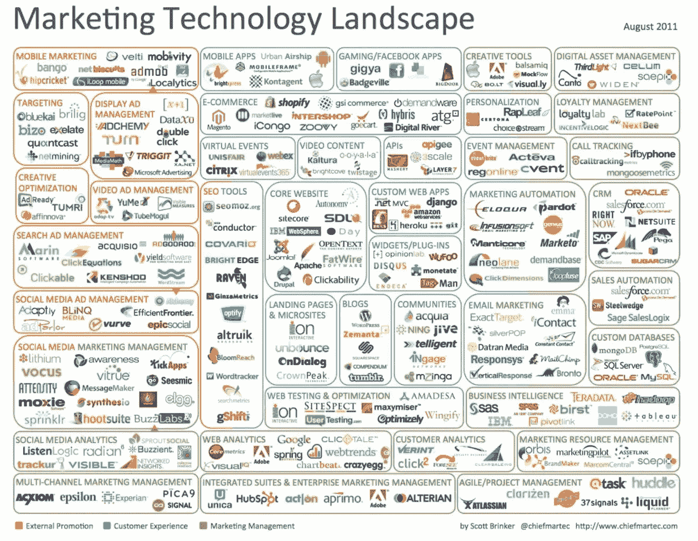

# 你如何销售比你卖什么更重要

> 原文：<https://medium.com/swlh/how-you-sell-is-more-important-than-what-you-sell-49f6a82db6e1>

## 原因如下。

我们已经进入了一个时代，在这个时代里，你如何销售已经变得和你卖什么(T2)一样重要。

原因如下…

**每一个产品类别都在竞争中*爆发*。**

> 顾客可以选择数百种他们想购买的产品。所有的都差不多。

基于产品特性的差异化在最好的情况下是短暂的，在最坏的情况下是不存在的。

**以营销技术为例……**

2011 年，[营销技术领域](http://chiefmartec.com/2011/08/marketing-technology-landscape-infographic/)共有 **150 家厂商:**

你可能会认为 150 英镑已经很难应付了。

但与今天相比，这只是沧海一粟。

在向下滚动之前，您能猜出目前有多少营销技术供应商吗？

大胆猜测一下。

我会等的。

请敲鼓。

…

…

…

回答:

# 5,000.

真是一团糟:

你真的相信拥有比 T21 稍微好一点的功能的厂商会赢得这场战争吗？

我不相信。

这只是一个例子。

同样的竞争爆发正在每个 B2B 类别中发生。

那里有你卖的“什么”的精确复制品。

最好的产品不太可能凭借自身的优势一路飙升。

# 这是在“扼杀”那些未能适应的销售领导

这种趋势正在增加销售领导者的伤亡人数。

那些未能适应这种变化的人正处于水深火热之中。

他们的寿命缩短了，因为他们努力想办法在这个新的高度竞争的世界中取胜:

他们中有太多的人仍然把他们的帽子挂在他们卖的东西上。

但并不是*都*黯淡。

有些销售领导已经想出了如何在各种噪音中茁壮成长的方法…

、、、根据*他们如何*销售来区分，现在*他们销售什么*。

# 你如何销售>你销售什么:案例研究

[佐拉](http://zuora.com/)这个*真的*好吗。

他们通过掌握如何销售而超越噪音，而不仅仅是 T42 销售什么。

这里有一个概述。

Zuora 有 12 个成熟的竞争对手(不包括该领域所有的小型初创公司)。

所有的产品都大同小异:**循环计费软件。**

然而不知何故，Zuora 的收入估计是最接近的竞争对手的 7 倍。

他们怎么能逃脱呢？

他们并不比他们的竞争对手更早出发。你会发现这里没有“先发优势”。

你可能会说他们有很好的市场营销。

在某种程度上，这可能是真的。

但他们的竞争对手实际上在营销的许多方面都超过了他们。

与竞争对手相比，看看他们的搜索引擎排名就明白我的意思了:

**归结起来就是:Zuora 因拥有当今 B2B 销售中最有效的销售演示之一******而闻名。****

**他们从世界上的一个重大变化开始了他们的演讲:**

> **“人们不再购买产品了。他们正在订阅 T10。”**

**然后，他们向潜在客户介绍这一新趋势的所有后果。**

**他们血淋淋地描述了一些公司如何因未能适应环境而付出代价，以及其他公司如何通过提供订阅产品和服务而取胜。**

****

**只有在讲述完这个故事后，他们才会介绍他们的产品。**

**换句话说，他们没有成功是因为他们卖的东西。**

**他们的订阅计费平台和其他平台没什么不同。**

***他们因为他们的销售方式而大获成功:***

****他们将订阅经济作为一个概念来推销，它如何改变世界，以及这对他们的客户意味着什么。****

**那些顾客成群结队地购买。**

# **是什么阻止了我们其余的人？**

**问题是我们如何销售是一个“黑箱”**

**销售对话是我们“如何”销售的顶峰。**

**当我们谈论你如何销售时，我们指的是你如何进行销售对话。**

**然而，作为销售领导，我们对销售对话视而不见。**

**这种盲目性是导致您的明星代表与其他人相分离的配额达成差距的根本原因:**

****

**如果你对自己的销售方式视而不见，你怎么能在销售方式的基础上取胜呢？**

**如果我们不了解我们销售团队的销售情况，我们就会像大海捞针一样。**

# **销售对话是一项战略要务**

**基于*如何*销售而获胜的关键在于**将销售对话视为战略要务。****

**它们包含了达成交易的决定性时刻。**

> **一家公司的成功将取决于他们销售对话的有效性。**

**将销售对话视为战略资产有许多“第一步”。**

**这是其中之一…**

**下载我们的免费电子书: [*赢得销售对话的终极指南*](https://goo.gl/B5pFe4) 。**

**给你团队中的每个人发一份。**

**它会发出正确的信息。**

**伙计们，现在就到这里吧。**

**在下面的评论中让我知道你的想法，或者**标记一个应该看看这个的同事。****

**我希望你喜欢这篇文章。**

**更重要的是，我希望你能做点什么。**

****

## **这篇文章发表在[《创业](https://medium.com/swlh)》上，这是 Medium 最大的创业刊物，有 285，454+人关注。**

## **订阅接收[我们的头条新闻](http://growthsupply.com/the-startup-newsletter/)。**

****