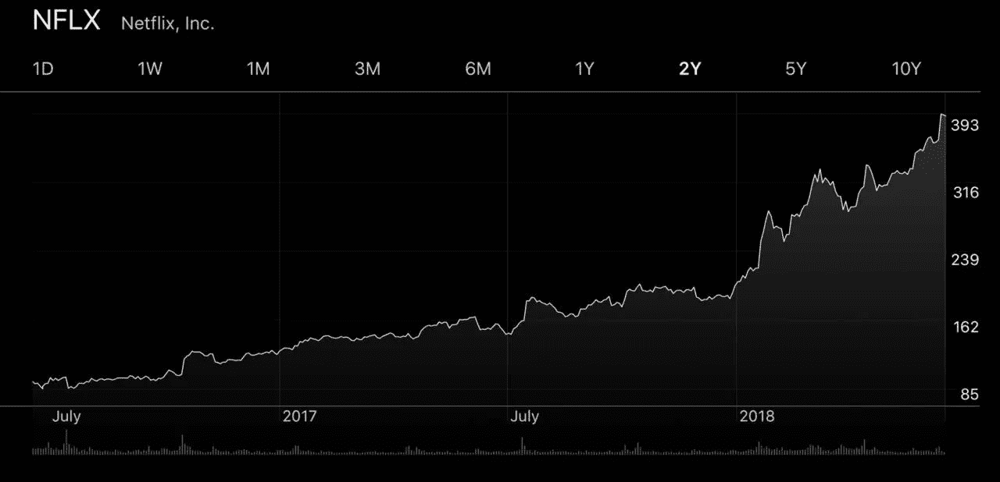

# 你的品牌如何实施网飞的非正统增长战略

> 原文：<https://medium.com/swlh/how-your-brand-can-implement-netflixs-unorthodox-growth-strategy-b7d59e7df323>

最近的一项评估显示，网飞的价值超过了迪士尼，成为世界上最有价值的媒体公司。他们是这样做的。

网飞的增长是梦寐以求的。

如果你仔细观察，这种梦是可以被模拟的。

他们的策略是你可以快速、简单、直接地用于你的品牌的策略。以下是方法。

# 更大的图景:网飞如何拥抱文化变迁

1998 年，网飞推出了 DVD 邮寄服务。

网飞在 1999 年引入了“随看随看”的订阅模式。

自 2007 年以来，网飞提供流媒体视频。

在这一点上，他们只是一个视频内容的分发渠道(现已倒闭的 Blockbuster Video 可以从中吸取重要的教训)。

> 当网飞选择推翻电视的旧商业模式时，这一切都改变了 *(突发新闻:这始于七年前)。*

这是转变的一部分，因为这家硅谷公司以用小红包邮寄 DVD 而闻名，它击败了 AMC 和 HBO，获得了英国迷你系列*纸牌屋的美国翻拍权。*

这是更大图景和网飞抱负的第一个暗示:超越他人知识产权的数字仓库。

毕竟，网飞的全球用户已经从《纸牌屋》首映前的 3300 万增加到今天的 1 . 25 亿。

快进到今天:网飞今年已经锁定了大约 1000 个原创作品。

> 从卑微的开始到今天，网飞现在制作的电视节目比历史上任何一家电视网都多。

它计划今年在内容上投资 80 亿美元。

# 创意是金鹅

当约翰和保罗决定“我们想要录制自己的原创音乐”(拒绝录制其他艺术家的音乐和歌曲的当前模式)时，披头士改变了游戏。

当第三方开发者充分利用 iPhone 和苹果设备的新技术和 UX 因素，给苹果提供别处没有的原创应用时，应用商店开始腾飞。

你认为 HBO 是什么时候起飞的？当它超越了他人的“优质视频”而生产自己的原创内容时。

亚马逊制作原创内容电影和电视节目，以及非常成功的 Alexa 设备和 Echo line 也是如此，远远超出了仅仅是出售其他公司的东西。

为什么乔氏的客户如此忠诚，也是如此。顾客得到所有这些私人标签的产品，这些产品似乎只能从 Trader Joe's 买到。

网飞也运用了同样的原则:制作你自己的原创作品，让你与其他人和你的客户有明显的区别，他们中的许多人不会制作原创的(或以原创的方式做一些事情)和对观众有价值的东西。

# 原创对网飞的影响以及我们如何消费视频内容

该公司进军原创内容领域颠覆了电视行业的诸多规范:网飞不会浪费数百万美元制作永远不会播出的试播集；*几乎它购买的每一个项目都是抱着直接进入系列的意图购买的。*

> ***最近的一项评估显示其价值超过迪士尼，成为世界上最有价值的媒体公司。***

它改变了我们看电视的方式，因为他们一次放弃整季的节目，而不是一周一周地分发剧集，这是自*我爱露西*以来的惯例，创造了“狂看”作为一种文化现象。他们让我们狂看，因为他们狂放。

如果你想在今天取得成功，这种对创意的利用以及对其在品牌中的作用的了解是至关重要的。

1.  保持原创。
2.  用独特原创的方式做“平凡的事”。挑战大会。
3.  尽一切可能让你的产品独特而有价值。
4.  通过与您做生意，让您的客户生活更轻松、压力更小、回报更多。

我在我的畅销书《品牌干预》**中谈到了更多这方面的内容，如果你对一个品牌负有任何责任，你应该拥有并阅读这些内容。**

**为你下金蛋干杯。**

****

## ***从这篇文章中得到了价值？
然后拍拍，分享，关注我，订阅我的* [*YouTube 频道*](https://www.youtube.com/user/headmusik) *每周有新视频。需要一个品牌重塑或一个难忘的主题演讲人？到达我这里***。****

******

## ***这篇文章发表在 [The Startup](https://medium.com/swlh) 上，这是 Medium 最大的创业刊物，拥有 336，210 多名读者。***

## ***在这里订阅接收[我们的头条新闻](http://growthsupply.com/the-startup-newsletter/)。***

******