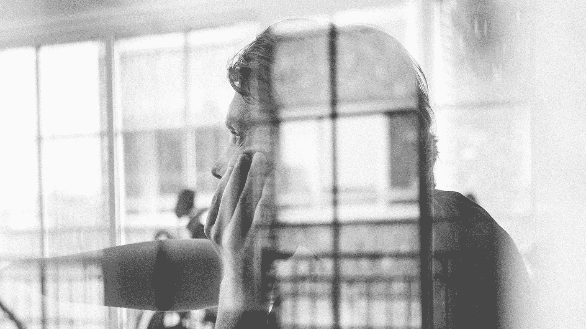

# 与你最大的敌人共处一室

> 原文：<https://medium.com/swlh/how-your-fear-of-solitude-is-holding-you-back-38531724188>

## 你对孤独的恐惧是如何阻碍你的

Originally published on [**JOTFORM.COM**](http://jotform.com)

你和你最大的敌人被困在一个房间里。

全力以赴，你开始做最坏的打算。当汗珠在太阳穴上形成时，你的心脏在胸腔中剧烈跳动，警告你危险即将来临。