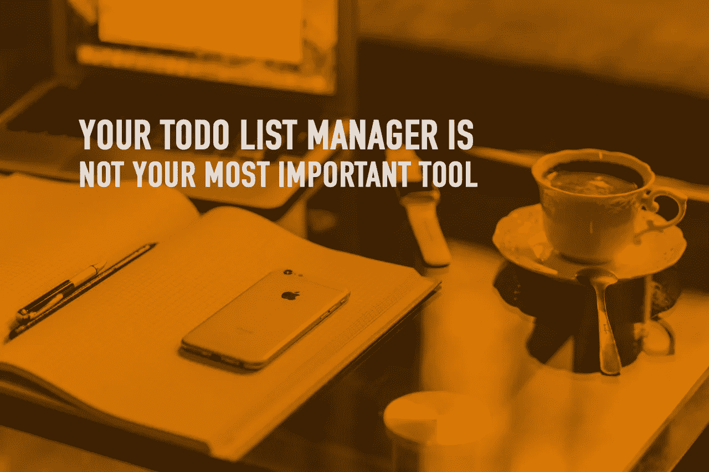

# 你的生产力系统应该如何工作。

> 原文：<https://medium.com/swlh/how-your-productivity-system-should-be-working-c388ab8f5f3a>

我要坦白一件事。我的大部分重要项目根本不是通过 [Todoist](https://www.youtube.com/playlist?list=PLAzfmm1gS2_UIsnCtmVq52bljDw8Am2VH) 来控制的。我的大部分图书项目、在线课程和 YouTube 视频都在 [Evernote](https://www.youtube.com/playlist?list=PLAzfmm1gS2_XNMhxQJoomJLKc-GG-1Ux6) 开始和结束。这是思想诞生、发展和建立的地方。Todoist 所做的就是告诉我什么需要改进。

让我解释一下。我每年的重要项目是我写的书。我喜欢写书，我每年的目标是写并出版一本书。这本书的策划发生在 Evernote。大纲、笔记、参考资料的链接和章节想法都在 Evernote 中。我将在 Todoist 中创建一个项目，但该项目中唯一的东西是一个任务— *“继续写书”*。

在项目的大部分时间里，这就是 Todoist 的全部内容；*《续书》*。现在写书是一个复杂的项目，涉及许多资源、待办事项和其他事情，但写书的实际任务是写作。没有别的了。这本书能完成的唯一方法就是我来写。所以，唯一要紧的任务就是*“续写本”*。一旦这本书完成了，编辑工作开始了，Todoist 就会开始完成任务。任务如*“重写第 6 章”*和*“为第 12 章寻找图像”*将进入 Todoist。但是在项目的大部分时间里，Todoist 内部实际上很少。

许多人认为生产力是在他们的待办事项管理器中有很多任务，但是，如果你非常清楚你想要完成/实现什么，你的待办事项管理器不会有太大的帮助。你的待办事项列表管理器会告诉你要做什么，但是你要做的最大部分的事情会留在你的笔记和参考资料里。那是头脑风暴发生的地方，那是材料和想法的垃圾场。如果您正在处理一个重要的演示文稿，您在该演示文稿中的工作将在 Keynote 或 PowerPoint 中进行。你的待办事项列表管理器对你演示文稿的实际创建没有太大帮助。你的笔记和参考资料会放在别的地方。

然而，我的待办事项管理器真正努力工作的一个领域是我每天必须处理的承诺和日常事务。当我和一个学生在一起的时候，他们问我是否可以给他们指出一些学习材料的方向，来学习公认的发音(标准的英式发音)，这个任务就会进入 Todoist。然后，当我一天结束回到家，处理我的收件箱时，我看到了那个任务，可以快速搜索并把材料发给我的学生。Todoist 还会告诉我当天需要完成哪些日常任务。比如更新我的教学计划，准备周六早上的商务英语课。

这些年来，我一直在使用一个数字待办事项管理器，我使用它的方式已经发生了变化。当我第一次开始时，每个任务都是在我的待办事项列表管理器中开始的。我认为那是做这件事的正确方法。随着时间的推移，我意识到，实际上在我的笔记应用程序中拥有我所有的笔记、链接和其他资源意味着我更多地是在我的笔记应用程序中工作，而不是在我的待办事项列表管理器中工作。今天，我的待办事项管理器只告诉我需要做什么和我已经做了什么。它就像一种安全网，帮助我避免忘记一些重要的事情。

我的待办事项列表管理器非常有用的一个地方是在我非常忙的日子里，我有一个接一个的课程和会议。在那些日子里，我需要我的待办事项管理器告诉我哪些任务需要完成，哪些任务可以推迟到下一天。当这些日子到来时，我发现把我所有的任务放在一个方便的列表中是至关重要的。我能看到我还剩下什么要做，我能确保重要的任务完成了，并把不太重要的任务重新安排到另一天。如果我面前没有这份清单，我会感到不知所措，不知道该做什么。尽管如此，这只是作为一个安全网。

不管你在做什么工作，真正重要的项目不应该需要太多的待办事项管理器。如果这个项目足够重要，你就会知道下一步需要做什么。我正在编辑我的新书。我真的不需要我的待办事项管理器来告诉我编辑这本书。我只需要一个地方坐下来，放上我的电脑和笔记。同样，2018 年的《时间与生活掌握练习册》是另一个大项目，我的待办事项经理不需要告诉我继续设计那本书。一打开 InDesign，我就知道需要做什么。我的待办事项列表管理器对完成它们没有太大的帮助。我的待办事项经理需要告诉我的是那些容易忘记的小事，比如安排把车送去维修，或者安排和我的员工开会做年度员工评估。

当你做到这一点，你的待办事项管理器和笔记和谐地一起工作，你的工作流程就变得有节奏，你的系统就会无缝地工作。承诺和小任务不会被遗忘，你正在做的真正重要的事情比其他任何事情都重要。你的系统正常工作，你的生产力飙升，你开始实现不可思议的事情。

谢谢你阅读我的故事！😊如果你喜欢这篇文章，请多次点击下面的拍手按钮👏这对我意义重大，也有助于其他人了解这个故事。

我的目标是向你展示如何过上你想要的生活。帮助你找到快乐，变得更有条理，更有效率，这样你就可以做更多生活中重要的事情。

如果你想更多地了解我的工作，你可以访问我的 [**网站**](www.carlpullein.com) **或者你可以在** [**推特**](/swlh/www.twitter.com/carl_pullein) **，**[**YouTube**](https://www.youtube.com/c/CarlPulleinGTD?sub_confirmation=1%0A)**或** [**脸书**](https://www.facebook.com/CarlPulleinProductivity/) **上打个招呼，并在这里订阅我的每周简讯**

****

## **这个故事发表在 [The Startup](https://medium.com/swlh) 上，Medium 的出版物有超过 256，410 人关注。**

# **订阅[在这里获取头条](http://growthsupply.com/the-startup-newsletter/)。**

****