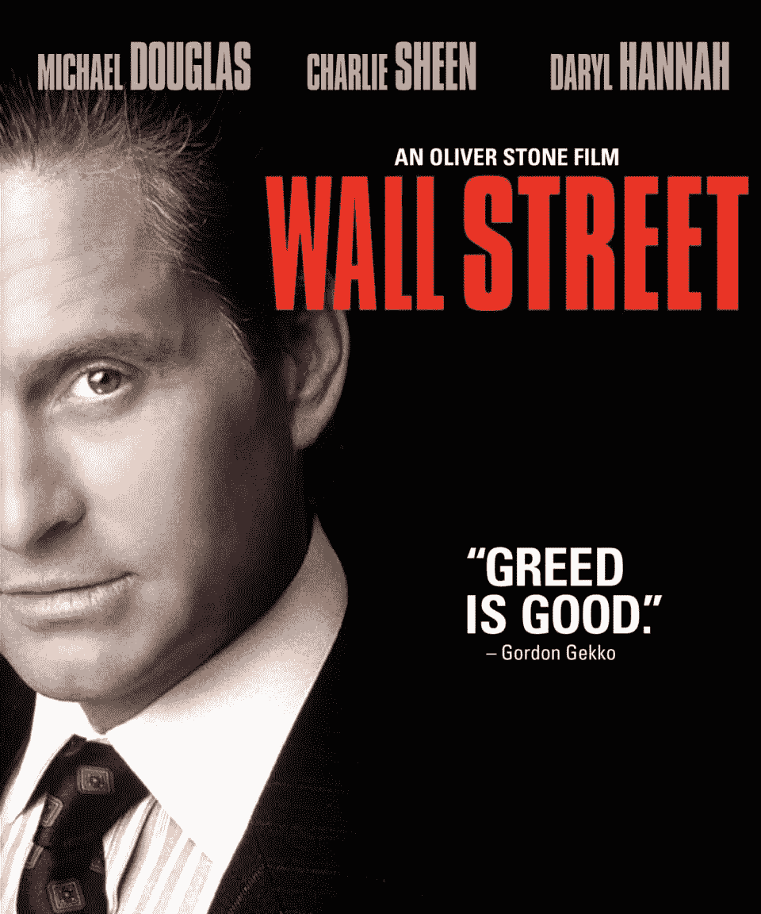

# 你与金钱的关系是如何暗中破坏你的，以及如何修复它

> 原文：<https://medium.com/swlh/how-your-relationship-with-money-secretly-sabotages-you-and-how-to-fix-it-e1faea305ff5>

**钱。**

没有几个词像这个神奇的词那样有力量引发如此强烈的爱与恨。

[**金钱，我的生命之光，我的欲火**](https://amzn.to/2NCpr84) **。我的罪恶，我的灵魂。**

**周一:当你的嘴唇高潮时，舌尖离开你的上颚，发出甜蜜的声音。**

这是一个黑暗而美味的词，它被编织进我们想要的一切和我们讨厌的一切，有时是同时的。我们希望没有它也可以，然而每个人都暗暗渴望它，想象它能解决他们所有的问题。

[Greed is good](https://amzn.to/2LhQoAv).

作为一个社会，在万能的金钱的催眠力量下，我们时好时坏。

20 世纪 70 年代的迪斯科让我们想要更多、更多、更多。“在 80 年代的电影中，像[华尔街](https://amzn.to/2uv10Cp)告诉我们“贪婪是好的”,作为一种文化，我们庆祝财富的华丽展示，从跑车到快女，再到富可敌国的名人脖子上闪闪发光的金子[。长发、皮裤和电灯标志着那个时代的音乐，摇滚歌手和流行歌星过着光鲜亮丽的生活。甚至像宠物店男孩这样的另类乐队也演唱了“](https://www.rollingstone.com/culture/culture-lists/50-things-millennials-have-never-heard-of-13946/lifestyles-of-the-rich-and-famous-224515/)[让我们赚大钱。他们的意思是讽刺的，但当时很少有人这么想。](https://amzn.to/2NYCL7B)

然而，我们对金钱的热爱与恐惧和厌恶交替出现。

在 90 年代，对快速现金文化的强烈反对生根发芽，以垃圾摇滚为代表。涅槃穿着格子衬衫和破洞牛仔裤，使得大发带的皮裤和激光灯看起来非常不酷。网络公司和经济的崩溃让憎恨富人再次成为一种生活方式。

它从未真正离开过我们。

2008 年的房地产危机加速了仇恨，因为不那么聪明的算法和掠夺性的银行摧毁了世界。

这种情况一直持续到现在，对金钱和掌握金钱的人的权力的反弹不断上升。“精英”已经成为我们这个时代的口号。

到处都有政客和改革者愤怒地指责他们，即使他们自己也是秘密的精英。我们把社会的一切问题都归咎于权贵和他们贪得无厌的贪婪。如果我们能把他们根除，让简单、高尚的人掌权，这个世界就都好了。

**但这真的是真的吗？**

**或者富人只是众多替罪羊中的又一个方便的替罪羊？**

像很多事情一样，真相介于两者之间。

金钱是一种不同于其他任何力量的强大力量。它比夏末的风雨和风暴更有力量。它影响着我们周围的一切。它既不是善也不是恶，但有时它可能是两者兼而有之，让我们彼此分离，也可能让我们合而为一。

那么，是什么让金钱对我们有利或不利呢？

**简单。**

我们与金钱的关系就是一切。

糟糕的关系就像糟糕的婚姻。它摧毁了周围的一切。

良好的关系就像火红的清晨日落。它照亮了我们的整个生活，让我们更容易做任何想做的事情。

但是我们与金钱的许多关系都严重破裂了。我们陷入了爱与恨的恶性循环。

打破这个循环，让金钱以积极的方式为我们服务，这取决于我们。

**但是如何？**

**重新开始。**

我们必须重新点燃我们与金钱的浪漫。

我们必须回到我们第一次相遇的时刻，重新开始。

正如除非我们清理了田地，否则新的作物无法生长一样，除非我们清除过去所有阻碍我们的错误观念，否则与金钱的新关系无法开花结果。

如果你想赚更多的钱或者创业或者擅长股票和加密货币交易，那么来和我一起散步，我们一起清理场地，这样你就可以在充满机遇和冒险的黄金之地重新开始。

# 金钱的阴暗面

货币的变化基于两个因素:

*   我们对它的体验。
*   我们如何看待它。

让我们从经历和它如何塑造我们的好坏开始。

首先是坏消息。

往往是我们糟糕的经历摧毁了我们赚钱的能力。

[Money](https://amzn.to/2L5PZSi), it’s a hit
Don’t give me that do-goody-good bullshit
I’m in the high-fidelity first class traveling set
And I think I need a Lear jet

当我年轻的时候，我在纽约市的一家电脑顾问公司工作，那里有一些世界上最富有的客户，包括[福斯特曼·利特尔](https://en.wikipedia.org/wiki/Theodore_J._Forstmann)的已故[泰迪·福斯特曼](https://en.wikipedia.org/wiki/Theodore_J._Forstmann)，这是一家强大的私募股权公司，现在已经随风而逝。福斯特曼拥有[湾流航空](http://www.gulfstream.com/)(私人飞机公司)[扬基蜡烛](https://www.yankeecandle.com/)和[托普斯交易卡](https://www.topps.com/)。他拥有超过 16 亿美元的个人财产。

为了让你感受到这个男人有多强大，有消息称他在迷人的戴安娜王妃英年早逝前欺骗了她，而且王妃正考虑和他私奔。

但这只是冰山一角。

我曾经不得不为公司重建一个损坏的 Excel 文档。工作人员告诉我，他们需要它来邀请人们参加他们的独家年度派对。经过几天的努力，我们奇迹般地成功重建了这份文件，却发现里面有全国所有名人和首席执行官的私人电话号码。

我在那里工作时，类似的事情比比皆是。我曾经在一次私人飞机旅行中看到葡萄酒的价格，它的价格为 40，000 美元，这在 90 年代初是一笔巨款。泰迪很有钱，他在自己的庄园里雇了一名全职捕兔员，在办公室里还雇了一名美食厨师，每天为七个人做饭。

这只是我的顾问认为是他的客户之一。

我记得一家由五个人经营的小型对冲基金，他们办公室里的古董和波斯地毯比大多数博物馆都多。另一家公司的首席执行官把他和比尔·克林顿以及最高法院法官的照片挂在墙上，他们都手挽手。这些公司的私人助理每年能挣几十万美元来保护这些珍贵的秘密。

这似乎是一份理想的工作。

那是一场噩梦。

我讨厌每一秒钟。这些人是地球上最可怜的人。

我记得有人让我修泰迪的笔记本电脑。我在他的大办公室里，周围都是他的奖杯和奖牌，这是富人不劳而获的东西，因为各种组织试图吸引他们和他们的钱。我很清楚，他可能一生中从未使用过这台机器。它几乎没有开箱，甚至没有完全安装正确。当我正在做的时候，他的私人秘书尖叫着跑了过来:

“你现在必须走了！他来了！他来了！”

一开始我看着她，好像她有两个头。她到底在说什么？为什么我必须离开？

后来我明白了。我是帮手，而帮手永远不会出现。

我只是路上的一只小昆虫。

现在泰迪走了，他经常被视为一个好人。为什么不呢？尽管我刚才说的一切，在许多方面他是一个好人，人在生活中不仅仅是一件事。

他激烈地批评了 80 年代用垃圾债券筹集巨额资金和用杠杆收购袭击企业的恶劣做法。他来自企业袭击者时代，但他反对恶意收购和用有毒债务为其融资。

但我从未见过他的那一面。我只看到了他黑暗的一面。

他的前私人助理给我讲过他如何和员工玩恶意游戏的故事。她说，有一次他把护照藏起来，一路跑到机场，然后冲她大喊“忘了”，让她在他等的时候回去拿。

我可以讲更多的故事，但我不会。很简单，这些是你害怕的富人，1%中神话般的 1%，你在最黑暗的阴谋论中想象的一切等等。

那次经历毒害了我十年的金钱观。

它教会了我一件事:

要致富，你必须残酷无情。

我以为发财的唯一方法就是从每个人身上拿走。我相信《教父》开头巴尔扎克的名言“每一笔巨大财富的背后都是一种犯罪。”反社会者和精神变态者在顶端茁壮成长，残酷地压制他们面前的小人物，除了他们自己，不考虑任何人。

我不想和这件事扯上任何关系。

在我的潜意识里，我认为金钱是肮脏、黑暗和邪恶的。对我来说那都是血汗钱。因此，当我有机会积累自己的筹码时，我总是设法以自己的方式来进行。

**那是因为每个人都能得到他们生活中想要的东西。**

**即使我们不知道自己在要求什么。**

我们大多数人根本不知道自己想要什么。

我当然没有。事后看来，很明显我是在要求*而不是*赚钱，因为我不想成为那些邪恶的人之一。马后炮，就像他们说的，是 20/20。

我想成为一个好人和艺术家，这意味着尽可能远离金钱。

我们有限的经验快速有效地规划我们的潜意识。而我们的无意识编程悄悄指挥着我们的一举一动，让我们远离更丰富更充实的生活。我们完全完全看不见我们内心的机器，被我们看不见也感觉不到的无形的线拉着前进。

这让我自我破坏我所有的努力，使真正的财富。我总是做得很好，然后找到一些方法拉回和短路的过程。

**但是后来** **我意识到了一些本质的东西:**

**一直以来都是我的错。**

除了我自己，没有人应该受到责备。

是我自己对金钱的信念阻碍了我。

我的样本量太小了。我没有足够的经验，我让有限的经验塑造了我对世界的一切看法。

它从来都不是真的关于那些可怕的人。这是关于我是谁，我需要成为谁。

# **掌握自己，掌握自己的钱**

但是我需要成为什么样的人？

有不同的赚钱方式吗？

我不知道，但我决心弄清楚。我想找到一种致富的方法，一种忠于我自己的信仰和本性的方法。很长一段时间我都不知道答案。

然后一些事情改变了一切。

它始于一个承诺。

对自己的承诺。

多年来我一直想成为一名作家，但我从未真正投入其中。每个人都是这样。首先是承诺，然后是掌握你的手艺。没有这种承诺，你永远不会有时间去达到精通。

《贝格·万斯传奇》的作者史蒂文·普莱斯菲尔德在《艺术之战》中讲述了这位艺术家的旅程。多年来，普雷斯菲尔德竭尽全力写作。他拖延，找借口，责怪他人，责怪社会，责怪他的生活、工作和环境。

有一天，他厌倦了开出租车，不想写作，于是他回到家，从一堆垃圾中找出打字机，开始写作。从那以后，他在纯粹的幸福中洗碗，从那天起，他知道他是一个作家。

他又过了十年才卖出第一本书。

大多数人认为他卖了那本书就成了作家，但这不是真的。这始于 10 年前的那个决定命运的日子，当时他致力于变好的过程。

变好需要时间。

它需要很多年的时间每天敲打键盘，一周又一周，一月又一月，一年又一年。没有捷径可走。只是奉献和时间。

任何事情都是如此。

无论你是想擅长建造房屋、交易加密货币、开创商业帝国、成为一名医生，还是其他任何需要技能和奉献的事情，都始于与自己建立的神圣纽带。

这不是一件容易的事。

我们不会像选择汤而不是沙拉那样选择一个深刻的、一生的承诺。我们不得不忍受如此多的痛苦，以至于我们别无选择，只能屈服，将我们的生命专注于更伟大的事情。

我花了几年时间涉猎写作，但从未真正投入其中。我写了一些短篇小说，匆匆写了一些糟糕的小说和剧本，但我并没有真正好转。我试着去卖这些书，当它们卖不出去的时候，我通常会放弃或者在我喜欢的时候写作。

然后有一天，我知道我已经尝试了所有可能的方法来避免做我喜欢的事情，我已经受够了。我的灵魂生病了。在我内心深处，我正在死去，每天都是我灵魂中潮湿、细雨蒙蒙的十二月。

那时候我知道我想做一件事，而且是一个人做一件事:写作。

我每天都致力于写作，并向自己承诺，除非我死了，否则我不会停下来。从那一刻起，我知道我会做任何必要的事情，以擅长在一页纸上挥洒文字。

There is no substitute for mastering your craft.

又过了十年，人们才开始大量阅读[这个博客](/@dan.jeffries)和[我的书](https://www.amazon.com/Daniel-Jeffries/e/B00D1HG62U)。

我喜欢说我只用了二十年就一夜成名了。

也许你想知道写作和金钱有什么关系？

好问题。

**当我们找到自己真正热爱的东西，我们真正热爱的东西，并最终投入其中时，一切都会改变。**

我们向世界辐射一种新的能量。我们吸引新的人群，因为我们来自一个充满力量和真实的地方。其他人也能感觉到。他们从你、你的言语和行动中看到了这一点。这就像把你的灯从篮子里拿出来，放在山顶上，让全世界都看到它的光芒。

既恐怖又美妙。这意味着你可能会破产，因为把自己置于危险之中是一个很大的风险。但是就像海明威说的“我们作为人类的唯一价值是我们愿意承担的风险。”

当我们冒这些风险时，我们会突然遇到我们从未想过会遇到的人。这就是有钱有势的人回来的原因，也是我与金钱的关系。

因为我的工作，我认识了世界各地的人，来自各行各业，富人和穷人，以及介于两者之间的所有人。我见过作家、风险投资家和艺术家、无家可归者和超级富豪、有权有势者和无权无势者。我旅行过，站在世界上最大的城市的街道上看日落，想知道我是怎么来到这里的？

就在那时，我意识到还有第二条通往金钱的道路，一条与第一条截然不同的道路。

当最弱小和最阴险的富人走上暴力和仇恨的道路时，另一群非常特殊的人走上了光明的道路，一条健康的道路，一条开放和富足的道路。这些人不认为世界是一个零和游戏，其他人都是他们的玩物。

像许多其他人一样，这些人在山顶上看到了我的光芒，他们想与它联系起来。

那么现在人们到底在我身上看到了什么？

**他们感受到的是我为他人创造价值的能力。**

写作、人际关系、创业、教学以及生活中的许多其他方面都不仅仅是我们自己。

写作不仅仅是关于我和我想说的东西。这是我和你，读者之间的一种伙伴关系。

如果我想写什么就写什么，那就没人会看了。然而还不止这些。如果我只写你想看的东西，而不考虑真实的自己，那还有什么意义呢？我会成为页面的奴隶，我们会有一种寄生关系。

**真正的关系建立在信任的基础上，信任是随着时间的推移赢得或失去的。**

这是一种互让。我们为彼此创造价值。

**既自私*又*无私。**

金钱也是如此。

一旦我学会了如何自由地给予，我就开始吸引那些在自己的生活中也这样做的人。

我通过写作和加密货币项目认识的一位了不起的女士刚刚举行了她的生日聚会。她邀请我们去法国南部，为我们所有人租了一个巨大的城堡来开派对，还雇了一个两星级的米其林厨师来招待我们。就像你想象的那样不可思议，绵延起伏的绿色葡萄酒田在一望无际的蓝天下延伸，梦幻般的古老农舍和城堡在田野中闪闪发光，成为过去时光的回忆。

虽然这听起来像是我曾经在纽约市做 IT 无名小卒时看到的那种华而不实的金钱展示，但事实并非如此。

这是完全不同的事情，因为这是一个不同类型的女人。她关心别人胜过关心自己。有一次，她为每个人连续做了三个小时的饭，因为她想让他们都享受一顿美味的大餐，结果累得瘫倒在地。

这也是一个与众不同的派对。

不全是喝醉和跳舞，虽然肯定也有一点。这是关于我和几乎所有在场的人进行的令人惊奇的谈话，那些被她的光芒和善良所吸引的人。

人们工作、玩耍、分享。

他们都有自己的生意，在世界各地做慈善工作，不仅仅是周末的慈善工作，而是那种需要时间和承诺的工作。他们帮助遭受政治和自然灾害严重打击的地区的人民，以及受最严重贫困影响的地区的人民。

他们都想让世界变得更好。

他们正在这样做，而不仅仅是谈论它或希望它或等待它发生。

你看，真的有两条赚钱的路:

*   **自私自利的道路。**
*   **为他人创造价值的道路。**

只有第二条路是值得的。

当你遇到第二条道路上的人时，你会意识到他们非常关心别人，他们也希望你成功，而不仅仅是他们自己。

如果你在生活中从未见过富人，你可能会因为恐惧而对他们有刻板印象，但直接的经历是生活中唯一真正的老师。如果我们从来没有遇到过不同阶层的人，我们很容易把他们妖魔化。

我理解你的冲动，相信我。

我年轻时的经历只让我看到了事情的一面。如果你只看到这些，那就很难超越它。

我不会假装每个掌权的人都是好的，都有一颗慈善的心和让世界变得更美好的热情。那就太天真了。

但是，用同样的画笔描绘每个人，并假设每个有权力的人都是把穷人当早餐吃的寄生虫，这同样是幼稚的。

当我们用画笔描绘每个人时，我们是在欺骗自己。我们故意视而不见，被[合成谬误](https://www.logicallyfallacious.com/tools/lp/Bo/LogicalFallacies/88/Fallacy-of-Composition)所困。各行各业都有好人坏人。富人也不例外。

但是如果你拒绝看到这一点，如果你把所有有钱的人都放在同一条船上，那么你自己永远也不会赚钱。你会和我一样，把它看得污秽恶心，每走一步都会暗中破坏自己。

那种想法伤害的不仅仅是别人，它伤害的是你和你在生活中索取和得到你想要的东西的能力。

金钱不会让我们变得善良或邪恶。这是一种催化剂。它只是在我们拥有它之前加速了我们的自我。

如果我们在赚到第一个 100 万之前是冷血的混蛋，那么我们在赚到第一个 100 万之后肯定也会是冷血的混蛋。割喉者身后留下毁灭。这不是值得效仿的，而是值得鄙视的。

但是第二条致富之路是非常不同的。真正的赚钱之道，是做出每个人都想要、都需要的东西。你想要建立一些东西来推动社区和激情。当你这样做的时候，你为每个人掀起了浪潮，这只会让你在这个过程中变得更加富有。有些是给你的，有些是给其他人的。

平衡是最好的。

**我们如何看待世界，造就世界。**

**错误的思维，错误的结局。正确的想法，正确的结果。**

当然，如果能在人生的早期遇到这种人就太好了，但是我没有那么幸运。不过这并不重要。在很多方面，我都没有准备好。我没有学会创造自己的价值，也没有学会自由地奉献我的想法和时间。反正我也不怎么担心了。

我就在我该在的地方。每件事都在该发生的时候发生。现在，我很感激在我人生的这个阶段遇到了这样的人。

这完全改变了我对如何理财的看法。

钱现在是我正常流动的一部分。

你不是靠从每个人身上拿走钱来赚钱的。你通过帮助其他人致富来实现。

这是我对每一位读者的目标。

如果我能让你们所有人退后一步，用正确的方式看待金钱，那么我知道你们会找到我找到的东西。

当你知道如何使用它，如何与它一起流动，如何驾驭它，不再抗拒它时，赚钱就变得容易多了。你自然会为别人创造价值，不求回报。我不是超级富豪，可能永远也不会是，但我总能在需要的时候得到我想要的东西。

你也可以。财富是相对的。要过上你梦想的生活，你到底需要多少钱？可能比你现在要求的要多得多，也比你想象中会让你觉得富有的要少得多。

大多数人不需要几百万去做他们喜欢的事情，也不会觉得他们的手机下周就会关机。

知道自己真正需要的是什么，并提出要求。

当你进入资金流时，你不必担心你的下一张支票从哪里来，因为它会从某个地方回到你身边，即使你从未问过。它可能来自同一个源头，也可能来自不同的源头，但没关系，它会来的，就像因果报应一样确定。

金钱是能量。它汇集、流动、变化。你与它结盟。你不要勉强。你继续吧。

一旦你知道如何运用它，它就是这个星球上除了你自己不屈不挠的意志和心灵力量之外最强大的工具。

赚钱有两条路。

而我，我选择了人迹较少的那一条。

############################################

我在 Crypto Trader Central group 的朋友们正在[做一项名为 **#Blockchain4Good**](/@katmai_27208/ctc-blockchain4good-event-in-cooperation-with-the-miracle-foundation-e5ac26ff9767) 的慈善捐赠活动——比赛收入的 80%将捐给神奇的 [**奇迹基金会**](https://give.miraclefoundation.org/team/177279) ，这是一个每天为世界各地的孤儿创造奇迹的组织。

############################################

## 如果你喜欢我的作品，请访问我的个人主页，因为没有它，这个博客就不会存在。

## 顶级赞助人可以独享这么多东西:

*   **每篇文章、播客和私人谈话的早期链接。**你比任何人都先阅读和聆听！
*   **一个月月虚拟的和我见面并问&一个。**问我什么我都会回答。我也分享我正在做的一切，并给你一个幕后看我的过程。

## 访问传说中的硬币表 Discord，您会发现:

*   **市场来电**来自我和其他专业技术分析大师。
*   **币**只**私聊**。
*   **私人海龟滩频道，程序员们在这里分享各种版本的** [**密码海龟交易员策略**](https://hackernoon.com/my-super-secret-crypto-turtle-strategy-revealed-ae7492fb01a6) **等信号和交易软件**。
*   幕后看看我和其他专业人士是如何解读市场的。

###########################################

简单介绍一下我:我是一名作家、工程师和连续创业者。在过去的二十年中，我涉及了从 Linux 到虚拟化和容器的广泛技术。

## 当你加入我的读者群，你可以免费得到一本我的第一部小说《蝎子游戏》。读者称之为“神经癌的第一次严重竞争”和“黑色侦探会见约翰尼记忆术。”

## 最后，你可以[加入我的私人脸书小组，Nanopunk Posthuman 刺客](https://www.facebook.com/groups/1736763229929363/)，在这里我们讨论所有的科技、科幻、幻想等等。

## 这个故事发表在 [The Startup](https://medium.com/swlh) 上，这是 Medium 最大的企业家出版物，拥有 351，974+人。

## 在这里订阅接收[我们的头条新闻](http://growthsupply.com/the-startup-newsletter/)。

