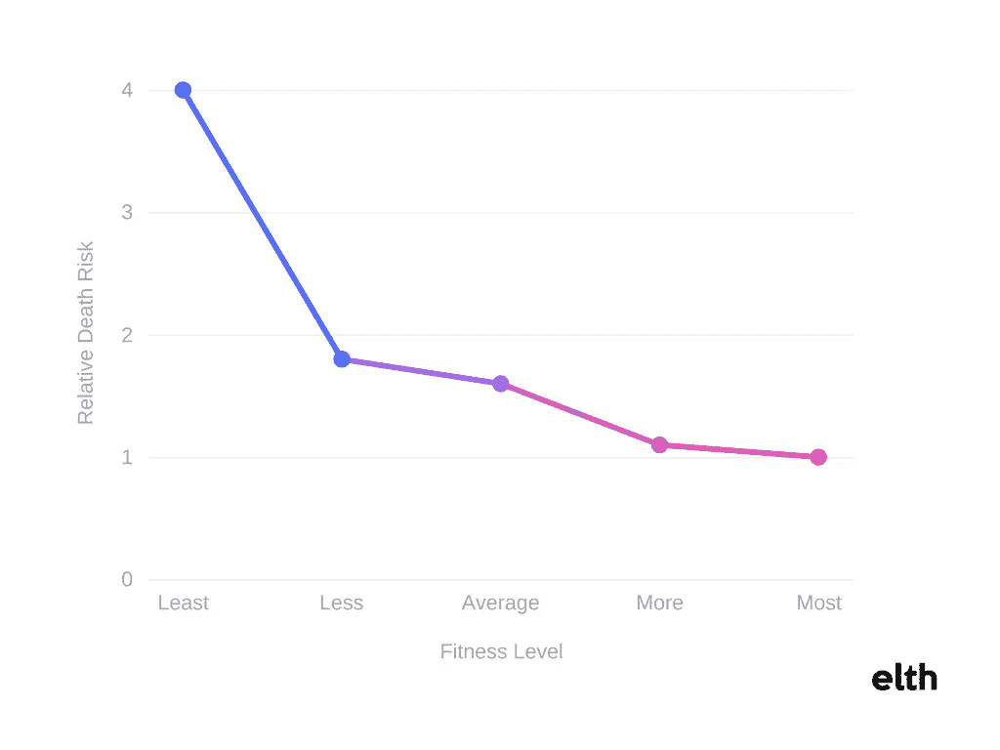
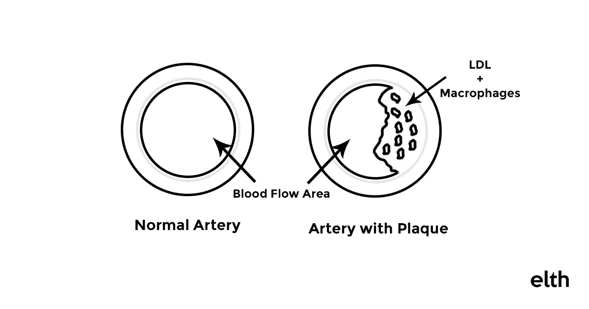
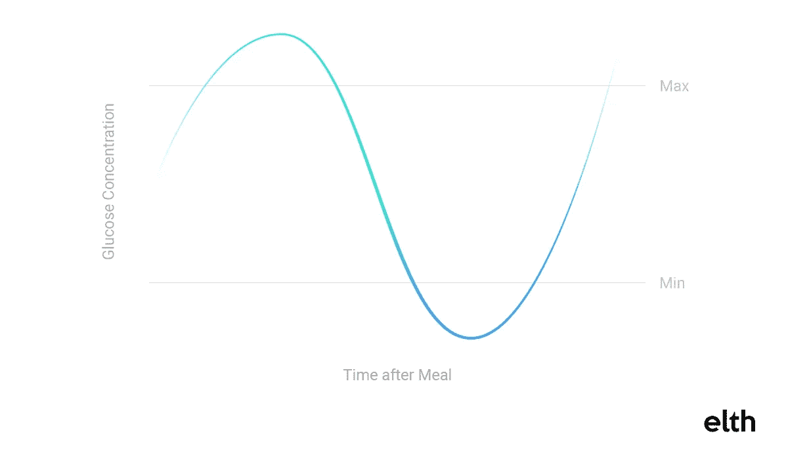

# 你久坐不动的生活方式是如何杀死你的

> 原文：<https://medium.com/swlh/how-your-sedentary-lifestyle-is-killing-you-d8949b323d13>

## 你热爱的案头工作在幕后造成了很多伤害…

Photo Credit: [Michał Kubalczyk](https://unsplash.com/photos/WecngmAT-KY?utm_source=unsplash&utm_medium=referral&utm_content=creditCopyText)

在人类进化的早期，我们没有机器或太多的工具来帮助我们进行日常的生存活动。

我们不得不依靠我们的脚来移动，而不是在一个有轮子的盒子里四处游荡(*亲爱的宝马，无意冒犯*)。

我们必须经历一个彻底的狩猎过程才能把食物放进肚子里。

久坐的生活方式在当时是一个相对陌生的术语。这是一个较新的概念。

人体是为运动而生的。

它不应该静止太久。

当你四处走动时，奇妙的事情会发生在你的身体上，并在你开始懈怠时停止。

随着我们越来越依赖于技术，我们不再需要四处迁移来做很多工作。

我们被绑在闪亮的办公室里桌子前的椅子上，醒着的大部分时间都在工作，屁股粘在椅子上。甚至当我们搬家的时候，我们用汽车之类的机器四处走动，而不是走路(*懒我们*)。

这种习惯的改变是身体无法适应的，因此导致了许多人类健康问题的出现。

从让你变胖到挤压你的骨头，久坐的生活方式有很多负面的好处。

为了让你清楚地了解这种新时代的生活方式对你的整体健康有多大的影响，这里有一张图表，显示了根据你的健康水平，你死亡的可能性有多大。

Figure 1\. Graph showing relative death risk with respect to fitness level [[1](http://diabetes.diabetesjournals.org/content/56/11/2655)]

让我们深入研究这个问题，看看久坐不动的生活方式对我们健康的哪些方面有影响，看看它到底是如何影响的，以及如何克服这个坏习惯。从头号罪犯开始。

# 让你变胖

我们身体中的脂肪主要以甘油三酯的形式存在。由于不溶于血液，甘油三酯包裹在称为脂蛋白的蛋白质结构中，在身体各处流动。

为了利用脂肪，肌肉和脂肪组织都会产生一种叫做脂蛋白脂肪酶的酶。这种酶分解脂蛋白，揭示甘油三酯，并通过称为**水解**的过程将其进一步分解为游离脂肪酸。

> 这种平衡失调使得脂肪细胞将越来越多的脂肪酸转化为甘油三酯

游离脂肪酸主要以两种方式被利用——要么被骨骼肌组织消耗为能量，要么被转化回脂肪。

然而，在身体吸收多少脂肪酸之间存在着微妙的平衡(*你不想打扰*)。

组织(*肌肉和脂肪*)的工作是促进整体肌肉的发育和维护，同时通过保持适当的平衡来限制过多的脂肪储存。【[2](https://file.scirp.org/pdf/Health_2012123111225935.pdf)

骨骼肌组织中高浓度的脂蛋白脂肪酶会导致一种叫做**底物窃取**的现象。

这只不过是更多的脂肪酸流向肌肉组织用作能量，而不是储存为脂肪。[ [**3**](https://www.researchgate.net/publication/12203141_The_role_of_lipoprotein_lipase_in_adipose_tissue_development_and_metabolism)

当我们倾向于过度休息时，例如连续坐几个小时，我们骨骼肌组织中的脂蛋白脂肪酶活性下降了相当大的幅度——因此，破坏了精细的平衡。[ [**4**](https://www.ncbi.nlm.nih.gov/pubmed/12815182)

这种平衡失调使得脂肪细胞将越来越多的脂肪酸转化为甘油三酯。

因此，这些甘油三酯以脂肪的形式储存起来，以备将来某个时候需要被燃烧掉，目前肌肉组织停止了脂肪燃烧(*该买新裤子了*)。【 [**5**](https://file.scirp.org/pdf/Health_2012123111225935.pdf)

在很长一段时间内一遍又一遍地重复这个过程，你会发现你的胖银行比你实际的银行账户填满得更快。嗯，除非你想成为相扑运动员，否则你不会想填满你的脂肪库。

# 增加你患心脏病的几率

与甘油三酯类似，胆固醇也需要包裹在蛋白质结构中，才能在身体各处移动。

是的，包裹在好老的*脂蛋白*里。

我们的身体，主要是肝脏，从我们吃的食物中产生不同种类的脂蛋白，以平稳地将甘油三酯和胆固醇运输到我们身体的不同部位。

在这些不同类型的脂蛋白中，有两种类型与心脏病发作关系最大。

其中一种叫做**低密度脂蛋白** ( *LDL* )，另一种叫做**高密度脂蛋白** ( *HDL* )。

它们之间的主要区别在于胆固醇与蛋白质浓度的比例。低密度脂蛋白胆固醇浓度较高，而高密度脂蛋白蛋白质浓度较高。

LDL 的主要工作是将胆固醇输送到需要的不同部位。高密度脂蛋白清除多余的胆固醇。[[**6**](http://study.com/academy/lesson/what-are-lipoproteins-definition-functions-types.html)][[**7**](https://courses.washington.edu/conj/bess/cholesterol/liver.html)]

> 这些肿块限制了通过动脉流向心脏的血液量

当低密度脂蛋白通过大中型动脉时，它们开始刺激动脉内壁。

这导致层的破裂和 LDL 主动进入安全壁之外的动脉内膜(*希望它像* ***中国的长城*** )一样坚固)。

作为一种保护机制，我们的身体有一种叫做巨噬细胞的细胞，它随着血液流动在身体周围巡逻，以发现不规则的活动或外来细胞。

如果发现异物，异物会从体内排出。巨噬细胞检测到低密度脂蛋白异常进入动脉内膜，试图吞噬低密度脂蛋白并将其从犯罪现场清除。

在这个过程中，巨噬细胞最终死亡(*再见，老朋友*)，并在膜内形成更多杂物，导致动脉壁隆起(*有点像斯巴达人建造的墙*)。

这个肿块有个名字——**动脉斑块**。

这些肿块堵塞了通道，限制了通过动脉流向心脏的血液量。继续这样下去，动脉阻塞会变得严重到足以让你心脏病发作。[[**8**](https://www.ncbi.nlm.nih.gov/pubmed/26844337)][[**9**](https://www.khanacademy.org/science/health-and-medicine/circulatory-system-diseases/blood-vessel-diseases/v/atherosclerosis-part-1)]

Figure 2\. Cross sectional view of an artery in both normal and plaque condition

但问题是，身体不活动或久坐与动脉斑块有什么关系？

研究表明，身体不活动会导致血液中低密度脂蛋白浓度持续上升，超过高密度脂蛋白浓度。【[10](http://jap.physiology.org/content/103/2/432)

这意味着，当低密度脂蛋白在动脉中不受监控地流动，而低密度脂蛋白减少时，斑块就会更大规模地形成。

在一个晴朗的周日早晨，当你正在看报纸时，动脉内壁上厚厚的一层脂肪的堆积实际上可以杀死你，而你并没有意识到整个场景。

# 降低你大脑的表现

我们花了大量的时间坐在电脑前，以提高工作效率，充分发挥我们的潜力。

具有讽刺意味的是，坐得太久实际上会降低你的生产力，因为它会阻碍你的大脑思考和处理任何输入数据的能力，而不是帮助它实现奇迹。

你可能也注意到了这一点。

当你陷入某个问题时，一次愉快的散步或环境的改变似乎有助于解决问题。

> 当这种情况发生时，流向大脑的血液比满足其代谢需求所需的要显著减少

发生这种情况是因为我们的大脑依赖血液中的葡萄糖作为能量来源。【 [**11**](http://neuro.hms.harvard.edu/harvard-mahoney-neuroscience-institute/brain-newsletter/and-brain-series/sugar-and-brain)

长时间的身体不活动或久坐会扰乱身体的血糖控制，血糖控制是血液中葡萄糖过多和过少之间的平衡。

处于坐着的状态或相当不活动的状态会使葡萄糖水平增加太多或减少太少。

**问题**。[ [**12**](http://www.sciencedirect.com/science/article/pii/S2352873717300252)

Figure 3\. Glycemic activity when being sedentary after a meal [[13](http://www.sciencedirect.com/science/article/pii/S2352873717300252)]

当这种情况发生时，流向大脑的血液比满足其代谢需求所需的血液明显减少，这种现象称为 [**大脑灌注不足**](https://en.wikipedia.org/wiki/Brain_ischemia) 。

这种异常阻止大脑保持正常运作，因为它缺乏食物。没有食物，没有想法(*对不起，伙计*)[[**14**](http://diabetes.diabetesjournals.org/content/early/2015/02/16/db14-1729)][[**15**](http://www.sciencedirect.com/science/article/pii/S0165017307000021)]

**低血糖** ( *降低血糖浓度*)的另一个后果是通过一种叫做**己糖激酶 II** ( *HKII* )的酶激活细胞凋亡或细胞死亡。这种酶将大脑中依赖葡萄糖的神经元置于残酷的死刑，影响大脑的正常功能。

此外，让你宝贵的神经元死亡，你是在为更大的疾病铺平道路。其中之一就是臭名昭著的老年痴呆症。[[**16**](https://www.ncbi.nlm.nih.gov/pubmed/22233811)][[**17**](https://www.nature.com/nature/journal/v407/n6805/full/407802a0.html)]

虽然我们的主要目标是坐下来专注于我们的工作，但太多的工作可能会适得其反，让你的大脑进入休假模式(*你最终会滚动猫迷因*)。

这不是一个明智的选择。

# 怎么办？

你一天中很大一部分时间都要坐下来。你没办法。

这就是它的工作原理。

你不能在起草博客文章或演示文稿时蹲着(*如果你想的话可以试一试*)。

不管怎样，解决这个问题并不复杂。你习惯上的一些改变应该能达到目的。不会花太多时间和精力。保证。

# 当你在家的时候

*   开始做一些轻微的运动，即使只是 7 分钟
*   不要花太多时间看电视

# 当你在办公室的时候

*   休息一下，每隔 30-45 分钟从椅子上站起来，呼吸一些新鲜空气
*   不要把水瓶放在桌子上，当你渴了的时候走到饮水机旁
*   当你意识到你坐的时间太长时，伸展你的腿、脖子和手臂(*试试 Greatist 的* [***去桌面练习***](https://greatist.com/fitness/deskercise-33-ways-exercise-work) )
*   当你需要问同事一些事情时，走向他/她的桌子，而不是留言(*你可能会在这个过程中展开一场精彩的对话*
*   如果你的办公室有一张立式办公桌，那就在你的普通办公桌和立式办公桌之间来回移动

# 通常

*   步行或骑自行车去附近的地方，而不是使用摩托车或汽车(*健身+储蓄*
*   试着去健身房或者上瑜伽课

在你的日常计划中尽可能多的包括一些活动，而不是把你的屁股贴在一个舒适的垫子上。

太安慰会把你直接送到病床上。最后不太舒服。

你愿意做出改变吗？

## 如果你喜欢这个故事，请👏🏻👏🏻👏🏻给我一点爱。😍

## 这篇文章发表在 [The Startup](https://medium.com/swlh) 上，这是 Medium 最大的创业刊物，拥有+ 370，771 人关注。

## 在这里订阅接收[我们的头条新闻](http://growthsupply.com/the-startup-newsletter/)。

