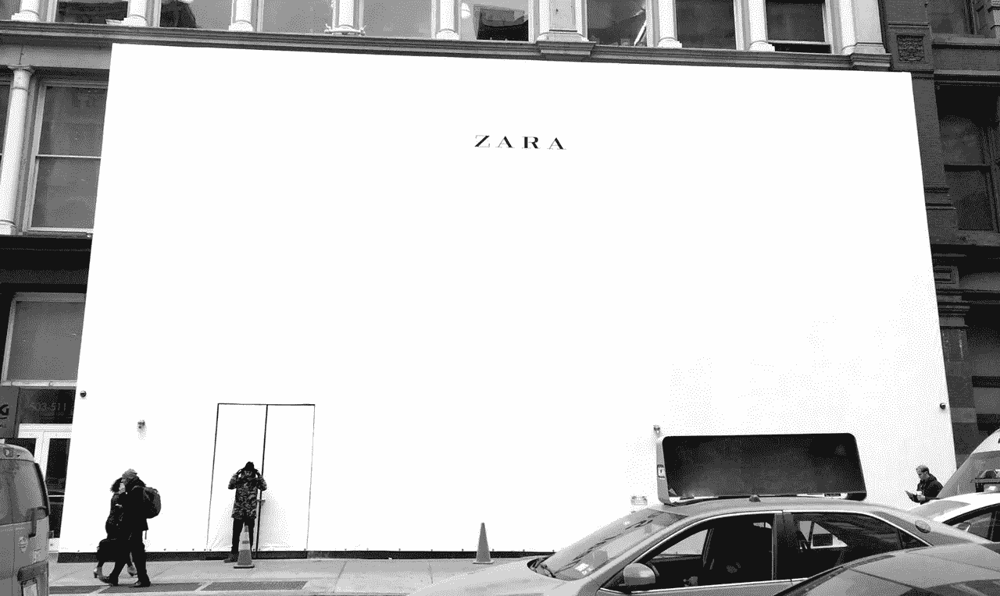
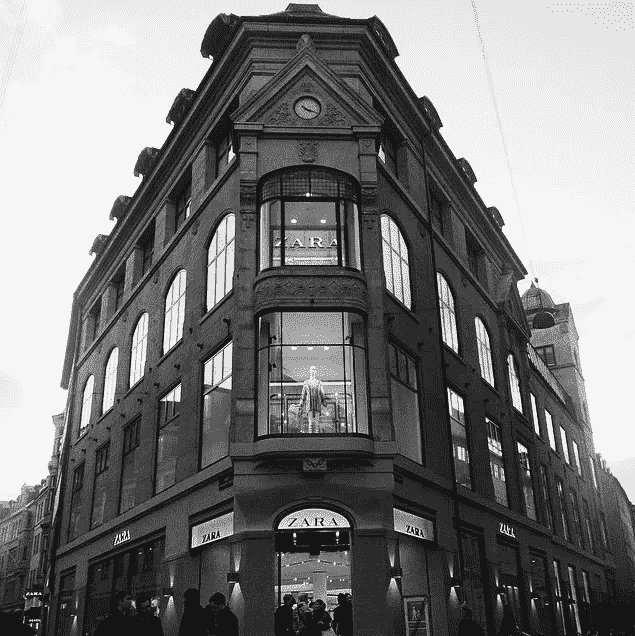
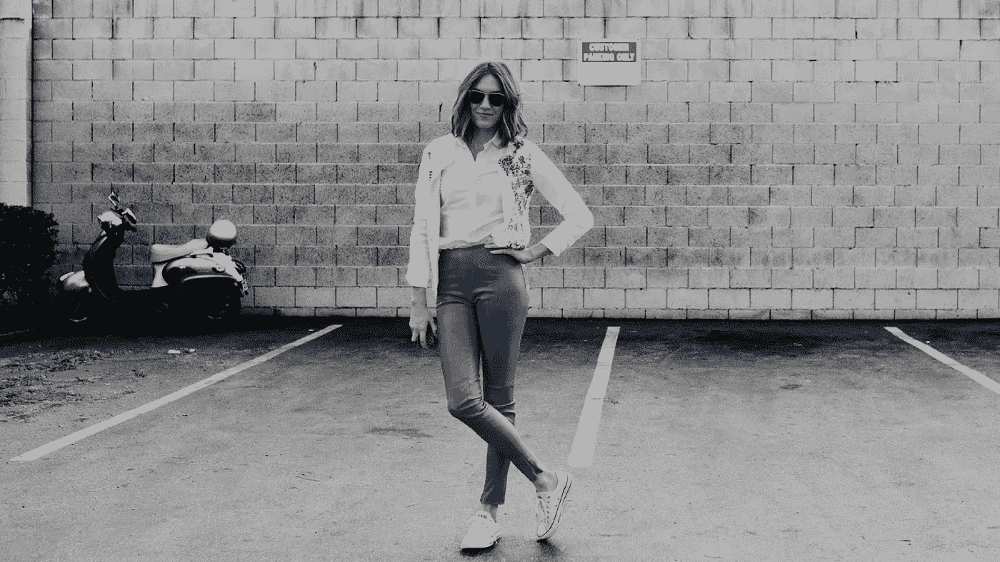
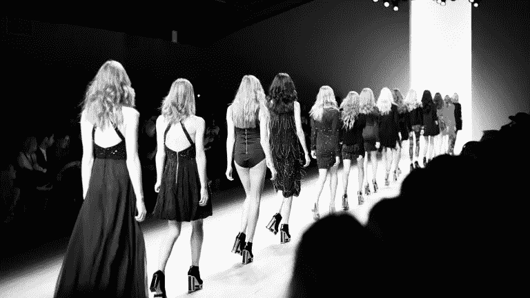
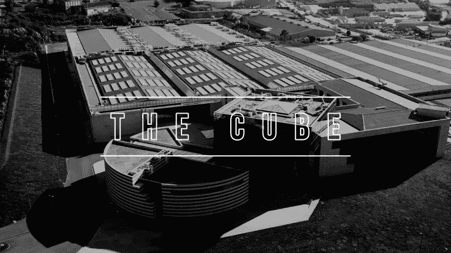

# Zara 如何花 0 美元做广告来颠覆时尚产业

> 原文：<https://medium.com/swlh/how-zara-spent-0-in-advertising-to-disrupt-the-fashion-industry-59526b5000af>

[**由尼坦纳朗**](https://www.linkedin.com/in/nitant-narang-49446014/)

2016 年 9 月，微软创始人比尔·盖茨在*福布斯*年度全球最富有亿万富翁排行榜中跌至第二。盖茨多年来一直坚守的总理位置被一个阿曼西奥·奥特加篡夺了——哪怕只是几天。与盖茨的公众地位和名人相比，奥尔特加相对不为人知，市场观察人士、企业家和商业记者怀疑地在谷歌上搜索了几次，才发现这位 80 岁的西班牙人实际上是服装巨头 Zara 的创始人。

然而，仔细观察一下，奥尔特加这样一个默默无闻、低调的人物掌管着世界上最大的时尚帝国之一，似乎并不令人惊讶。首先，Zara 不愿意接受采访或寻求任何形式的宣传，因此在广告上几乎不投资。与竞争品牌和时装公司不同，Zara 很少出现在广告牌上；它的系列没有出现在时装秀上；它既不为《Vogue》的镀金版面游说，也不与任何名人或知名时装设计师联系在一起。

事实上，它打破了所有的规则，挑战了自时尚从 19 世纪巴黎的贵族沙龙和波西米亚精品店出现并进入大众市场以来一直存在的所有惯例。然而，Zara 正在蓬勃发展。它在世界各地拥有超过 2100 家商店，收入为 159 亿美元(2016 年)，是世界上最有价值的公司之一。

*Unlike competing brands and fashion houses, Zara scarcely appears on billboards; its collections do not figure in fashion shows; neither does it lobby for Vogue’s gilded pages, nor does it associate itself with any celebrities or high-profile fashion designers.*

# 那么 Zara 是怎么做的呢？

答案是快时尚。Zara 开创的快速时尚既是其成功的动力，也是其最显著的因素。相比之下，传统时尚品牌的产品价格更高，遵循更正统和历史悠久的季节性时尚方法，其中大部分库存都是在每个季节开始之前设计和制造的，不允许在季节中期进行设计改进或改变。

在继续之前，让我们明确区分快速时尚和季节性时尚服装。虽然大多数服装品牌将 80%的库存用于季节性时装，但 Zara 却反其道而行之，仅将 50%的库存用于季节性服装，其余的用于快速时尚产品。从现在开始，所有的事实、数字和细节都将与 Zara 的快时尚服装有关，而不是其库存的另外 50%。

# 什么是快时尚？

自从它开始流行以来，其他几个品牌也采用了它——特别是 H&M，它将高达 20%的库存用于快时尚商品——结果这个概念变得有弹性且定义松散。然而，我们试图通过研究它的核心特征来描述它。

*Fast Fashion is at the very centre of Zara’s strategy; it is what gives it an edge over legacy fashion retailers like Calvin Klein, Armani etc.*

**节俭**

Zara 的快时尚之路可以追溯到 1963 年 Ortega 最早的商业冒险——当时他[销售灵感来自设计师品牌的绗缝浴袍和内衣。直到今天，Zara 仍然坚持奥尔特加节俭的设计流程。与竞争对手相比，该公司不会雇佣知名设计师，也不会在打造完全原创的设计上投入太多。相比之下，年轻、匿名、热情的设计师们齐心协力，严格按照市场需求创造和修改设计。](http://www.telegraph.co.uk/finance/newsbysector/retailandconsumer/10247484/Zara-founder-Rosalia-Meras-fast-fashion-legacy-to-the-British-high-street.html)

**模仿**

Zara 的天才在于识别最新的时尚潮流；它拥有一支时尚观察家大军，他们密切关注着时装秀上的流行趋势、时装品牌正在生产的时装以及前卫设计师正在展示的时装，并相应地调整其面料，以保持在潮流的最前沿。在这样做的过程中，Zara 与时尚界和独立设计师发生了冲突。2012 年，奢侈品牌克里斯蒂安·鲁布托(Christian Louboutin)对 Zara 提起法律诉讼，原因是 Zara 涉嫌模仿其一款鞋的设计，并以半价出售。尽管此案被驳回，时尚记者猜测 Zara 通过调整其设计来避免侵犯版权，从而避开了麻烦。同样，年轻和新兴的设计师指责 Zara 出售所谓的仿冒品。

Zara 的天才在于识别最新的时尚潮流；它拥有一支时尚观察家大军，他们密切关注着时装秀上的流行趋势、时装品牌正在生产的时装以及前卫设计师正在展示的时装，并相应地调整其面料，以保持在潮流的最前沿。

*Zara’s genius lies in identifying the latest fashion fads; it keeps an army of fashion watchers who keep an eye on what’s trending on runways, what couture brands are producing and what avant-garde designers are exhibiting, and accordingly tailoring its fabrics to stay on top of trends.*

**反应灵敏**

如果你在 2001 年的后几个月在纽约市的任何一家 Zara 商店购买牛仔裤，很可能你买的是一条黑色的牛仔裤。这不仅仅是巧合；相反，这是快时尚核心战略的一部分。在 911 袭击震惊纽约的几天后，Zara 的商店经理意识到他们的大部分顾客都处于一种[阴沉的](https://books.google.ca/books?id=oSsIfoDQHhgC&pg=PA154&lpg=PA154&dq=September+11+Zara&source=bl&ots=Ba41Rifl-u&sig=jixWyAY4YQ4Up6_-LVRFGaGfS7g&hl=en&sa=X&ved=0ahUKEwimhISB3eDPAhUCLmMKHbqoBUoQ6AEIQTAH#v=onepage&q=September%2011%20Zara&f=false)情绪中。这一发现被传达给了 Zara 的设计师，他们迅速行动起来。仅仅几周之后，Zara 推出了一个全黑的新系列。

用时尚术语来说，周转时间代表一个新系列取代一个现有系列所需的时间。对于大多数时装零售商来说，周转时间是 3-6 个月。相比之下，Zara 可以在两周内(T5)将一个系列从画布上推到商店的货架上(T4)，就像它在 911 事件后所展示的那样。

# 是什么让快速时尚如此迅速

*The Cube is where Zara’s 200-member design team, its procurement and production teams work in coordination. Tokyo, Mumbai, Rio de Janeiro or London — no matter where you shop, at least 50% of every Zara outlet’s inventory (in other words, its Fast Fashion inventory) begins its course at The Cube.*

这个立方体是 Zara 的 200 人设计团队、采购和生产团队协同工作的地方。东京、孟买、里约热内卢或伦敦——无论你在哪里购物，Zara 每个分店至少 50%的库存(换句话说，它的快时尚库存)都是从 Cube 开始的。

Arteixo 是一个安静的小镇，位于西班牙海岸线上的 A Coruñ。凭借其加利西亚建筑和历史地标，它似乎很难从散布在西班牙乡村的几十个传统城镇中分辨出来。然而，在它的鹅卵石街道下，运行着一个 124 英里长的高速单轨铁路网，它汇聚在一个巨大而令人生畏的叫做立方体的巨型结构下。考虑到它的巨大和未来派的设计，这个立方体看起来像是 2001 太空漫游中的场景。实际上，它是 Zara 全球运营的神经中枢。

这个立方体是 Zara 的 200 人设计团队、采购和生产团队协同工作的地方。东京、孟买、里约热内卢或伦敦——无论你在哪里购物，Zara 每个分店至少 50%的库存(换句话说，它的快时尚库存)都是从 Cube 开始的。

## [***此处阅读其余***](http://blog.procurify.com/2016/10/24/supply-chain-beats-zara-spend-culture/)