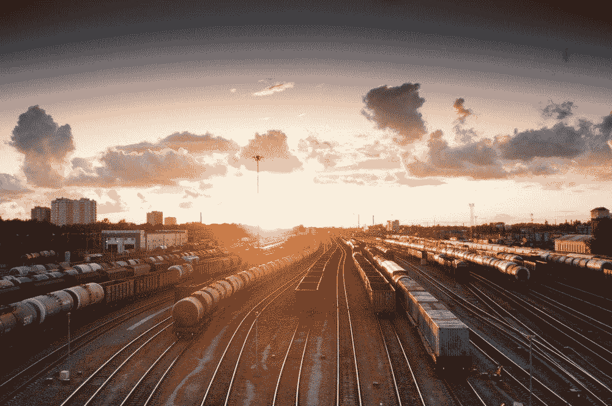
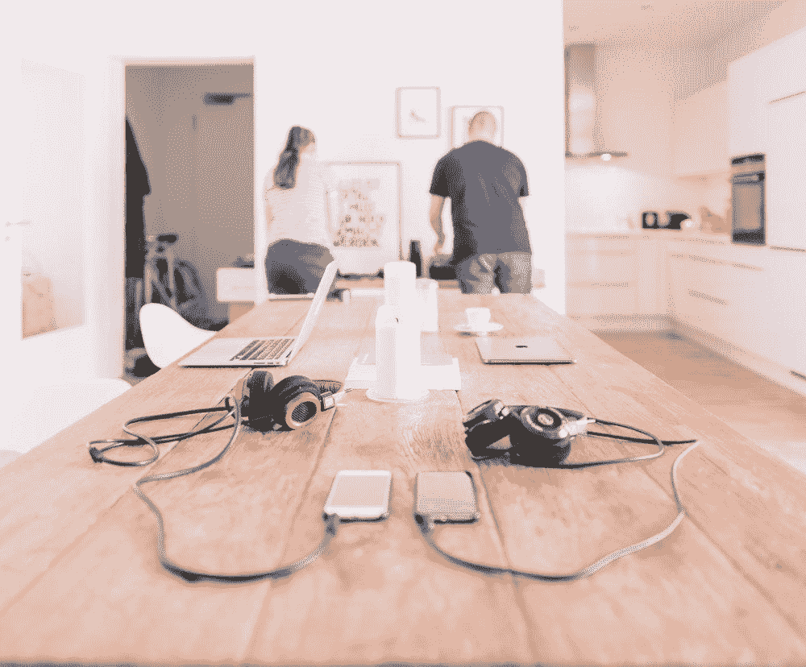
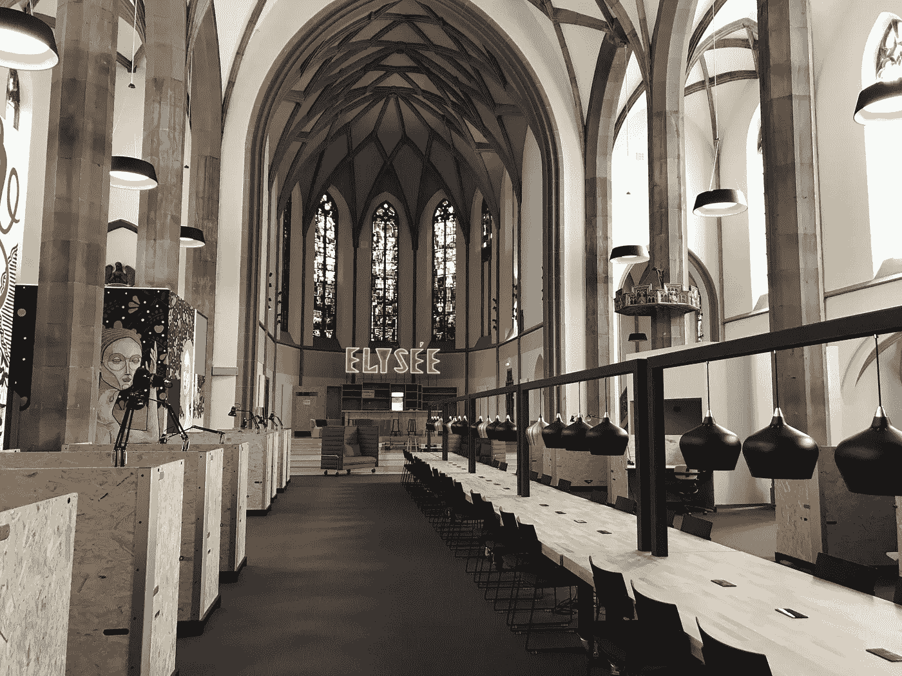
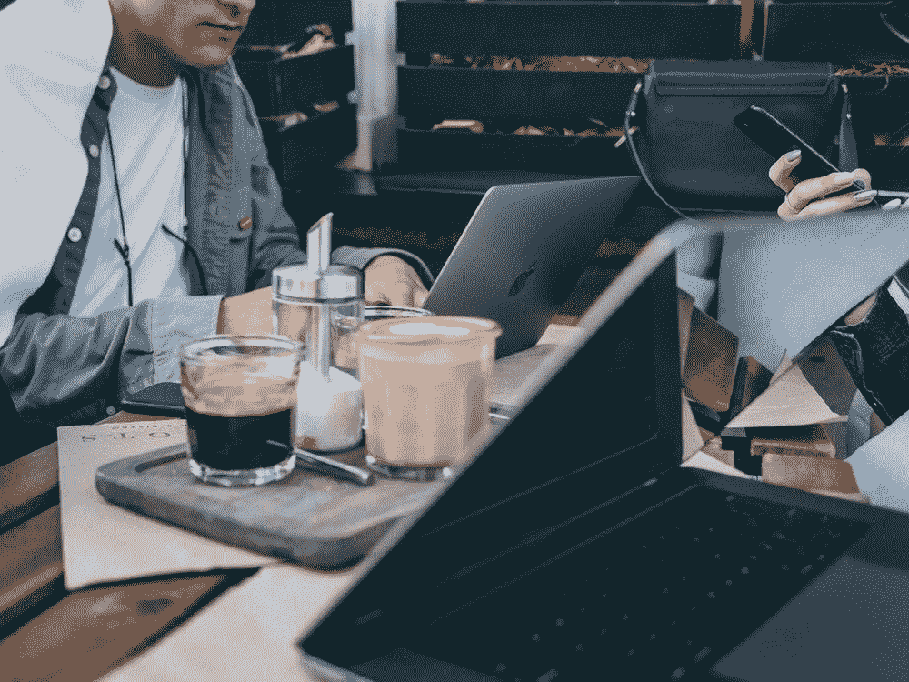
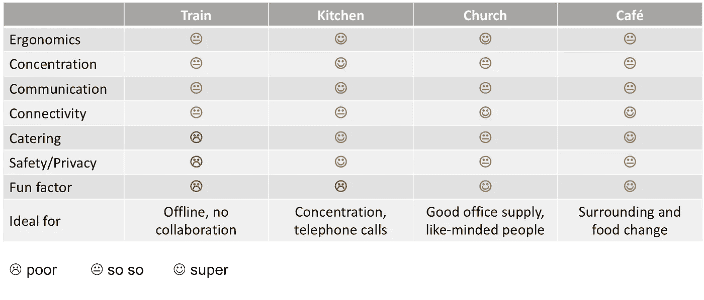
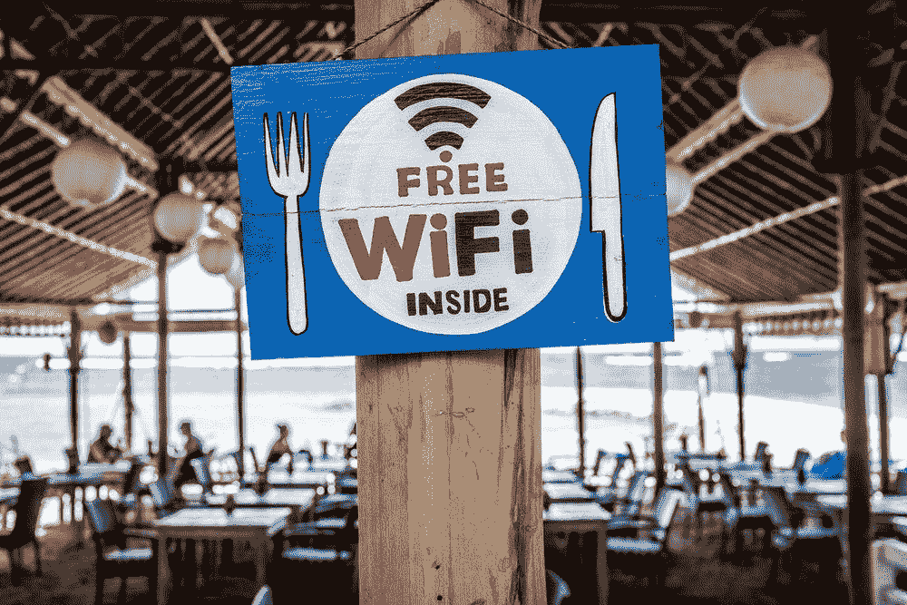

# 如何成为没有旅行预算的数字游牧者

> 原文：<https://medium.com/swlh/how2digitalnomad-5f1d9d29fd47>

在沿海城市工作和生活一段时间，并学习如何在途中冲浪(就像我的一位创始人朋友今年在里斯本做的那样)，对我们许多数字工作者来说，听起来像是一个梦想。我一直想体验数字游牧生活方式，但由于预算和更多的时间限制，现在不能出国几个星期。因此，我不想等待，而是在省钱的同时为数字游牧生活方式做好准备，我将这种远程工作生活方式转变为更便宜的“每天更换办公室”工作周。在这里阅读我在火车、咖啡馆、厨房和教堂工作时学到的东西，找出哪种工作方式最适合你。→跳转到[总结](/@daniel_kirch/how2digitalnomad-5f1d9d29fd47#d1b9)。

# 第一天:火车站

Source: [https://unsplash.com/photos/Q47eNv_UvfM](https://unsplash.com/photos/Q47eNv_UvfM)

我在柏林参加了 EY 的投资者晚宴，在那里我会见了几个早期风投和 EY 的经理，讨论了关于 [Taxy.io](http://www.taxy.io) 的事情，之后我找不到负担得起的航班返回科隆，所以我选择了 ICE 火车。包括准备时间在内，这比坐飞机要多花一点时间，然而，火车比飞机的最大优势是你可以进入车内，坐在一个座位上直到抵达。因此，我可以少受干扰地工作。列车办公室的其他优点:

*   **人体工程学**:火车上托盘桌的位置可以用笔记本电脑工作(比四人桌好多了，它们太高了)，日光和灯足够亮，不会在显示器上产生令人讨厌的反射，休息时可以散步和伸展。
*   我在安静区预定了一个座位，那里禁止打电话。此外，有了降噪耳机，我可以相对舒适地工作，并专注于我的待办事项。

另一方面…

*   沟通:这不是一个给同事打电话或发语音信息的好工作环境。这就是为什么我把那天的工作安排在了一段时间内不需要与联合创始人互动的文档(商业计划、推介材料、信息函)上。
*   **连接性**:实际上，我非常惊讶飞机上的免费无线网络工作得有多好。这比在一个合适的共同工作空间要糟糕得多，但总比没有好(比如在飞机上)。补偿与离线-上述文件的工作。
*   **餐饮**:“小酒馆”里的食物/饮料价格过高，质量一般。最好带上水和零食，这样你去餐车的时候也不需要把工作站落下。
*   安全/隐私:这次没有发生什么不好的事情，但是当我去酒吧或浴室的时候，我感觉不好，因为我知道你的笔记本电脑很容易被抢走。为了防止你的邻座长脖子盯着你的屏幕，我推荐视觉覆盖箔。令人震惊的是，有多少人在他们的笔记本电脑上工作，向每个乘客展示他们目前在做什么项目。
*   **乐趣因素**:相当有限，通常没有什么惊喜可期待(除了延迟，但那不算惊喜)。

> 总的来说，火车办公室的缺点是可以忍受的，或者可以通过准备得到补偿，其优点可能会让我在将来再次选择火车而不是飞机。火车办公室非常适合不需要协作并且可以在旅行中离线完成的任务。

# 第二天:厨房办公室

Source: [https://unsplash.com/photos/B0n4-PeF60Q](https://unsplash.com/photos/B0n4-PeF60Q)

有时候，尤其是在繁忙的商务旅行之后，我喜欢呆在家里，在我的工作室或者餐桌上工作。除了工作时间和休息时间的最大灵活性，我还欣赏厨房办公室的以下优势:

*   **人体工程学**:有些餐桌不是用来工作的，但是我有一个更高的吧台桌，非常适合我在笔记本电脑上工作时的坐姿**和**我可以站着工作来放松背部。光线和显示反射通常是完全可控的。
*   集中注意力:如果没有公寓聚会，我可以在厨房里完全集中注意力。
*   **沟通**:厨房也为电话会议提供了一个安静的氛围，因为没有人会打扰你，你也不会打扰任何人。
*   **餐饮**:厨房办公室是经济实惠的餐饮供应中心。咖啡机伸手就能拿到。这一类满分！(如果你自制力低，这可能是个问题；)
*   **连接**:家里的 WIFI 应该是很好的，尽管我的联合创始人有时会抱怨我的连接很慢(那是一栋老房子，墙很厚)。
*   **安全/隐私**:不用解释，两方面在厨房办公室都维护的很好。

厨房办公室只有一个缺点:

*   有趣因素:在这里被孤独包围了几天之后，我不得不走出大楼，重新融入人群。

> 厨房办公室非常适合需要高度集中注意力或通过电话与团队成员和合作伙伴进行密集沟通的任务。

# 第三天:教堂办公室

为了呼吸新鲜空气，第二天我去了教堂工作。嗯，这不是一个真正的教堂(不再)，这是一个前天主教堂改造成一个共同工作的空间。在这篇文章中，它代表了各种各样的现代合作空间，然而，我还没有见过比[数字教堂](http://www.digital-church.de/)更漂亮的。

Source: [http://www.digital-church.de/digital-church-galerie](http://www.digital-church.de/digital-church-galerie#)

*   **人体工程学**:这个合作空间的创造者非常注意人体工程学工作站，因为你可以移动桌子，所以你可以坐着或站着工作。各种各样的桌子、座位、椅子、豆袋、酒吧(包括讲坛)让你在一天中采取不同的位置(这对你的包无疑是很棒的)。夏天足够明亮和清新(尽管冬天需要额外的套衫)。
*   **集中注意力**:集中注意力的能力取决于你在共同工作区内选择的具体位置。如果你能设法预订自己的会议室，这是完美的，如果你靠近共同工作的桌子，而不是中等。免费提供的耳机在一定程度上有所帮助。
*   沟通:为了避免在电话会议中吵到你的同事，你找到了特定的电话听筒(如果有的话)。
*   **安全/隐私**:根据我的经验，这些声音并不完全可靠，所以数据隐私是有限的，但它应该适用于大多数活动。如果你和别人共用一个垃圾桶，在那里可以找到其他创业公司的宣传资料和合同草案，也会出现同样的问题。我很欣赏在午休时间租用储物柜存放东西的选择。
*   **餐饮**:除了咖啡和水(创始人的基本营养)之外，你的月租金中不包括太多东西，所以午餐休息时，建议自带食物或在附近的超市买东西，因为那里很少有好的小吃店/餐馆。
*   **连接**:作为一个共同工作空间的重要组成部分，WIFI 连接非常好。还有单独的免费 WIFI 供客人使用。
*   **有趣因素**:非常酷，因为你总能认识新朋友，或者在咖啡机旁与其他有抱负的创始人聊天。这是一个很好的社交方式，在中心活动期间还可以分享免费的啤酒和披萨。

> 当你每天可以在不同的桌子上工作，不需要 100%的隐私，但需要专业的办公用品，并且你喜欢结识志同道合的人时，教堂办公室是一个很好的搭配。

# 第四天:咖啡馆

为了治愈之前经历的烹饪情况，我选择了一家咖啡馆作为第二天的餐厅。

*   **人体工程学**:有限，桌子或椅子并不总是为使用笔记本电脑工作的位置而设计，此外，灯光不可控，可能会太亮，尤其是如果你在咖啡馆的室外工作。

Source: [https://unsplash.com/photos/F6Gk6nhwlmY](https://unsplash.com/photos/F6Gk6nhwlmY)

*   注意力:如果你没有闭上耳朵的能力(像我一样)，在咖啡馆里很难集中注意力。但是对于电子邮件来说，这已经足够了。
*   **交流**:你可以在咖啡馆里打电话，因为人们也会在其他桌子上聊天。但是请记住，每个人都可以听到你，可能会被你的电话打扰。
*   **餐饮**:我去了一家很有创意的咖啡馆( [Café Hase](https://www.cafe-hase.de/) )，有创新的饮料和食物。很好吃，我可以尝试新的东西，但是每天都要花太多的钱。
*   **连接**:如果咖啡馆是为数字工作者准备的，他们会提供合适的 WIFI。我建议在你打开你的仪器之前，问问服务员是否可以把一张桌子堵一整天，并且比普通客人消费得少。
*   **安全/隐私**:如果你的屏幕对着墙，可以保持数据安全。当你离开住处去洗手间时，你的物品的安全性是有限的。
*   **有趣因素**:很好，尤其是如果你遇到朋友或同事(也来自其他不在你的共同工作空间工作的公司)，和他们聊聊共同的工作相关问题或完全不同的话题，以开阔你的视野。

> 如果你想彻底改变一下营养、环境、同事和喝咖啡的话题，咖啡馆是个不错的地方。

# 摘要

我希望已经很好地概述了城市远程工作的可能性，并为成为数字流浪者进行了培训。在开始一个完整的游牧生活方式之前，了解你需要哪些工具来有效地工作，以及你对你的工作环境有哪些要求。这将有助于你在开始游牧之旅时避免主要的陷阱。

以下是对评估办公室概念的概述:

Evaluation of tested office concepts

至于我，我想我现在已经准备好远程工作，甚至去更自然的工作环境，所以我的下一个办公室可以是一个湖，山或海滩。☼，我随时向你汇报。

Source: [https://unsplash.com/photos/X0EtNWqMnq8](https://unsplash.com/photos/X0EtNWqMnq8)

## 这个故事发表在 [The Startup](https://medium.com/swlh) 上，这是 Medium 最大的企业家出版物，拥有 344，974+人。

## 在这里订阅接收[我们的头条新闻](http://growthsupply.com/the-startup-newsletter/)。

