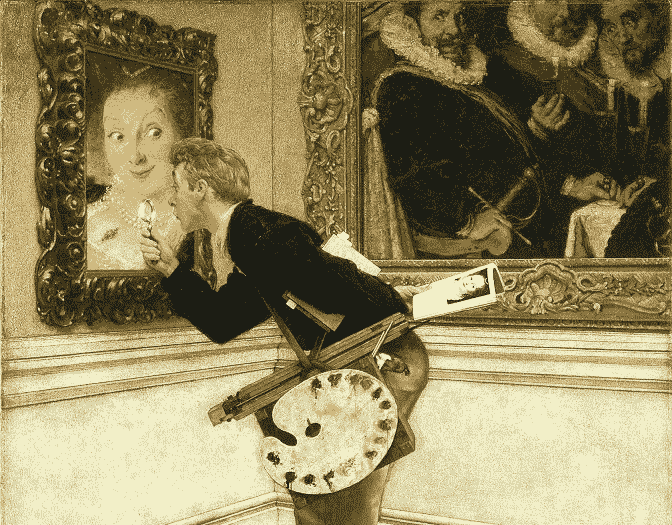
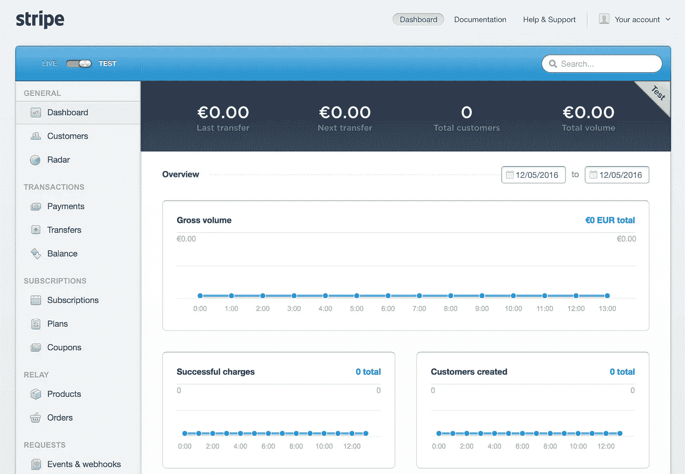
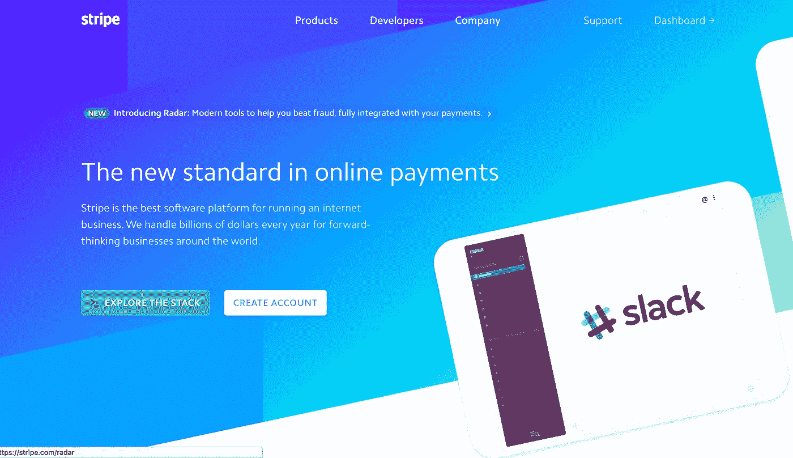
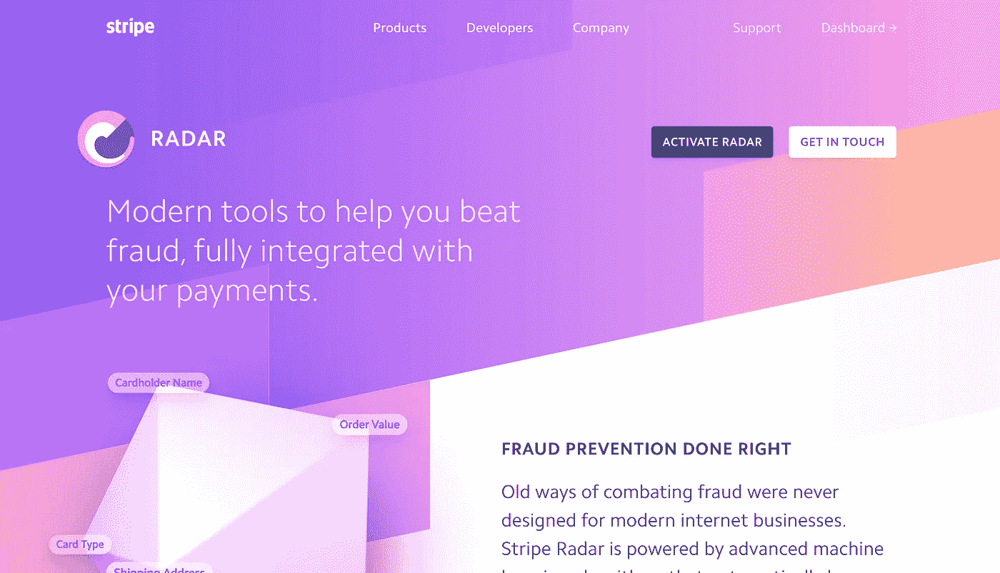

# 伟大的设计可能不适合你

> 原文：<https://medium.com/swlh/https-medium-com-aguycalledconor-great-design-probably-isnt-for-you-f1ccad66d69f>

Design critiques shouldn’t be as subjective as art critiques

伟大的设计是当软件在它的用途上是显而易见的，并且在它的风格上是非常固执己见的。它是如此不被重视和困难，以至于它是业内许多人的自我目标。

这个定义看起来像是一个显而易见的陈述，但是它是有效的，并且有一个清晰的定义是至关重要的，即使它看起来是显而易见的。**如果我们不知道为什么我们设计得比“显而易见和简单”更好，那么我们额外的设计努力就是一个虚荣的项目**，可能不会影响客户或业务。

我将以[条纹](https://medium.com/u/3ecae35d6d66?source=post_page-----f1ccad66d69f--------------------------------)为例来剖析这个想法。他们的网站和各种元素有足够的复杂性来比较和对比。

## 显而易见但不固执己见——条纹应用

通过这种分类，你可以很容易地找到“好的设计”。你可以通过遵循标准和严重依赖好的工程来做到这一点，而不需要太多的原创或时尚倾向。

[Stripe](https://medium.com/u/3ecae35d6d66?source=post_page-----f1ccad66d69f--------------------------------) 的 app 完美的展现了这一点。

The Stripe app home screen, obvious but not really opinionated

它的可用性对我来说毫无疑问。清晰的布局和体面的层次清晰地显示信息，任何使用过 Stripe 的人都知道它很好地涵盖了大多数用例。然而，他们自举式的视觉风格和安排并没有给人一种公司将现代主义推向前沿的想法。

Stripe *是*的一家公司，以其对开发者的易用性而闻名，在他们的设计中有更多的观点，即使它并不总是可视化的。从他们非常简单的 api，他们的[文档](https://stripe.com/docs/api)一直到他们界面中的“实时数据/测试数据”开关，他们提供了可能是最简单的开发体验。你可能会说，他们经历的这一部分是最固执己见、最明显的。

## 明显且固执己见的用户界面——Stripe 变得很棒

然而， [Stripe](https://medium.com/u/3ecae35d6d66?source=post_page-----f1ccad66d69f--------------------------------) 已经开始向伟大的设计迈进。这是他们最近更新的营销页面[stripe.com](http://www.stripe.com)和[雷达](http://www.stripe.com/radar/)，对我来说，这是自以为是地设计的非常漂亮的用户界面。

[www.stripe.com](http://www.stripe.com) homepage. Modern, obvious, delightful and very opinionated

Stripes newest product www.stripe.com/radar/ get the most opinionated of page

我建议访问这两个页面，与他们充分互动。主页有一些令人愉快的方面，比如当你刷新页面时看到的不同的应用程序模型。雷达页面拥有我在旋转的多面形状的 UI 中见过的最平滑的 3D 元素。这些页面上有很多值得探索的内容。

有了这个想法，我们就可以抛开表面上的“惊喜”,去思考为什么他们真的很棒。它们很棒，因为它们平衡了明显的交互和固执己见的设计，是美丽的网页设计的领先范例之一(2016 年底)。

同样值得注意的是，设计本能在一定程度上是现代主义和现代主义中的时尚运动之间的判断。两者之间的平衡就是气候和天气的差异。你必须在任何时候单独或联合地对它们做出反应。

当将上面的两个页面与 Stripes 的旧营销页面[连接](https://stripe.com/connect/)和[订阅](https://stripe.com/subscriptions)进行比较时，你可以看到这种变化的平衡。两者都是实用和现代的，但在最初的设计中不那么固执己见，而且随着时尚的发展也显得过时了。

利用这种对设计质量的更好理解，我们可以开始分析将您的设计标准提高到这一水平的风险和有限收益。

## 我们不应该都这样做

简而言之，要达到自以为是的水平，条纹营销页面上的伟大设计是昂贵的。所有这些小细节，定制的互动和纯粹的时尚知识花费了昂贵的人很多时间。条纹 app 上*好*设计的水平，一句话，是可以达到的。这并不是说这很容易，但是如果有时间和良好的数据，一个由各种各样的设计师和优秀的开发人员组成的体面团队将会实现接近可用性和显而易见性的东西。

## “你怎么敢说我们不应该都为此奋斗，目标很重要！”

我以前也曾被这样说的人推回去过。我同意我们都应该为现代、简单的可用性而努力。但是在你没有资源的情况下努力让界面本身变得如此自以为是和美丽是一种无稽之谈。

证明这是胡说八道的最简单和最容易的方法就是把它和工程学相比较。有能力的小公司从来不会努力拥有和大公司一样好和一样复杂的技术体系。如果你的经理也这么建议，那将是一个离开去更理智的牧场的信号。这同样适用于设计。

## 这太贵了，那为什么还要做呢

从**优秀到伟大设计的主要好处就是光环和自我祝贺**。

仅此而已，但有时这是值得的。它可以让你的公司内部感觉良好，它可以意味着你的客户使用你的产品和喜欢、推荐你的产品之间的差异。

我想起了那句古老的广告语“我的广告中只有 20%起作用，我只是不知道是哪 20%”。事实上，伟大的设计就像老式的广告。它很美，很贵，而且很难衡量眼前的利益。您可以调整按钮并测试转换，但测试一个整体渐进的风格变化是困难的和定性的。

这就是应该为伟大而奋斗的**，那些有时间、金钱或者只是天生爱好的人去推动它，并投入时间去衡量它。对于其他人来说，了解你应该努力达到的标准，考虑到你的人力和财力限制，会让你放松并有一个清晰的范围，这样你就不会在你只*好的时候不断地让自己失望。因为**好的设计对我们大多数人来说都是完美的**。***