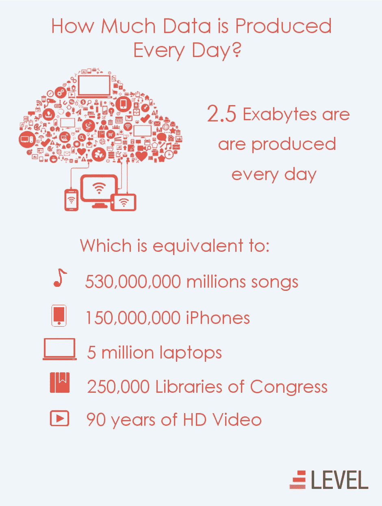
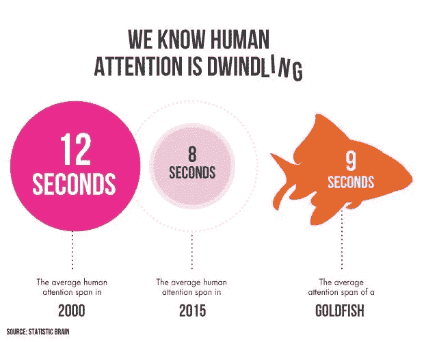

# 为什么千禧一代在创造所有这些内容？

> 原文：<https://medium.com/swlh/https-medium-com-arjunrao87-why-are-millennials-creating-all-this-content-cf02220325a3>

“简单点。让它令人难忘。让它引人入胜。让阅读变得有趣。”—李奥·贝纳

从严格的观察意义上来说，我们的社会是一个沉迷于自我放纵和自我迷恋的社会。我把这种自恋归因于我们热衷于发布关于自己的内容。我是千禧一代，我们是创造内容的一代，是迄今为止创造内容最多的一代。通过 Instagram 和 Snapchat 等渠道，我们创作故事、照片、图片和视频，并发布给全世界。使用像脸书、推特和 Reddit(抱歉，Reddit，你有点像社交网络)这样的社交网络，我们发布链接、照片、经历、新闻文章、模因和 gif 给全世界看。在 YouTube、Vimeo 和其他视频分享网站上，我们看到了像 Casey Neistat 和 PewDiePie 这样的新一代内容摇滚明星。通过 Medium、PostHaven、WordPress 和其他博客渠道，我们正在以前所未有的速度表达我们的想法。内容洪流是持续不断的，有时会淹没所有相关人员。

为了给你一个有规律地创造内容的感觉，这里是我从互联网上搜集的一些数字；**每一分钟**

*   电子邮件用户发送 2.04 亿条消息
*   发送了 3567850 条短信
*   谷歌收到超过 400 万个搜索查询
*   Snapchat 用户观看了 6944444 个视频
*   优步乘客乘坐 694 次
*   谷歌翻译了 6950 万个单词
*   博客作者发布了 1400 篇新博客文章
*   脸书用户共享 246 万条内容
*   脸书用户喜欢 4166667 次
*   推特用户发了 347，222 条推特
*   网飞用户可观看 86，805 小时的视频
*   亚马逊网上销售额为 83，000 美元
*   Tinder 用户刷了 972，222 次
*   Whats App 用户分享了 347222 张照片
*   Instagram 用户发布了 216，000 张新照片
*   Instagram 用户点赞 2430555 次
*   潘多拉用户听了 61，141 小时的音乐
*   苹果用户下载了 48000 个应用程序
*   Yelp 用户发布了 26380 条评论
*   Skype 用户连接时间为 23，300 小时
*   Vine 用户分享了 8333 个视频
*   Pinterest 用户锁定了 3472 张图片
*   Youtube 用户上传了 300 小时的视频

来源:http://bit.ly/2agpt2g；【http://bit.ly/2qE7tL8】T4；

这是一体的。单身。一分钟。让它深入人心。以免你对此感到太舒服，这是一个信息图表，显示了我们每年最终创造了多少数据—

Source : [http://bit.ly/2h4QPjq](http://bit.ly/2h4QPjq)

也许上面的信息图有点误导，因为不仅仅是我们在社交媒体上创造的内容，还有公司、政府产生的数据；整个玉米卷饼。当我阅读这个内容弹幕的统计数据时，它给我的惊讶感与我阅读类似于 [this](https://www.ovoenergy.com/blog/ovo-foundation/61-facts-you-need-to-know-about-the-rainforest.html) 的东西时一样——其中的一些亮点包括一些数字，如亚马逊河每天抽出的水足以满足纽约市九年的用水需求，或者亚马逊森林每天向大气中释放 200 亿吨水分，相当于 800 万个游泳池！我离题了，但不可否认的是，每天每分钟都有大量数据涌入我们的生活。

让我们想一想是谁创造了这些内容。特别是用户生成的内容——人们自愿创建的内容，并放在网上让全世界看到。此时此刻，我是这篇媒体文章的内容创作者，所以我想深入探究为什么我和我的内容创作者同伴在创作原创和个人内容时遇到了麻烦。因为有不同的内容网络针对完全不同的人类行为，我将试着进入兔子洞，记住 3 个网络—

*   脸书——由于拥有庞大的用户群，并且是我们这个时代“最权威的”社交网络
*   snapchat——新成员(无论从哪方面来看),它颠覆了脸书建立的现状，以不同的视角分享信息
*   媒介——空想家的踏脚石，或者至少是大多数作家对他们的技巧和表达形式的看法。通过让“博客”写作再次变得酷起来，并让更广泛的受众能够发现，媒介已经改变了现代社会中人们消费文章和新闻的方式。

跃入脑海的第一个原因是自我表达。每个人都想有与众不同的感觉，想拥有本质上独一无二的经历。YOLO 或“你只能活一次”曾经是所有冒险的潜在颂歌。我的意思是，如果你只能活一次，你必须过最好的生活；当你过着最好的生活时，为什么不向你的朋友和家人展示最好的经历呢？这是脸书、Instagram 等内容网络迅速崛起的部分原因。在此之前(这里不考虑 MySpace ),没有办法将你的活动传播给广大的观众。这种冒险的故事会通过口耳相传或者通过把照片传给你遇到的朋友和家人来传播。

然后是“FOMO”这个词。YOLO 是如此的 2000 年代。FOMO 或“害怕错过”是 YOLO 的反面教材。YOLO 人追求奢华的生活，而 FOMO 人鼓励怀疑和不确定。典型的千禧一代。用类比来解释——通过发布你的 YOLO 内容，你可能在其他人身上酝酿 FOMO，当那个人有机会去 YOLO 时，它可能在其他人身上创造 FOMO。乍一看，这似乎令人困惑或非常愚蠢，但如果你能触及表面，你可能会对人类心理有更好的了解。有些人可能会反驳这一点，但是渴望获得更多，做得更多，再加上一种贪婪的感觉，是推动社会行为增长的一个非常重要的因素；以及社交网络的使用模式。

对于媒体，本质上是一样的，但结果不同。在这里，目标不是在短时间内用你的奢侈冒险迷惑人们，而是用你的智慧和思想做同样的事情。不可否认的是，千禧一代以及随之而来的 Z 世代正以比以前更快的速度失去人们的关注，正如下面的信息图表所证明的那样

此外，47%的消费者希望在 2 秒钟内加载一个网页。我们将通过一个链接/页面，如果它需要超过两秒钟！在这样一个注意力持续时间越来越短的时代，Medium 倾向于提前宣布阅读文章需要多长时间也就不足为奇了。它能迅速淘汰那些远离长篇文章的人，同时吸引人们进行简短快速的阅读。事实上，有一个平台，人们可以发布深思熟虑的内容，可以提供给许多人，这确实是一个伟大的价值主张。但这正是所有社交网络行为的症结所在。

对 Medium 来说是“推荐”，对 Instagram 来说是“心”，对脸书来说是“喜欢”，对 Snapchat 来说是“观点”。这是社交网络上所有人类行为的圣杯。这是对尽可能实现最高可发现性的追求。让尽可能多的人看到你的内容是发布所有内容的巨大推动力。对于一些人来说，这可能是他们的私人(封闭)网络中的内容消费者的数量，而对于其他人来说，这是更广泛的公共用户(对所有人开放)。我不是科学家，但人们看到自己的内容被尽可能多的人浏览/欣赏时的那种兴奋感，似乎类似于你在健身房锻炼或做一些真正有成就感的事情时的那种兴奋感。它也非常像一种糖，在第一次获得一定数量的“喜欢”后，满足食欲的唯一方法是在接下来的时间里超越你的观点/喜欢。有一些研究试图解释为什么我们会被这种行为所吸引。这可能是一个疯狂的循环，并导致对某个内容出版物的统计数据的痴迷。发布内容的人经常查看他们的应用程序/网站简介，看看欣赏他们的帖子或关注他们的人数是否在增加。我并不是假装置身于这种现象之外，我确实是这种现象的牺牲品。在我看来，这种被他人(陌生人或其他人)欣赏的感觉，以及在最高赞/推荐/心中/转发的肩膀上有一个筹码，是社交网络持续成功的主要原因。

十有八九，我们可能不会很快看到内容创作的减少，最有可能的是在未来几年只会看到增加。然而，重要的是要记住将这些内容平台作为一种向善的力量，不要让点赞和关注者的统计数据妨碍我们专注于生活中最重要的事情。

在一个大多数人不再相信来世的时代，我们目前对创造力的痴迷是我们不断追求不朽的结果。
——阿瑞娜·赫芬顿

***想了解我更多，请顺便来*******打个招呼！或者在推特上关注我***[***@ raoarjun***](https://twitter.com/raoarjun)*